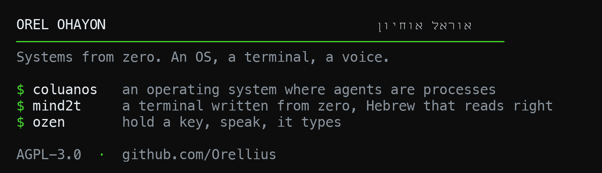

   <!-- allow-personal: Orel's own GitHub profile banner, his ask, 2026-08-08 -->

  The banner above is a screenshot of <a href="https://github.com/Orellius/mind2t">mind2t</a> rendering itself. Latin and Hebrew share that first line, right to left, because the terminal underneath it is mine.

---

I build systems from the bottom up: an operating system for AI agents, a terminal engine, and an on-device Hebrew voice stack. All three are AGPL-3.0 and readable in full, tests and gates included.

### coluanos

**An operating system for AI agents, written from zero.** No Linux in the guest: a Rust `no_std` aarch64 kernel on virtual hardware. Agents are processes behind a capability-gated syscall ABI, LLM inference is a paravirtual device, and every governed decision lands on a hash-chained audit tape. One image boots on both QEMU and Apple Virtualization.

`Rust` · `no_std` · `aarch64` · `hypervisors` · [repo](https://github.com/Orellius/coluanos)

---

### mind2t

**A terminal written from zero in Rust, checked case by case against a real one.** Hebrew, Arabic and Persian render properly: bidi reordering, cursive joining, GPOS-placed niqqud. 223 differential cases against a reference implementation, plus a drop-in C ABI you can link in place of libghostty-vt.

`Rust` · `wgpu` · `Tauri 2` · `bidi` · [repo](https://github.com/Orellius/mind2t)

---

### ozen

**Hold a key, speak Hebrew, release.** Polished Hebrew or clean English lands in whatever app has focus. Fully on-device: whisper (ivrit-ai) plus DictaLM through Ollama. It learns your corrections once and applies them from then on, and grades itself nightly against a gold set.

`Rust` · `Tauri 2` · `whisper` · `on-device` · [repo](https://github.com/Orellius/ozen)

---

### Also public

| | |
|---|---|
| [glyphcast-core](https://github.com/Orellius/glyphcast-core) | Video as text. A typography-only codec: every frame is Unicode glyphs plus per-cell color, GPU-rendered in one draw call. |
| [opendisplay](https://github.com/Orellius/opendisplay) | Unlocks the HiDPI resolutions macOS hides on sub-4K monitors. No kext. |
| [mel](https://github.com/Orellius/mel) | The Minecraft Enchantment Language. Real lexer, parser and interpreter; its canonical source form is the enchanting-table alphabet. |
| [responsive-viewer](https://github.com/Orellius/responsive-viewer) | MV3 extension: preview any page at any device resolution, in place. 168 presets, no paywall. |
| [wisp-adblock-test](https://github.com/Orellius/wisp-adblock-test) | One screen that shows what your ad blocker, DNS filter or VPN actually catches. |

---

`Rust` · `TypeScript` · `Swift` · `Python` · `Lua` · `C/WASM` · `Chromium` · `Tauri` · `Next` · `React` · `Bun`

---

Self-taught from Israel. [orel@orellius.ai](mailto:orel@orellius.ai) 
