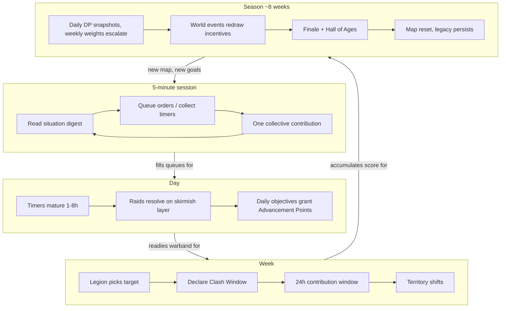

# 01 — Game Design Document: Legions of Earth

**Executive summary.** This document specifies the moment-to-moment and season-to-season design of *Legions of Earth*: the four nested gameplay loops (5-minute session, day, week, ~8-week Season), the complete player verb set built on an async order-queue system, the five unit archetypes with full stat lines, the Doctrine pre-order system, the deterministic server-side combat model with a fully worked example battle, Commander progression and per-Season Advancements, the balancing framework with named tuning levers and anti-snowball mechanics, PvE and neutral content, and the edge-case rules for inactivity, desertion, Legion collapse, and abandoned Provinces. Every system here obeys the five pillars of `00-vision-and-concept.md` — in particular *Five minutes matter* (no verb requires more than 5 minutes of attention), *Worldwide by design* (no mechanic rewards a specific UTC hour, all math runs identically on a 2 GB Android phone), and *Fair free-to-play* (nothing in this document can be bought). Map generation, supply-line topology, and Season scoring detail live in `02-world-map-and-seasons.md`; Legion social systems in `03-legions-social-and-diplomacy.md`; the engineering of determinism in `04-technical-architecture.md`.

---

## 1. Core gameplay loops at four time scales

The game is one loop nested four deep. Each scale produces the inputs the next scale consumes, and each scale is independently satisfying — a Commander who only ever plays the 5-minute loop is still a real contributor to a Season victory.

### 1.1 The 5-minute session ("the check-in")

Target: a player on a bus, on 3G, opens the PWA and accomplishes something visible in under 5 minutes.

| Minute | Activity |
|---|---|
| 0–1 | **Situation digest**: one screen summarizing what happened since last session — battles resolved (with replay links), timers finished, Legion pings, supply threats. |
| 1–3 | **React**: queue 1–3 orders (reinforce, repair, intercept), collect finished training, restock upkeep. |
| 3–5 | **Contribute**: one bite-size collective act — escort leg of a supply run, scouting sweep, garrison top-up, vote in a Legion decision, mark the coalition map. |

Design rule: **every screen in the session loop is reachable in ≤ 2 taps from the digest**, and every order form pre-fills a sensible default so "accept the suggestion" is always a valid 10-second play (see `09-onboarding-retention-accessibility.md` for the suggestion engine).

### 1.2 The day loop ("the shift")

Timers of 1–8 hours (training batches, building stages, long marches) mean a player who checks in 2–4 times a day keeps their machine running at full efficiency — and 2–4 check-ins is the **tuning ceiling**: no queue is sized so that a 5th daily session adds material output. Daily loop content: rotate garrisons, launch/absorb skirmish-layer raids, run one market trade, complete the 3 daily contribution objectives (source of Advancement Points, §6.3).

### 1.3 The week loop ("the campaign")

Weekly rhythm is set by Legion strategy: pick the next target Province cluster, declare a Clash Window siege (declared ≥ 72 h ahead per `02-world-map-and-seasons.md`), build siege works, pre-position supply. The **Clash Window** itself is the weekly peak: a 24-hour contribution window in which every member's 5-minute actions accumulate, so São Paulo, Lagos, Warsaw, and Manila members all contribute at humane local hours. Weekly loop also carries the Warpath Pass chapter unlocks (`06-economy-and-monetization.md`).

### 1.4 The Season loop (~8 weeks)

Season standing accrues through **daily Dominion Point snapshots** whose weekly weights escalate from ×0.5 (weeks 1–2) to ×2.0 (week 8) — the scoring system and the phase-by-phase calendar are owned by `02-world-map-and-seasons.md` §7. The Season moves through **early** (Landrush, Consolidation), **mid** (Upheaval), and **finale** (Escalation, week-8 Finale) phases, punctuated by world events (§8.3), ending in the Grand Clash, the map reset, and Hall of Ages inscription. Anti-snowball consequences of this scoring shape are in §7.3; what persists vs. resets is specified in §6.3.

---

## 2. Player verbs and the order/queue system

### 2.1 The verb set

All player agency flows through **orders** placed into per-warband queues and executed by the authoritative server in real time. The full verb list (each completable in < 5 minutes of attention; execution then proceeds unattended):

| Verb | Order type | Typical execution time | Notes |
|---|---|---|---|
| Move | `MARCH(path)` | Speed × terrain (see §3) | Path auto-routed; player may pin waypoints. |
| Train | `TRAIN(archetype, count)` | 8–40 min per batch (§3) | Consumes resources up front. |
| Build / Repair | `BUILD(structure)` / `REPAIR` | 1–8 h | Structures per `02-world-map-and-seasons.md`. |
| Scout | `SCOUT(province)` | 10–60 min | Wayfinders only; produces intel report. |
| Escort | `ESCORT(convoy leg)` | ≤ 2 h | Joins a Legion supply run segment. |
| Reinforce | `GARRISON(province, units)` | March time | Units join Province garrison pool. |
| Raid | `RAID(province)` | March + ≤ 4 combat rounds | Skirmish layer (§5). |
| Interdict | `INTERDICT(supply edge)` | Standing, 8 h | Contests one supply-line edge. |
| Vote / Plan / Chat | instant | — | Social verbs, see `03-legions-social-and-diplomacy.md`. |

### 2.2 Queue mechanics (async-first)

- Each warband has an **order queue**: base depth **5**, growing to **12** at Commander level 25 (§6.1). The convenience purchase "Quartermaster's Ledger" (`06-economy-and-monetization.md`) unlocks depth 12 immediately — the **cap is identical for free and paying players**, per Pillar 5.
- Orders may be **conditioned** on simple triggers: *at time T* (for Clash Windows in your own morning), *when unit batch completes*, *if Province attacked → return home*. Three condition types only at launch; complex scripting is deliberately excluded to keep the skill ceiling strategic, not programmatic, and to deny bots an expressiveness advantage (`10-security-anticheat-trust-safety.md`).
- Queues execute while offline. **Nothing in the game requires being online at a specific moment**; the Clash Window's 24-hour accumulation design (`02-world-map-and-seasons.md`) extends this guarantee to decisive battles.
- All order submissions are idempotent HTTPS POSTs ≤ 1 KB — playable on 2G in a pinch (`04-technical-architecture.md`).

---

## 3. Unit archetypes

A warband is composed of five archetypes. Design intent: a **legible counter triangle** (Shieldline ▸ Riders ▸ Skirmishers ▸ Shieldline) plus two support archetypes (Engineers for structures, Wayfinders for information and logistics) whose value is situational, not statistical. Population cap per warband: **200 supply weight** (weights below), raised to 300 by Season Advancements (§6.3).

### 3.1 Stat table

All stats are per soldier. Speed is hexes per hour on open terrain; terrain multipliers in `02-world-map-and-seasons.md`.

| Archetype | Role | ATK | DEF | HP | Speed | Carry | Supply wt | Train time / soldier | Cost (grain/timber/iron) | Upkeep (grain/day) |
|---|---|---:|---:|---:|---:|---:|---:|---:|---|---:|
| **Shieldline** | Hold ground | 6 | 10 | 100 | 2 | 5 | 1.0 | 12 min | 20 / 5 / 10 | 3 |
| **Skirmishers** | Harass, chip | 9 | 4 | 60 | 3 | 10 | 0.8 | 8 min | 15 / 10 / 5 | 2 |
| **Riders** | Mobility, pursuit | 12 | 6 | 80 | 5 | 20 | 1.5 | 25 min | 30 / 5 / 15 | 5 |
| **Engineers** | Siege, build | 3 (14 vs structures) | 5 | 70 | 2 | 15 | 1.2 | 40 min | 25 / 30 / 20 | 4 |
| **Wayfinders** | Scout, logistics | 2 | 3 | 50 | 6 | 30 | 0.5 | 15 min | 15 / 10 / 0 | 2 |

Training runs in batches of up to 10 (batch time = soldiers × per-soldier time; a batch of 10 Shieldline = 2 h). Upkeep is drawn along the supply line; unpaid upkeep applies **attrition**: −5% pool HP per unpaid day (see §7.2, lever U).

### 3.2 Counter matrix

Multiplier applied to the attacker's damage against each target archetype (§5.1, term `C`):

| Attacker ↓ vs → | Shieldline | Skirmishers | Riders | Engineers | Wayfinders |
|---|---:|---:|---:|---:|---:|
| Shieldline | 1.0 | 0.75 | **1.5** | 1.0 | 1.0 |
| Skirmishers | **1.5** | 1.0 | 0.75 | 1.25 | 1.0 |
| Riders | 0.75 | **1.5** | 1.0 | **1.5** | **1.5** |
| Engineers | 0.75 | 0.75 | 0.75 | 1.0 | 1.0 |
| Wayfinders | 0.5 | 0.5 | 0.5 | 0.5 | 1.0 |

Engineers additionally deal **2.5×** against fortifications and siege works. Wayfinders are not a combat piece: their job is scouting (intel reports reveal enemy composition and doctrine aggression — not exact thresholds), carrying capacity for supply runs, and granting the warband **+1 effective Speed for withdrawal** if ≥ 5 Wayfinders survive (they know the paths out).

### 3.3 Targeting priorities (deterministic)

Each archetype attacks the highest-priority enemy group still alive at the start of the round; overflow spills per §5.1 rule 5.

- Shieldline → Riders, Shieldline, Skirmishers, Engineers, Wayfinders
- Skirmishers → Shieldline, Engineers, Skirmishers, Riders, Wayfinders
- Riders → Skirmishers, Engineers, Wayfinders, Shieldline, Riders
- Engineers → structures, then Shieldline, Skirmishers, Riders, Wayfinders
- Wayfinders → whatever attacks them (defensive only)

---

## 4. The Doctrine system

A **Doctrine** is a saved pre-set of combat orders, applied per warband (and per garrison contribution). Because combat resolves asynchronously (§5), Doctrine is *the* expression of player combat skill: you win by predicting what you'll face and setting orders before contact.

### 4.1 Doctrine slots and components

Commanders hold **3 Doctrine preset slots** at start, **6 at Commander level 20** — progression-only, never sold. A Doctrine has four components:

1. **Formation** — modifies the math:

| Formation | Effect |
|---|---|
| **Line** | Baseline. No modifiers. |
| **Wedge** | Riders' counter bonuses +0.25 (e.g. 1.5 → 1.75); own mitigation ×0.9. |
| **Loose** | Incoming Skirmisher damage ×0.75; own Shieldline counters −0.25. |
| **Square** | Mitigation ×1.15 for all groups; Speed halved for withdrawal/pursuit. |
| **Column** | +1 march Speed to the whole warband; if intercepted mid-march, first-round mitigation ×0.8. |

2. **Aggression** — one of three postures:

| Posture | Own damage (term `A`) | Own mitigation guard (term `G`) |
|---|---:|---:|
| **Bold** | ×1.2 | ×0.8 |
| **Balanced** | ×1.0 | ×1.0 |
| **Guarded** | ×0.8 | ×1.25 |

3. **Retreat threshold** — the warband disengages when its total remaining HP pool falls below X% of its starting pool. Settable **20%–60% in 5-point steps**. High threshold = leave early, save troops; low threshold = die hard, hold ground.
4. **Pursuit toggle** — whether to chase a breaking enemy (pursuit damage, §5.1 rule 7) or hold position (safer vs. feints).

### 4.2 Example loadouts

| Loadout name | Formation | Aggression | Retreat | Pursuit | Intended use |
|---|---|---|---|---|---|
| **Shieldwall Anvil** | Square | Guarded | 20% | Off | Garrison holding a capital Province during a Clash Window. |
| **Outrider Raid** | Wedge | Bold | 50% | Off | Fast pillage raid; leave before losses bite (see worked example, §5.2). |
| **Siege Train** | Line | Balanced | 35% | Off | Engineers + Shieldline escort cracking a Stronghold's works. |
| **Ghost Screen** | Loose | Guarded | 55% | Off | Wayfinder/Skirmisher tripwire that reports and withdraws. |
| **Hammer Charge** | Wedge | Bold | 30% | On | Coalition field army breaking a relief force, then running it down. |

Doctrine is readable by good scouting: a Wayfinder report reveals the enemy garrison's formation and posture (not its retreat number), making scouting a genuine pre-battle mind game.

---

## 5. Combat resolution

### 5.1 The model

Combat is a **server-side, fully deterministic, zero-RNG auto-battle**. No dice anywhere: identical inputs always produce identical outcomes. Uncertainty comes from hidden information (what the enemy garrisons, their Doctrine), never from luck — this is the fairest possible design for an async worldwide game (no latency advantage, no reroll sniping) and it makes replays nearly free (§5.3). All arithmetic is **fixed-point — integer thousandths (values ×1000)** — so results are bit-identical across server and every client device (`04-technical-architecture.md`); this document shows values to one decimal for readability.

**Resolution rules, in order:**

1. **Groups and pools.** Each archetype contingent is a *group* with an HP pool = soldiers × HP. Effective count = pool ÷ per-soldier HP (fractional).
2. **Rounds are simultaneous.** Both sides compute damage from start-of-round pools; damage applies at round end. Round caps: **raids 4 rounds, pitched field battles 8, Clash Window sieges accumulate across the window** (`02-world-map-and-seasons.md`). Hitting the cap = attacker withdraws in good order.
3. **Attack.** Group base attack `BA = effective count × ATK`. Against its priority target: `EA = BA × C × A × T × F`, where `C` = counter multiplier (§3.2), `A` = aggression damage term, `T` = terrain attack multiplier (e.g. attacking into forest 0.8, and Riders ×0.75 extra in forest/jungle; full table in `02-world-map-and-seasons.md`), `F` = formation terms (§4.1).
4. **Mitigation.** Damage taken = `EA × (1 − M)`, with `M = min(0.6, DEF/(DEF+20) × G × formation terms)`. Base mitigations: Shieldline 33.3%, Riders 23.1%, Engineers 20%, Skirmishers 16.7%, Wayfinders 13%.
5. **Overflow.** If a group's damage exceeds its target's remaining pool, the unused fraction `f` of that attack re-targets the next priority: redirected damage = `BA × f × C(new target) × A × T`, then that target's mitigation. Destroyed groups are removed at end of round.
6. **Retreat check** at each round's end: side breaks if pool% < its Doctrine retreat threshold.
7. **Pursuit.** A breaking side suffers pursuit damage = 2% of its remaining pool per point of Speed advantage of the pursuer's fastest surviving group over the withdrawing side's slowest surviving group (cap 20%), only if the winner's Pursuit toggle is On. Orderly withdrawal (round cap reached, or threshold-triggered withdrawal with no Speed disadvantage) suffers none.
8. **Wounded recovery.** After battle, a side that withdrew in good order recovers **30%** of its lost pool HP as wounded (returned over 24 h at its supply source); the side holding the field recovers **50%**. A *broken* side recovers nothing. This defender-tilted rule is a core anti-snowball lever (§7.3).
9. **Pillage** (raids): loot = min(survivors' Carry capacity, damage ratio × Province stockpile), where damage ratio = damage dealt ÷ garrison starting pool. Raids also add **Disruption** to the Province meter (`02-world-map-and-seasons.md`).

### 5.2 Fully worked example: the raid on Kharsk Vale

**Setup.** Commander **Karsa Venn** (Ashen Horde) raids the steppe Province *Kharsk Vale*, garrisoned by Commander **Edda Marrow** (Verdant Pact). Open steppe: `T = 1.0`. No fortifications.

- **Attacker:** 30 Riders (pool 2,400) + 30 Skirmishers (pool 1,800); total 4,200. Doctrine **Outrider Raid** — Wedge is ignored here for arithmetic clarity (assume Line), Bold (`A`=1.2, `G`=0.8), retreat 50%, Pursuit off.
- **Defender:** 40 Shieldline (pool 4,000) + 20 Skirmishers (pool 1,200); total 5,200. Doctrine **Shieldwall Anvil** variant on Line — Guarded (`A`=0.8, `G`=1.25), retreat 25%.

Effective mitigations: defender Shieldline 33.3%×1.25 = **41.7%**; defender Skirmishers 16.7%×1.25 = **20.8%**; attacker Riders 23.1%×0.8 = **18.5%**; attacker Skirmishers 16.7%×0.8 = **13.3%**.

**Round 1, every step shown:**

- Att. Riders → def. Skirmishers (their top living priority): `BA = 30×12 = 360`; `EA = 360 × 1.5 × 1.2 = 648`; damage = 648 × (1−0.208) = **513.0**.
- Att. Skirmishers → def. Shieldline: `BA = 270`; `EA = 270 × 1.5 × 1.2 = 486`; damage = 486 × 0.583 = **283.5**.
- Def. Shieldline → att. Riders: `BA = 240`; `EA = 240 × 1.5 × 0.8 = 288`; damage = 288 × 0.815 = **234.8**.
- Def. Skirmishers → att. Skirmishers (no Shieldline/Engineers present): `BA = 180`; `EA = 180 × 1.0 × 0.8 = 144`; damage = 144 × 0.867 = **124.8**.

Pools after R1 — def. Skirm 687.0, def. Shield 3,716.5; att. Riders 2,165.2, att. Skirm 1,675.2. Attacker at 91.4% (> 50%), defender at 84.7% (> 25%): fight on.

**Rounds 2–4** (same formulas, fractional effective counts):

| Round | Att. Riders dmg | Att. Skirm dmg | Def. Shield dmg | Def. Skirm dmg | End pools (D-Shield / D-Skirm / A-Riders / A-Skirm) |
|---:|---:|---:|---:|---:|---|
| 2 | 462.8 → D-Skirm | 263.8 → D-Shield | 218.2 → A-Riders | 71.4 → A-Skirm | 3,452.7 / 224.2 / 1,947.0 / 1,603.8 |
| 3 | 416.2 → D-Skirm (224.2 kills it; overflow f=0.461 redirects 70.7 to D-Shield at C=0.75) | 252.6 → D-Shield | 202.7 → A-Riders | 23.3 → A-Skirm | 3,129.4 / **0** / 1,744.3 / 1,580.5 |
| 4 | vs D-Shield now: `261.6 × 0.75 × 1.2 × 0.583` = 137.4 | 248.9 → D-Shield | 183.7 → A-Riders | — (destroyed) | 2,743.1 / — / 1,560.6 / 1,580.5 |

**Resolution.** Raid cap (4 rounds) reached; Karsa withdraws in good order at 74.8% strength. Pursuit: Edda's fastest survivor is Shieldline (Speed 2) vs. Karsa's slowest survivor Skirmishers (Speed 3) — no pursuit possible. *This is why raiders bring only fast troops.*

- **Defender losses:** all 20 Skirmishers + 12.6 Shieldline (2,456.9 HP); recovers 50% as wounded (holds the field) → net loss ≈ 10 Skirmishers' and 6.3 Shieldline's worth of pool.
- **Attacker losses:** 10.5 Riders + 3.7 Skirmishers (1,058.9 HP); recovers 30% → net ≈ 741 HP lost.
- **Pillage:** damage ratio = 2,456.9 ÷ 5,200 = 47.2%. Stockpile 1,400 resources → 661 eligible, capped by survivors' Carry (19.5 Riders×20 + 26.3 Skirm×10 = **653**). Karsa hauls 653 resources and adds 47 Disruption to Kharsk Vale.
- **Verdict:** Province **holds** (defender objective met); raid **profits** (attacker objective met). Both players get a satisfying digest — the intended emotional shape of skirmish-layer conflict.

### 5.3 Replay visualization

Because the sim is deterministic, the server never stores rendered battles — only the **initial state + both Doctrines** (< 2 KB). The client re-runs the same fixed-point math and renders a 20–45 second stylized visualization: hex battlefield, group tokens with animated ranks, damage ticks, the break-and-pursuit moment. Replays are:

- **Shareable** by URL into Legion chat (`03-legions-social-and-diplomacy.md`) — a core virality surface (`11-marketing-community-gtm.md`);
- **Scrubbable** with a round timeline, and viewable as a pure numbers table ("ledger view") for screen readers, data-saver mode, and low-end devices — the ledger is the accessibility-primary representation (`09-onboarding-retention-accessibility.md`);
- **Truthful**: the visualization is the math, so players learn real mechanics by watching, and disputes are impossible (`10-security-anticheat-trust-safety.md`).

---

## 6. Progression

### 6.1 Commander level (persistent, 1–60)

Commander XP comes from any verb completing (weighted toward collective verbs) and never expires. Levels grant **breadth and identity, never combat stats** — persistent stat power would poison the Season reset.

| Level | Unlock |
|---:|---|
| 2–5 | FTUE gates: raid, market, coalition map layers. |
| 8 | Doctrine slot 4; order queue depth 7. |
| 12 | Conditional orders; queue depth 9. |
| 20 | Doctrine slots 5–6. |
| 25 | Queue depth 12 (cap). |
| 30+ | Cosmetic frames, title tracks, Hall of Ages plinth styles — identity only. |

### 6.2 Per-Season Advancements (reset every Season)

A 3-branch research tree bought with **Advancement Points (AP)** from daily objectives, battles, and Legion contributions. Each branch has 12 nodes; a dedicated player finishes ~70% of one branch per Season — full completion of all three is impossible by design, forcing identity choices.

- **Field Command:** +5% warband ATK tiers, formation variants, retreat-threshold fine steps (2.5%).
- **Logistics:** supply-weight cap 200→300, march speed on friendly roads, upkeep −10%, carry +25%.
- **Siegecraft:** Engineer structure damage tiers, siege-work build speed, garrison mitigation +5%.

**Pacing guards:** AP has a weekly soft cap (≈ what 2 sessions/day earns; beyond it, gains drop to 25%) so no-lifing can't run away with the tree; and a **catch-up rule** — Commanders below 70% of the Shard median AP earn double AP — so late joiners and returners are on-curve within ~10 days (`09-onboarding-retention-accessibility.md`).

### 6.3 What persists vs. what resets

| Persists across Seasons | Resets at Season end |
|---|---|
| Commander profile, level, XP | Warband, all units |
| Cosmetics, titles, battle honors | Resources, stockpiles, treasuries |
| Legion identity, ranks, history | Provinces, structures, siege works |
| Hall of Ages records | Advancement tree, AP |
| Friendships, Legion/Coalition membership | Market listings, trade routes |
| Warpath Pass entitlements | Doctrine *assignments* (presets persist as templates) |

---

## 7. Balancing philosophy and tuning levers

### 7.1 Philosophy

1. **Determinism makes balance a data problem.** Every battle is loggable and re-simulable; we re-run the previous week's 100k+ battles against candidate tuning before shipping it (pipeline in `05-liveops-content-and-analytics.md`).
2. **Balance the triangle, not the units.** The counter matrix is the contract; a "weak" archetype is fixed by adjusting its multipliers or costs, never by adding mechanics mid-Season.
3. **Never change resolved history.** Tuning applies to battles started after the patch timestamp; replays always re-simulate under the ruleset version they were fought under (rulesets are versioned data, `04-technical-architecture.md`).
4. **Cadence:** numeric hotfix within 48 h for degenerate exploits; weekly tuning window (same UTC-rotating slot pattern as Clash Windows, announced in all 20+ languages simultaneously per `07-localization-and-i18n.md`); structural changes only at Season boundaries. This is the one balance-cadence policy, stated in full in `05-liveops-content-and-analytics.md` §2.3.

### 7.2 Named tuning levers

| Lever | Current value | Safe range | First lever for… |
|---|---|---|---|
| C — counter multipliers | 0.75 / 1.0 / 1.5 | ±0.25 | Archetype dominance |
| M — mitigation curve constant | DEF/(DEF+20) | +15 to +25 | Battles too fast/slow |
| A/G — aggression terms | 1.2/0.8 etc. | ±0.1 | Everyone picks Bold |
| U — upkeep & attrition | 2–5 grain/day; −5%/day | ±40% | Army-size inflation |
| T — training times | 8–40 min | ±50% | Loss aversion, comeback speed |
| P — pillage cap & Disruption | 100% dmg-ratio; 47→meter | ±30% | Raid profitability |
| W — wounded recovery | 30/50/0% | ±10 pts | Attrition snowball |
| S — supply-stretch upkeep | +10%/hex past 6 from Stronghold | ±5 pts | Over-extension meta |
| X — attack-cost multiplier | ×3 vs protected Legions | ×2–×5 | Seal-clubbing reports |

### 7.3 Anti-snowball and comeback mechanics

- **Supply stretch (lever S):** upkeep rises +10% per hex beyond 6 supply-line hexes from the nearest Stronghold — big empires pay superlinear costs, and cutting one supply edge (the `INTERDICT` verb) hurts them most. Combined with the anchor rule that unsupplied Provinces cannot be held, front lines self-correct.
- **War weariness:** a Legion holding > 120 Provinces suffers −25% pillage income and +15% upkeep; > 200, doubles. Announced in-fiction as overextended supply trains.
- **Defender-tilted attrition:** wounded-recovery asymmetry (50% vs 30%, §5.1) means grinding into defended land is lossy even when winning.
- **Escalating weekly scoring:** Season standing comes from daily Dominion Point snapshots under weekly weights that climb from ×0.5 to ×2.0 (`02-world-map-and-seasons.md` §7 owns the table). Summed over the weights, weeks 1–2 decide only ~11.8% of a Season while week 8 alone decides ~23.5% — a dominant first month cannot mathematically lock the Season, and world events (§8.3) redraw objectives at each event beat (weeks 3, 5, and 7).
- **Per-Commander Clash contribution cap:** during a Clash Window each Commander's counted contribution caps at roughly three sessions' worth of actions — a 100-Commander Legion wins by breadth of participation across time zones, not by five members playing 20 hours. This is the single most important time-zone-fairness rule in the combat design.
- **Rally events:** a Coalition that lost > 30% of its Provinces during a Season phase (early / mid / finale) receives a scripted Rally hook (discounted training, a narrative objective worth Dominion Points) — see `05-liveops-content-and-analytics.md`.

### 7.4 New-player protection (specifics)

- **7-day shield** (per `00-vision-and-concept.md`): the Commander's home Province and warband cannot be attacked; resources are raid-proof. The shield **breaks irreversibly** if the player attacks another Commander (two-step confirmation, localized clearly in all languages) or joins a Clash Window assault. It does not break for PvE (§8), scouting, escorting, or market trade — new players can contribute to a Legion safely for a full week.
- **Frontier spawning:** new Commanders spawn in designated low-conflict frontier zones (generation rules in `02-world-map-and-seasons.md`).
- **Small-Legion protection:** attacking a Legion that is ≤ 14 days old *or* ≤ 15 members costs ×3 supply (lever X), yields 50% pillage, and grants **zero Season points** — removing every competitive incentive to farm the small. Protection status is visible on the map (shield icon, shape-coded for colorblind players per `08-art-and-ux-direction.md`).
- **Returner shield:** a Commander inactive 14+ days returns under a 48 h home-Province shield plus the AP catch-up rule (§6.2). Only the home Province is shielded — outlying holdings follow normal supply rules, so shields cannot be exploited to freeze strategic terrain.

---

## 8. PvE and neutral content

PvE exists on the one shared map (Pillar 1 — no private instances) and serves three jobs: safe on-ramp, shield-friendly contribution, and strategic texture.

### 8.1 Ruins

~400 **Ancient Ruins** per Season map, biased toward frontier zones. A Wayfinder expedition (30–60 min order) yields a first-discovery bonus (AP + a cosmetic fragment toward Season sets) and repeatable small resource caches on a 20 h per-Commander cooldown. Certain ruins are **Awakening sites** that world events activate into contested objectives (`02-world-map-and-seasons.md`, `05-liveops-content-and-analytics.md`).

### 8.2 Marauder camps and neutral forces

**Marauders** are neutral warbands using the same five archetypes and the same combat math (one sim, no special cases). Camps spawn scaled to local player density, raid *undefended* player Provinces lightly (teaching garrison discipline with low stakes), and are worth upkeep-free practice battles — the recommended first fights during the 7-day shield. Clearing a camp near a supply line grants the local Legion a 24 h supply-safety buff, making PvE a genuine team contribution a brand-new player can make in 5 minutes. Neutral **caravans** cross unclaimed land and can be escorted (small reward, teaches the escort verb) but not robbed by shielded players.

### 8.3 World-event hooks

Season narrative arcs (comet winters shifting biome yields, great migrations of neutral herds, ruins awakening) are specified in `02-world-map-and-seasons.md` and scheduled in `05-liveops-content-and-analytics.md`. The GDD-level contract: events may **redraw incentives** (yields, objectives, spawn tables) but may **never change combat math mid-Season** (§7.1 rule 3), and every event objective must be contributable in 5-minute units across all time zones. All event fiction uses the game's invented mythic register — no real-world holidays as combat content, no real cultures as factions (cultural review process in `07-localization-and-i18n.md` and `10-security-anticheat-trust-safety.md`).

---

## 9. Edge cases: inactivity, desertion, collapse, abandonment

Deterministic, published rules — never GM discretion — so a worldwide player base with 20+ languages always knows exactly what happens. All timers are grace-period-generous because 3G connectivity and shared devices are normal for our audience.

| Situation | Trigger | Resolution |
|---|---|---|
| **Inactivity (short)** | No login 72 h | Warband auto-adopts its garrison Doctrine at home Province; queues keep executing; upkeep continues. |
| **Inactivity (long)** | No login 7 days | Warband **furloughs**: units convert to reserve tokens (no upkeep, no combat value); Provinces held solely by this Commander lose their garrison contribution and follow normal supply rules. On return: tokens redeem instantly (no retrain), returner shield + AP catch-up apply. Furlough protects the player from logging back into ruin, and protects Legions from paying dead weight. |
| **Desertion** | Leaving a Legion while it has an active declared Clash Window | Allowed (leaving must always be possible — see `03-legions-social-and-diplomacy.md` for the social layer), but: personal warband auto-marches home, contributions already made stay with the Legion, and a 72 h cooldown blocks joining any Legion in the same Coalition or its current war's opposing Coalition — closing the spy-hop exploit (`10-security-anticheat-trust-safety.md`). |
| **Legate inactivity** | Legion leader inactive **14 consecutive days** | The seat is offered to Officers in activity order with a **72 h acceptance window**; if none accepts, the most active Veteran is offered it (`03-legions-social-and-diplomacy.md` §1.5). The old Legate is retitled, not removed. No Legion is ever leaderless. |
| **Legion collapse** | Membership < 5 for 7 days, or explicit disband vote | Stronghold becomes a scored ruin (its history is written to the Hall of Ages); Provinces enter **abandonment** (below). Members receive a 7-day "free agent" flag that waives join cooldowns. |
| **Abandoned Provinces** | No valid supply line for 48 h, or owner Legion collapsed | Province enters neutral decay: structures lose 10% integrity/day, stockpiles decay 20%/day (anchor's anti-hoarding rule), Marauders may move in after day 3. Any Legion may claim it at half the normal capture cost — but it grants no Season points for 7 days, so farming abandoned land is a logistics play, not a scoring exploit. Former-Coalition partners get a 72 h priority claim window to keep front lines coherent. |

These rules interlock with the supply system in `02-world-map-and-seasons.md`; economic decay constants are owned by `06-economy-and-monetization.md`.

---

## 10. Design-risk register (owned by this document)

| Risk | Mitigation in this design | Watch metric (see `05-liveops-content-and-analytics.md`) |
|---|---|---|
| Solved meta (determinism → one best Doctrine) | Hidden-info scouting game, formation rock-paper-scissors, weekly numeric tuning | Doctrine pick entropy per battle tier |
| Big-Legion steamroll | Contribution caps, war weariness, supply stretch, escalating weekly scoring weights | Gini of Season points across Legions |
| Timer fatigue | 2–4 check-in ceiling, furlough, queue depth | Sessions/day distribution p90 |
| New-player churn to raids | Shield rules §7.4, small-Legion protection, Marauder on-ramp | D7 of attacked-vs-unattacked cohorts |
| Time-zone resentment | Async everything, contribution-window Clashes, rotating resolution | Clash participation by local hour |

Everything above is buildable with the architecture in `04-technical-architecture.md` and testable through the analytics plan in `05-liveops-content-and-analytics.md`. Where this document and `00-vision-and-concept.md` state numbers for the same concept, the anchor's numbers govern.
