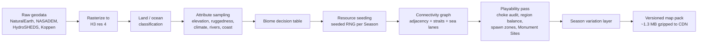
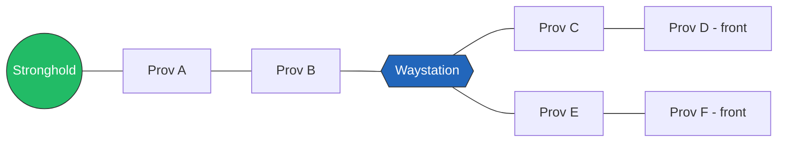
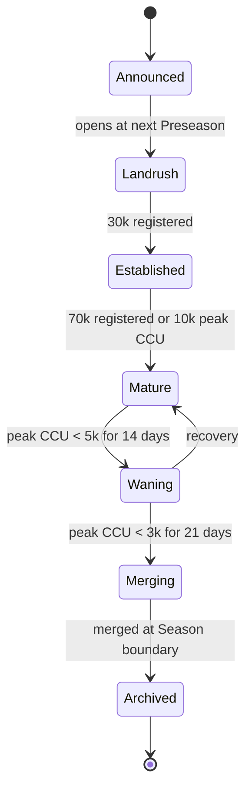

# 02 — World, Map & Seasons: Legions of Earth

> Builds on [00-vision-and-concept.md](00-vision-and-concept.md). Combat and unit rules live in [01-game-design-document.md](01-game-design-document.md); rendering and server implementation of everything here live in [08-art-and-ux-direction.md](08-art-and-ux-direction.md) and [04-technical-architecture.md](04-technical-architecture.md).

**Executive summary.** This document specifies the physical world of Legions of Earth: how we turn real Earth geography into a playable board of ~48,000 hex Provinces using the H3 grid at resolution 4; the Province attribute model (biome, resources, defense, capacity); the supply-line rules that make front lines legible and deep occupation impossible; Strongholds, the building system, and its construction economy; movement speeds and logistics; the week-by-week lifecycle of an 8-week Season including victory scoring and reset; the Hall of Ages legacy system; the full Shard lifecycle from opening through merge; and the catalogue of world events that drive each Season's narrative arc with real mechanical teeth. Every choice below is constrained by the worldwide-audience requirements in the anchor: ~700 KB of low-LOD map data ships in the initial load (the full ~1.3 MB compressed pack streams immediately after — the byte ledger lives in [04-technical-architecture.md](04-technical-architecture.md) §2.2), all timers are async-friendly and time-zone-rotated, and the map is deliberately stripped of every political border, country name, and contested toponym — players fight over terrain under fictional banners, never over nations.

---

## 1. The world at a glance

| Parameter | Value | Rationale |
|---|---|---|
| Grid system | **H3, resolution 4** (Uber's hexagonal hierarchical index) | Battle-tested library (JS/C/Python bindings), uniform ~hex tiling of the sphere, stable cell IDs across Seasons, free and open source |
| Mean Province area | 1,770 km² (edge ≈ 22.6 km, center-to-center ≈ 39 km) | "County-sized": large enough that holding one feels meaningful, small enough that a Legion of 100 can plausibly hold 150–400 |
| Land cells before filtering | ~81,000 | All res-4 cells with ≥ 30 % land |
| **Playable Provinces** | **~48,000** (hard clamp 40,000–60,000 per anchor) | After excluding Antarctica, ice sheets, and merging micro-islands |
| Ocean transit hexes | ~210,000 (non-ownable, pathfinding only) | Sea lanes, never territory |
| Pentagon cells (12 per H3 resolution) | All fall in open ocean by H3's icosahedron orientation | Verified in the build pipeline; if any drift into a coastal merge, they are forced to ocean-transit |
| Static map pack | ~700 KB low-LOD data in the initial load; full pack ≤ 1.3 MB gzipped, streamed after | Initial-load byte budget is [04-technical-architecture.md](04-technical-architecture.md) §2.2's ledger |
| Provinces per Commander at target population | ~0.5 (48k Provinces / ~100k registered) | Scarcity: territory is always contested |

Why H3 and not a hand-rolled icosahedral grid or square tiles: H3 gives us free adjacency math, hierarchical aggregation (res-2 cells become the strategic zoom level and the server's actor-sharding key — see [04-technical-architecture.md](04-technical-architecture.md)), and compact 64-bit cell IDs that compress beautifully. The known cost — twelve pentagons — lands entirely in ocean. A bespoke grid would cost 4–6 engineer-weeks for no player-visible gain. Square tiles lost because hex adjacency (6 equal neighbors) produces fairer supply-line and movement geometry than 4/8-neighbor squares.

---

## 2. Map generation pipeline

### 2.1 Data sources (all open, all apolitical)

| Layer | Source | License | Used for |
|---|---|---|---|
| Coastlines & land polygons | Natural Earth 1:10m (land, minor islands, glaciated areas) | Public domain | Land/ocean classification |
| Elevation | NASADEM 30 m, downsampled via GMTED2010 | Public domain | Highland detection, ruggedness, defense |
| Rivers | HydroSHEDS / HydroRIVERS (rivers ≥ 100 m³/s mean discharge) | Free for all uses w/ attribution | River tags, crossing penalties, fertile valleys |
| Climate | Köppen-Geiger 1 km classification (Beck et al. 2018) | CC-BY 4.0 | Biome assignment |
| Land cover sanity check | ESA WorldCover 10 m | CC-BY 4.0 | Validating forest/desert assignments |

We **never ingest** admin-0/admin-1 political boundaries, populated-place layers, or flag/name gazetteers. There is no file in the build that contains a country name, which makes "no political borders" enforceable by CI check rather than by review vigilance (a `map-pack-lint` step greps the artifact for a blocklist of demonyms and state names in all 20+ launch languages, maintained with [07-localization-and-i18n.md](07-localization-and-i18n.md)).

### 2.2 Pipeline stages

1. **Rasterize.** Every res-4 cell covering the globe is classified by sampling the land polygon layer at 64 points per cell. ≥ 30 % land → land Province; 1–30 % → merged into its largest land neighbor (this is how island chains like archipelagos become single playable Provinces); < 1 % → ocean transit hex.
2. **Filter.** Antarctica and the Greenland ice-sheet interior are excluded entirely (uninhabitable, and their inclusion adds ~9k dead Provinces). Result lands at ~48k playable Provinces; the pipeline asserts the 40k–60k clamp and fails the build otherwise.
3. **Attribute sampling.** Per Province we record mean/max elevation, terrain ruggedness index, dominant Köppen class, river presence (a HydroRIVERS segment crossing the cell), and coastal adjacency.
4. **Biome assignment** by decision table (§2.3), then a smoothing pass that removes single-hex biome islands (a lone desert hex inside forest becomes forest) so the map reads cleanly at strategic zoom on a low-end phone.
5. **Resource seeding** (§3) from a per-Season seed — deterministic, so client and server derive identical values from the pack.
6. **Connectivity graph.** Hex adjacency, plus **strait links** (two coastal Provinces ≤ 2 ocean hexes apart get a crossable strait edge, e.g. the narrows between the two great western peninsulas), plus **sea lanes** (precomputed ocean paths between all coastal cells for port logistics).
7. **Playability pass.** Automated audits: no land region > 400 Provinces reachable through a single choke hex (if found, a strait or pass is added); each of the 10 **Muster Regions** (continental-scale onboarding zones) contains ≥ 2,500 Provinces and ≥ 15 % coast; 16 **Monument Sites** are pinned to dramatic physical geography (highest peaks, great river confluences, largest deltas) for the Hall of Ages (§10); 9 major **Ruin Sites** and ~400 minor **Ancient Ruins** are seeded away from spawn frontiers — together the PvE footprint that [01-game-design-document.md](01-game-design-document.md) §8.1 builds on. A designer reviews a rendered diff report; the goal is zero hand-editing per Season.
8. **Export.** Quantized binary pack: per Province, 64-bit H3 id (delta-encoded), biome (3 bits), tags (8 bits), yields (4 × 6 bits), defense/capacity indices (8 bits), name index (20 bits). ~22 bytes/Province before gzip; measured pack ≈ 1.25 MB gzipped including the name table. A ~700 KB low-LOD subset (strategic-zoom geometry, biomes, names) is split out for the initial load; the remainder streams in the background immediately after first launch. Live ownership state is *not* in the pack — it streams as deltas (see [04-technical-architecture.md](04-technical-architecture.md)); data-saver mode falls back to a 60 KB minimap snapshot refreshed on demand.

### 2.3 Biome decision table

The anchor fixes seven biomes. Assignment, in priority order:

| Priority | Condition (per Province) | Biome |
|---|---|---|
| 1 | Mean elevation > 1,800 m **or** ruggedness index top decile | **Highland** |
| 2 | Köppen E or Dfc/Dfd (polar/subarctic) | **Tundra** |
| 3 | Köppen B W/S (arid) and not coastal | **Desert** |
| 4 | Köppen A f/m (tropical rainforest/monsoon) | **Jungle** |
| 5 | Coastal adjacency and mean elevation < 400 m | **Coast** |
| 6 | Tree cover > 40 % (ESA WorldCover) | **Forest** |
| 7 | Everything else (temperate/continental grassland, savanna) | **Steppe** |

Expected distribution on the base Earth: steppe 27 %, forest 19 %, desert 16 %, coast 14 %, highland 11 %, tundra 8 %, jungle 5 %. Mountainous coasts stay Highland but carry the `coastal` tag (ports allowed); "Coast" as a biome is the fertile lowland littoral.

### 2.4 Per-Season variation

The skeleton (coastlines, mountains, biome geography) is **fixed** — Earth stays learnable, which protects returning players' hard-won map knowledge. What the Season seed varies:

| Varied element | Range | Why |
|---|---|---|
| Resource yield reshuffle | ±40 % per Province around biome baseline; 3 % of Provinces get a **Rich Vein** (×3 one resource) | Prime real estate moves every Season; last Season's fortress economy may be this Season's backwater |
| Fertile / blighted belts | 2–4 seeded regional modifiers (+25 % / −25 % grain or timber) | Regional strategy varies |
| Frozen straits & land bridges | 0–3 strait edges toggled (e.g. a northern strait freezes into a land link) | Redraws invasion geometry |
| Impassable zones | 1–2 regions of 30–80 hexes flagged impassable (volcanic wastes, great floods) | Blocks last Season's dominant corridor |
| Ruin & event site placement | 9 major Ruin Sites + ~400 minor Ancient Ruins + event stages re-rolled | Objectives never camp the same hexes |
| Muster Region rotation | New-Commander spawn frontiers rotate among low-conflict areas | No permanent "newbie continent" |

Variation is generated and published at Preseason (§8) so scouting the new world is itself the first play activity of a Season.

---

## 3. Province attribute model

Every Province is: `id, biome, tags[], yields{grain,timber,stone,iron,silver}, defense_mod, capacity{garrison_cap, build_slots}, move_cost, owner, supply_state, development`.

**Reference table — biome baselines** (yields in units/hour at development 0; all values are pre-Season-variation):

| Biome | Grain | Timber | Stone | Iron | Silver | Defense mod | Move cost ×base | Garrison cap | Build slots |
|---|---|---|---|---|---|---|---|---|---|
| Steppe | 12 | 2 | 2 | 1 | 0 | −10 % | 1.0 | 400 | 3 |
| Coast | 10 | 3 | 2 | 0 | 1 | 0 % | 1.0 | 500 | 4 |
| Forest | 6 | 12 | 2 | 2 | 0 | +15 % | 1.5 | 400 | 3 |
| Jungle | 5 | 10 | 1 | 1 | 3 | +20 % | 2.0 | 300 | 2 |
| Highland | 3 | 2 | 12 | 8 | 2 | +30 % | 2.0 | 350 | 2 |
| Desert | 2 | 0 | 8 | 3 | 4 | 0 % (attrition instead) | 1.5 | 300 | 2 |
| Tundra | 2 | 4 | 3 | 6 | 1 | +10 % | 1.75 | 300 | 2 |

Tags modify baselines: `river` (+30 % grain, crossing penalty for attackers +25 % defense at river edges), `coastal` (port allowed), `strait` (crossable narrows), `rich_vein`, `ruin_site`, `monument_site`, `capital` (Legion-designated, 3× scoring weight), `impassable`. **Development** (0–3) rises through buildings and raises yields +25 % per level; it resets each Season. Balance targets and the full resource-consumption model are owned by [01-game-design-document.md](01-game-design-document.md) and [06-economy-and-monetization.md](06-economy-and-monetization.md); this table is the world-side source of truth for generation.

**Naming and cultural neutrality.** Provinces receive procedurally generated fictional names built from an invented, phonotactically neutral root set ("Varrow Reach", "Kessune", "Tal Moraen"), reviewed against the profanity/sensitivity screens of every launch language ([07-localization-and-i18n.md](07-localization-and-i18n.md)). Major *physical* features keep recognizable geographic names where they are apolitical (the Andes, the Sahara) because "we hold the Andes" is the core fantasy; any toponym with a live naming dispute between states ships under an invented neutral name instead, maintained on a sensitivity list jointly owned with [12-legal-compliance-privacy.md](12-legal-compliance-privacy.md). No real city names, ever.

---

## 4. Supply lines

Supply is the mechanic that keeps 48,000 Provinces legible: front lines exist because occupation requires connection.

### 4.1 Tracing rules

- A Province is **In Supply** if a path of friendly-controlled, passable Provinces connects it to its Legion's **Stronghold** or to a **Waystation** that is itself In Supply, with each path segment ≤ **10 hexes** from its supply source.
- **Waystations** (a building, §5.2) chain the network outward: Stronghold → ≤ 10 hexes → Waystation A → ≤ 10 hexes → Waystation B → … No hard chain limit; the limit is the cost of building and defending them.
- **Ports** extend supply over water: two friendly Ports connect if a sea lane ≤ 25 ocean hexes joins them; the sea segment counts as 1 hex of supply distance but is **interdictable** by enemy raiders operating from a coastal Province within 3 hexes of the lane (Skirmish-layer action).
- Coalition members' Provinces count as friendly for *pathing* but not as supply *sources* — you may trace through an ally's land, but only your own Stronghold/Waystations feed you. This makes coalitions useful without dissolving Legion identity ([03-legions-social-and-diplomacy.md](03-legions-social-and-diplomacy.md)).
- Supply is recomputed incrementally on every ownership change (an incremental BFS on the server's region actors — cheap because changes are local; see [04-technical-architecture.md](04-technical-architecture.md)).

### 4.2 Cutting and consequences

When the path breaks, the Province does not instantly flip — it **falters**, on a timeline slow enough for async, worldwide play (no advantage to being awake at the cut moment):

| Time since cut | State | Effects |
|---|---|---|
| 0 h | **Cut** | Resource output stops immediately; construction pauses; player and Legion get push/in-game alerts |
| 0–24 h | **Strained** | Garrison attrition 5 % per 12 h tick; defense modifier unchanged (grace window to counterattack) |
| 24–72 h | **Faltering** | Attrition 10 % per 12 h; defense modifier halved; repair/reinforce orders disabled |
| 72 h | **Collapse** | Province reverts to **Neutral**; garrison survivors auto-retreat toward nearest In-Supply friendly Province, losing 25 % en route |

Reconnecting at any point before Collapse restores In Supply within one 15-minute tick, with no lingering penalty — comebacks are cheap by design.

**Deep raids vs. deep occupation.** Warbands (units, not Provinces) may operate out of supply for **48 hours** with 5 %/12 h attrition, enough to burn a Waystation eight hexes behind the line and walk home — but not enough to *hold* what they take, because a captured Province with no traced path starts Faltering immediately. This is the anchor's "deep raids possible, deep occupation not," made numeric.

### 4.3 Worked examples

*Example 1 — the cut.* The Ashen Horde captures Prov B at 03:00 UTC while the Aurelian Legion's European players sleep. Provinces C–F all lose their trace (the Waystation now has no path to the Stronghold) and enter Cut → Strained. Aurelian players in Manila and São Paulo see the alert, and at 05:40 a Riders detachment retakes B — total damage: ~5 hours of lost output on four Provinces, no attrition (inside the 24 h grace). The time-zone-spanning Legion's round-the-clock coverage — the anchor's core fantasy — is exactly what saved them.

*Example 2 — the pocket.* Instead, the Horde takes B *and* garrisons it with Shieldline behind a river edge (+25 % defense). Aurelia's counterattack fails at hour 30. C–F are now Faltering: halved defense makes them cheap to storm one by one, or the Horde can simply wait until hour 72 and let all four collapse to Neutral, having only ever won one battle. **Cutting is worth roughly four times taking** — which is why front-line play revolves around guarding the two or three hexes your whole network hangs on, and why the playability pass (§2.2) guarantees no *continental* region hangs on a single hex.

*Example 3 — the sea lane.* The Tidewalkers supply an island chain through a Port pair. The Verdant Pact cannot reach the island, but parks Skirmishers on a coastal Province 2 hexes off the lane and runs interdiction: each successful Skirmish-layer interdiction (resolved asynchronously, [01-game-design-document.md](01-game-design-document.md)) suspends the lane for 6 h. Three successes in a day put the island into Strained without a single naval battle. Counterplay: escort supply runs (a 5-minute player verb from the anchor) or burn out the raiders' coastal base.

---

## 5. Strongholds and the building system

### 5.1 Strongholds

One Stronghold per Legion — its supply root, treasury site, and heart.

| Level | HP (siege points) | Supply radius | Upgrade cost (stone/timber/iron) | Build time | Unlocks |
|---|---|---|---|---|---|
| 1 | 10,000 | 10 | founding: 5k/5k/1k | 24 h | Treasury, 1 muster queue |
| 2 | 18,000 | 10 | 12k/8k/3k | 48 h | Coalition banner hall, market access |
| 3 | 30,000 | 11 | 25k/15k/8k | 72 h | 2nd muster queue, siege workshops |
| 4 | 45,000 | 12 | 45k/25k/15k | 96 h | Grand market, monument masons |
| 5 | 65,000 | 12 | 80k/40k/30k | 120 h | Capital designation ×3 scoring, finale eligibility |

Strongholds are placed during Preseason (§8) via an officer draft with minimum spacing of 8 hexes between Legion Strongholds, and can be **relocated once per Season** (72 h pack-and-rebuild at −1 level) — an expensive strategic retreat, not a dodge. Strongholds can only be *besieged* during a declared **Clash Window** (anchor §4.4): attackers must declare the window at least **72 hours** in advance — the notice period [01-game-design-document.md](01-game-design-document.md) §1.3 hangs its prepare-and-rally loop on — then accumulate siege points against HP across the 24-hour window; defenders repair with Engineers. A destroyed Stronghold does not eliminate the Legion — it re-founds anywhere in supply-traceable friendly territory at level max(1, L−2) after a 7-day rebuild, during which the Legion's Provinces trace to their best Waystation instead (mercy rule: max 10 Provinces stay supplied). Losing your Stronghold is a catastrophe; it is never a deletion, because eliminated players are churned players ([09-onboarding-retention-accessibility.md](09-onboarding-retention-accessibility.md)).

### 5.2 Province buildings

Buildings occupy a Province's build slots (2–4 by biome, §3). Any Legion member with build rights can queue them; costs draw on the Legion treasury or the builder's stock.

| Building | Slots | Cost (grain/timber/stone/iron) | Time | Effect | Upkeep/h |
|---|---|---|---|---|---|
| Farm I–III | 1 | 200/100/0/0 → ×2.2/level | 30 m → 2 h → 6 h | +40 % grain/level | 2 timber |
| Lumber camp I–III | 1 | 150/0/100/0 → ×2.2 | 30 m → 2 h → 6 h | +40 % timber/level | 2 grain |
| Quarry / Mine I–III | 1 | 100/200/0/50 → ×2.2 | 1 h → 3 h → 8 h | +40 % stone or iron/level | 3 grain |
| **Waystation** | 1 | 500/800/400/100 | 4 h | Supply relay (radius 10) | 10 grain |
| Watchtower | 1 | 100/300/200/0 | 1 h | Reveals moves within 4 hexes to Legion | 2 grain |
| Fort I–II | 1 | 300/500/800/200 → ×2.5 | 6 h → 16 h | +25 % defense/level, +100 garrison cap | 5 grain |
| **Port** | 1 (coastal tag) | 400/1,000/600/200 | 8 h | Sea-lane supply + trade routes | 8 grain |
| Market | 1 | 600/400/300/100 | 4 h | Regional trade access ([06-economy-and-monetization.md](06-economy-and-monetization.md)) | 4 grain |
| Shrine | 1 | 200/200/400/0 | 2 h | +5 % morale aura, cosmetic customization surface | 1 grain |

### 5.3 Construction economy

- **Queues.** Every Commander has 2 free build-queue slots; the Warpath Pass QoL track and convenience purchases raise this to a hard cap of 4 — a cap free players also reach through seasonal play, per the anchor's fair-F2P line. There is **no paid speed-up of any build timer**: Forts, Waystations, and Strongholds are combat-relevant, so they sit squarely inside the anchor's hard exclusion.
- **Engineers matter.** Each Engineer detachment present in the Province cuts remaining build time by 10 %, stacking to −30 %. This turns construction into a *logistics* activity (escort Engineers to the front) rather than a menu.
- **Upkeep and decay.** Buildings consume upkeep from the local supply network; an Out-of-Supply Province's buildings take 5 % damage per day and repair free once reconnected. Razing a captured building refunds the raider 25 % of its stone/iron — pillage is profitable but halves further, so burning deep is a raid economy, not an occupation one.
- **Worked example.** A forward Fort I on a river hex: 300/500/800/200 plus 6 h base, with two Engineer detachments → ~4 h 20 m. Combined river + Fort + forest biome defense: +25 % + 25 % + 15 % = +65 %, garrison cap 500. Cost is roughly 40 minutes of a mid-Season Legion's aggregate stone output — Forts are cheap enough to line a front, expensive enough that fortifying everywhere is impossible.

---

## 6. Movement and logistics

All movement is order-queued and resolves server-side on 15-minute ticks; nothing requires presence at arrival (anchor pillar 3).

**Base minutes per hex** (flat steppe/coast), multiplied by biome move cost (§3), +50 % at unbridged river edges, ×0.75 on a friendly In-Supply path (roads emerge implicitly from supply):

| Archetype | Min/hex | Role note |
|---|---|---|
| Riders | 12 | Interception, deep raids |
| Wayfinders | 16 | Scouting, escort |
| Skirmishers | 18 | Harassment |
| Shieldline | 25 | The front moves at Shieldline pace |
| Engineers | 30 | Slowest; protect them |

**Worked distances.** A front 18 hexes from the Stronghold (≈ 700 km center-to-center — e.g., across a large peninsula): Riders over mixed terrain (avg ×1.3, friendly ×0.75) ≈ 18 × 12 × 1.3 × 0.75 ≈ **3.5 h**; Shieldline ≈ **7.3 h** — an overnight march you queue before bed, a deliberately async rhythm with no advantage for any time zone. A hemisphere-scale redeployment (120 hexes) is ~2 days for Riders: possible, visible to enemy Watchtowers, and committing. **Muster transfer:** units *inside* the supply network may teleport-march between any two In-Supply Provinces at a flat 20 min/hex of network distance, capacity-limited to 3 detachments per Commander per day — interior lines are a real defensive advantage, but not a free one. Sea movement uses Ports: embark 30 m, 8 min/ocean hex, disembark 30 m; landings on hostile coasts take +50 % combat penalty on arrival day ([01-game-design-document.md](01-game-design-document.md)). Resource caravans move on the same graph at 20 min/hex and are raidable, making trade routes a strategic surface per the anchor. Trade geography follows the 10 **Muster Regions** (§2.2): each region's Markets aggregate into a single **Regional Market Hub** — one order book and one tax point per region, ten hubs worldwide; the market rules built on those hubs live in [06-economy-and-monetization.md](06-economy-and-monetization.md).

---

## 7. Season lifecycle

### 7.1 Week by week

| Phase | Days | What happens | Scoring weight |
|---|---|---|---|
| **Preseason** | 3 | New map pack published; scouting free-look; Legion registration and transfers; Stronghold placement draft (staggered by Legion size, smallest first); Doctrine planning | — |
| **Weeks 1–2: Landrush** | 1–14 | Neutral expansion; new-Commander 7-day shields active; no Clash Windows may be declared; attack-cost multipliers on small/new Legions at maximum | ×0.5 |
| **Weeks 3–4: Consolidation** | 15–28 | First Clash Windows; **Event beat 1** (week 3, §9); **World Congress session 1** (week 3, [03-legions-social-and-diplomacy.md](03-legions-social-and-diplomacy.md) §6); market opens fully; coalition diplomacy deadlines ([03-legions-social-and-diplomacy.md](03-legions-social-and-diplomacy.md)) | ×0.75 / ×1.0 |
| **Week 5: Upheaval** | 29–35 | **Event beat 2** — the mid-Season map-changer (comet winter, migration…); lapsed-player re-engagement push ([05-liveops-content-and-analytics.md](05-liveops-content-and-analytics.md)) | ×1.0 |
| **Weeks 6–7: Escalation** | 36–49 | **Event beat 3** (week 7); **World Congress session 2** (week 6, [03-legions-social-and-diplomacy.md](03-legions-social-and-diplomacy.md) §6); Ruin Sites fully active; Clash Window cadence rises to 2/week per front | ×1.25 / ×1.5 |
| **Week 8: Finale** | 50–56 | All holdings doubled in scoring; the **Grand Clash** — one final 24-hour window per Shard whose resolution hour rotates Seasons (UTC+0 → +8 → −6 → …) so no region owns the climax | ×2.0 |
| **Reckoning** | 57–58 | Scores frozen and audited (anti-fraud pass, [10-security-anticheat-trust-safety.md](10-security-anticheat-trust-safety.md)); awards ceremony in-client; Hall of Ages etching; world browsable read-only | — |
| **Reset** | 59 | New Season's Preseason begins; no downtime — the interlude *is* the Preseason of the next Season | — |

The escalating weekly weights sum to 8.5 weight-weeks (0.5 + 0.5 + 0.75 + 1.0 + 1.0 + 1.25 + 1.5 + 2.0), so weeks 1–2 decide **~11.8 %** of a Season (1.0 / 8.5) and week 8 decides **~23.5 %** (2.0 / 8.5): early stumbles are recoverable, finales are genuinely decisive, and mid-Season joiners (a huge share of a worldwide funnel) still matter.

**Outage fairness.** A Shard-wide outage longer than 30 minutes pauses the Season clock for its duration and shifts any open or already-declared Clash Windows by the same amount — no region's prime time is silently eaten by downtime. Detection and the pause mechanism live in [04-technical-architecture.md](04-technical-architecture.md) §8.

### 7.2 Victory scoring

**Dominion Points (DP)**, snapshotted once daily at a UTC hour that advances 3 hours each day (fully cycling the clock ~every 8 days — no time zone can camp the snapshot):

- Standard Province held In Supply: **1 DP** × week weight
- Capital Province (Stronghold L5 designation): **3 DP**
- Monument Site / Ruin Site held: **5 DP**
- Event objectives: fixed DP purses per event (§9), typically 500–2,000 DP
- Clash Window victories: 200 DP (Stronghold siege) / 100 DP (capital defense)

Faltering Provinces score 0 — occupation without supply is worthless on the scoreboard too. Legions are ranked per Shard; a Coalition's score is the sum of its Legions' (coalitions share glory, not a separate ladder, keeping the 100-Commander Legion the identity unit). Commander-level contribution (battles, escorts, builds, scouting) feeds personal titles, not Legion DP — so there is no incentive to hoard actions from teammates. Final standings produce: **Season Victor** (top Legion), podium (top 3), **Regional Laurels** (top Legion per Muster Region), and ~30 deed-based awards (§10). Rewards are cosmetic and commemorative only — banners, monument rights, titles, Warpath Pass bonus tiers — never a next-Season head start, which would compound-snowball across Seasons and violate the fairness pillar.

### 7.3 Reset and continuity

At reset: map ownership, warbands, resources, buildings, and development wipe; Commander profile, cosmetics, titles, battle honors, Legion identity/history/social graph, and Hall of Ages records persist (anchor §4.5). Legion treasuries convert at a published rate into **Legacy Marks**, the cross-Season cosmetic currency ([06-economy-and-monetization.md](06-economy-and-monetization.md)) — softening the sting of reset without carrying power forward.

---

## 8. World events and seasonal narrative arcs

Each Season runs a light narrative arc delivered in three **event beats** (weeks 3, 5, 7). The pool below ships at launch; each beat draws one event, seeded per Season and per Shard, with start times rotated across UTC offsets. Every event changes *incentives on the map* — flavor rides on mechanics, never instead of them. Event fiction uses only the game's invented mythos; nothing references real cultures' sacred narratives ([07-localization-and-i18n.md](07-localization-and-i18n.md) owns culturalization review).

| Event | Beat | Mechanical effects | Counterplay / decisions |
|---|---|---|---|
| **Comet Winter** | 2 | Tundra creeps 2 hexes/day along the polar margin for 7 days (yields drop to tundra baseline); 1–3 straits freeze into land bridges; movement in affected zone ×1.5 | Abandon the north or fortify the new land bridges; grain trade south spikes |
| **The Great Migration** | 2–3 | An NPC horde (server-driven warband stream) enters along a steppe corridor, attacking Provinces on its path; defeating horde detachments yields DP and salvage | Coalitions must coordinate a rolling defense across time zones; letting it through redirects it at your rival |
| **Ruins Awaken** | 1–3 | The 9 major Ruin Sites activate progressively; each held site = 5 DP/day + one Season-limited cosmetic dig reward | Ruins sit deliberately far from Season-start power centers — long supply lines required |
| **Silver Rush** | 1 | Silver yields ×3 across one desert belt for 10 days | Gold-rush land grabs in low-defense terrain; caravan raiding surges |
| **The Sunken Causeway** | 2 | A new 4-hex land path rises from a shallow sea, linking two regions for the rest of the Season | Whoever fortifies it first owns a new world artery |
| **The Blight** | 1–2 | Grain −50 % in 2 regional belts for 10 days; Shrines reduce it to −25 % locally | Import or starve: markets, escorts, and mutual-aid diplomacy get stress-tested |
| **The Long Night** (finale variant) | 3 | Week 8 only: Watchtower vision −50 %, raid attrition paused | Fog-of-war finale rewards scouting Doctrines and disciplined comms |

Events are also the re-engagement hook: beat announcements go out as localized push/email with a one-tap deep link into the affected region ([05-liveops-content-and-analytics.md](05-liveops-content-and-analytics.md) owns cadence and experimentation; [09-onboarding-retention-accessibility.md](09-onboarding-retention-accessibility.md) owns lapsed-player flows).

---

## 9. Hall of Ages

The Hall of Ages is the permanent memory of a world that otherwise resets — the reason eight weeks of effort never feels deleted.

- **Monuments in the world.** Each Season, winners earn **etching rights** at the 16 Monument Sites: the Season Victor at the Grand Site (highest peak on the map), Regional Laurels at their region's site. Monuments are visible in-world in every future Season on that Shard — stylized stelae showing banner, Season number, and inscription (free-text, filtered through the moderation pipeline of [10-security-anticheat-trust-safety.md](10-security-anticheat-trust-safety.md)). Architecture styles for monuments are a cosmetics surface ([06-economy-and-monetization.md](06-economy-and-monetization.md), [08-art-and-ux-direction.md](08-art-and-ux-direction.md)).
- **The Hall itself** is a browsable in-client archive (and public web mirror — a marketing surface, [11-marketing-community-gtm.md](11-marketing-community-gtm.md)): every Season's final map, standings, and **Great Deeds** — ~30 automatically detected records per Season (Longest supply line held unbroken, Greatest comeback from ≤ 10 Provinces, First across the Sunken Causeway, Night Watch: most cut-saves in the 03:00–06:00 local dead hours…). Deed detection runs on the analytics event stream, so new deed types ship without client updates.
- **Titles** are Commander-level, permanent, and equippable (one shown at a time): *Season III Victor*, *Laurel of the Western Reach*, *Wayfinder Primus*. Titles carry zero mechanical effect.
- **Cross-Shard identity.** Hall records are Shard-scoped, but a Commander's titles and an account-level deed ledger travel with the account, so switching Shards (or surviving a merge) never orphans a legacy.

---

## 10. Shard lifecycle

- **Opening.** A new Shard is announced when the *newest* existing Shard crosses **80k registered** or sustains **12k peak CCU** for 7 days, and it opens at the next Preseason so every Shard's Seasons stay phase-aligned (critical for cross-Shard events later and for a single global live-ops calendar). Shards carry mythic names (*Aurelia*, *Kharsis*, *Veyra*) — never region names, since Shards are region-agnostic by design.
- **Population targets** per the anchor: ~100k registered / ~15k peak CCU at maturity. Soft cap at 120k registered: past it, new registrations are steered (not forced) elsewhere.
- **Choosing a Shard.** The picker recommends one Shard by score: population health 40 % (distance from the healthy band), friends/invite-link presence 30 % (an invite link *always* lands you on the inviter's Shard if it's below hard cap — Legion recruiting is the top social funnel), active language-community match 20 % ("2,400 Portuguese-speaking Commanders active this week"), Season freshness 10 % (early-Season Shards favored). Manual choice is always available with the same stats shown. Latency is deliberately *not* a factor — the async-first design makes 250 ms indistinguishable from 40 ms. One Commander per account per Shard; account-wide switching allowed at Season boundaries only (an anti-multi-boxing surface, [10-security-anticheat-trust-safety.md](10-security-anticheat-trust-safety.md)).
- **Merging.** A Shard in *Merging* combines into a designated healthy Shard at the Season boundary — never mid-Season. Legions transfer intact (name collisions resolved by founding date, the younger Legion gets a free rename); Hall of Ages archives are preserved in full on the merged Shard under a "Chronicles of Kharsis" shelf, and monuments from the closing Shard are rebuilt at secondary positions on the destination's Monument Sites. Players get 2 weeks' notice, in-client and by localized email.
- **End of life.** An Archived Shard's Hall remains permanently readable on the web. We commit to this in the service promise: **worlds merge, history is never deleted** ([12-legal-compliance-privacy.md](12-legal-compliance-privacy.md) covers the data-retention interplay).

---

## 11. Interfaces with sibling documents

| Topic decided here | Consumed by |
|---|---|
| H3 res-4 grid, cell IDs, region hierarchy | [04-technical-architecture.md](04-technical-architecture.md) (sharding, deltas, pack CDN) |
| Province yields, upkeep, building costs | [01-game-design-document.md](01-game-design-document.md), [06-economy-and-monetization.md](06-economy-and-monetization.md) |
| Supply/Faltering timelines, Clash constraints | [01-game-design-document.md](01-game-design-document.md), [03-legions-social-and-diplomacy.md](03-legions-social-and-diplomacy.md) |
| Season calendar and event beats | [05-liveops-content-and-analytics.md](05-liveops-content-and-analytics.md) |
| Map readability, biome palette, monument art | [08-art-and-ux-direction.md](08-art-and-ux-direction.md) |
| Naming pipeline, toponym sensitivity list | [07-localization-and-i18n.md](07-localization-and-i18n.md), [12-legal-compliance-privacy.md](12-legal-compliance-privacy.md) |
| Shard picker, spawn shields, Muster Regions | [09-onboarding-retention-accessibility.md](09-onboarding-retention-accessibility.md) |
