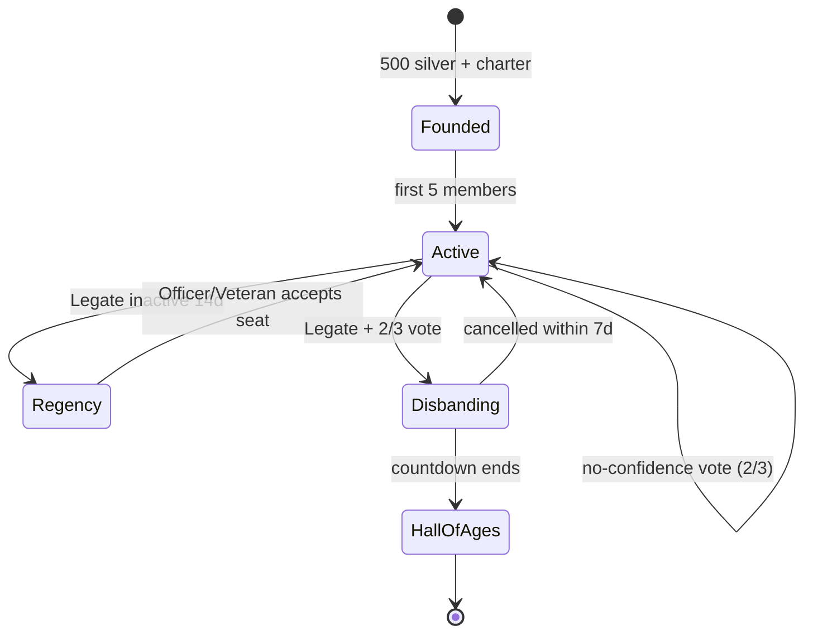

# 03 — Legions, Social & Diplomacy: Legions of Earth

**Executive summary.** This document specifies the social layer of *Legions of Earth*: the full Legion lifecycle (founding, fictional-banner creation, ranks, treasury, succession), the coordination tools that let 100 Commanders across a dozen time zones act as one army, the recruitment and matchmaking pipeline that places every new Commander in a compatible Legion within three sessions, Coalition mechanics, a formal diplomacy system with enforceable pacts and priced betrayal, the Shard-wide World Congress, and a chat system built around always-on machine translation and language-free tactical communication. The design premise, inherited from `00-vision-and-concept.md`, is that the Legion is the real player character: a median Legion should span three or more countries, keep watch around the clock, and make a 5-minute contribution from any member visibly matter. Everything here is therefore designed for asynchronous, cross-language, cross-cultural cooperation on low-end phones first. Deep enforcement mechanics (moderation queues, sanctions, appeals) live in `10-security-anticheat-trust-safety.md`; this document defines the surfaces that feed them.

---

## 1. The Legion lifecycle

### 1.1 Founding

Any Commander who has completed the tutorial arc (first ~20 minutes; see `09-onboarding-retention-accessibility.md`) and reached account level 3 may found a Legion. Founding costs **500 silver** — deliberately cheap enough that a group of friends founds one on day one, expensive enough that founding is a choice rather than an accident. Founding requires, in one flow of under two minutes on mobile:

1. **Name** (3–24 characters, Unicode letters permitted, uniqueness enforced per Shard, screened at creation — see §1.2).
2. **Banner** built in the banner editor (§1.2).
3. **Charter card** — three structured fields chosen from pickers, not free text: *primary languages* (up to 3), *play style* (Casual / Regular / Hardcore), *Clash participation expectation* (Optional / Encouraged / Required). These fields drive matchmaking (§3) and are displayed on every recruitment surface.
4. **Home region** — the founder's current Province becomes the initial Stronghold site (Stronghold rules in `02-world-map-and-seasons.md`).

A newly founded Legion starts at **capacity 25**, expanding to the full 100 through Legion progression milestones (member activity-days, Provinces held, Clash participations). This throttle exists so the recruitment funnel (§3) steers unaffiliated players toward established Legions with real capacity to absorb them, while friend groups still get a home immediately.

### 1.2 Banner creation and the fictional-banner rules

The banner editor is a compositor: **1 field pattern × 1–2 emblems × a 3-color palette**, from a curated library at launch of **40 patterns, 120 emblems, and 24 palettes** (~340k practically distinct combinations; cosmetic packs extend the library — see `06-economy-and-monetization.md`). There is **no free-drawing and no image upload at launch**; any future image surface is gated on a Trust & Safety review (`10-security-anticheat-trust-safety.md`). This is a deliberate loss of expressiveness bought back as safety: a compositor cannot render a real flag, a hate symbol, or pornography, which removes the single largest moderation load a user-generated-identity system creates.

The emblem library is drawn from mythic-historical motifs across many world cultures (knotwork, calligraphic geometry, animal totems, celestial signs), curated with the culturalization review process in `07-localization-and-i18n.md` to avoid sacred symbols used disrespectfully. Hard exclusions, enforced by library curation plus combination linting (the editor blocks palette+pattern+emblem combinations that reproduce well-known real flags within a perceptual-distance threshold):

| Rule | Enforcement point |
|---|---|
| No real national flags or close imitations | Editor combination lint + report flow |
| No real-country, ethnic-group, or political-movement names | Name screen at creation (blocklist + classifier) + report flow |
| No hate symbols | Emblem library curation (they are simply not in the library) |
| No impersonation of other Legions (name or near-identical banner) | Similarity check at creation |

Name screening runs the layered filter defined in `10-security-anticheat-trust-safety.md` (exact blocklist, transliteration-aware fuzzy match, and a human review queue for flagged creations, with per-language lists maintained by the localization team per `07-localization-and-i18n.md`). A rejected name explains *which rule* failed, in the player's language, and offers the "banner ethos" line from the naming screen: *"Legions fight for terrain, never for nations."* This framing is repeated in onboarding so the rule reads as lore, not censorship.

### 1.3 Ranks and permissions

Four ranks, matching the vocabulary in `00-vision-and-concept.md`, with a permission matrix rather than hardcoded roles so Legions can tune governance:

| Permission | Legate (1) | Officer (≤10) | Veteran | Recruit |
|---|---|---|---|---|
| Invite / accept applicants | ✔ | ✔ | configurable | — |
| Kick members | ✔ | ✔ (not Officers) | — | — |
| Promote/demote | ✔ | ✔ (up to Veteran) | — | — |
| Post orders to the orders board | ✔ | ✔ | configurable | — |
| Edit shared map layers | ✔ | ✔ | ✔ | view only |
| Treasury withdrawals | ✔ | daily-capped | — | — |
| Declare war / sign pacts | ✔ | configurable | — | — |
| Schedule Clash Window defense slot | ✔ | ✔ | — | — |
| Edit charter / banner / MOTD | ✔ | — | — | — |
| Disband Legion | ✔ (with vote, §1.5) | — | — | — |

Recruits auto-promote to Veteran after **7 activity-days** unless an Officer intervenes — promotion should be the default path, not a favor. All permission-bearing actions are written to a member-visible **Legion audit log** (90-day retention), which is both a governance tool ("who kicked Aster?") and a Trust & Safety evidence surface (§9).

### 1.4 Treasury

The Legion treasury holds the five in-game resources and silver (economy rules in `06-economy-and-monetization.md`; **no premium currency may ever enter a treasury** — this closes the largest RMT laundering channel preemptively). Inflows: voluntary member deposits, a Legate-set **tithe** (0–10% of member Province income, shown to every applicant on the recruitment card before they apply), and Coalition disbursements. Outflows fund Stronghold construction, Clash Window siege works, and market operations.

Anti-embezzlement design, since treasury theft is the classic alliance-game griefing vector: Officer withdrawals are capped at **5% of treasury value per day per Officer**; the Legate's cap is 20%; any single withdrawal above 2% triggers a push notification to all Officers; and the audit log makes every movement attributable. We accept that a patient Legate can still drain a treasury over days — total prevention would require multi-signature friction that punishes the 99.9% of honest Legions — but the caps convert catastrophic theft into a slow, visible, socially answerable act, and the succession vote (§1.5) gives members a remedy.

### 1.5 Succession and disband

- **Inactivity succession:** if the Legate is inactive **14 consecutive days**, the system offers the seat to Officers in activity order; if none accepts within 72 hours, the most active Veteran is offered it. No Legion is ever leaderless for more than ~17 days.
- **No-confidence vote:** any 3 Officers (or 25% of active members) can trigger a Legate vote; a **⅔ supermajority of members active in the last 14 days** transfers the seat. Cooldown: one vote per 21 days. This is deliberately hard — coups should be rare, dramatic, and legitimate.
- **Voluntary transfer:** instant, with a 48-hour treasury-withdrawal freeze on the outgoing Legate to prevent hand-off drains.
- **Disband:** requires Legate initiation plus a ⅔ member vote, then a 7-day countdown visible to all members and the Coalition; treasury is distributed pro-rata by lifetime contribution score (§2.3). Provinces revert to neutral per the decay rules in `02-world-map-and-seasons.md`. Legion name, banner, and history are preserved read-only in the Hall of Ages — a dead Legion's deeds outlive it, which makes founding feel consequential.

---

## 2. Coordination tools: making 100 strangers an army

The core coordination problem: members are asleep in shifts, speak different languages, and play in 5-minute sessions. Every tool below is therefore **asynchronous-first, glanceable on a 360×640 phone screen, and language-light**.

### 2.1 Shared map layers

Three annotation layers render on the world map (rendering budget in `04-technical-architecture.md`; annotations are vector deltas of a few hundred bytes, 3G-friendly):

- **Legion layer** (Veterans+ edit): pins, arrows, zone highlights, and **icon-stamps** — a fixed vocabulary of 24 tactical stamps (Attack Here, Defend, Scout Needed, Supply Route, Rally, Danger, Trap Suspected, Build, …) that carry meaning without any shared language (§8).
- **Coalition layer** (designated Coalition planners edit): same vocabulary, visible to all 10 member Legions.
- **Personal layer:** private notes.

Every stamp records author + timestamp and auto-expires (default 72 hours, orders-linked stamps persist with the order) so the map never fossilizes into stale plans. A "what changed since my last session" mode replays new annotations in sequence — the single most important feature for the 5-minute check-in player.

### 2.2 Orders board

The orders board is the Legion's async task queue and the backbone of the "five minutes matter" pillar. An Officer posts an **Order**: a structured object, not prose — *type* (from 12 templates: Reinforce, Escort Supply Run, Scout, Raid, Repair, Garrison, Gather, Build, …), *target Province*, *quantity needed*, *deadline*, optional short note (machine-translated, §7). Members see orders **sorted by fit**: distance from their warband, unit-type match, and deadline urgency. One tap claims a slice ("I'll escort 1 of the 4 supply runs"); completion auto-verifies from the simulation and credits contribution (§2.3).

Worked example: Officer Dara (Warsaw, UTC+1) posts at 22:00 her time: *Reinforce Province K-1132, 4,000 Shieldline strength, deadline 14:00 UTC*. Overnight, Commanders in Manila and Jakarta claim 2,600; a São Paulo player waking at 07:00 local sees the remaining 1,400 flagged "closes soon — you're 2 Provinces away," claims it, and the garrison is full before the deadline — with Dara asleep the entire time. No chat message was ever required; the order object itself, rendered in each claimant's language, was the communication.

### 2.3 Contribution and attendance tracking

Every simulation-verified act (order completions, resources moved, walls repaired, scout reports, Clash Window contribution) accrues to a per-member **Contribution Score**, decomposed by category so a logistics specialist is as legible as a raider. Displayed as a 14-day rolling view plus season total. Design rules learned from alliance-game failure modes:

- **Floor, not leaderboard-first:** the default Officer view is "who is below the Legion's own activity floor," not a top-10. Public leaderboards inside the Legion are opt-in per Legion, because mandatory internal rankings are a documented burnout driver in this genre.
- **Session-length fairness:** scores are normalized so five 5-minute sessions ≈ one 25-minute session; no category requires presence at a specific UTC hour (Clash contribution accrues across the whole 24-hour window per `00-vision-and-concept.md` §4.4).
- Contribution drives treasury pro-rata on disband, seasonal Legion rewards, and the Hall of Ages honors feed.

### 2.4 Officer dashboards

A single dashboard screen (mobile-first, three stacked cards) answering the only three questions officers ask daily: **Who needs attention?** (below-floor members, pending applicants, expiring shields), **What is at risk?** (Provinces with supply lines threatened, garrisons below doctrine threshold, upcoming Clash Windows), **What is moving?** (orders board fill rates, treasury deltas, diplomacy inbox). Each card deep-links to the acting screen. Target: an Officer can run a competent Legion in **10 minutes/day on a phone** — this is a hard UX acceptance criterion shared with `08-art-and-ux-direction.md`.

---

## 3. Finding a Legion: every Commander housed within 3 sessions

Pillar 2 sets the bar: a new player joins a Legion within their first three sessions. The funnel (instrumentation and targets in `05-liveops-content-and-analytics.md`; FTUE placement in `09-onboarding-retention-accessibility.md`):

### 3.1 Recruitment surfaces

1. **Session 1 — soft touch.** The tutorial's final beat has three nearby Legions' banners visible on the map with the line "Provinces fall to Legions, not Commanders." No ask yet.
2. **Session 2 — Legion Finder.** A card-swipe browser (not a table — tables die on phones) showing per Legion: banner, charter card (languages, play style, Clash expectation, tithe %), member count and capacity, active-in-last-24h count, countries represented, and a one-line MOTD machine-translated into the viewer's language. One tap applies; Legions may set auto-accept.
3. **Session 3 — assertive default.** Any unaffiliated Commander gets a **top-3 recommended list** with a one-tap join into auto-accept Legions, plus the alternative "found your own with friends." If still unaffiliated after session 3, a persistent (dismissible) banner remains, and week-1 quests include "join or found a Legion" as a Warpath Pass objective.
4. **Ambient surfaces:** open-recruitment Legions get a subtle map glyph on their Stronghold; post-battle replay screens show the victors' recruitment card; invite links are shareable out-of-game (deep-link joins measured as a GTM channel in `11-marketing-community-gtm.md`).

### 3.2 Matchmaking model

Recommendation score per (player, Legion) pair — a transparent weighted sum, not an opaque model, so the team can tune it and players can be told *why* ("Recommended because: speaks Portuguese, active in your evenings, near your home Province"):

| Factor | Weight | Signal |
|---|---|---|
| Language overlap | 30% | Client language + charter languages (never IP-inferred ethnicity — language only) |
| Activity-hours overlap | 25% | Player's observed session hours vs. Legion's activity histogram — **with a deliberate bonus for Legions whose coverage the player *fills a gap in***, capped so at least one strong same-hours cohort remains |
| Geographic proximity in-game | 20% | Home Province distance to Stronghold |
| Play-style match | 15% | Session-length pattern vs. charter (a 5-min/day player is not routed to "Clash Required") |
| Capacity & absorption health | 10% | Open slots, recent-recruit 14-day retention rate |

The gap-filling bonus operationalizes "time zones are a game mechanic": the system actively assembles around-the-clock Legions instead of clustering compatriots — this is how the "median Legion spans ≥ 3 countries" success criterion in `00-vision-and-concept.md` §9 gets met, and machine-translated chat (§7) is what makes it livable. Legions that habitually reject or churn recruits (recruit 14-day retention < 40%) are down-ranked automatically; no manual curation needed.

**Funnel targets:** ≥ 60% of D3-retained players in a Legion by session 3; ≥ 55% of D7-retained players in a Legion (KPI definitions and denominators in `05-liveops-content-and-analytics.md`); recruit 14-day in-Legion retention ≥ 55%. These feed the D7 social KPI in `00-vision-and-concept.md` §9 and are A/B-owned by the growth team per `05-liveops-content-and-analytics.md`.

---

## 4. Coalitions

A **Coalition** is a named alliance of up to **10 Legions** (≤1,000 Commanders) — the unit that takes continents. Formed by a founding Legion inviting others; each Legion's Legate accepts. Governance is deliberately thin — a **Coalition Council** of the 10 Legates, one vote each regardless of Legion size (protecting small Legions from absorption politics), majority rule, with a rotating **Marshal** (elected by the Council for 2-week terms) who can post to the Coalition orders board and layer.

Shared machinery: the Coalition map layer and orders board (§2), a Coalition chat channel (§7), and **Coalition Objectives** — Season-scoped goals (hold a named mountain chain through week 6, control both ends of a strait, win 3 Clash Windows in a biome) that pay Coalition-wide cosmetic rewards and Hall of Ages entries. Objectives are authored by live-ops (`05-liveops-content-and-analytics.md`) and sized so that a full 10-Legion Coalition is *helpful but not mandatory* — 3-Legion Coalitions must have winnable objective tiers, or small alliances become dead content.

Deliberate constraints, each a lesson from territory-game history:

- **No Coalition treasury.** Inter-Legion resource movement uses the market/tribute systems (raidable, visible), keeping logistics a strategic surface per `00-vision-and-concept.md` §4.6 and denying mega-alliances a frictionless internal economy.
- **Coalition membership is public** to the whole Shard. Secret mega-blocs are the classic death of territory games (one bloc wins, everyone else quits); public membership lets the Shard see and counter-coalesce, and the World Congress (§6) gives the "everyone else" a lever.
- **Leaving costs:** a Legion exiting a Coalition enters a 72-hour period during which it cannot join another Coalition, and standing pacts with the old Coalition convert to non-aggression for 7 days (anti-instant-backstab, §5.4).

---

## 5. Diplomacy

Diplomacy is **formal and mechanical**, not honor-system: agreements are game objects with enforced effects and priced violations. Informal scheming in chat is welcome — but what is *signed* is *binding or expensive*.

### 5.1 Instruments

| Instrument | Effect while active | Term | Breakable? |
|---|---|---|---|
| **Non-Aggression Pact (NAP)** | Attacks/raids between parties blocked in UI; forcing an attack requires breaking the pact first | 7/14/28 days | Yes — betrayal cost (§5.4) |
| **Alliance Pact** | NAP + shared vision on each other's Provinces + mutual-defense flag (attacker of one suffers +15% siege cost from the other's garrisons) | 14/28 days | Yes — betrayal cost |
| **Tribute Agreement** | Scheduled resource transfer, auto-executed along physical supply routes (**raidable in transit** — third parties can interdict tribute, making it strategic) | Up to 28 days | Payer may default → counts as betrayal |
| **Right of Passage** | Units cross the grantor's Provinces without triggering hostility | 7/14 days | Yes — betrayal cost |
| **War Declaration** | Formal state of war; removes new-player/low-conflict cost multipliers between parties; enables Stronghold Clash scheduling | Until peace signed | Peace requires both parties or 14-day mutual inactivity |

All instruments are signed Legion-to-Legion or Coalition-to-Coalition by holders of the diplomacy permission (§1.3), through a **diplomacy inbox** with proposal/counter-proposal turns. Proposal notes are machine-translated (§7); terms themselves are structured fields needing no translation.

### 5.2 War declarations

War is declared, never drifted into: a declaration takes effect after a **24-hour notice period** (broadcast to both sides and visible Shard-wide on the diplomacy map overlay), satisfying the "attackers get notice" rule in `00-vision-and-concept.md` §4.4. Skirmish-layer raiding between non-pacted parties needs no declaration — the always-on layer stays frictionless — but **Stronghold sieges and capital-Province Clash Windows require a standing declaration**, which keeps decisive violence legible and schedulable across time zones.

### 5.3 Reputation: the Oathkeeper Index

Every Legion carries a public **Oathkeeper Index (OI)**, 0–100, starting at 70: +1 per pact honored to term (cap +3/week), −25 for a betrayal, −10 for a tribute default, linear recovery of +1 per clean week. OI is displayed on the Legion's card everywhere — recruitment, diplomacy inbox, map tooltip. It has exactly **one mechanical hook** (below OI 40, proposals you send carry a warning banner and your NAPs demand a deposit, §5.4) — everything else is social. Alternative considered and rejected: heavy mechanical punishment for low OI (trade bans, combat debuffs). Rejected because treachery is *content* — the great betrayals become Hall of Ages stories — and because hard punishment pushes scheming into unsigned, invisible agreements, which is worse for everyone. We price betrayal; we do not prohibit it.

### 5.4 Betrayal costs — worked example

Breaking a signed instrument before term triggers, automatically:

1. **OI −25.**
2. **War-preparation lockout:** the betrayer cannot declare formal war on the betrayed party for 48 hours (a betrayal opens skirmish hostilities immediately but delays decisive sieges — the victim gets time to organize its defense across time zones).
3. **Deposit forfeiture:** pacts may include an optional escrowed deposit (proposer sets 0–20,000 silver, both sides escrow equally; **mandatory** at 10% of treasury for parties under OI 40). Broken pact → the betrayer's escrow pays the victim.
4. **Shard-wide herald:** the betrayal is announced in the world-events feed and recorded permanently on both Legions' Hall of Ages pages.

*Example:* the Ashen Horde (OI 71) signs a 14-day NAP with the Tidewalkers with a 10,000-silver mutual escrow, then breaks it on day 9 to seize a bridge Province. Instantly: Horde OI → 46; Tidewalkers receive 10,000 silver plus their own escrow back; the Horde cannot open a formal war (and thus cannot schedule a Stronghold Clash) until hour 48, during which Tidewalker Officers in three time zones rotate garrison reinforcement via the orders board; the herald announcement pushes two neutral Legions into an Alliance Pact with the Tidewalkers. The bridge was worth it — maybe. That "maybe" is the design target.

### 5.5 Anti-abuse

Pact spam (flooding an inbox with proposals) is rate-limited (5 open proposals per target per week); "pact-shield weaving" (chaining NAPs with puppet Legions to become unattackable) is countered because NAPs block *your own* attacks too — every pact is a real constraint; multi-account puppet diplomacy detection is specified in `10-security-anticheat-trust-safety.md`.

---

## 6. The World Congress

Once per Season cycle, weeks 3 and 6 (schedule in `02-world-map-and-seasons.md`), the **World Congress** convenes: a Shard-wide vote in which **every Legion with ≥ 10 active members casts one ballot** (one Legion, one vote — Congress is where small Legions matter; Commander-level voting was rejected because it simply mirrors population, and unaffiliated players are represented via a single aggregated "Free Companies" ballot line computed from individual votes).

The Congress votes on **2–3 agenda items** drawn from a live-ops-curated slate (`05-liveops-content-and-analytics.md`) of bounded world-rule levers — Congress tunes the world, it never touches player property or combat power:

| Category | Example ballot |
|---|---|
| World rules | "Winter storms close tundra passes in weeks 7–8: yes/no" |
| Economy levers | "Market tax 5% → 4% for the remainder of the Season" |
| Event selection | "Season finale event: *Comet Winter* vs. *The Great Migration*" |
| Commons | "Designate the Great Rift as a no-siege sanctuary zone until week 6" |
| Honors | "Elect this Season's *Wonder of the Age* from the top 5 Hall of Ages nominees" |

Voting is open for **72 hours** (time-zone fairness — no live assembly to attend), ballots are public per Legion after close (secret ballots were rejected: public votes create diplomacy — vote-trading, tribute-for-votes, and Congress coalitions are intended emergent content), and results apply automatically at the next daily reset. The Congress interface is a single mobile screen: agenda card, machine-translated neutral summary of each option's mechanical effect (authored by live-ops, localized per `07-localization-and-i18n.md`), your Legion's declared position (set by Legate/Officers), and a "debate" thread per item in Shard chat. Expected outcome worth naming: dominant Coalitions will whip votes — and the visible whip becomes the rallying point for everyone else, which is the Congress doing its real job: giving the Shard a non-military theater of conflict.

---

## 7. Chat design

### 7.1 Channels

| Channel | Membership | Retention | Notes |
|---|---|---|---|
| **Legion** | All members | 30 days | The home channel; default landing tab |
| **Officers** | Officer+ | 30 days | Governance |
| **Coalition** | All Coalition members | 14 days | Read-heavy; posting default Veterans+ (per-Legion setting) |
| **Diplomacy threads** | Parties to a negotiation | Season | Attached to proposals; evidence-grade log |
| **Province** | Commanders present in a Province | 24 h | Local coordination, emergent frontline banter |
| **Shard herald** | Everyone (read-only) | Season | World events, betrayal heralds, Congress results |
| **Whispers** | 1:1 | 30 days | Mutual-Legion/Coalition or mutual-follow only by default (harassment surface control, §9) |

No global free-for-all channel at launch. Alternative considered: a world chat. Rejected — at 15k peak concurrent per Shard it is unmoderatable noise in 20 languages, is the #1 toxicity surface in comparable games, and the Province channel gives the same serendipity with location-scoped stakes.

### 7.2 Built-in machine translation UX

Translation is the load-bearing feature of the entire social design — the multi-country Legion (median ≥3 countries, per `00-vision-and-concept.md` §9) only works if language is not a filter on membership. The translation stack and policy are owned by `07-localization-and-i18n.md`; this section specifies the UX built on top of them.

- **Inbound, automatic where it matters:** in **Legion and Coalition channels**, every message auto-translates into the reader's client language by default — rendered lazily, only for clients actively viewing the channel; all other channels (Province, Shard herald, whispers, diplomacy threads) are **translate-on-tap**. In the auto-translated channels the UI shows the translation as the primary text with a small source-language chip (e.g., `PT→`); tapping the chip reveals the original. Sender never chooses anything; in the home channels there is no "translate" button to find. Message cost stays 3G-friendly: originals are sent once, translations are rendered per-reader. This channel policy is set in `07-localization-and-i18n.md`.
- **Engine:** Google Cloud Translation v3 at launch, behind our own translation service with a **locked game-term glossary** that pins game vocabulary (Legion, Clash Window, Province names, unit archetypes are never machine-translated; they render from the localization string tables in `07-localization-and-i18n.md`, so a Polish and a Filipino player always see the same proper noun). A post-launch migration to self-hosted NLLB-200 is planned as a cost reduction, triggered by the monthly-spend threshold defined in `07-localization-and-i18n.md`, which owns the provider decision (DeepL was evaluated and dropped for its language-coverage gap). Caching identical short messages ("gg", "on my way", stamp-adjacent phrases) cuts API spend an estimated 35–50%; cost model and per-message budget in `07-localization-and-i18n.md`.
- **Honesty about quality:** a persistent, subtle "machine translated — may be imperfect" affordance, and a one-tap "translation seems wrong?" flag that (a) shows the original and (b) feeds the glossary team. Etiquette prompts (§8) teach players to write short, plain sentences — which is also simply how the orders board works anyway.
- **Moderation note:** reports capture the **original text plus the rendered translation** the reporter saw, because harassment can be created *or* masked by translation; pipeline in `10-security-anticheat-trust-safety.md`.

### 7.3 Pings and mobile ergonomics

- **Map pings from chat:** long-press any Province reference to insert a tappable Province chip; tapping it in chat flies the map to the location. Orders and stamps auto-generate chips.
- **Tactical stickers:** the same 24-stamp vocabulary from the map layers (§2.1) is postable in chat as stickers, each rendering with a localized caption. A full defense can be organized in stickers + Province chips with zero prose (§8).
- **Ergonomics:** chat is a bottom sheet over the map (thumb-reachable, map stays visible behind at 40% opacity); voice-to-text uses the OS keyboard, we build nothing custom; **no voice chat at launch** — it breaks translation, excludes quiet/mobile/low-bandwidth contexts, and is the heaviest moderation surface in gaming; revisit post-launch only as opt-in Officer rooms. Notifications are strictly opt-in per category (orders assigned to you, @mentions, Clash alerts, diplomacy inbox) with a **quiet-hours default of 22:00–08:00 local** — an around-the-clock Legion must never mean around-the-clock interruption; this is a retention-protecting rule owned by `09-onboarding-retention-accessibility.md`.

---

## 8. Designing for cross-cultural cooperation

Matchmaking deliberately builds Legions that span cultures (§3.2). That bet fails without structure that makes cooperation the path of least resistance:

1. **Structured communication first.** The orders board (§2.2), map stamps (§2.1), and tactical stickers (§7.3) mean the *core cooperative loop requires no shared language at all* — prose chat is for bonding, not for operations. This is the single most important cross-cultural design decision in the game: we did not add translation to a chat-dependent game; we built a game whose teamwork is legible without chat, then added translation for everything human on top.
2. **Etiquette prompts, ambient not preachy.** First-join tooltips seeded per surface: on joining a multilingual Legion — "Your Legion speaks 4 languages. Short, plain sentences translate best."; first whisper to a cross-language player — a reminder their message will be machine-translated; first Clash Window — "Your Legion-mates fight in their own daylight. Contribution counts across all 24 hours." Each shown once, dismissible forever.
3. **Time-zone empathy in the UI.** Member lists show local-time-of-day glyphs (morning/day/evening/night icons — never a city or country) next to each name; scheduling widgets render every proposed time in the viewer's local time with a coverage bar showing what fraction of the Legion is typically awake. Norm being taught silently: *your 3 a.m. is someone's lunch break; plan accordingly.*
4. **Culturally neutral defaults.** No default emotes or stickers with culture-specific gestures (per the gesture-risk review in `07-localization-and-i18n.md`); the stamp vocabulary is arrows, shields, flames, eyes — physics, not idiom. Celebration cosmetics are reviewed under the culturalization process; the events calendar celebrates seasons and sky (solstices, meteor showers), not holidays owned by one culture (`05-liveops-content-and-analytics.md`).
5. **Names render everywhere.** Commander and Legion names in any Unicode script must render on every client (font fallback strategy in `07-localization-and-i18n.md`); a Latin-alias display option exists for players who struggle to *refer to* Legion-mates, positioned as an accessibility aid, never a default that erases anyone's name.

---

## 9. Social safety surface hooks

This document owns the *surfaces*; detection, sanctions, moderation staffing, and appeals live in `10-security-anticheat-trust-safety.md`. The contract between the two:

| Surface (this doc) | Hook | Consumed by doc 10 |
|---|---|---|
| Chat (all channels) | Long-press → report (category picker, localized); captures original + shown translation + 10-message context | Moderation queue, ML pre-triage |
| Legion/Commander names, banners | Report from any card; creation-time screening (§1.2) | Name/banner review queue |
| Legion membership | Leave is always one tap, never gated by "permission"; kick reasons logged | Coercion-pattern detection |
| Legion audit log (§1.3) | 90-day immutable record of governance actions | Evidence for hijack/embezzlement claims |
| Whispers | Default-restricted reachability (§7.1); block is instant, bilateral-invisible, and blocks across all surfaces including map stamps | Harassment case files |
| Recruitment | Charter fields are pickers, MOTD is the only free text (screened) | Scam/RMT-advertising filters |
| Diplomacy threads | Season-retained, attached to signed objects | Extortion/RMT evidence |
| Congress & votes | Per-Legion public ballots | Vote-buying-with-real-money detection |

Two principles bind every surface: **reporting is never more than two taps from the content**, and **blocking always wins** — no rank, pact, Coalition, or Congress mechanic can force contact from a blocked player. Minors' additional protections (default whisper-off, stricter reachability) follow the age-gate rules in `12-legal-compliance-privacy.md`.

---

## 10. Success metrics for this system

| Metric | Target (Season 2 steady state) | Owner |
|---|---|---|
| D3-retained players in a Legion by session 3 | ≥ 60% | Growth (doc 05) |
| Median countries per Legion (≥ 20 members) | ≥ 3 | This system |
| Recruit 14-day in-Legion retention | ≥ 55% | This system |
| Legions using orders board weekly | ≥ 70% of active Legions | This system |
| Cross-language message share in Legion chat | ≥ 30% of Legion messages read in a different language than sent | KPI tree (doc 05) |
| Congress ballot participation (eligible Legions) | ≥ 60% | Live-ops (doc 05) |
| Chat reports resulting in action | Volume & rate tracked per doc 10 | Trust & Safety |

These metrics are the acceptance tests for the claim this document makes: that a hundred strangers who share no language, no country, and no waking hours can be given tools good enough that holding a continent together feels easy — and leaving feels unthinkable.
