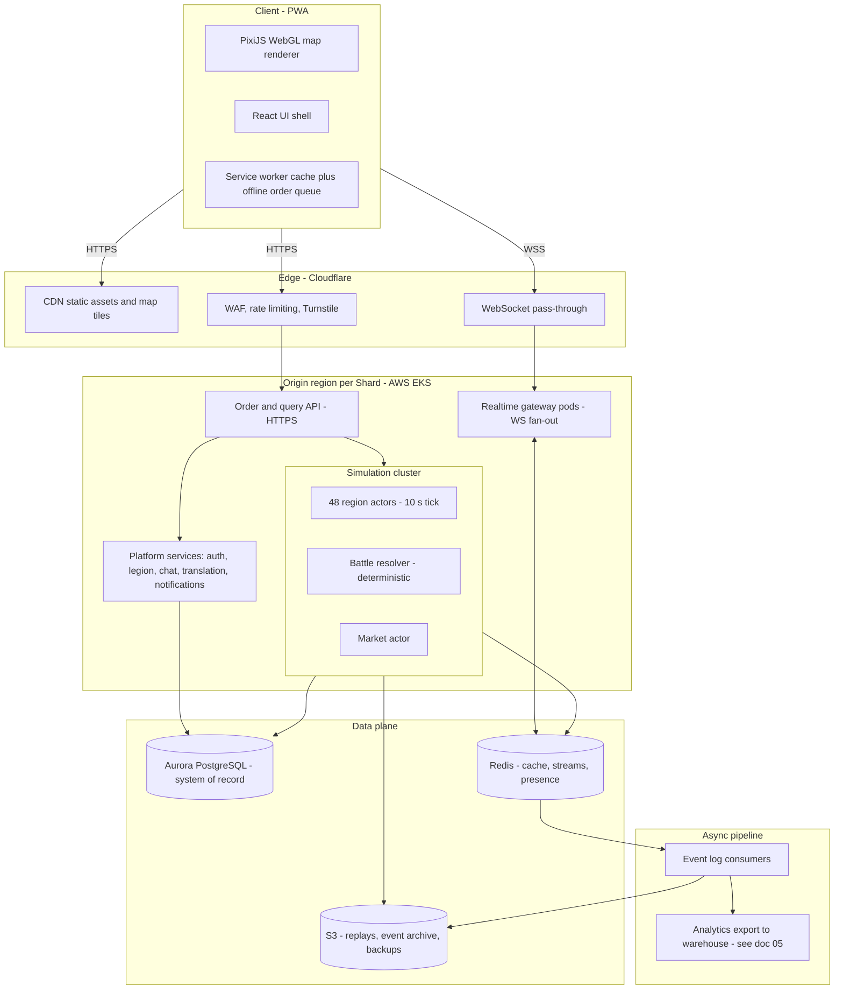

# 04 — Technical Architecture: Legions of Earth

**Executive summary.** Legions of Earth is an async-first, server-authoritative strategy MMO, and its architecture is chosen to match: a sub-5-MB PixiJS + React PWA client served from Cloudflare's edge; a Node.js/TypeScript simulation cluster on Kubernetes (AWS EKS) that shards each world Shard into ~48 deterministic region actors ticking every 10 seconds; WebSocket push for live map layers and plain HTTPS for orders; PostgreSQL (Aurora) as the system of record with an append-only event log and Redis for cache, queues, and presence. Because combat is deterministic and resolved server-side, replays ship as sub-2-KB order-set records instead of video-scale streams — the single biggest lever that lets a 15,000-CCU Shard run on roughly **$13k/month** of infrastructure (chat translation included) and stay playable on a 2-GB Android phone over 3G anywhere on Earth. This document commits to specific runtimes, vendors, budgets, and numbers; alternatives are noted with the reasons they lost. Game rules live in [01-game-design-document.md](01-game-design-document.md), map/season structure in [02-world-map-and-seasons.md](02-world-map-and-seasons.md), and the cost model rolls up into [13-roadmap-team-budget.md](13-roadmap-team-budget.md).

---

## 1. System overview

The architecture has five planes. Everything player-facing terminates at the edge; everything authoritative lives in a small number of origin regions, because an async-first game tolerates 100–300 ms of extra latency but cannot tolerate split-brain world state.



Design rules that fall out of the anchor's pillars:

1. **Server authority everywhere.** The client renders and requests; it never computes an outcome. This is the anti-cheat foundation (see [10-security-anticheat-trust-safety.md](10-security-anticheat-trust-safety.md)).
2. **Determinism as compression.** A battle is fully described by `(ruleset version, initial state hash, order set)` — combat has zero RNG, so there is no seed to store ([01-game-design-document.md](01-game-design-document.md) §5). The client re-simulates locally to visualize. Replay payload: < 2 KB versus megabytes of streamed frames.
3. **Async-first latency tolerance.** No mechanic resolves faster than a 10-second tick, so a Commander in Lagos on 3G and one in Frankfurt on fiber are mechanically equal. Latency budgets (§6) are about *feel*, not fairness.
4. **One writer per region.** Each map region has exactly one actor that owns its state. All contention is resolved by message ordering, not locks.

---

## 2. Client: WebGL map + React shell as a PWA

### 2.1 Stack

- **Renderer:** PixiJS v8 (WebGL2, WebGL1 fallback) drawing the hex map, unit tokens, supply-line overlays, and battle visualizations. Chosen over Three.js (3D capability we don't need, larger core) and raw WebGL (engineering cost). Phaser lost because we need a renderer, not a game framework — simulation is server-side.
- **UI shell:** React 18 + Zustand for client state, driving all menus, chat, Legion management, and diplomacy screens as DOM — cheaper than canvas UI, and the only realistic path to WCAG 2.2 AA screen-reader support (requirements in [09-onboarding-retention-accessibility.md](09-onboarding-retention-accessibility.md)).
- **Build:** Vite + esbuild, Brotli-11 precompression, route-level code splitting. TypeScript strict mode; the deterministic combat module is shared verbatim between client and server (§3.3).
- **PWA:** Workbox service worker with stale-while-revalidate for assets, an app manifest for installability, and an IndexedDB-backed offline order queue (§4.4). No app store required at launch, per the anchor.

### 2.2 Byte budget — hard cap 5 MB, target 4.2 MB

The budget below is the *first interactive load*: everything needed to see your home Province, read the map, and issue an order. Sizes are over-the-wire (Brotli). This table is the single authoritative ledger for the initial load — allocations restated elsewhere (e.g. [08-art-and-ux-direction.md](08-art-and-ux-direction.md) §8.1) sum back to these groups.

| Asset group | Budget (KB) | Notes |
|---|---:|---|
| HTML + critical CSS | 30 | Inlined app shell, loading state |
| React + Zustand + router | 175 | React 18 production, tree-shaken |
| PixiJS core (custom build) | 130 | Sprite, graphics, events only; no filters/spine |
| Game code: map engine + UI routes (initial) | 320 | Non-critical routes lazy-loaded |
| Shared deterministic sim module | 60 | Integer-math combat core, replays |
| Protocol + net layer (protobuf-es, ws client) | 45 | |
| Base texture atlas (terrain, units, UI) | 1,150 | 2 atlases, WebP + Basis fallback, 512px tiles |
| World overview map data (all Provinces, low LOD) | 480 | Binary topology + biome ids, ~48,000 land Provinces ([02](02-world-map-and-seasons.md)) at ~10 B/hex |
| Home-viewport map data (full LOD) | 220 | Streamed first, rest on pan |
| Fonts | 260 | Noto Sans subset for active locale; CJK loads its own subset lazily |
| Locale strings (one language) | 45 | Other locales fetched on switch — see [07-localization-and-i18n.md](07-localization-and-i18n.md) |
| Icons + banner components (SVG sprite) | 90 | Banner library ([03](03-legions-social-and-diplomacy.md)) delivered as procedural SVG layers + palettes, not bitmap element sheets |
| Service worker + manifest | 25 | |
| Audio | 0 | All audio deferred post-interaction; core loop is audio-optional |
| **Total initial** | **3,030** | |
| Reserve for growth over live operation | 1,170 | Budget alarm in CI at 4.2 MB, hard fail at 5.0 MB |

CI enforces this: a `size-limit` check per PR fails the build if any group exceeds budget, so the 5 MB promise survives two years of live content. Post-load, assets stream in priority order (the rest of [02](02-world-map-and-seasons.md)'s ~1.3 MB map pack — only its ~700 KB low-LOD slice ships in the initial load, as the two map rows above → cosmetics in view → battle visualization pack → audio), all resumable and cancellable for data-saver mode.

### 2.3 Low-end device strategy

Reference device: **2019 Android, 2 GB RAM, Mali-G51-class GPU, 3G (1.5 Mbps, 300 ms RTT)** — this is a launch gate, not an aspiration, matching the anchor's worldwide-by-design pillar.

- **Three renderer tiers**, auto-detected at boot (GPU renderer string + a 200 ms micro-benchmark), user-overridable:
  - *Tier A:* WebGL2, 60 fps cap, full overlays and animation.
  - *Tier B:* WebGL1, 30 fps cap, half-resolution atlases, no ambient animation.
  - *Tier C ("Lite Map"):* Canvas2D static map with DOM interaction — functionally complete, guaranteed to run on anything that renders a browser. Also the screen-reader-friendly mode.
- **Memory ceiling 300 MB:** texture atlases evicted outside a 3-region ring around the viewport; React routes unmounted aggressively; no per-hex display objects (the map renders as chunked meshes of 32×32 hexes, ~60 draw calls for a full viewport).
- **Data-saver mode:** deltas batched to 30 s cadence, images capped at half resolution, battle visualizations replaced by text summaries. Typical session cost in this mode: **< 400 KB per 15 minutes**.
- **CPU discipline:** all delta decoding and replay simulation runs in a Web Worker so the UI thread never drops input on a weak SoC.

---

## 3. Authoritative simulation

### 3.1 Runtime decision

| Criterion | **Node/TypeScript on Kubernetes (chosen)** | Cloudflare Workers + Durable Objects | Elixir/Erlang (OTP) |
|---|---|---|---|
| Code sharing with client (deterministic combat) | Native — one TS module both sides | Native TS, but DO CPU limits constrain heavy battle bursts | None; dual implementation must be kept bit-identical |
| Actor model fit | Manual but simple (one process = N single-threaded actors) | Excellent (DO = actor) | Excellent (BEAM processes) |
| 10 s tick, bursty Clash Window loads | Fine; scale pods | Wall-clock/CPU limits and per-request pricing awkward for a continuously ticking world | Excellent |
| Hiring pool, worldwide | Largest of the three | Large (JS) but platform-niche | Small |
| Cost predictability at 15k CCU | Reserved instances, flat | Per-request pricing of ~4.5k msg/s fan-out is worse than flat compute | Flat |
| Ecosystem (protobuf, pg, observability) | Deepest | Growing, some gaps | Good |
| Lock-in | Low (containers run anywhere) | High | Low |

**Committed choice: Node.js 22 / TypeScript on Kubernetes (AWS EKS), Graviton (arm64) nodes.** The decisive argument is the anchor's "TypeScript end-to-end": the deterministic combat module *is* the product's integrity core, and maintaining it once — shared byte-for-byte between the client replay and the server resolver — eliminates an entire class of desync and anti-cheat bugs. Elixir is the better raw actor runtime, but a two-language determinism contract and a thin hiring market outweigh that. Durable Objects are genuinely attractive for the actor model and edge placement, but a persistent world that ticks 24/7 with heavy Clash-Window bursts fits flat reserved compute better than per-request pricing, and we keep the option open to move the *chat/presence* tier there later.

### 3.2 Actor-style sharding of the world

- One Shard's ~48,000 land Provinces ([02-world-map-and-seasons.md](02-world-map-and-seasons.md)) are partitioned into **48 region actors** of ~1,000 Provinces each, partitioned along low-traffic boundaries (oceans, mountain chains — partition map defined with [02-world-map-and-seasons.md](02-world-map-and-seasons.md) at season generation time).
- Each actor is a single-threaded event loop owning its region's canonical state in memory (~10 MB), processing an ordered inbox: player orders, cross-region messages (armies crossing boundaries, supply-line traces), and tick events.
- Actors are packed ~8 per pod; Kubernetes reschedules pods on failure and the actor rehydrates from PostgreSQL snapshot + Redis Stream replay in < 5 s (§5.2).
- Cross-region interactions (a supply line spanning three regions, an army crossing a border) use asynchronous handoff messages with idempotency keys — never distributed transactions. A supply-line trace is a staged flood-fill: each actor answers for its own Provinces within one tick, so a worst-case trans-continental trace settles in ≤ 3 ticks (30 s), well inside async gameplay tolerance.
- Singleton actors per Shard: **Market** (order book per trade region, per [06-economy-and-monetization.md](06-economy-and-monetization.md)), **Season clock** (Clash Window scheduling and time-zone rotation), **Hall of Ages writer**.

### 3.3 Tick model and deterministic combat

| Cadence | What resolves |
|---|---|
| **10 s (fast tick)** | Unit movement steps, skirmish-layer engagements, scouting reveals, supply-run progress |
| **60 s (economy tick)** | Resource production, upkeep, construction/training timer completion, hoard decay |
| **5 min (world tick)** | Supply-line revalidation sweep, Province control flips, decay of unowned structures |
| **Clash Window close** | Batch resolution of accumulated siege contribution; rotation rules from the anchor §4.4 |

Determinism contract, enforced in CI by replaying golden battles on both client and server builds:

- **Integer math only** in the sim core (fixed-point as integer thousandths — values ×1000 — where fractions are needed, matching [01-game-design-document.md](01-game-design-document.md) §5); no `Math.random`, no floats, no `Date.now` — the tick number is the only clock.
- **Zero RNG in combat** ([01-game-design-document.md](01-game-design-document.md) owns this rule): a battle is fully determined by `(ruleset version, initial state hash, order set)` — no seed. The seeded **xoshiro128\*\*** PRNG is scoped to non-combat systems only (map-generation variation, world-event seeding, PvE placement) and never enters the battle resolver.
- All entity iteration in canonical ID order; ruleset is versioned, and every battle record stores its ruleset version so old replays render forever (a Hall of Ages requirement).
- A battle resolves in ≤ 200 simulated rounds; measured cost on one Graviton vCPU: **~1–3 ms per skirmish, ~40 ms for a maximal 100-Commander Clash resolution** — cheap enough that Clash Windows are a scheduling problem, not a compute problem.

---

## 4. Networking

### 4.1 Two channels, deliberately

- **HTTPS (JSON, HTTP/2)** for everything a player *does*: submit orders, fetch profiles, manage Legions, market actions. Request/response, cache-friendly, retriable, trivially debuggable, works through every corporate/school/national proxy on Earth.
- **WSS (protobuf frames)** for everything a player *watches*: map deltas, chat, presence, Clash Window contribution meters, notifications. One socket per client, multiplexed by topic subscription.

A client that cannot hold a WebSocket (hostile middleboxes, extreme networks) degrades to HTTPS long-polling of the same delta stream at 30 s cadence — the game remains fully playable, another dividend of async-first design.

### 4.2 Protocol sketch

Order submission (HTTPS):

```
POST /v1/shards/{shard}/orders
{ "type": "MOVE_WARBAND", "clientOrderId": "uuid-v7",
  "warbandId": 88121, "path": [19442, 19443, 19511],
  "doctrineId": 3, "issuedAtTick": 4211987 }
→ 202 { "orderId": 991823, "acceptedTick": 4211989, "etaTick": 4212349 }
```

`clientOrderId` makes every order idempotent — the cornerstone of retry and offline queueing. The server validates ownership, legality, and rate limits, then routes to the owning region actor; nothing mutates outside an actor.

WebSocket frames (protobuf, numbers indicative):

```
C→S  SUB   { topics: ["region:31", "region:32", "legion:5541", "clash:207"] }
S→C  DELTA { regionId: 31, tick: 4211990, changes: [...] }   // ~0.5–2 KB, per fast tick, only if dirty
S→C  EVENT { battleResolved { battleId, rulesetV, stateHash, resultSummary } }
S→C  CHAT  { channel, msgId, senderId, lang, text, translations? }
C→S  PING  / S→C PONG (30 s heartbeat, RTT sampling)
```

Clients auto-subscribe to viewport regions (max 4), their Legion/Coalition topics, and any Clash they opted into. Fan-out happens in stateless gateway pods reading Redis pub/sub, so realtime capacity scales independently of the simulation.

### 4.3 Reconnection

On disconnect: exponential backoff with jitter (1 s → 60 s cap), resume with `RESUME { lastTickSeen }`. Gateways keep a 10-minute delta ring buffer per region in Redis; a resume inside that window replays compactly, beyond it the client refetches region snapshots over HTTPS (CDN-cacheable at 10 s TTL). Sockets migrate between gateway pods transparently — all session state lives in Redis, gateways are cattle.

### 4.4 Offline order queueing

Mobile players on flaky networks are the *majority* worldwide, so the service worker treats disconnection as normal:

1. Orders issued offline are stored in IndexedDB with their `clientOrderId` and the tick at which they were composed.
2. The UI renders them as "pending — will send when connected," with optimistic local preview clearly marked (dashed movement arrows).
3. On reconnect, the queue flushes in order; the server accepts, or rejects with a machine-readable reason (`PROVINCE_LOST`, `INSUFFICIENT_GRAIN`) that the UI explains.
4. Queue TTL is 6 hours — long enough for a subway commute or a power cut, short enough that stale orders don't fire into a changed world.

---

## 5. Data plane

### 5.1 PostgreSQL system of record

Aurora PostgreSQL 16, one writer + one reader per Shard, plus a small **global cluster** for cross-Shard account identity, entitlements/purchases, and the Hall of Ages. Schema sketch (abridged; authoritative DDL lives in the repo):

```sql
-- Global cluster
CREATE TABLE accounts (
  id BIGINT GENERATED ALWAYS AS IDENTITY PRIMARY KEY,
  email_hash BYTEA UNIQUE, region_code TEXT, locale TEXT,
  created_at TIMESTAMPTZ, privacy_flags JSONB);         -- consent state: doc 12
CREATE TABLE entitlements (account_id BIGINT, sku TEXT, source TEXT,
  granted_at TIMESTAMPTZ);                              -- Warpath Pass, cosmetics
CREATE TABLE hall_of_ages (season INT, shard INT, deed_type TEXT,
  payload JSONB, PRIMARY KEY (season, shard, deed_type, payload));

-- Per-Shard cluster (season-scoped tables carry season_id and are archived at reset)
CREATE TABLE commanders (id BIGINT PK, account_id BIGINT, shard SMALLINT,
  legion_id BIGINT NULL, home_province INT, doctrine JSONB, shield_until TIMESTAMPTZ);
CREATE TABLE legions   (id BIGINT PK, name TEXT, banner JSONB, stronghold_province INT,
  treasury JSONB, coalition_id BIGINT NULL);            -- ranks/diplomacy: doc 03
CREATE TABLE provinces (id INT PK, season_id INT, biome SMALLINT, region_actor SMALLINT,
  owner_legion BIGINT NULL, structures JSONB, resources JSONB, supplied BOOLEAN);
CREATE TABLE orders    (id BIGINT PK, client_order_id UUID UNIQUE, commander_id BIGINT,
  type SMALLINT, payload JSONB, accepted_tick BIGINT, status SMALLINT)
  PARTITION BY RANGE (accepted_tick);
CREATE TABLE battles   (id BIGINT PK, region_actor SMALLINT, tick BIGINT,
  ruleset_version INT, initial_state_hash BYTEA, participants JSONB, result JSONB,
  replay_ref TEXT)                                      -- S3 key for full order set
  PARTITION BY RANGE (tick);
CREATE TABLE market_listings (id BIGINT PK, trade_region SMALLINT, legion_id BIGINT,
  resource SMALLINT, qty INT, unit_price INT, expires_tick BIGINT);
```

Write pattern: region actors are the only writers to sim state, and they write **asynchronously** — a snapshot of dirty Province/warband state every 60 s plus an immediate write for irreversible events (battle results, control flips, market fills). Between snapshots, durability comes from the event log.

### 5.2 Event log

Every actor appends its inputs (accepted orders, cross-region messages, tick markers) to a **Redis Stream** per region before applying them. Recovery = load last PostgreSQL snapshot + replay the stream: deterministic, bounded to ≤ 60 s of events, restores an actor in < 5 s. A consumer group drains streams continuously to S3 as hourly Parquet segments — this is simultaneously the audit trail for anti-cheat forensics ([10-security-anticheat-trust-safety.md](10-security-anticheat-trust-safety.md)) and the raw feed for the analytics warehouse ([05-liveops-content-and-analytics.md](05-liveops-content-and-analytics.md)). Kafka was considered and rejected at this scale: Redis Streams already sits in the stack, and one Shard's ~1,000 events/s peak does not justify a second distributed log's operational weight. The S3 layout is Kafka-shaped, so migration at 20+ Shards is an ingestion swap, not a re-architecture.

### 5.3 Redis tier

ElastiCache for Redis (cluster mode), serving four jobs: hot cache (profiles, Legion rosters, map snapshots), pub/sub for gateway fan-out, Streams for the event log and job queues (timer completions, notification dispatch), and presence/session state. Sized at 3 × cache.m7g.large per Shard — ~40 GB working set headroom against a ~12 GB expected footprint.

### 5.4 Chat translation service

Per the anchor, cross-language chat is a launch requirement, and it is the one external-AI-shaped dependency with real cost risk. Provider and policy decisions are owned by [07-localization-and-i18n.md](07-localization-and-i18n.md) §4; this section is the serving architecture behind them:

- **Auto-translate where coordination happens, on-tap everywhere else:** Legion and Coalition channels auto-translate by default — lazily, a message is only translated into locales with a client actively viewing the channel; every other channel is translate-on-tap. Messages carry a detected `lang` tag and the original is always one tap away.
- **Launch provider:** Google Cloud Translation v3 behind our internal translation API, with the locked game-term glossary from [07-localization-and-i18n.md](07-localization-and-i18n.md) §4.3 riding every call. DeepL lost on language coverage across the launch locales.
- **Post-launch cost path:** self-hosted NLLB-200-distilled (CTranslate2) stands up behind the same internal API once monthly spend crosses the migration trigger defined in [07-localization-and-i18n.md](07-localization-and-i18n.md) §4.2, absorbing top-traffic pairs while Google keeps the long tail — the client never knows which engine answered.
- **Caching:** translations cached in Redis keyed by `(sha256(normalized text), targetLang)` — Legion rally messages get repeated and re-read constantly; hit-rate assumptions and the full cost model live in [07-localization-and-i18n.md](07-localization-and-i18n.md) §4.2.
- Profanity/abuse filtering runs *pre-translation* on the source text (pipeline in [10-security-anticheat-trust-safety.md](10-security-anticheat-trust-safety.md)); language-detection and quality specifics in [07-localization-and-i18n.md](07-localization-and-i18n.md).

---

## 6. Global delivery: CDN, regions, latency budgets

**Edge: Cloudflare** (CDN, WAF, bot management, Turnstile, WebSocket proxying). Chosen for the widest global PoP coverage in exactly the regions the anchor targets (South Asia, Africa, South America), free-tier-friendly egress economics via R2 for static assets, and integrated bot defense. Fastly and CloudFront lost on the combination of PoP breadth in emerging markets and bundled security tooling.

**Origin regions.** Shards are region-agnostic to players (anchor §4.1), but each Shard's simulation lives in exactly one origin region. Shard homes rotate across three AWS regions — **us-east-1, eu-central-1, ap-southeast-1** — so the *fleet* is globally distributed even though each world is single-homed. A player in Chile on a Singapore-homed Shard sees ~320 ms RTT to origin; against a 10 s tick and edge-cached reads, this is imperceptible. Static assets, map snapshots, and replay files come from the nearest of Cloudflare's 300+ PoPs regardless of Shard home.

Latency budgets (p95, worldwide including 3G):

| Interaction | Budget | Mechanism |
|---|---|---|
| First interactive load, cold | < 10 s on 3G / p75 < 6 s global | 3.0 MB initial payload from edge PoP |
| Repeat load (SW cache warm) | < 2.5 s | Service worker; only deltas fetched |
| Order acknowledgment | < 700 ms | Single HTTPS round trip to origin |
| Map delta after tick | tick + 1.5 s | WS push through edge |
| Chat delivery, same language | < 1 s | Redis pub/sub fan-out |
| Chat translate-on-tap | < 1.5 s | Cache hit < 200 ms; provider round trip < 1.5 s |
| Battle replay open | < 3 s | 2 KB replay record + local resimulation |

---

## 7. Scaling math for one Shard (~100k registered / 15k peak CCU)

**Per-Shard activity model (canonical — this section owns it).** A mature Shard runs **~25,000 DAU** against ~100k registered and ~15k peak CCU, and produces **~600,000 chat messages/day, ~65% of them in Legion channels**. Translation cost ([07-localization-and-i18n.md](07-localization-and-i18n.md)) and moderation load ([10-security-anticheat-trust-safety.md](10-security-anticheat-trust-safety.md): reports ≈ 0.08/DAU ≈ 2,000/day) derive from these numbers; a change here propagates there.

**Request load (peak hour).**

| Source | Assumption | Rate |
|---|---|---:|
| Orders (HTTPS writes) | 15k CCU × 1 order / 90 s active | ~170 rps |
| Reads (profiles, snapshots, market) | 15k CCU × 1 / 25 s, 70% edge-cached | ~180 rps at origin |
| Chat sends | ~600k msgs/day, peak hour ≈ 3× the daily average | ~20 msg/s |
| WS messages outbound | 15k conns × ~0.3 msg/s (dirty-region deltas, chat) | ~4,500 msg/s |
| WS bandwidth outbound | avg 0.8 KB/msg | ~3.6 MB/s peak; ~7 TB/month |
| Event log appends | orders + sim events | ~1,000 events/s peak |

**Tick cost.** 48 region actors × (movement + skirmish pass over ~1,000 Provinces and ~2–4k active warband stacks) ≈ 15–40 ms per fast tick per actor ⇒ **< 0.4 vCPU average for the whole Shard's simulation**, bursting ~10× at Clash Window resolution (still < 4 vCPU). The honest conclusion of the math: *simulation is nearly free; the money is in the database, realtime fan-out, and egress.* We still provision 8 sim vCPU per Shard for GC headroom, recovery replay, and season-end batch work.

**Storage growth.** ~25k DAU × 30 orders/day ≈ 750k order rows/day (~0.5 GB/day with indexes); ~150k battle rows/day (~0.3 GB/day); event-log Parquet ~1.2 GB/day to S3. Hot-DB policy: partitions older than 14 days archived to S3, season reset archives all season-scoped tables — hot storage stays **< 300 GB per Shard** indefinitely; S3 grows ~40 GB/Shard/season (Glacier after two seasons).

**Monthly infrastructure cost model** (AWS on-demand ≈ list, Graviton, 1-year reserved applied where marked ®; shared rows amortize across Shards):

| Line item | 1 Shard | 5 Shards | 20 Shards |
|---|---:|---:|---:|
| EKS nodes — sim + API + gateways (8× m7g.xlarge ®) | $950 | $4,300 | $15,800 |
| Aurora PostgreSQL (2× db.r7g.xlarge ® + storage/IO) | $1,300 | $6,100 | $22,500 |
| ElastiCache Redis (3× cache.m7g.large ®) | $340 | $1,700 | $6,800 |
| Chat MT — Google Cloud Translation v3, NLLB-200 past the spend trigger; post-migration steady state carried from [07](07-localization-and-i18n.md) §4.2 (≤ $7k/Shard; GPU fleet shared across Shards) | $7,000 | $28,000 | $95,000 |
| Origin egress (WS + API, ~7 TB) | $630 | $3,000 | $11,500 |
| Cloudflare (Business + R2 + bot mgmt) | $400 | $700 | $1,500 |
| S3 + backups + Glacier | $120 | $450 | $1,400 |
| Global services cluster (auth, payments, Hall of Ages) | $450 | $700 | $1,600 |
| Observability (Grafana Cloud) | $350 | $900 | $2,600 |
| CI/CD, staging + loadtest envs | $400 | $600 | $1,200 |
| Contingency (10%) | $1,190 | $4,650 | $16,000 |
| **Total / month** | **≈ $13.1k** | **≈ $51.1k** | **≈ $175.9k** |
| **Per registered player / month** | **$0.131** | **$0.102** | **$0.088** |

Sub-linear scaling comes from shared global services, observability, CDN contracts, reserved-instance depth, and — for chat MT — the NLLB-200 migration [07-localization-and-i18n.md](07-localization-and-i18n.md) defines. At 20 Shards (~2M registered), infrastructure runs at about 9 cents per registered player per month. Chat MT is the dominant line at every scale — which is why it carries its own budget cap and graceful "original text only" fallback (risk table below) and why the migration economics in [07-localization-and-i18n.md](07-localization-and-i18n.md) §4.2 are on the critical path of the cost model, not an optimization. The remaining lines together stay under 4 cents per registered player, comfortably inside the revenue model in [06-economy-and-monetization.md](06-economy-and-monetization.md).

---

## 8. Observability, CI/CD, environments, backup/DR

**Observability.** OpenTelemetry throughout; metrics/logs/traces to Grafana Cloud (chosen over self-hosted LGTM to keep the launch team small — revisit at 20 Shards; Datadog lost on cost at this cardinality). Golden signals per Shard: tick duration p99 per actor, actor inbox depth, order ack latency, WS connect success rate *by country* (the worldwide lens applied to ops — a regression in Brazilian carrier networks must page us, not reach us via Reddit), delta bytes per client, translation latency and cache hit rate, DB replication lag. Error tracking: Sentry (client + server). Synthetic probes from 12 worldwide vantage points (Checkly) run the full login-order-delta loop hourly.

**CI/CD.** GitHub Actions → container build → Argo CD GitOps to EKS. Every PR runs: unit tests, the **determinism gate** (golden battle replays must be bit-identical across client and server builds and across arm64/x64), the byte-budget check, and a 500-CCU smoke load test against an ephemeral environment. Deploys are rolling per pod; region actors drain their inbox, snapshot, and hand off in < 10 s, so releases never pause the world. Simulation *ruleset* changes ship dark behind versioned flags and activate on a tick boundary announced in advance — mid-season balance patches per [05-liveops-content-and-analytics.md](05-liveops-content-and-analytics.md).

**Environments.** `dev` (per-engineer ephemeral, seeded miniature 2k-Province world) → `staging` (full-size world, nightly bot population of 5k simulated Commanders driving realistic order mixes) → `loadtest` (on-demand, 20k simulated CCU before each season launch) → `prod`. Bot Commanders reuse the deterministic sim module to generate plausible behavior cheaply.

**Backup/DR.** Aurora continuous backup, PITR 35 days; cross-region snapshot copies every 6 h. Event-log Parquet in S3 with cross-region replication is the second, independent recovery path. **RPO: ≤ 60 s** (snapshot + stream replay) for sim state, ≤ 5 min for platform services. **RTO: 30 min** for in-region actor/pod loss (automatic), **4 h** for whole-origin-region loss (restore Shard into its next rotation region from snapshots — players experience a paused world, and the season clock pauses with it, so no side gains territory during an outage; fairness policy in [02-world-map-and-seasons.md](02-world-map-and-seasons.md)). Quarterly game-day drills restore a production Shard into staging and replay 24 h of event log to verify determinism end-to-end.

---

## 9. Top technical risks and mitigations

| # | Risk | Likelihood | Impact | Mitigation |
|---|---|---|---|---|
| 1 | **Determinism drift** between client and server builds (JS engine or dependency change) breaks replays/trust | Medium | High | Integer-only sim core; determinism gate in CI on every PR across architectures; ruleset versioning; canary Shard replays 1 h of prod events nightly |
| 2 | **Clash Window thundering herd** — a famous siege draws 10k spectators to one region topic | High | Medium | Compact deterministic-replay design means spectating is KB-scale; gateway pods autoscale on connection count; per-topic fan-out sharding; degrade to 30 s summary cadence above threshold |
| 3 | **Cross-region actor consistency bugs** (armies duplicated/lost at borders) | Medium | High | Idempotency keys on all handoffs; property-based border tests; event log makes every duplication forensically reversible; weekly invariant sweep (unit conservation checksum) |
| 4 | **Translation cost blow-up or vendor outage** | Medium | Medium | Auto-translate scoped to actively viewed Legion/Coalition channels, translate-on-tap elsewhere ([07-localization-and-i18n.md](07-localization-and-i18n.md)); NLLB-200 migration path ready behind the same API once [07]'s spend trigger fires; hard monthly budget cap with graceful "original text only" fallback |
| 5 | **Low-end reality worse than lab** — real 3G in target markets underperforms budgets | Medium | High | Tier C Lite Map guarantees a floor; RUM segmented by country/device tier gates launches; regional beta in target markets before global launch ([11-marketing-community-gtm.md](11-marketing-community-gtm.md)) |
| 6 | **Aurora writer as single bottleneck** during season-end scoring | Medium | Medium | Season scoring computed from S3 event archive offline, not live DB; async snapshot writes mean sim never blocks on DB; per-Shard clusters cap blast radius |
| 7 | **WebSocket hostility** in some national/corporate networks | High | Low | HTTPS long-poll fallback is a first-class, tested path; WS success rate by country is a paged SLO |
| 8 | **Node runtime ceiling** if a future mechanic makes sim CPU-heavy | Low | Medium | Actor boundaries are process boundaries — hot regions can move to Rust workers behind the same message contract without touching the protocol |

---

*Cross-references: gameplay rules driving the tick model — [01-game-design-document.md](01-game-design-document.md); map partitioning and season reset — [02-world-map-and-seasons.md](02-world-map-and-seasons.md); chat and diplomacy features on this transport — [03-legions-social-and-diplomacy.md](03-legions-social-and-diplomacy.md); analytics consumers of the event log — [05-liveops-content-and-analytics.md](05-liveops-content-and-analytics.md); payment integrations on the global services cluster — [06-economy-and-monetization.md](06-economy-and-monetization.md); i18n engineering — [07-localization-and-i18n.md](07-localization-and-i18n.md); privacy architecture constraints — [12-legal-compliance-privacy.md](12-legal-compliance-privacy.md); team and budget rollup — [13-roadmap-team-budget.md](13-roadmap-team-budget.md).*
