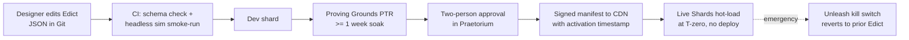
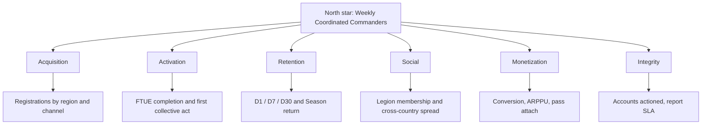

# 05 — Live-Ops, Content & Analytics: Legions of Earth

**Executive summary.** This document defines how Legions of Earth is operated as a living worldwide service: the Season-driven live-ops calendar and a sample 8-week Season plan; a 12-month global event calendar with a mandatory cultural-respect review; the config-driven content pipeline (the **Praetorium** admin console, versioned **Edicts**, Unleash feature flags, scheduled CDN-delivered drops with zero deploys); the **Proving Grounds** public test shard and the multilingual **Council of Envoys** player council; incident response with severity levels, follow-the-sun on-call, and a fairness-first compensation policy; a privacy-respecting telemetry taxonomy built on a self-hosted Redpanda → ClickHouse pipeline; a KPI tree whose targets reconcile exactly with the success criteria in `00-vision-and-concept.md`; and an experimentation policy engineered for the hard constraint that everyone shares one world — no experiment may ever alter combat power, economy yields, or territory outcomes for a subset of Commanders. Where sibling documents own a topic in depth (economy in `06-economy-and-monetization.md`, localization in `07-localization-and-i18n.md`, privacy law in `12-legal-compliance-privacy.md`, staffing in `13-roadmap-team-budget.md`), this document references them rather than restating them.

---

## 1. Live-ops principles

Four rules govern every operational decision below, derived from the pillars in `00-vision-and-concept.md`:

1. **The Season is the drumbeat.** All content, events, structural balance changes, and marketing beats snap to the ~8-week Season grid (numeric tuning follows the bounded weekly window in Section 2.3). Nothing meaningful ships mid-week "because it's ready."
2. **No deploy required to run the game.** Every recurring live-ops action — event start, balance tune, store rotation, narrative beat — is a data change activated by timestamp, never a code release. Code deploys are for features and fixes only (release engineering in `04-technical-architecture.md`).
3. **One world, one truth.** Because a Shard is a single shared world, we never fork gameplay reality per player. Experiments, flags, and rollouts are constrained accordingly (Section 9).
4. **Worldwide by default.** Every scheduled moment is checked against time-zone fairness (rotating Clash Windows per the anchor), every event against the cultural-respect process (Section 3.2), and every telemetry payload against a 3G data budget (Section 7).

---

## 2. The live-ops calendar

### 2.1 Season cadence

A full Season cycle is **61 days**: an 8-week (56-day) Season plus a 5-day intermission called **The Turning**. Six cycles are exactly **366 days** (61 × 6), so the year holds **exactly six Season cycles**: a leap year fits the grid with no slack, and a common year comes up 1 day short, shifting the next year's grid by a single day. There are no slack days; holiday freezes are absorbed into The Turning. Season start is always a **Tuesday at 12:00 UTC** (Tuesday avoids Monday-holiday clusters worldwide and gives the weekend as ramp-up rather than launch-day chaos; 12:00 UTC is daytime for the largest share of the global population — evening in Asia-Pacific, midday in Europe/Africa, morning in the Americas).

**The Turning (5 days)** is not downtime — it is a designed beat:

| Day | Activity |
|---|---|
| T-day 1 | Season finale scoring locks; **Hall of Ages** induction ceremony (in-world broadcast, replayable); Season rewards granted |
| T-day 2 | "Ashes of the Age" free-for-all sandbox on the dying map: no scoring, absurd modifiers, zero stakes — a pressure valve and social moment |
| T-day 3 | Map regeneration published for preview (see `02-world-map-and-seasons.md`); Legions scout the new world and vote on landing regions |
| T-day 4 | Legion recruitment fair: cross-language recruitment board surfaced to all unaffiliated Commanders (`03-legions-social-and-diplomacy.md`) |
| T-day 5 | Pre-season ceremony; new Warpath Pass preview; countdown to landfall |

Lapsed-player win-back pushes (owned jointly with `09-onboarding-retention-accessibility.md` and `11-marketing-community-gtm.md`) fire on T-day 3, when there is a concrete, spoiler-free reason to return: *"A new world has been sighted."*

### 2.2 Sample 8-week Season plan ("Season of the Sundered Coast")

Each Season carries a light narrative arc (anchor §4.5), delivered through world-event beats in **weeks 3, 5, and 7** — the fixed grid and seeded event pool owned by `02-world-map-and-seasons.md` §8. The arc's mid-Season beats are **mechanical, not just textual** — they redraw strategic incentives so week 5 does not feel like week 2.

| Week | Phase | Narrative beat | Systems beat | Live-ops actions |
|---|---|---|---|---|
| 1 | Landfall | "The banners come ashore" | Stronghold founding; new-player shields active; frontier zones oversized | Onboarding funnel watch (hourly dashboards); first weekly numeric tuning window falls on day 3 (Thursday, Section 2.3) |
| 2 | Expansion | "The land answers" | Supply lines mature; first regional markets open | First store rotation; creator kit drop (`11`) |
| 3 | First Blood — **World Event I** | "Drums on the border — the Silver Rush" | First **Clash Windows** eligible; coalition diplomacy unlocks; silver yields surge across a desert belt, pulling land-grabs into low-defense terrain | Event Edict activates via scheduled drop (event beat 1, `02-world-map-and-seasons.md` §8); Clash Window rotation audit (time-zone fairness report published in-game) |
| 4 | Escalation | "Old grudges, new maps" | Tribute and non-aggression pacts stress-tested; attack-cost multipliers on small Legions re-verified | Mid-season pulse survey (12 languages minimum); weekly numeric tuning pass (Section 2.3) if win-rate skew > 5 pts |
| 5 | **World Event II** | "The Comet Winter" — a moving cold front | Affected biomes flip: tundra spreads, supply upkeep rises along the front, forcing renegotiated borders | Event Edict activates via scheduled drop (event beat 2); PTR feedback from 2 weeks prior incorporated |
| 6 | The Long March | "Every road leads somewhere" | Finale objectives revealed; scoring preview visible on map | Second Warpath Pass content page unlocks; comeback-mechanic telemetry review |
| 7 | **World Event III** | "The Ruins Awaken" — ancient sites surface in contested Provinces | Time-limited neutral objectives worth finale points; designed so a losing coalition can leapfrog | Event Edict activates via scheduled drop (event beat 3); finale infrastructure load test on Proving Grounds; SEV-readiness review |
| 8 | Finale | "The Age is written" | Final Clash Windows; scoring accumulates live; anti-snowball floor guarantees every active Legion scores something | War-room staffing (follow-the-sun); Hall of Ages assets pre-rendered |

Two structural rules embedded here: **(a)** mid-Season events are *incentive-redrawing*, meaning they must give trailing coalitions a credible path back (measured: the week-7 event should move ≥ 10% of finale-point standings on average); **(b)** nothing decisive happens at a fixed UTC hour — Clash Window resolution rotates by rule (anchor §4.4), and finale scoring accumulates over the full week 8 rather than at one midnight.

### 2.3 Weekly and daily rhythm

- **Daily:** Skirmish-layer bounty objectives rotate on a rolling schedule offset by 25 hours, so the rotation hour drifts through all time zones over a month — no region always gets fresh objectives at 3 a.m.
- **Weekly (Thursday 12:00 UTC):** store cosmetic rotation, Warpath Pass challenge refresh, community spotlight in the in-game herald.
- **Balance cadence — the single policy (sibling documents reference this section rather than restating it):**
  1. **Weekly numeric tuning window** (Thursday, alongside the rotation): bounded, ±10%-class adjustments to numeric values only — unit stats, resource yields, upkeep — shipped as an Edict with a shard-wide in-game proclamation in all supported languages before activation.
  2. **Structural and mechanic changes** — new rules, reworked systems, anything that invalidates learned play — ship **only at Season boundaries**.
  3. **Emergency exploit hotfixes** ship **anytime**, following the incident process in Section 6.

---

## 3. Worldwide event design

### 3.1 The 12-month event calendar

Events are **fictional in-world festivals keyed to broadly shared human moments** — renewal, reunion, harvest, light, games, rest — that happen to land near major real-world observances. We never reproduce a real holiday, never use sacred symbols, never name real nations or peoples, and never sell anything themed on a religious observance. Events are cosmetic-and-social first; where they touch gameplay it is always shard-wide and symmetric (e.g., a global truce), never a buff someone can buy.

| Month | In-world event | Aware of (timing only) | What players do | Design guardrails from review |
|---|---|---|---|---|
| Jan | **The Long Dawn** | Gregorian New Year | Resolution banners: Legions declare a public Season goal; completing it mints a Hall of Ages plaque | Renewal motif only; no champagne/fireworks-brand iconography |
| Jan–Feb (movable) | **Reunion of Banners** | Lunar New Year period | Homecoming mechanic: lapsed Legion-mates who return grant the whole Legion a cosmetic feast-hall decoration | Reunion/feast motifs are universal; no zodiac animals, no red-envelope mechanic (reads as gambling and as direct lift) |
| Feb–Mar | **The Masquerade** | Carnival season | Warband cosmetic masks craftable from event tokens; anonymous "masked herald" compliment system | Masks drawn from invented banner-mythology, not Venetian/Rio designs |
| Mar–Apr (movable) | **The Open Gates** | Ramadan/Eid period | Hospitality mechanic: sheltering another Legion's supply runners in your Provinces earns both sides generosity tokens for charity-themed cosmetics | Timing-aware, content-neutral: generosity/hospitality motif, zero religious imagery; reduced grind intensity that month benefits everyone equally |
| Apr 1 | **Festival of Fools** | April Fools | 24-hour absurd cosmetic filter on the map (units wear ridiculous hats); opt-out toggle | Pure silliness; opt-out required for accessibility and for players who dislike it |
| May | **The Planting** | Spring festivals (Northern Hemisphere) / autumn (Southern) | Cooperative terraforming: Legions vote where a new forest micro-biome sprouts next Season | Explicitly hemisphere-neutral framing: "the world turns," not "spring" |
| Jun | **The Longest Day Games** | Mid-year, solstice | Shard-wide games: scouting races, engineering contests, parade formations; medals are cosmetic | Athletic-games motif; no Olympic rings/branding |
| Jul–Aug | **The Great Migration** | Summer/winter school breaks worldwide | World-event herds cross the map creating temporary neutral resource trails; escorting them is a co-op objective | Wildlife is invented megafauna, mapped to no real region's sacred animals |
| Sep–Oct | **The Gathering Tithe** | Harvest festivals (Mid-Autumn, Chuseok, Sukkot, Thanksgiving-family) | Harvest fairs in home Provinces; surplus-sharing between Legions earns shared monuments | Harvest/moon motifs kept generic; no mooncakes, no cornucopia-branded goods for sale |
| Oct–Nov | **Night of Beacons** | Diwali period, and festivals of light broadly | Strongholds light beacon cosmetics; a shard-wide "light the world" progress bar unlocks a free commemorative banner for everyone | Light-over-dark as abstract motif; no diyas, no religious narrative |
| Nov | **The Remembrance** | Various memorial observances | Hall of Ages open-house: past Seasons' monuments browsable with guided tours by veteran players | Strictly in-fiction remembrance of *game* history; never real-world memorial framing |
| Dec | **The Stillness** | Year-end holidays | A rule-enforced **48-hour world truce**: no attacks resolve; social spaces, gift cosmetics (free, giftable), snow-flair on tundra | Truce is symmetric and mechanical; winter flair only on biomes where it makes sense (the map is global — jungle Provinces get lantern-fireflies instead of snow) |

Notes: movable observances (Lunar New Year, Ramadan) shift yearly; the live-ops calendar is rebuilt each January against next year's real dates. Regional one-off celebrations (a country's major local moment) are handled through the community program in `11-marketing-community-gtm.md` (creator streams, community tournaments) rather than in-game content, which stays globally shared. The July–August **Great Migration** slot is not a separate event build: it draws from the same seeded world-event pool as the per-Season Great Migration beats (`02-world-map-and-seasons.md` §8), so the annual calendar and the Season beat grid never double-book competing migrations — the calendar entry simply guarantees the migration variant is the seeded pick for the Season running in that window.

### 3.2 Cultural-respect review (mandatory, gated)

Every event, cosmetic set, and narrative beat passes a five-step review before production art is commissioned. This is the process the anchor's worldwide-requirements table points to, and it is shared with `10-security-anticheat-trust-safety.md` (naming/report enforcement) and `07-localization-and-i18n.md` (regional reviewers).

1. **Concept brief (T-10 weeks before activation).** One page: motif, mechanical hook, which real-world moment it is timing-aware of, and a source analysis: where does each visual/verbal element come from?
2. **Checklist screen.** Hard blockers: sacred or religious symbols; real flags, borders, nations, ethnic groups, or political movements; monetization themed on a religious observance; motifs specific to one living culture presented as exotic flavor; date-exclusive framing that assumes one hemisphere or one calendar.
3. **Regional reviewer sign-off (T-8 weeks).** Minimum **three reviewers from three different regions** drawn from the localization staff pool (`07`) plus at least two members of the Council of Envoys (Section 5.2) from regions closest to the referenced observance. Any single reviewer can escalate to a design change; two escalations kill the concept as designed.
4. **Trust & Safety and legal check (T-6 weeks).** Consistency with naming policy (`10`) and per-country content law (`12-legal-compliance-privacy.md`).
5. **Post-event audit.** In-game pulse survey (one question, all languages), sentiment sweep of community channels, and a standing "cultural concern" report category routed to T&S with a 72-hour review SLA. Findings feed the next year's calendar rebuild.

The review has teeth: in the production schedule (`13-roadmap-team-budget.md`), no event artwork is budgeted until step 3 clears.

---

## 4. Content pipeline and tooling

### 4.1 Architecture: Edicts, flags, and the Praetorium

All live-tunable game data — unit stats, doctrine parameters, biome modifiers, event definitions, store rotations, Warpath Pass tracks, narrative scripts — lives in versioned data packages called **Edicts**: JSON documents with a TypeScript schema, stored in Git, validated in CI (schema check + a headless simulation smoke-run that replays 500 canned battles and flags any determinism or balance-bound violation — the deterministic sim from `04-technical-architecture.md` makes this cheap). An Edict promotes through **dev shard → Proving Grounds → production**, and ships to production as a **signed manifest on the CDN with an activation timestamp**. Game servers and clients hot-load the new Edict at the timestamp. No deploy, no downtime, and clients on 3G fetch only a delta (Edict deltas are typically 5–50 KB).

Feature flags are **Unleash, self-hosted** — open-source, TypeScript SDKs on both client and server, gradual-rollout and kill-switch strategies out of the box, no per-seat pricing at our scale, and no third-party data processor touching player identifiers (relevant to `12`). LaunchDarkly lost on cost at 100k+ MAU and on data residency; homegrown flags lost because audit logging, UI, and SDK maturity are exactly the parts teams underbuild.

The **Praetorium** is the internal admin console (a React app sharing the game's component library, `08-art-and-ux-direction.md`): Edict browser and diff viewer, scheduled-drop calendar, flag dashboard (embedded Unleash), player/Legion lookup, compensation grant tool, in-game herald composer with side-by-side translation preview (`07`), and the incident command view. Every mutating action requires SSO + hardware-key 2FA, is written to an append-only audit log, and **production balance-affecting changes require two-person approval** (author + reviewer, enforced in the tool). Support-tier staff get read-only plus scripted, pre-approved compensation actions only — no free-form grants (integrity rationale in `10`).

### 4.2 What ships without a deploy

| Change type | Mechanism | Lead time | Approval |
|---|---|---|---|
| Event start/end, narrative beat | Scheduled Edict | Prepared ≥ 2 weeks ahead | Two-person + review gate (Section 3.2) |
| Numeric balance tune (weekly window, Section 2.3) | Edict | PTR soak since the prior window | Two-person |
| Structural balance change (Season boundary, Section 2.3) | Edict | 1 week PTR soak | Two-person |
| Store/pass rotation | Edict | 1 week | One designer + automated price-table validation against `06` regional price matrix |
| Herald message / news | Praetorium composer | Same day | One editor; all-language check enforced (no English-only posts) |
| Feature enable/disable | Unleash flag | Minutes | On-call authority during incidents |
| Emergency exploit mitigation | Flag off + hotfix Edict | Minutes–hours | Incident commander (Section 6) |

---

## 5. Public test shard and player councils

### 5.1 The Proving Grounds (PTR)

One permanent public test shard, capacity-capped at **5,000 registered / 1,000 concurrent**, opt-in from the account screen, running the **next Season's ruleset two weeks ahead** of production and wiping every cycle. Compressed 2-week mini-Seasons let us observe full arc dynamics (landfall → mid-event → finale) before the real Season. Participation incentives are cosmetic only: an exclusive "Vanguard" title and banner trim per cycle with a bug-report or survey submission — never premium currency (that would monetize testing access unequally across regions).

PTR telemetry is tagged `shard_class=ptr` and excluded from all production KPIs. Because PTR self-selects for hardcore players, its balance signal is treated as an early-warning system, not a verdict: the rule of thumb is *PTR finds exploits and degenerate strategies; production telemetry finds pacing and comprehension problems*.

### 5.2 The Council of Envoys

A standing player council of **48 members serving staggered 2-Season terms** (half rotate each cycle), selected by application with explicit quotas: every launch language cluster represented (≥ 1 Envoy per language tier from `07`), ≥ 40% from outside North America + Western Europe, a mix of Legates, rank-and-file Commanders, small-Legion players, and accessibility-focused players (coordinating with `09`). Envoys get: a private multilingual forum with the same machine-translation layer as in-game chat, monthly video briefings (recorded, subtitled), pre-release Edict notes under a lightweight non-disclosure understanding, and a named liaison on the live team. They give: structured feedback on event concepts (they are step 3 reviewers in the cultural process), PTR play reports, and a veto-signal survey before any Season's headline change. Compensation is honorary and cosmetic (unique Envoy regalia) — paying councils skews who applies and creates labor-law questions across 60 countries (`12`). The Envoys' mandate is **product feedback and cultural review** only; player relations and community representation belong to the separate **Council of Legates** (15 seats per Shard-cluster) defined in `11-marketing-community-gtm.md` §7.3, and the two bodies cross-reference each other's minutes rather than sharing a scope.

Alternatives considered: Discord-only "insider" programs (lost: structurally English-first and time-zone-biased toward whoever is awake when a thread starts) and per-region separate councils (lost: fragments exactly the cross-cultural conversation a one-world game needs).

---

## 6. Incident response

### 6.1 Severity levels and response targets

| Sev | Definition | Examples | Response | Resolution target | Player comms |
|---|---|---|---|---|---|
| SEV-1 | Shard down, data loss risk, security breach, payment failure worldwide | Login dead; territory state corruption | Page on-call immediately; incident commander within 15 min | Mitigate < 1 h | Status page < 15 min; in-game herald + social in top-8 languages < 30 min, all languages < 2 h |
| SEV-2 | Major feature broken or fairness-affecting bug live | Clash Window resolution wrong; supply-line calc exploit; store overcharge in one region | Page on-call; IC within 30 min | Mitigate < 4 h | Status page < 30 min |
| SEV-3 | Degraded non-critical feature | Chat translation lag; replay viewer broken | Ticket + next-business-day | < 3 days | Known-issues list |
| SEV-4 | Cosmetic/minor | Typo, visual glitch | Backlog | Next Edict | None required |

Fairness-affecting bugs are **automatically SEV-2 minimum** even if tiny in blast radius, because in one shared world an exploit compounds: an hour of a supply-line exploit can decide a Province chain. The standing mitigation is the Unleash kill switch plus, when needed, a **world-clock pause** (the simulation supports pausing timer accrual shard-wide, per `04`) — pausing the whole world is fairer than letting the unaffected keep marching.

### 6.2 On-call and roles

Follow-the-sun on-call across the three engineering hubs in `13-roadmap-team-budget.md`, 8-hour handoffs, primary + secondary per rotation. Tooling: **Grafana OnCall** for paging and schedules (self-hosted, free, integrates with the Grafana stack in Section 7) — PagerDuty lost purely on cost at our team size; we accept the tradeoff of thinner mobile apps. Incident roles follow the standard model: incident commander, ops lead, comms lead (owns status page + herald + social, coordinating translations with `07`'s on-call linguist pool for SEV-1), and scribe. Public status page: **Instatus** (fast, cheap, supports localized status text; hosted off our infrastructure so it survives our outages — the one place we deliberately accept a third-party host). Blameless postmortem within 5 business days for SEV-1/2, published externally in summary form for any incident with player-visible impact > 1 hour.

### 6.3 Compensation policy: repair the world, don't enrich the affected

The hard line from the anchor (no purchasable power) binds compensation too. We never grant resources, units, or timer skips as apology — that converts outages into windfalls and creates incentive to farm incidents. Instead:

| Impact | Compensation |
|---|---|
| Downtime ≥ 1 h during active Season | **World-clock rollback or pause credit shard-wide** (everyone's timers paused, Clash Windows rescheduled by rule) + Warpath Pass XP grant sized to median hourly earn, **to all Commanders on the Shard equally** |
| Downtime ≥ 6 h | Above + commemorative cosmetic ("I survived the Silence of Age 7") for the whole Shard |
| Store/payment error | Full refund or correction per `06` and `12`; affected players additionally get a small premium-currency goodwill grant (currency buys only cosmetics, so this is power-safe) |
| Fairness bug that changed territory outcomes | Rollback of affected Provinces where feasible within 24 h; where not feasible, finale-scoring adjustment reviewed publicly, criteria published |

Everything is granted shard-wide and equally because impact in a shared world is shared: if São Paulo players couldn't defend for two hours, their attackers' gains are the real damage, and only symmetric repair (pause/rollback) is fair.

---

## 7. Telemetry

### 7.1 Pipeline

Client and server events flow: **HTTPS collector (first-party endpoint) → Redpanda (Kafka-compatible, lighter ops) → stream validation/enrichment workers (TypeScript) → ClickHouse** (raw + aggregate tables) → **Grafana** (operational dashboards, alerting) and **Metabase** (product analytics, self-serve SQL for designers). Experimentation and flag analytics ride the same warehouse via **GrowthBook** (open-source, reads ClickHouse directly, integrates with Unleash assignments). This stack is entirely self-hosted first-party: no Google Analytics, no third-party mobile SDKs, which simplifies the consent posture in `12` enormously and keeps the client bundle small (the telemetry module is < 6 KB gzipped). Snowplow lost as over-heavy for our schema needs; hosted product-analytics suites (Amplitude/Mixpanel) lost on cost at 100k+ DAU-scale event volume and on cross-border data-processing complexity.

**3G budget:** client events batch every 30 s or 20 events, gzip-compressed, hard cap **50 KB uplink per session**; in data-saver mode (`09`), batching stretches to 120 s and low-priority events (UI micro-interactions) are dropped client-side.

### 7.2 Event taxonomy

Naming: `source.domain.action`, snake_case, versioned schemas in the same Git repo as Edicts, CI-validated. Server-authoritative events are the source of truth for anything with integrity or money implications; client events cover experience quality and UI behavior only.

| Event | Source | Fires when | Key properties | Retention |
|---|---|---|---|---|
| `client.session.start` | Client | App foregrounded ≥ 10 s | shard, client_version, device_class, network_class, locale, entry_point | 13 months |
| `client.session.end` | Client | Background/close | duration_s, screens_visited_count | 13 months |
| `client.perf.first_interaction` | Client | Map interactive | ms, bytes_loaded, network_class, device_class | 13 months |
| `client.ftue.step` | Client | Tutorial step completes/abandons | step_id, outcome, elapsed_s | 13 months |
| `client.ui.error` | Client | Caught exception / dead click | error_hash, screen | 90 days |
| `client.settings.change` | Client | Accessibility/data-saver/language toggled | setting, value | 13 months |
| `server.account.register` | Server | Account created | shard, acquisition_channel, country_bucket (region-level only) | 25 months |
| `server.order.issue` | Server | Any player verb (move, train, build, repair, scout, escort, reinforce, vote) | verb, province_biome, queue_depth | 13 months |
| `server.combat.resolve` | Server | Deterministic battle resolves | layer (skirmish/clash), attacker_legion_size_bucket, outcome, replay_id | 13 months |
| `server.supply.break` | Server | A supply line is cut | provinces_affected, cause | 13 months |
| `server.legion.join` / `.leave` | Server | Membership change | legion_size_bucket, days_since_register, invite_source | 25 months |
| `server.chat.message_meta` | Server | Message sent — **metadata only, never content** | channel_type, translated (bool), source→target lang pair | 90 days |
| `server.econ.trade` | Server | Market trade settles | resource, volume_bucket, route_distance_bucket | 13 months |
| `server.monetization.purchase` | Server | Payment settles | sku_class (cosmetic/pass/convenience), price_region_tier, payment_method_class | 25 months (finance, per `12`) |
| `server.integrity.flag` | Server | Anti-cheat heuristic trips | rule_id, confidence_bucket | 25 months (`10`) |
| `server.event.participate` | Server | Live-event objective contribution | event_id, contribution_type | 13 months |

### 7.3 Privacy-respecting defaults

Aligned with `12-legal-compliance-privacy.md`, engineered here:

- **Pseudonymous by design:** telemetry keys on a rotating `telemetry_id`, mapped to account ID only inside a restricted-access join table; analysts query pseudonymous data by default.
- **No content, no precision:** chat content never enters analytics (metadata only, and moderation is a separate audited system per `10`); IP addresses truncated to region at the collector and dropped after geo-bucketing; no device fingerprinting, no advertising IDs, no cross-site anything.
- **Buckets over values:** country stored as region bucket, device as class, spend as tier — cardinality low enough that re-identification is impractical.
- **Consent posture:** strictly-necessary operational telemetry (perf, errors, integrity, purchases) runs under legitimate interest with a public plain-language telemetry page; product-improvement analytics is on by default where law allows and consent-gated where required, with a one-tap opt-out in settings that we honor globally, not just where mandated.
- **Retention enforced in ClickHouse TTLs** exactly as tabled above; deletion requests propagate through the join table within 30 days.

---

## 8. KPI tree

North star: **Weekly Coordinated Commanders (WCC)** — Commanders who performed at least one *collective* act (Legion contribution: escort, reinforce, treasury, vote, coordinated Clash participation) in the past 7 days. It is the single number that captures "belonging to something enormous that notices you."

Targets below reconcile with the anchor's 12-month success criteria (§9) and are reviewed each Season:

| Branch | KPI | Target (12 mo post-launch) | Anchor link |
|---|---|---|---|
| Acquisition | Registered accounts | 5M across ≥ 60 countries | §9 Reach |
| Acquisition | Country concentration | No country > 30% of MAU | §9 Reach |
| Acquisition | Invite-driven share of registrations | ≥ 25% (K-factor ≥ 0.35) | Legion-first pillar |
| Activation | FTUE completion | ≥ 70% of registrants | with `09` |
| Activation | **First collective act ≤ 3 sessions** | ≥ 50% of D1-retained | Pillar 2 |
| Retention | D1 / D7 / D30 | ≥ 40% / ≥ 18% / ≥ 8% | §9 Retention |
| Retention | Season-over-Season return (played W1 of next Season) | ≥ 35% of prior-Season D30 cohort | Seasons model |
| Retention | Lapsed reactivation at Turning | ≥ 8% of 30-day-lapsed | Section 2.1 |
| Social | **In a Legion by session 3** | ≥ 60% of D3-retained | §9 Social; Legion-first pillar |
| Social | **In a Legion at D7** | ≥ 55% of D7-retained | §9 Social |
| Social | Median Legion country spread | ≥ 3 countries | §9 Social |
| Social | Chat-translation usage | ≥ 30% of Legion messages cross language | Worldwide pillar |
| Monetization | Payer conversion / ARPPU / pass attach | Targets owned by `06`; tracked here weekly | §6 anchor |
| Performance | p75 first interaction worldwide | < 6 s (incl. South Asia, Africa, South America) | §9 Performance |
| Integrity | Accounts actioned per Season | < 2%, trending down | §9 Integrity |
| Integrity | Player-report resolution | p90 < 72 h | with `10` |

This tree owns the two Legion-affiliation funnel definitions — **≥ 60% of D3-retained Commanders in a Legion by session 3** and **≥ 55% of D7-retained Commanders in a Legion** — with exactly these denominators; `03`, `09`, `11` (Gate 2), and `13` (G2) cite them rather than redefining them.

Guardrail metrics (never traded away for a growth win): p75 first-interaction time, crash-free session rate ≥ 99.5%, telemetry uplink ≤ 50 KB/session, and the country-concentration cap — a launch tactic that spikes one country past 30% MAU is a failure even if global numbers rise.

---

## 9. Experimentation policy

### 9.1 The one-world constraint

In a shared persistent world, classic per-user A/B testing of gameplay is **unethical and unsound**: unethical because giving cohort A a stronger unit or cheaper timer breaks the fairness pillar as surely as selling power would; unsound because players interact, so treatment leaks across cohorts (SUTVA violations). Policy, enforced technically in GrowthBook by an allowlisted experiment surface list:

**Never experimented per-user:** combat math, unit/doctrine stats, resource yields, timer durations, supply rules, map generation, matchmaking or shield rules, prices (regional price *levels* are set openly per `06`; we do not show different players different prices — this is also a legal risk per `12`).

**Allowed per-user (max 10% of a Shard per experiment, max 3 concurrent experiments per surface, 2-week minimum):** UI layout and information hierarchy, FTUE step order and copy, notification content/timing, store *layout* (not price, not contents), tooltip and glossary phrasing, translated-string variants (with `07`).

**Shared-world changes are tested differently:** (1) on the Proving Grounds mini-Season first; (2) then as **Season-level pre/post comparisons** across the Season boundary with CUPED variance reduction on prior-Season covariates; (3) where multiple Shards exist, as staggered Shard-level rollouts (Shard-randomized, population-matched) — never within one Shard. We accept slower, noisier reads on gameplay changes as the cost of a fair world, and say so publicly in the player-facing design-values page (`11`).

Every experiment requires a one-page registration in the Praetorium: hypothesis, primary metric, guardrails, cohort spec, stop date. Experiments without a registered stop date cannot launch. Localized-experience parity check is mandatory: an experiment that only ships English variants is rejected.

### 9.2 Dashboards and weekly rituals

- **Always-on dashboards (Grafana):** shard health (CCU, tick latency, error rates), funnel (register → FTUE → first collective act), economy flows (sources/sinks per `06`), integrity heat, event participation. Regionalized views by default — every chart splittable by region bucket, device class, and network class so "the average" never hides a 3G regression.
- **Monday — KPI review (45 min, rotating chair):** KPI tree vs. targets, one region and one language cohort spotlighted each week on a rotation so all populations get recurring attention.
- **Wednesday — experiment council (30 min):** GrowthBook readouts, launch/stop decisions, registration reviews. A designer, an analyst, and a T&S representative must all be present for any decision.
- **Thursday — live-ops readiness (30 min):** next 2 weeks of scheduled Edicts walked through against the calendar; comms and translation status checked.
- **Per-Season retro (Turning, day 2):** full-funnel Season review, event post-audits (Section 3.2 step 5), Council of Envoys survey digest, balance postmortem; outputs feed the next Season's plan and the yearly event-calendar rebuild.

Analytics staffing, tooling budget, and the data-team hiring sequence are in `13-roadmap-team-budget.md`.
