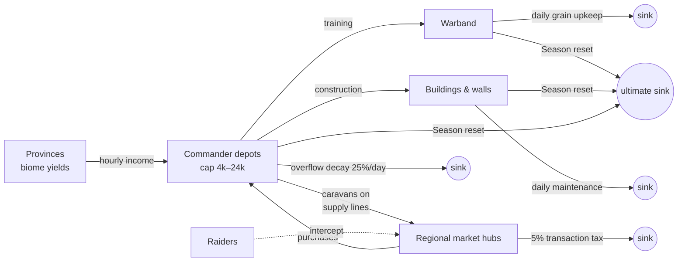

# 06 — Economy & Monetization: Legions of Earth

**Executive summary.** This document specifies the two economies of *Legions of Earth* and the wall between them. The **in-game economy** (grain, timber, stone, iron, silver) is a closed, player-driven system with strong sinks, physical raidable trade, and seasonal resets that keep inflation structurally impossible to run away. The **real-money economy** sells exactly three things — identity (cosmetics), story (the Warpath Pass), and comfort (capped convenience) — through a single premium currency, **Laurels**, priced in four PPP-informed regional tiers and payable through the methods people actually use worldwide: cards, PayPal, Pix, UPI, mobile money, carrier billing, and prepaid codes, delivered via **Xsolla as merchant of record** at launch with **Coda** added for Southeast Asia and Africa distribution. Power, resources, combat speed-ups beyond free caps, territory, and any form of loot box are never sold, and each exclusion is enforced in system architecture, not just policy. The revenue model targets a wide, shallow funnel — roughly 2% blended payer conversion at a $4–5 blended monthly ARPPU across a 5M-registered year-one audience — reaching a self-sustaining live-team run rate by month 12 in the base scenario.

---

## 1. Design goals and principles

The economy serves the five pillars in [00-vision-and-concept.md](00-vision-and-concept.md), especially Pillar 5 (*Fair free-to-play*) and Pillar 4 (*Worldwide by design*). Five operating principles govern every decision below:

1. **Two economies, one wall.** Resources and Laurels never convert into each other, in either direction. There is no SKU, event, or edge case that turns money into in-world material advantage.
2. **Sinks beat faucets.** Target faucet-to-sink ratio of **1.03–1.08** measured weekly per resource per Shard (telemetry in [05-liveops-content-and-analytics.md](05-liveops-content-and-analytics.md)). The seasonal reset is the ultimate sink: nothing material survives the ~8-week Season, so long-horizon hoarding has no payoff.
3. **Commerce is terrain.** Trade happens through physical caravans on the map, not an abstract menu — making merchants, escorts, and raiders into playstyles (mechanics shared with [02-world-map-and-seasons.md](02-world-map-and-seasons.md)).
4. **Wide funnel, shallow spend.** We optimize for many small payers across 60+ countries, not few large ones. There is no real-money SKU above the Tier-1 equivalent of $9.99, and minors' spending is off by default until a parent enables and caps it (§9.4).
5. **A free player can look legendary.** The most prestigious cosmetics (Hall of Ages monument styles, Season victory regalia) are *earned*, not sold, so paying never monopolizes status.

---

## 2. The in-game resource economy

### 2.1 The five resources

| Resource | Produced by | Primary uses | Personality |
|---|---|---|---|
| **Grain** | Steppe, coast, river Provinces | Unit training, **daily warband upkeep** | The heartbeat; scarcity forces armies to shrink |
| **Timber** | Forest, jungle Provinces | Buildings, siege engines, caravans | Early-game bottleneck |
| **Stone** | Highland, mountain Provinces | Walls, Strongholds, monuments | Defensive investment; slow to move |
| **Iron** | Mountain, tundra Provinces | Elite units, weapons, repairs | Mid/late military scarcity |
| **Silver** | Coast/trade Provinces, market tax | Market medium of exchange, mercenary fees, diplomacy tributes, instant-repair fees | The only resource all biomes want |

Province yield ranges and biome baselines live in [02-world-map-and-seasons.md](02-world-map-and-seasons.md) (§3); unit costs, upkeep rates, and balance curves live in [01-game-design-document.md](01-game-design-document.md); this document owns the *flow* design.

### 2.2 Sources and sinks

| Flow | Faucets (sources) | Sinks |
|---|---|---|
| **Grain** | Province tiles (base 2–12/hr by biome), Farm buildings (+40% grain/level), event caches | Warband upkeep (see 2.3), training costs, caravan provisioning, spoilage above depot cap |
| **Timber** | Province tiles (0–12/hr), lumber camps | Construction, siege engine builds, caravan construction (80 timber each), repair costs |
| **Stone** | Province tiles (1–12/hr), quarries | Walls/Stronghold tiers, monument construction, Clash Window fortification spend |
| **Iron** | Province tiles (0–8/hr), mines | Elite unit training, equipment repair after battles (15–30% of unit cost), siege heads |
| **Silver** | Province tiles (0–4/hr base; desert and jungle richest), 5% market transaction tax redistribution, event rewards | Market fees, mercenary/scout contracts, diplomacy tributes, instant garrison-repair fee, Legion treasury dues |
| **All** | — | **Seasonal reset** (100% of stocks, armies, and buildings; legacy items exempt per 00 §4.5) |

Tile ranges are the per-Province biome baselines owned by [02-world-map-and-seasons.md](02-world-map-and-seasons.md) §3, quoted at development 0; development (+25%/level), river tags, and Rich Veins raise them.

### 2.3 Upkeep and decay as inflation control

Upkeep is the always-on sink that keeps stock from compounding:

- **Warband upkeep:** every soldier consumes grain **per day** (Shieldline 3/day, Skirmisher 2, Rider 5, Engineer 4, Wayfinder 2 — rates owned by [01-game-design-document.md](01-game-design-document.md)). A typical week-4 warband of 60 mixed units burns ~180 grain/day — around **14% of a mid-game Commander's grain income** at week 4, and armies triple by week 7 while income grows far more slowly, making upkeep the binding constraint by design. There is no desertion mechanic: unpaid upkeep applies **attrition** — −5% of warband pool HP per unpaid day (per [01-game-design-document.md](01-game-design-document.md); never instant wipe-outs — respects Pillar 3's async-friendliness).
- **Building maintenance:** structures consume 1% of their build cost per day in timber/stone; unpaid maintenance degrades effectiveness 5%/day (repairable, never auto-destroyed).
- **Depot caps and spoilage:** every Commander has a depot per resource — base cap **4,000**, upgradable in 5 steps to **24,000**. Stock above cap **decays 25% per day**. Legion treasuries cap at 150,000 per resource (10 members' worth) with the same overflow decay. This is the hoarding limit: stockpiling for a "week 7 mega-push" is possible but leaks, and the market (2.4) becomes the rational alternative to hoarding.
- **Silver demurrage:** silver has no spoilage but pays a 1%/day treasury tithe above 12,000 per Commander, sinking to the void — a gentle brake on currency accumulation without punishing normal play.

**Worked example — a mid-game Commander's daily grain ledger (week 4, base scenario):**

| Line | Amount/day |
|---|---|
| Province income (3 Provinces, avg 10 grain/hr base per [02](02-world-map-and-seasons.md) §3) | +720 |
| Development & Farm bonuses (avg +80% on tile yield) | +576 |
| Warband upkeep (60 units, ~180 grain/day per [01](01-game-design-document.md)) | −180 |
| Training queue (12 mixed units/day at [01](01-game-design-document.md)'s grain costs) | −240 |
| Caravan provisioning (1 route) | −120 |
| **Net** | **+756** |

Net-positive, but sinks already consume ~42% of gross — and the Commander fills a 4,000-cap depot in five to six days and must *spend or trade*, which is exactly the behavior we want.

### 2.4 Economy flow

### 2.5 Tuning levers

Live tuning follows the balance cadence owned by [05-liveops-content-and-analytics.md](05-liveops-content-and-analytics.md) §2.3 — bounded ±10%-class numeric changes inside the weekly tuning window; structural changes only at Season boundaries; emergency exploit hotfixes anytime — and uses four levers, in preference order: (1) biome yield multipliers via in-fiction world events, (2) upkeep rates (±10%-class, in the weekly window), (3) market tax 4–7%, (4) depot decay rate. We never tune by injecting resources into player hands mid-season — event rewards are pre-budgeted into the season's faucet plan.

---

## 3. Regional markets and raidable trade routes

### 3.1 Market hubs

The market is **regional, not global**. Trade geography follows the 10 **Muster Regions** of the map (defined in [02-world-map-and-seasons.md](02-world-map-and-seasons.md)): each region has a single **Regional Market Hub** — one order book, one tax point — anchored in a hub Province any Legion can contest. A Commander posts buy/sell orders at a hub their supply line reaches; orders match continuously in a standard limit-order book, denominated in silver.

**Physical settlement:** a matched trade is not teleported. The seller's goods travel by **caravan** along real supply-line paths at **20 minutes per hex** (movement rules in [02-world-map-and-seasons.md](02-world-map-and-seasons.md)), escorted or not. Caravans are visible to Wayfinder scouting and **raidable on the Skirmish layer** — a successful raid loots 40% of cargo (25% destroyed, 35% delivered as "salvage insurance" so trading never feels pointless). Long-distance arbitrage between regions is therefore possible and lucrative but demands escorts, route planning, and coalition protection — commerce as strategy, per Pillar 2.

### 3.2 Market-manipulation guardrails

| Risk | Guardrail |
|---|---|
| Corner-the-market pumps | **Daily price bands:** orders outside ±20% of the 7-day regional median price are rejected; bands widen to ±35% during declared world events |
| Wash trading / RMT laundering | Trades between accounts sharing device/payment/network fingerprints are flagged to the anti-fraud pipeline in [10-security-anticheat-trust-safety.md](10-security-anticheat-trust-safety.md); silver is non-giftable and non-purchasable, killing the RMT exit ramp |
| Bot market-making | Order placement rate-limited to 10 active orders and 30 order actions/hour per Commander; new accounts (<7 days or pre-tutorial-complete) cannot trade |
| Monopoly hoarding | Position limit: no Commander may hold open orders exceeding 2× their depot cap; Legion treasuries cannot place market orders directly (officers trade as individuals, visibly) |
| Cross-Shard distortion | No cross-Shard trading of any kind |
| Insider event-timing trades | World-event announcements publish simultaneously worldwide with a 24-hour market-band widening notice (fairness with [05](05-liveops-content-and-analytics.md)'s event calendar) |

The 5% transaction tax is both a sink and a manipulation damper — round-tripping costs ~10%, making thin-margin manipulation unprofitable.

---

## 4. Monetization catalog

### 4.1 Premium currency: Laurels

One premium currency, **Laurels**, anchored at **100 Laurels ≈ US$1.00** in Tier-1 pricing. Laurels buy cosmetics, the Warpath Pass, and convenience unlocks — nothing else. Laurels are **earnable free**: ~130 per Season on the free Warpath track plus ~50 from seasonal events, so a dedicated free player funds a premium pass roughly every fourth season (or one mid-tier cosmetic per season) without paying. Laurel packs: 500 ($4.99), 700 ($6.99 — sized so the 680-Laurel Warpath Pass strands no forced remainder), 1,050 ($9.99, +5% bonus — the largest cash SKU we sell; wide funnel, shallow spend). Laurels never expire, are account-bound, and are not tradable between players (gifting is catalog-item-based, §9.1).

### 4.2 Cosmetics catalog

All cosmetics are render-layer only; the server's combat and economy tables have no cosmetic inputs (verification in §5). Art direction and cultural-review process in [08-art-and-ux-direction.md](08-art-and-ux-direction.md) — every cosmetic set is fictional-mythic, cleared by the cultural consultation checklist, never a real flag, uniform, or religious symbol.

| Category | Examples | Price (Laurels / Tier-1 USD) |
|---|---|---|
| Banner sigils & patterns | Legion banner emblems, border filigree, color palettes | 150–400 L ($1.50–4.00) |
| Warband skins | Archetype visual sets ("Ashen Horde Riders," "Tidewalker Shieldline") | 300–800 L ($3–8) |
| Stronghold architecture styles | Full visual reskin of a Legion's Stronghold (basalt citadel, cliff monastery, river bastion) | 600–1,200 L ($6–12) |
| Map flair | March trails, encampment tents, caravan liveries | 200–500 L ($2–5) |
| Monument styles | Visual styles for Hall of Ages entries a Legion has *earned* (style purchasable; the monument itself never is) | 500–1,000 L ($5–10) |
| Commander identity | Portrait frames, titles, profile backdrops | 100–300 L ($1–3) |
| Expression | Emotes, chat flourishes, victory fanfares | 80–200 L ($0.80–2) |

Catalog cadence: 10–14 new items per Season (pipeline throughput per [08-art-and-ux-direction.md](08-art-and-ux-direction.md) §8.3), ~30% of them earnable-only. Nothing is FOMO-locked forever: store items rotate back within two Seasons (retention ethics per [09-onboarding-retention-accessibility.md](09-onboarding-retention-accessibility.md)).

### 4.3 The Warpath Pass

The seasonal battle pass, aligned to the Season cycle — exactly **6 passes/year** (six 61-day cycles fill the calendar; lifecycle in [02-world-map-and-seasons.md](02-world-map-and-seasons.md) §7). **Premium price: 680 Laurels ($6.99 Tier-1 equivalent)** — covered outright by the 700-Laurel pack with no forced remainder, or by one $4.99 pack plus earned Laurels.

- **50 tiers**, progressed by *Warpath Marks* from any meaningful play (skirmishes, supply runs, scouting, Legion objectives — never login streaks alone). Tuned so ~5 focused hours/week completes tier 50 by week 7; catch-up acceleration (+50% Marks) applies automatically when behind the curve, protecting 5-minute-session players and late joiners.
- **Free track:** ~130 Laurels, 2 banner patterns, 1 emote, 1 portrait frame, titles, and all narrative story beats — the Season's story is never paywalled.
- **Premium track:** ~250 Laurels back (37% rebate), 1 exclusive warband skin set, 1 Stronghold style, 3 map-flair items, 2 emotes, seasonal title, and the animated Season sigil.
- **No tier skips are sold.** The pass monetizes *access to the premium reward track*, not progression speed. This removes the classic "pass pressure → buy tiers" spiral entirely.

**Selected tiers (worked example):**

| Tier | Free track | Premium track |
|---|---|---|
| 1 | 10 Laurels | "Emberline" banner pattern |
| 10 | Portrait frame | Map flair: ember march-trail |
| 20 | 30 Laurels | Warband skin: Skirmishers (Emberline set) |
| 30 | Emote: "Rally" | 100 Laurels |
| 40 | 40 Laurels | Warband skin: Shieldline + Riders (set complete) |
| 50 | Title: "Season's Veteran" + 50 Laurels | Stronghold style: "Emberline Bastion" + 150 Laurels + animated sigil |

### 4.4 Convenience items and their hard caps

Convenience means *comfort within caps every player reaches free* (Pillar 5, 00 §6). Each item below has a universal ceiling; purchase only accelerates reaching a cap free play also reaches — it never raises one.

| Item | Free path | Purchase | Universal hard cap |
|---|---|---|---|
| Order queue slots | 5 at start; grows to 12 by Commander level 25 ([01-game-design-document.md](01-game-design-document.md) §6.1) | "Quartermaster's Ledger," 300 L: unlocks depth 12 immediately — early unlock only | **12 slots** — everyone |
| Build queue slots | 2 at start; Warpath Pass QoL track and seasonal play reach 4 ([02-world-map-and-seasons.md](02-world-map-and-seasons.md) §5) | 200 L per slot, early unlock only | **4 queues** — everyone |
| Cosmetic loadout slots | 1 free | 100 L per extra | 5 (pure cosmetics) |
| Warband name/recolor tokens | 1 per Season free | 80 L | unlimited (cosmetic) |
| Commander rename | 1 free ever | 300 L | 1 per 90 days (impersonation guard, [10](10-security-anticheat-trust-safety.md)) |

Explicitly **not** in the convenience catalog: anything touching timers of training, construction, repair, movement, or combat. Also never sold: **Doctrine preset slots** (3 at start, 6 at Commander level 20) are progression-only, per [01-game-design-document.md](01-game-design-document.md) §4.1. Free daily "Field Order" skip tokens (2/day, 15-minute value, earned by login-free play activity) exist for everyone identically and cannot be bought, gifted, or stacked beyond 6.

---

## 5. The fairness line: never sold, and how each exclusion is enforced

Policy lines get eroded by "temporary events" unless they are enforced structurally. Each exclusion below has a **design-level enforcement** that would require engineering work — not a store-config change — to violate.

| Never sold | Enforcement in design |
|---|---|
| **Combat power** (stats, units, doctrines) | Cosmetics live in a render-only asset layer; the deterministic server simulation ([04-technical-architecture.md](04-technical-architecture.md)) takes no input from entitlement data. CI includes a schema test: the battle resolver's input type contains no cosmetic or entitlement fields. |
| **Resources** (grain/timber/stone/iron/silver) | The commerce service has no write path to the economy service. Resource grants exist only in the season-event budget pipeline, which has no price field. A "resource pack" SKU is unrepresentable in the store schema. |
| **Combat-relevant speed-ups beyond free caps** | Timer-skip tokens are minted only by the play-activity service at a fixed universal rate; the store cannot mint them. Token wallet is hard-capped at 6 server-side. |
| **Territory & map influence** | Province ownership changes only through simulation events (capture, supply collapse, season reset). There is no administrative grant path exposed to any commercial or liveops tool; GM territory edits require the incident-response process in [10](10-security-anticheat-trust-safety.md) and are publicly logged per Shard. |
| **Loot boxes / gacha / randomized paid rewards** | Every SKU maps 1:1 to deterministic contents; the store schema has no probability field. This also simplifies compliance in Belgium, the Netherlands, China-adjacent markets, and under Japan's *kompu gacha* rules ([12-legal-compliance-privacy.md](12-legal-compliance-privacy.md)). |
| **Warpath Pass tier skips** | Tier state is owned by the Marks service; no purchasable Marks SKU exists. |
| **Laurel→silver or any currency bridge** | Laurels and silver live in separate services with no exchange endpoint. |

Public commitment: this table ships verbatim in the player-facing "Fairness Charter" on the website, and any change to it is announced 30 days ahead. Trust is the acquisition strategy ([11-marketing-community-gtm.md](11-marketing-community-gtm.md)).

---

## 6. Regional pricing methodology

### 6.1 Method

1. **Base tiering:** four price tiers derived from a 60/40 blend of World Bank PPP conversion factors and market exchange rates, floored at 20% of Tier-1 USD (below that, fraud arbitrage and payment fees consume the margin).
2. **Charm rounding:** convert to local convention (₹99, Rp 65,000, R$ 12.90) rather than raw FX output.
3. **Quarterly review:** reprice when local FX drifts >15% from the last setting (critical for TRY, ARS, NGN, EGP); mid-Season price changes only downward, upward changes land at Season boundaries.
4. **Anti-arbitrage:** storefront tier binds to payment-method country + account history, not IP alone; mismatch triggers step-up verification (mechanics in [10](10-security-anticheat-trust-safety.md), lawfulness in [12](12-legal-compliance-privacy.md)). Gifting across tiers is settled at the *recipient's* tier to close the gift-arbitrage loop.

### 6.2 Tier table with worked examples (Warpath Pass and 1,050-Laurel pack)

| Country | Tier | Multiplier | Warpath Pass (local) | ≈USD | 1,050 Laurels (local) | ≈USD |
|---|---|---|---|---|---|---|
| United States | 1 | 1.00 | $6.99 | 6.99 | $9.99 | 9.99 |
| Germany | 1 | 1.00 | €6.99 (incl. VAT) | ~7.55 | €9.99 | ~10.80 |
| Japan | 1 | 0.95 | ¥980 | ~6.60 | ¥1,400 | ~9.40 |
| Poland | 2 | 0.65 | 19.99 zł | ~4.60 | 28.99 zł | ~6.70 |
| Brazil | 3 | 0.40 | R$ 14.90 | ~2.80 | R$ 21.90 | ~4.10 |
| Turkey | 3 | 0.35 | ₺79.99 | ~2.45 | ₺119.99 | ~3.65 |
| India | 4 | 0.25 | ₹149 | ~1.75 | ₹229 | ~2.70 |
| Indonesia | 4 | 0.25 | Rp 27,000 | ~1.75 | Rp 42,000 | ~2.70 |
| Philippines | 4 | 0.28 | ₱109 | ~1.95 | ₱169 | ~3.00 |
| Nigeria | 4 | 0.22 | ₦2,400 | ~1.55 | ₦3,700 | ~2.40 |

Tier-1 prices are VAT-inclusive where local law expects it (EU, UK, Brazil); the merchant of record (§7) handles remittance. Laurel *amounts* are identical worldwide — only the money price moves — so the in-store experience is globally consistent and no region gets "less pass."

---

## 7. Payments worldwide

### 7.1 Method coverage requirements (from 00 §5)

| Method | Where it decides purchases | Notes |
|---|---|---|
| Cards (Visa/MC/Amex, local schemes ELO, RuPay, JCB) | Global; dominant in NA/EU/JP | 3DS2/SCA in EU |
| PayPal | NA, EU, strong in DE | Wallet trust for browser games |
| **Pix** | Brazil — now the default online payment | Instant, low fee (~1%), no chargebacks |
| **UPI** | India — ~80%+ of digital payments | Intent flow on mobile; mandatory for ₹99–₹229 price points |
| Mobile money (M-Pesa, MTN MoMo, Airtel Money; GCash, Dana, TrueMoney in SEA) | Kenya, Ghana, Nigeria; PH/ID/TH | Small-ticket friendly |
| Carrier billing | SEA, MENA, LATAM prepaid-phone users | Carrier take 15–40%: restrict to SKUs ≤ $10 equivalent and price margin accordingly |
| Prepaid codes / vouchers (Codashop, Razer Gold, retail cards) | Unbanked and under-18 users everywhere | Also our compliant answer to minors without cards |

### 7.2 Aggregator comparison and decision

| Criterion | Stripe | Adyen | **Xsolla** | Coda |
|---|---|---|---|---|
| Model | PSP (we are merchant) | Enterprise PSP (we are merchant) | **Merchant of record**, games-native | MoR + Codashop distribution, SEA/MENA-strength |
| Local methods (Pix/UPI/MoMo/carrier) | Growing but patchy for games | Excellent | Very broad (hundreds of methods) | Excellent in SEA/Africa/MENA, incl. carrier billing |
| Global VAT/GST & compliance | Ours to handle (Stripe Tax helps, registrations ours) | Ours to handle | **Theirs** | Theirs |
| Chargeback/fraud ops | Ours | Ours | Theirs (games-tuned) | Theirs |
| All-in cost of sale | ~3–4% + tax ops + entity costs | ~2.5–3.5% + heavy ops, volume minimums | ~5–5.5% | ~5–8% (method-dependent) |
| Fit for a small team selling in 60+ countries at launch | Poor (tax registrations alone are months of ops) | Poor until large scale | **Best** | Best as a *channel*, not sole platform |

**Decision:** launch with **Xsolla Pay Station as merchant of record** for the entire web store — it removes worldwide tax registration, local-method integration, and chargeback operations from our launch critical path, which for the team size in [13-roadmap-team-budget.md](13-roadmap-team-budget.md) is worth the ~2-point fee premium over a PSP. **Add Coda (Codashop + carrier billing) in months 4–6** as a second channel for Indonesia, Philippines, Thailand, Vietnam, and mobile-money Africa, where its voucher retail network reaches players Xsolla misses. **Revisit a direct Adyen integration only past ~$10M annual gross**, when a 2-point fee saving funds the required tax/fraud ops team. Stripe was considered and rejected as primary because merchant-of-record burden at 60-country launch scope is the binding constraint, not card rates; PayPal Braintree rejected for the same reason plus weaker emerging-market method coverage.

Web-first payments are also a margin strategy: no 30% app-store platform fee exists in our PWA channel. If store-wrapped builds ship later ([04](04-technical-architecture.md)), IAP-priced SKUs will be a strict subset and web remains the flagship store.

---

## 8. Revenue model

### 8.1 Funnel assumptions by region tier (base case, monthly)

Assumes the anchor's success criteria: 5M registered / no country >30% of MAU; MAU mix reflects the GTM sequencing in [11](11-marketing-community-gtm.md).

| Region tier (examples) | MAU share | Payer % | ARPPU/mo | ARPU/mo |
|---|---|---|---|---|
| Tier 1 (US, EU-W, JP, KR, AU) | 22% | 3.6% | $8.50 | $0.306 |
| Tier 2 (EU-C, e.g., PL/CZ; GCC) | 26% | 2.6% | $5.20 | $0.135 |
| Tier 3 (BR, MX, TR, TH) | 30% | 1.5% | $2.90 | $0.044 |
| Tier 4 (IN, ID, PH, VN, NG, EG, KE) | 22% | 0.8% | $1.60 | $0.013 |
| **Blended** | 100% | **~2.0%** | **~$4.60** | **$0.118** |

ARPPU is dominated by the Warpath Pass (6 Seasons/year × regional pass price) plus ~1.3 cosmetic purchases per payer per quarter. These conversion rates are conservative for strategy but honest for a cosmetics-only browser title with heavy Tier 3–4 reach.

### 8.2 Year-1 scenarios (12 months post-global-launch)

| | Lean | **Base** | Strong |
|---|---|---|---|
| Registered (month 12) | 3.0M | **5.0M** | 7.5M |
| MAU (month 12) | 600k | **1.05M** | 1.7M |
| Avg MAU (year 1) | 300k | **520k** | 850k |
| Blended ARPU/mo | $0.085 | **$0.118** | $0.170 |
| **Gross revenue, year 1** | **$0.31M** | **$0.74M** | **$1.73M** |
| Month-12 gross run rate | $51k/mo | **$124k/mo** | $289k/mo |
| Net after MoR fees (~5.5%) + refunds/chargebacks (~2%) + FX slippage (~1.5%) | $46k/mo | **$113k/mo** | $263k/mo |

The base month-12 net run rate (~$1.35M annualized) covers the distributed live team sized in [13-roadmap-team-budget.md](13-roadmap-team-budget.md), meeting the anchor's "self-sustaining live team by month 12" criterion. Sensitivity: the model is most sensitive to **Tier-1/2 MAU share** (a 5-point shift from Tier 4 to Tier 2 adds ~26% gross) and to **pass attach rate among D30-retained players** — our two most-watched monetization KPIs. Strong-case drivers: Season-finale virality spikes, Coda channel unlocking SEA prepaid spend, and Legion-gifting norms (§9.1). We deliberately do not model whale mechanics; the design forecloses them.

### 8.3 Monetization KPIs

Weekly per-Shard, per-tier dashboards ([05](05-liveops-content-and-analytics.md)): payer conversion, first-purchase day distribution (target median: day 12–18, *after* Legion joining — monetizing belonging, not confusion), pass attach among D30-retained (target 12–15%), refund and chargeback rates (<0.8% / <0.4%), Laurel sink ratio (target: 85%+ of purchased Laurels spent within 60 days), and revenue concentration (alarm if top 1% of payers exceeds 20% of revenue — the anti-whale tripwire).

---

## 9. Gifting, creators, refunds, and ethical guardrails

### 9.1 Gifting

Commanders may gift **catalog items and the Warpath Pass** (never Laurels, never anything from §5's excluded list) to mutual Legion- or Coalition-mates of ≥14 days' standing. Limits: 5 gifts sent/30 days, Tier-priced at the recipient's region (closing arbitrage), 48-hour delivery delay with cancel window (fraud brake). Gifting a pass to a Legion recruit is expected to become a social ritual — it monetizes generosity, our healthiest possible spend motivation.

### 9.2 Creator codes

A creator-code program (managed through the creator pipeline in [11](11-marketing-community-gtm.md)): players enter a code at checkout; the creator receives **5% of net revenue** on attributed purchases for 30 days per entry, paid monthly via the MoR's payout rails. Codes never discount the player's price (keeps regional tiers clean); creators from Tier 3–4 regions are paid in USD-stable terms. Eligibility gates and fraud screening (self-referral, stolen-card farming) per [10](10-security-anticheat-trust-safety.md).

### 9.3 Refunds and chargebacks

- **Refund policy:** any purchase refundable within **14 days if unconsumed** (cosmetic unequipped, pass tier ≤5, Laurels unspent) — meeting the EU withdrawal-right posture in [12-legal-compliance-privacy.md](12-legal-compliance-privacy.md) and applying it worldwide rather than region-gating consumer rights.
- **Chargebacks:** revoke the purchased entitlement, never the account, on a first offense; suspension only on repeat patterns or friendly-fraud signals. Pix and UPI's low-chargeback rails are one more reason they are first-class methods.
- All refund/chargeback flows run through the MoR, with our support able to grant goodwill refunds directly.

### 9.4 Ethical guardrails

- **Minors:** spending on age-gated minor accounts is **off by default**. A parent enables it through the **KWS parent portal** and selects a monthly cap from presets of **5 / 10 / 20 in the local price tier**; carrier billing stays unavailable for minors. Consent flows and legal mechanics per country in [12](12-legal-compliance-privacy.md). Prepaid codes remain available as the parent-controlled path.
- **Everyone:** monthly spend summary in-client; self-set spending limits and a purchase cool-off toggle; a friction interstitial ("You've spent X this week") at 3× a player's trailing median weekly spend; no countdown-pressure sales, no "only 2 left!" scarcity theater, and store item rotation is published in advance.
- **No dark-pattern currency skews:** Laurel packs are sized so common purchases don't strand awkward remainders by design — the 700-Laurel pack covers the 680-Laurel pass outright, and 1,050 covers pass + a small cosmetic.

---

## 10. Interfaces with sibling documents

| Topic | Owned here | See also |
|---|---|---|
| Resource yields, unit costs, balance curves | Flow design, sinks, caps | [01-game-design-document.md](01-game-design-document.md) |
| Market hub placement, caravan pathing | Market rules, guardrails | [02-world-map-and-seasons.md](02-world-map-and-seasons.md) |
| Commerce/economy service separation | Enforcement requirements (§5) | [04-technical-architecture.md](04-technical-architecture.md) |
| Store/liveops cadence, economy telemetry | KPIs, tuning levers | [05-liveops-content-and-analytics.md](05-liveops-content-and-analytics.md) |
| Store localization, currency formatting | Price points, tiers | [07-localization-and-i18n.md](07-localization-and-i18n.md) |
| RMT, fraud, market abuse detection | Guardrail specs | [10-security-anticheat-trust-safety.md](10-security-anticheat-trust-safety.md) |
| Consumer law, VAT, minors' consent | Policy commitments | [12-legal-compliance-privacy.md](12-legal-compliance-privacy.md) |
| Cost base the revenue must cover | Revenue scenarios | [13-roadmap-team-budget.md](13-roadmap-team-budget.md) |

The economy is the quietest system in the game when it works: prices stable, caravans moving, passes selling because players love who they've become on the map. Everything in this document is tuned toward that quiet.
