# 07 — Localization & Internationalization: Legions of Earth

**Executive summary.** Legions of Earth ships worldwide on day one, so localization is a launch-blocking engineering discipline, not a content afterthought. This document commits to a 22-language launch roster in three service tiers, an ICU-MessageFormat string pipeline built on LinguiJS and Crowdin Enterprise with pseudo-localization enforced in CI, a Noto-based subsetted font strategy that fits inside the < 5 MB initial-load budget from doc 00 (including CJK, Arabic RTL, Devanagari, and Thai), machine translation for Legion and Coalition chat via Google Cloud Translation v3 with a locked game-term glossary and a hard latency/cost budget, a culturalization review board for names, icons, colors, and map labels, a per-Season LQA cost model (~$1,650 per T1 language per Season, ~$30k per Season across the roster), a governed community translation program that pays contributors in cosmetics and Hall of Ages credit, and locale-level funnel/retention instrumentation so translation quality is measured like any other product metric. Cross-cutting dependencies: the 5 MB budget and asset pipeline (doc 04), chat systems (doc 03), FTUE funnels (doc 09), event calendar culturalization (doc 05), and regional pricing copy (doc 06).

---

## 1. Launch language roster

### 1.1 Selection criteria

Languages were scored on four axes: (a) addressable market for browser/mobile-web strategy games, (b) browser-game affinity (regions where no-install, low-bandwidth play is the norm rather than a fallback), (c) revenue potential under regional pricing (doc 06), and (d) fully loaded support cost (translation + LQA + community-management coverage from doc 11). The roster deliberately over-weights markets where the "playable on a 2 GB Android phone over 3G" promise is a differentiator: South and Southeast Asia, Latin America, MENA, and Eastern Europe.

### 1.2 The tiers

| Tier | Languages (locale codes) | Count | Service level |
|---|---|---|---|
| **T0 — Source** | English (`en`) | 1 | Source of truth; UK/US-neutral style guide; all strings authored here |
| **T1 — Full service** | Spanish–LatAm (`es-419`), Portuguese–Brazil (`pt-BR`), French (`fr`), German (`de`), Russian (`ru`), Turkish (`tr`), Polish (`pl`), Arabic–MSA (`ar`), Indonesian (`id`), Vietnamese (`vi`), Thai (`th`), Hindi (`hi`), Japanese (`ja`), Korean (`ko`), Chinese–Simplified (`zh-Hans`), Chinese–Traditional (`zh-Hant`) | 16 | Professional translation, full LQA pass every Season, native-speaker style guide, marketing/store copy included |
| **T2 — Professional, light LQA** | Italian (`it`), Ukrainian (`uk`), Spanish–European (`es-ES`), Filipino (`fil`), Malay (`ms`) | 5 | Professional translation with MT-assisted post-editing; spot LQA (top 20 screens + FTUE) per Season; community feedback loop covers the rest |
| **T3 — Community-assisted** | Opens post-launch: Czech, Romanian, Greek, Bengali, Tamil, Swahili, Dutch, Hungarian, and any language reaching the graduation gate (§7.3) | open | Community translation on Crowdin with professional proofreading of the FTUE and monetization strings only |

**Total at launch: 22 shipped languages** (T0 + T1 + T2), exceeding the "20+" requirement in doc 00 §5, with T3 as the growth valve.

### 1.3 Rationale highlights (the decisions someone will question)

- **`es-419` before `es-ES`.** Latin America is the larger browser-strategy market and pairs with Pix/regional pricing momentum (doc 06); European Spanish ships in T2 because mutual intelligibility is high but tone differences ("vosotros", register) are noticed and resented in both directions.
- **`zh-Hans` and `zh-Hant` both in T1.** Traditional Chinese serves Taiwan and Hong Kong browser players at modest incremental cost because conversion from Simplified is machine-assisted then human-reviewed — but it is a real localization (vocabulary differs: 服务器 vs 伺服器), not a script transform.
- **Hindi in T1 despite low historic ARPU.** India is the single largest 3G/low-end-device opportunity and a stated success criterion (doc 00 §9 names South Asia in the p75 load target). English UI is common in Indian gaming, so Hindi ships with an easy in-game toggle and we measure actual uptake (§8.1) before adding more Indic languages via T3 (Bengali, Tamil are first in line).
- **Arabic in T1, not T2.** RTL is an engineering cost you pay once (§3.5); paying it for a T2-level language would be poor leverage. MENA browser-game affinity is high and MSA gives one translation serving 20+ countries.
- **Ukrainian in T2 at launch** — significant strategy-game audience, strong community-translation energy expected, and Russian must never be presented as a substitute.
- **What lost:** Japanese in T2 (rejected: JP players have the genre's highest quality expectations; half-localized Japanese is worse than none), and a "top 10 only" launch (rejected: contradicts pillar 4 and the ≥ 60-country reach target; the marginal cost of T2 is ~$5k/language/year against measurable funnel lift).

---

## 2. i18n engineering foundation

### 2.1 Message format and runtime: LinguiJS + ICU MessageFormat

**Decision: LinguiJS** (`@lingui/core`, `@lingui/react`) with **ICU MessageFormat** as the only permitted message syntax.

- Compile-time catalog compilation means the runtime is ~3 KB gzipped — material under the 5 MB budget (doc 04 §2.2 owns the overall budget ledger, i18n's allocation included).
- Full ICU: plurals, selects, nested arguments, number/date skeletons.
- Alternatives: **react-intl/FormatJS** lost on runtime size (~15–20 KB more) and slower message compilation at runtime; **i18next** lost because its default interpolation is not ICU (plural handling via key suffixes invites errors in 6-plural Arabic) and its ecosystem encourages runtime fetching patterns we would fight constantly.

Rules enforced by lint (custom ESLint rule + Lingui extractor):

1. **No string concatenation of translatable text.** Ever. Word order differs; `"Attack " + name` is a bug.
2. **No UI-copy literals outside `t`/`<Trans>` macros** — extractor coverage is a CI gate.
3. **Every ICU variable is typed** (number, date, string) so formatting is locale-aware by construction.
4. **IDs are stable, generated from source text + context hash**, with an explicit `context` comment required for any string under 20 characters (short strings are where mistranslation lives: "Charge" the verb vs "Charge" the fee).

### 2.2 String pipeline: source to build

```mermaid
flowchart LR
  A[Dev writes source string\nin code with Lingui macro] --> B[CI: lingui extract\ncatalog diff on PR]
  B --> C[Crowdin Enterprise\nvia GitHub integration]
  C --> D[TM + glossary\npre-translate]
  D --> E[Human translation\nT1/T2 vendor, T3 community]
  E --> F[Crowdin QA checks:\nICU validity, placeholders,\nlength limits, glossary terms]
  F --> G[Auto-PR back to repo\nper-locale catalogs]
  G --> H[CI: compile catalogs,\npseudo-loc screenshot tests]
  H --> I[CDN: per-locale chunks,\nlazy-loaded ~25-40 KB gz each]
```

**TMS decision: Crowdin Enterprise.** It is the only mainstream TMS that is simultaneously strong at (a) GitHub-native round-tripping, (b) professional-vendor workflows, and (c) large-scale community crowdsourcing with voting and proofreader roles — and we need all three in one tool or the T3 program (§8) fragments. **Lokalise** lost on crowdsourcing depth, **Phrase** on price at our seat count, **Weblate** (self-hosted) on the engineering time it would tax from a small team (doc 13).

Operational details:

- **Context screenshots**: a nightly Playwright job captures every screen per feature flag and uploads tagged screenshots to Crowdin, so translators see strings in place. This is the single highest-leverage quality practice we know of and is budgeted as real engineering work (2 weeks initial, ~1 day/Season maintenance).
- **String freeze** 10 working days before each Season launch (calendar owned by doc 05's release cadence); hotfix strings ride a fast lane with MT + 24-hour human review.
- **Max-length metadata** on every string that lands in a fixed-width UI element (buttons, resource counters); Crowdin QA blocks overlong translations, and the German/Russian +35% expansion problem is caught at translation time, not QA time.

### 2.3 Pseudo-localization in CI

Every PR builds an `en-XA` pseudo-locale: accented expansion (`Ẋ~~Àttàçk thé Prõvïnçé~~Ẍ`, +40% length), bracket delimiters to expose truncation, and an `en-XB` RTL-mirrored pseudo-locale exercising the bidi pipeline. Playwright visual-diff tests run the 25 canonical screens in `en`, `en-XA`, and `en-XB`; a layout overflow or a raw (unextracted) English string fails the build. This makes "it broke in German" a class of bug that cannot ship, at the cost of ~4 minutes of CI time.

### 2.4 Plurals, gender, and grammar

- **Plurals** use ICU `plural` exclusively. CI validates that every locale's catalog covers that locale's CLDR plural categories (Arabic: zero/one/two/few/many/other; Russian: one/few/many/other; CJK, Vietnamese, Thai, Indonesian: other only). A message missing a required category fails Crowdin QA.
- **Gender**: the game's own writing sidesteps most grammatical-gender traps by design — players are addressed by role ("Commander") and Legion titles are epicene in source. Where target grammar forces agreement (e.g., French adjectives about the player), translators use ICU `select` on a `gender` argument fed from an **optional** profile setting with values `neutral | feminine | masculine`, defaulting to each language's accepted neutral/generic form per that language's style guide. We never require players to declare gender to render a sentence.
- **Interpolated proper nouns** (player names, Legion names, Province names) are never inflected; style guides mandate constructions that keep them in nominative position ("the Province of {name}" patterns per language).

### 2.5 RTL (Arabic)

- **CSS logical properties only** (`margin-inline-start`, `inset-inline-end`); a stylelint rule bans physical left/right properties in UI code. `dir="rtl"` at the document root for `ar`.
- **Mirroring policy**: UI chrome mirrors (navigation, panels, progress bars, back arrows); the **world map does not mirror** (Earth is Earth), and neither do clocks, media controls, or the checkmark. A reviewed icon inventory marks each of ~180 icons `mirror | no-mirror`; directional icons (troop-movement arrows, supply-flow chevrons) are generated in both orientations.
- **Bidi isolation**: every interpolated user-generated string (player names, Legion names, chat) is wrapped in `<bdi>` in DOM, or FSI/PDI control characters in canvas-rendered text, so a Latin Legion name inside an Arabic sentence cannot scramble the line.
- Numerals: Western Arabic digits (0–9) by default for `ar` per modern game convention, with Eastern Arabic numerals (٠–٩) as a locale setting — `Intl.NumberFormat` handles both via `numberingSystem`.

### 2.6 CJK and Thai line breaking; dates and numbers

- DOM text: `word-break: normal` with `line-break: strict` for `ja` (kinsoku shori — no line-initial 。、」), `zh` and `ko` per CSS defaults; `overflow-wrap: anywhere` only in chat bubbles.
- **Canvas/WebGL text** (map labels, battle replays — see doc 08): the renderer wraps using **`Intl.Segmenter`** with `granularity: "word"`, which correctly segments Thai, Lao, Khmer, Japanese, and Chinese without dictionaries of our own. `Intl.Segmenter` is supported in all evergreen browsers in our support matrix (doc 04); the sole fallback (older WebViews) is character-granularity wrapping plus zero-width-space hints emitted for Thai by the build pipeline using ICU4X at build time.
- **Dates, times, numbers**: servers emit UTC timestamps and raw numbers only; all formatting happens client-side via ECMA-402 (`Intl.DateTimeFormat`, `Intl.NumberFormat` with compact notation for resource counts — "1.2万" in Japanese, "12 هزار" style forms where CLDR provides them, `Intl.RelativeTimeFormat` for "Clash Window opens in 6 hours"). No CLDR tables ship in our bundle — the browser's copy is free. Clash Window times (doc 02) always display in the player's local time zone with the UTC offset available on tap, because "time-zone fairness" (doc 00 §5) dies the moment a player has to do UTC arithmetic.

---

## 3. Font strategy under the 5 MB budget

### 3.1 Principles

1. **One design family worldwide: Noto Sans** (plus Noto Sans Arabic, Devanagari, Thai, JP, KR, SC, TC). Uniform vertical metrics, open license (OFL), and doc 08's UI type ramp is built on it. Alternatives (per-market commercial fonts) lost on license cost and the QA burden of 22 different metric sets.
2. **Subset ruthlessly, load per-locale, never load what the locale doesn't need.**
3. **UI text gets our fonts; player-generated text gets the system font stack.** This is the load-budget escape hatch: chat, player names, and Legion names render in `system-ui`-first stacks, so a Japanese player's message renders correctly for a Brazilian player via the *reader's* OS fonts without us shipping a single CJK glyph to Brazil.

### 3.2 Per-locale font payloads (woff2, subset with `fonttools pyftsubset`)

| Locale group | Subset contents | Payload (Regular + Bold) |
|---|---|---|
| Latin (en, es, pt, fr, de, tr, pl, it, id, vi, fil, ms) | Latin + Latin Ext-A + Vietnamese diacritics + punctuation/currency | ~55 KB |
| Cyrillic (ru, uk) | Cyrillic + Latin base | ~48 KB |
| Arabic (ar) | Noto Sans Arabic, joined forms | ~78 KB |
| Devanagari (hi) | Noto Sans Devanagari + conjuncts used in catalog | ~92 KB |
| Thai (th) | Noto Sans Thai + Latin base | ~46 KB |
| CJK (ja, ko, zh-Hans, zh-Hant) | **Catalog-derived subset**: exactly the code points appearing in that locale's compiled string catalog + digits/Latin (~2,300–2,900 glyphs) | ~380–460 KB |

The CJK trick is the load-bearing decision: a full Noto Sans SC is ~8 MB, but our UI only ever renders strings we authored, so the build pipeline computes the union of code points per locale catalog each release and subsets to it. CJK locales therefore spend ~0.45 MB of the 5 MB budget on fonts; Latin locales spend ~0.06 MB. Chat and player names fall through to system fonts (§3.1.3), and the Hall of Ages' decorative display face (doc 08) is lazy-loaded post-interactive, outside the budget.

Fallback stacks are declared per script, e.g. for zh-Hans UI text: `"LoE Noto SC Subset", "PingFang SC", "Microsoft YaHei", "Noto Sans CJK SC", sans-serif` — if the subset ever misses a glyph (hotfixed string mid-Season), the player sees a system glyph, not tofu, and telemetry logs the miss so the next daily build re-subsets.

`font-display: swap` everywhere; fonts load in parallel with the locale catalog chunk keyed off the same locale negotiation (URL param > saved preference > `navigator.languages` > Accept-Language).

---

## 4. In-game chat machine translation

Doc 00 §5 makes cross-language chat a launch requirement; doc 03 owns chat UX and moderation flow — this section (§4.1–4.2) is the single decision record for the translation layer: launch provider, migration trigger, and translation policy. Docs 03, 04, and 13 implement these decisions and cite this section.

### 4.1 Provider decision

**Decision: Google Cloud Translation API v3 (Advanced)** as the launch provider.

| Criterion | Google v3 | DeepL | Amazon Translate | Azure Translator | Self-hosted NLLB/Marian |
|---|---|---|---|---|---|
| Covers all 22 launch locales incl. fil, ms, sw pipeline | Yes | No (gaps in our T2/T3 set) | Yes | Yes | Yes |
| Glossary support across our pairs | Yes (v3 glossaries) | Limited pairs | Yes | Yes (dynamic dictionary) | Ours to build |
| Typical latency (short message) | 100–250 ms | 150–400 ms | 100–300 ms | 100–300 ms | 30–80 ms (in-VPC) |
| Cost / M chars | $20 | ~$25 | $15 | $10 | Infra + ML-ops time |
| Quality on informal/game chat | Good | Best (where covered) | Fair | Good | Tunable |

DeepL wins on polish but loses on coverage — a chat system that translates French↔German beautifully and shrugs at Filipino↔Arabic contradicts pillar 4. Azure is cheapest but scored lowest in our informal-register spot checks for Thai and Vietnamese. **Phase 2 (post-launch, cost-triggered):** stand up self-hosted NLLB-200-distilled behind the same internal API for the top 10 traffic pairs once a Shard's monthly MT spend exceeds $6k, keeping Google for the long tail. The client never knows which engine answered.

### 4.2 Latency and cost budgets

- **Latency budget: p50 ≤ 350 ms, p95 ≤ 800 ms added** to message delivery for auto-translated channels. The original-language message is delivered immediately and the translation swaps in when ready — chat never blocks on the translator.
- **Translation policy**: Legion and Coalition channels **auto-translate by default** into each member's UI locale, but lazily — a message is only translated into locales with an actively viewing reader, and each (message, target-locale) pair is translated once and fanned out. Every other channel — public/zone chat, diplomacy mail (doc 03) — is **translate-on-tap**.
- **Caching**: normalized-text cache (case-folded, emoji-stripped key) with 7-day TTL; quick-chat wheel phrases and common short messages ("gg", "def N now", "need stone") are pre-translated at build time and hit rate on the cache is expected at 30–40% based on genre chat corpora.
- **Worked cost example (one mature Shard — doc 04 §7: ~25,000 DAU and ~600,000 chat messages/day, ~65% of them in the auto-translated Legion/Coalition channels):** average 70 chars, average 1.9 distinct reader locales per message after the active-viewer filter, 35% cache hit → 600k × 0.65 × 1.9 × 0.65 × 70 ≈ **33.7 M chars/day ≈ $675/day ≈ $20.2k/month/Shard** at Google list price. That is more than three times the $6k self-hosting trigger, which therefore fires while a Shard is still ramping (at roughly 180k messages/day — under a third of mature traffic), making the NLLB migration an expected early step on every Shard's cost curve, not a contingency. NLLB on four GPU instances (~$2.8k/month) absorbing the top 10 pairs (~80% of translated characters) leaves a ~$4k/month long tail on Google and cuts the projected mature steady state to **≤ $7k/month/Shard** — about $0.28 per DAU-month. This line item is carried in doc 04's cost model and doc 13's budget.

### 4.3 Game-term glossary

A locked glossary (~400 entries) rides every translation call: shared-vocabulary terms (Commander, Warband, Legion, Coalition, Province, Stronghold, Supply line, Clash Window, Season, Hall of Ages, Shard, Warpath Pass, Doctrine, unit archetypes *Shieldline/Skirmishers/Riders/Engineers/Wayfinders*), resource names, and UI verbs. Each term has one canonical translation per locale — the **same** translation the UI catalogs use, exported from Crowdin's term base nightly so chat MT and UI copy can never diverge ("supply line" translated one way in the tutorial and another in chat is a coordination-game bug, not a nuance). Player/Legion/Province proper nouns are wrapped in no-translate markup before the API call.

### 4.4 Safety filtering across languages

Translation must not become a harassment loophole (a slur translated into the reader's language) nor a false-positive machine (an innocuous idiom rendered offensive). Pipeline, in order: (1) source-language moderation per doc 10's chat rules; (2) translate; (3) **target-language filter pass** on the MT output using the same multilingual classifier stack doc 10 specifies; (4) if the output trips the filter but the source did not, show "message hidden — translation withheld (view original)" rather than a mistranslated slur. MT output is flagged visually (§4.5) precisely so players calibrate trust; translated messages are stored with both texts so moderation reports (doc 10) always adjudicate the *original*.

### 4.5 UX for original vs translated

- Translated messages carry a subtle ⇄ badge and a one-line "translated from Japanese" affordance; **tap toggles original/translation** in place.
- Per-channel and per-sender auto-translate toggles; "never translate this language" for bilingual players.
- A "translation looks wrong?" action on the toggle sheet files the message pair into the MT feedback queue (§8.2) — two taps, no typing.
- Romanization is never applied to names: a Legion named 蒼き狼 renders as 蒼き狼 everywhere (system fonts, §3.1), with the profile card offering a pronunciation field the Legion can fill in themselves.

---

## 5. Culturalization

### 5.1 Review board and process

A standing **Culturalization Review** gate runs before any Season's content freeze (cadence in doc 05): the localization manager, one native reviewer per T1 language (drawn from our LQA vendor pool under a standing SOW), and the art director (doc 08). Every new asset class carries a checklist:

- **Names** (units, doctrines, events, cosmetics): screened per-locale for unintended meanings, slurs, and trademark collisions — classic failure mode: a proud invented word that is a profanity in Portuguese or an unfortunate homophone in Mandarin. Automated first pass (profanity lexicons across 22 languages) then human review of survivors.
- **Icons and gestures**: no hand gestures with divergent meanings (thumbs-up, OK sign, pointing hands are all banned from UI iconography — we use abstract chevrons and unit silhouettes); no religious symbols; skull usage limited to clearly-fictional "danger zone" map markers and reviewed for markets with stricter norms.
- **Colors**: faction and UI palettes (doc 08) avoid encoding meaning solely through colors with strong divergent connotations (white = mourning in parts of East Asia; green's religious weight in parts of MENA is respected by never pairing it with crescent-like shapes). Map danger/safety states always double-encode (color + icon + pattern) — which accessibility (doc 09) requires anyway.
- **Map labels**: Provinces carry invented names (§5.2); the review confirms no invented name collides with a real disputed-territory name, real ethnic group, or slur in any launch language. Real-world geographic features keep neutral physical descriptors localized normally ("Great Northern Range"), never politically contested endonym/exonym pairs.

### 5.2 The fictional-banner naming system

Doc 00 §4.3 mandates invented factions with "mythic-historical flavor drawn respectfully from many world cultures." Concretely:

- **Constructed-root system**: Legion name generators and default banner names are built from three curated constructed-language root sets (harsh/sibilant, liquid/open, compound-Germanic-flavored) plus a curated list of ~600 real-world *common nouns* in English source ("Ashen Horde", "Tidewalkers", "Verdant Pact") that translate as meaning, not transliteration — so the Verdant Pact is 翠绿之盟 in Simplified Chinese, not "Weierdante Pakete."
- **Respect rules, enforced at curation**: no names of living religions' deities or sacred figures; no direct lift of a specific culture's sacred or funerary terminology; mythological *motifs* (world-tree, sun-chariot, storm-forge) are fair game when blended across at least two traditions so no banner reads as "the [real culture] faction." Each Season's new banner content is checked against this rule by the review board with written sign-off.
- **Player-created names** are governed by doc 10's naming policy (no real countries, ethnic groups, political movements), with the 22-language screening lexicons shared between that system and this one.

### 5.3 Events calendar

Doc 05 owns the live calendar; the culturalization board reviews every themed event for the "celebrates broadly without appropriating" bar from doc 00 §5 — seasonal/astronomical framings (solstice festivals, harvest moons, comet winters) over religious holidays, and no event that gives gameplay advantage tied to one region's waking hours (reinforcing the Clash Window rotation rule).

---

## 6. Localization QA plan

### 6.1 Vendor vs in-house mix

- **In-house (2 FTE)**: one **Localization Manager** (owns roster, vendors, style guides, culturalization board, this doc) and one **Localization Engineer** (owns pipeline, CI gates, fonts, MT integration). Headcount carried in doc 13.
- **Translation vendor**: a games-specialist LSP with per-word pricing and Crowdin-native workflow — the model to contract is a **LocalizeDirect/Alocai-class games LSP** as primary for all T1/T2 translation, chosen over generalist LSPs because game context handling (variables, length limits, tone) is the whole job. Single primary vendor with a bench of vetted freelancers via Crowdin's marketplace as surge capacity.
- **LQA vendor**: a **Keywords Studios-class** LQA provider for on-device passes, because they can field native testers across all 16 T1 languages on our device matrix (2 GB Android over throttled 3G — the doc 09 low-end profile — plus mid iPhone and desktop) without us building 16 testing pods.

In-house-only LQA lost (cannot staff 16 languages at ~2 bursts/Season); vendor-only ownership lost (nobody accountable inside the walls). The hybrid is standard for good reason.

### 6.2 Volume and cost model

**String volume estimates:**

| Body of text | Source words |
|---|---|
| Base game UI + FTUE + systems (launch) | ~38,000 |
| Warpath Pass, cosmetics, event copy per Season | ~4,500 |
| Seasonal narrative arc + world events (doc 05) | ~2,500 |
| Patch notes, store copy, notification templates per Season | ~1,500 |
| **Per-Season steady state** | **~8,500** |

**Rates (games-LSP list-price bands, 2026):** T1 translation $0.09–0.13/word (weighted avg $0.11; ja/ko/th at the top of the band, es-419/pt-BR at the bottom); T2 MT-post-editing $0.05–0.07/word; LQA $38–50/hour.

**Per-Season cost per T1 language:** 8,500 words × $0.11 ≈ $935 translation + 16 LQA hours × $45 = $720 → **≈ $1,650**. Per T2 language: 8,500 × $0.06 + 6 spot-LQA hours × $45 ≈ **$780**.

**Roster totals:** the live calendar runs exactly 6 Seasons/year (61-day cycles; doc 05 owns the calendar). Per Season: 16 × $1,650 + 5 × $780 ≈ **$30.3k**; annualized (× 6 Seasons) ≈ **$182k** vendor spend, plus launch localization of the 38k-word base (16 × $4,180 + 5 × $2,280 ≈ **$78k** translation, + ~$35k launch LQA campaign ≈ **$113k one-time**). These figures feed doc 13's budget lines directly.

### 6.3 LQA pass structure per Season

1. **Automated (continuous, free):** Crowdin QA checks + pseudo-loc CI (§2.3) + glyph-miss telemetry (§3.2).
2. **Smoke pass (all 21 target languages, 2 hrs each):** FTUE, purchase flow, Clash Window UI, on real low-end hardware.
3. **Full pass (T1 only, ~14 hrs each):** all screens, seasonal content, notification templates, store listings; bugs filed with string IDs straight into Crowdin issues so the fix loop skips triage.
4. **Post-launch 72-hour watch:** locale-tagged error and feedback dashboards (§8.1) reviewed daily.

---

## 7. Community translation program — "The Loremakers"

### 7.1 Structure and tooling

T3 languages (and terminology feedback for T1/T2) run on **Crowdin's crowdsourcing mode** in the same project as professional work — one TM, one glossary, one screenshot context library.

- **Roles**: Translator (anyone with a linked game account in good standing) → **Proofreader** (earned; approves strings) → **Language Coordinator** (1–2 per language; owns the style guide, appointed by the loc manager).
- **Quality gates**: a string ships only when (a) it passes automated QA checks, (b) it has proofreader approval, and (c) for the **protected set** — FTUE, monetization, legal, and safety strings, ~15% of the catalog — it additionally has a paid professional review (~$0.03/word). A quarterly 5% random sample per T3 language is professionally audited; two failed audits demote the language from shipping until re-reviewed.
- **Governance**: contributors accept a lightweight CLA (translations licensed to the project; contributor retains attribution rights), the community code of conduct (doc 10), and the term-base lock — glossary terms are not editable by translators, only proposable.

### 7.2 Recognition — cosmetics, never power

Consistent with pillar 5, contributors are paid in identity and honor:

| Milestone | Reward |
|---|---|
| 1,000 approved words | **Loremaker banner sigil** (exclusive cosmetic, per doc 06's cosmetic taxonomy) |
| 10,000 approved words or Proofreader role | Animated sigil tier + "Loremaker" title |
| Language Coordinator (per Season served) | Premium Warpath Pass granted + named credit |
| Language graduates to shipped (§7.3) | All contributors engraved in the **Hall of Ages** as founders of that language, permanently visible in-world |

The Hall of Ages engraving is the flagship: it converts translation work into exactly the kind of permanent, visible, planet-scale legacy the core fantasy promises.

### 7.3 Graduation gate (T3 → shipped)

A community language ships when: ≥ 95% of the catalog approved; protected set professionally reviewed; ≥ 2 active proofreaders; a Coordinator in place; and the culturalization checklist (§5.1) run once by a paid native reviewer. It moves to T2 service (professional maintenance) if its locale exceeds 2% of MAU — at that point the community earned the game a market and the game owes it a budget line.

---

## 8. Measuring localization quality

### 8.1 Locale-level product metrics

Every telemetry event (doc 05's analytics spec) carries `ui_locale`, `device_class`, and `network_class`, enabling like-for-like cohorting:

- **FTUE funnel per locale** (doc 09 owns the funnel definition): step-conversion deltas vs the English cohort *matched on device class, network class, and region* — the matching matters because raw Hindi-vs-English comparisons mostly measure device mix, not translation quality.
- **Retention**: D1/D7/D30 per locale vs matched baseline. **Action threshold:** a locale running > 10% relative D1 deficit or > 15% D7 deficit against its matched baseline for two consecutive weeks triggers an out-of-cycle LQA review of that locale's FTUE strings.
- **Language-switch rate**: players who change UI language away from their browser's language in week 1 is the single sharpest "this localization repels its own market" signal — target < 6% for T1 locales.
- **Chat MT health**: toggle-to-original rate per language pair (high = low trust), "translation looks wrong" reports per 1k translated messages (target < 2), and translation-withheld rate from the safety filter (§4.4) per pair, reviewed monthly.

### 8.2 Feedback loops

- **In-context string reporting**: long-press any UI text → "report translation" → the string ID, locale, and screenshot land in Crowdin issues. Reporter gets a thank-you toast; 25 accepted reports earns the Loremaker sigil track (§7.2). Target intake: it should be *easier* to report a bad string than to complain about it on Discord.
- **MT feedback queue**: §4.5 reports are clustered weekly; recurring errors become glossary entries or (phase 2) fine-tuning pairs for the self-hosted engine.
- **Season retrospective**: the loc manager publishes an internal per-locale scorecard (funnel deltas, report rates, LQA bug counts, community program stats) as part of doc 05's Season retro, and the tier roster (§1.2) is re-evaluated twice a year against it — languages can be promoted on evidence, and a T2 language that underperforms its cost for three consecutive Seasons is moved to T3, not silently abandoned.

### 8.3 Launch acceptance criteria

Go/no-go per language at global launch: zero open critical LQA bugs (garbled text, overflow hiding actions, wrong-meaning monetization or safety copy); pseudo-loc suite green; fonts verified tofu-free on the doc 09 low-end device; store/PWA listing localized; chat glossary loaded for all pairs involving the locale. A language that misses the bar launches dark (selectable via opt-in flag) rather than delaying the release train — shipping a broken localization to a market is worse for that market than shipping English plus an apology and a date.
