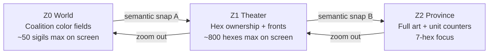
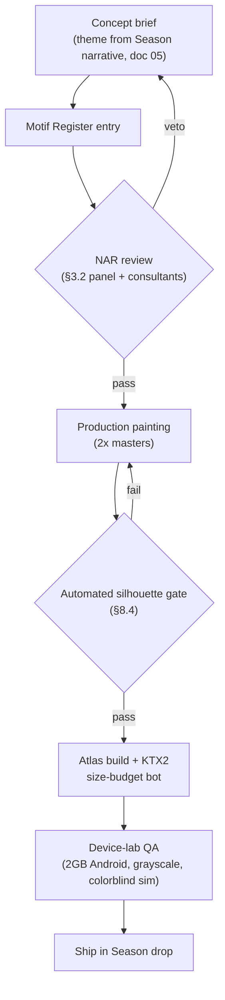

# 08 — Art & UX Direction: Legions of Earth

**Executive summary.** Legions of Earth commits to a single, disciplined visual identity — **the Illuminated Atlas**: a hand-painted-cartography aesthetic in which the world reads like a living campaign map drawn by a master mapmaker, not a photorealistic globe. Every art and UX decision below serves four masters at once: *readability* (a Commander must parse the front line in two seconds on a 5-inch screen), *bandwidth* (the entire first-load art budget is ~1.5 MB inside the game's committed 4.2 MB initial load), *cultural neutrality* (fictional banners with a documented non-appropriation review process — never real nations, ethnicities, or movements), and *worldwide accessibility* (WCAG 2.2 AA, colorblind-safe ownership colors, pre-literacy iconography, RTL and CJK-ready UI, audio as pure enhancement). This document specifies the art direction, map visual hierarchy per zoom level, banner and unit design language, the UI design system ("Ledger"), iconography standards, sound and music direction with size budgets, brand identity, and the production pipeline — including the hard silhouette rules that guarantee paid cosmetics never confuse a combat read. Technical delivery constraints trace to `04-technical-architecture.md`; accessibility requirements to `09-onboarding-retention-accessibility.md`; localization mechanics to `07-localization-and-i18n.md`.

---

## 1. Art direction: the Illuminated Atlas

### 1.1 The commitment

One style, stated once, enforced everywhere: **illuminated cartography** — the game world is presented as a beautifully painted strategic map, in the lineage of medieval portolan charts, Mughal and East Asian painted scrolls, and the hand-tinted campaign maps of 19th-century atlases, unified into an invented cartographic tradition that belongs to no single real culture.

In words, the mood is: *parchment warmth under lamplight; ink lines with confident weight; terrain rendered as painterly washes rather than textures; mountains drawn as stylized ridge-strokes, forests as clustered canopy marks, rivers as silvered ink threads; military presence shown as crisp heraldic counters and banner pins standing proud of the map surface, casting soft drop shadows as if physical pieces on a table.* The fantasy is that 15,000 concurrent Commanders are leaning over the same enormous war table. When something burns, we don't render fire — we scorch the map. When a Legion takes a Province, its banner color floods the hex like wet ink settling into paper.

Three formal rules define the style:

1. **Map-first, diegetic-second.** The world *is* a map. Units, Strongholds, and supply lines are map notations (counters, sigils, dotted routes), not simulated 3D objects. This is an aesthetic choice and a performance choice: notation is cheap to draw, cheap to ship, and instantly legible.
2. **Two-layer depth model.** Layer A is the painted terrain (flat, atlas-textured, rarely animated). Layer B is the "pieces" layer (banners, counters, UI pins) with consistent lighting from top-left and a single shared shadow treatment. Nothing else gets depth. This keeps the renderer to two sprite batches per tile region (see `04-technical-architecture.md`).
3. **Ink defines, color fills.** Every gameplay-meaningful shape has a dark ink outline (minimum 1.5 physical px at gameplay zoom). Color is always redundant with line, shape, or pattern — the game must be playable in grayscale (tested every milestone; see §5.4).

### 1.2 Why this style wins (and what lost)

| Candidate style | Verdict | Why |
|---|---|---|
| **Illuminated Atlas (painted cartography)** | **Committed** | Peerless readability at strategy scale; tiny texture footprint (washes + line art compress brutally well in KTX2/WebP); ages gracefully; culturally composite by design; distinctive in screenshots — a marketing asset (`11-marketing-community-gtm.md`). |
| Stylized low-poly 3D globe | Rejected | 3–5× the asset and GPU budget; weak on 2019-era 2 GB Android devices; terrain spectacle competes with strategic information; harder to keep culturally neutral (3D architecture reads as *somewhere real*). |
| Pixel art | Rejected | Cheap and small, but reads as retro-nostalgic to a primarily Western audience; poor scaling across the DPR range (1.0–3.5) of a worldwide device fleet; cramped for 20+ language UI. |
| Flat minimal vector ("board-game app" look) | Rejected | Excellent readability but emotionally cold; fails the "world that notices you" fantasy; hardest style in which to sell cosmetics, which carry the business model (`06-economy-and-monetization.md`). |

### 1.3 Reference palette and materials

The base world palette is deliberately narrow so faction colors own the saturated range:

- **Ground:** warm parchment neutrals (`#EFE6D2` to `#C9B896`), biome washes desaturated to ≤ 45% chroma of their natural hue (steppe gold, forest deep-green, desert ochre, highland slate, coast teal, tundra bone-white, jungle viridian — biome gameplay meaning per `02-world-map-and-seasons.md`).
- **Ink:** near-black warm sepia (`#2B2118`), never pure black in light theme.
- **Water:** the one indulgence — a slow, cheap two-frame shimmer on a tiling normal-free shader, disabled in data-saver mode.
- **Faction range:** 12 reserved high-saturation ownership hues (§5.4). No environmental art may use these hues at ownership-level saturation. This single rule does more for map readability than any other.

---

## 2. Map visual hierarchy across zoom levels

Readability beats spectacle at every zoom. With ~48,000 land Provinces on one persistent Earth, the cardinal sin is showing everything at once. Each zoom tier answers exactly one strategic question, and detail *replaces* rather than accumulates.

| Tier | Camera scope | The question it answers | Visible | Deliberately hidden |
|---|---|---|---|---|
| **Z0 — World** | Whole Earth, ~1 screen | *"How goes the war?"* | Continents as parchment masses; Coalition-level territory as soft ink-wash color fields (Provinces aggregated into blobs); capital Strongholds of the top ~50 Legions as sigil pins; active Clash Window sites as pulsing ring markers; Season event sites | Individual Provinces, units, supply lines, minor Strongholds, all labels below continent scale |
| **Z1 — Theater** | ~1 continent / 300–800 Provinces | *"Where is my front, and is it safe?"* | Individual hexes with ownership fill + pattern; front lines auto-inked as heavier contested borders; Strongholds and supply lines (dotted ink routes) of the viewer's Legion and Coalition; aggregate force markers (one counter per stack, size-banded 1/2/3 pips); biome as muted wash | Individual units, buildings, resource details, enemy supply lines (unless scouted — see `01-game-design-document.md`), decorative terrain marks |
| **Z2 — Province** | 1 Province + 6 neighbors | *"What do I do in my five minutes?"* | Full painted hex art; buildings as illuminated vignettes; individual warband counters with archetype icons (Shieldline, Skirmishers, Riders, Engineers, Wayfinders); garrison strength; timers; interactable objects with pre-literacy affordance glows | Everything beyond the 7-hex neighborhood fades to Z1 rendering under a vignette — focus is enforced, and so is draw-call count |

Transitions are continuous pinch/scroll zoom with two hard "semantic snap" thresholds where notation swaps (crossfade ≤ 200 ms, no parallax flourishes — flourishes cost battery and 3G goodwill). The renderer streams Z2 art per-region on demand; Z0/Z1 ship in the initial load (§8.1).

Two supporting principles:

- **The front line is the hero.** At Z1 the contested border is the highest-contrast element on screen: a doubled ink stroke with alternating faction ticks. Players' eyes must land there before anywhere else. Eye-tracking validation in beta (Tobii sessions, 30 participants across 6 countries, run with the FTUE studies in `09-onboarding-retention-accessibility.md`).
- **Label discipline.** Province names (invented toponyms, per cultural-neutrality policy) appear only at Z2 and only for the focus neighborhood; Legion names at Z1 only for pinned/allied entities. Fonts are the Noto family for full script coverage (`07-localization-and-i18n.md`); label layout uses per-script line-height metrics so Thai, Devanagari, and Arabic never clip.

---

## 3. Banner and unit design language

### 3.1 Mythic-historical, deliberately composite

All faction identity is fictional (anchor doc §4.3). The design language for banners, sigils, unit counters, and Stronghold styles draws on **broad, blended mythic-historical inspiration**: heraldic geometry, knotwork, tessellation, calligraphic flourish, animal-form abstraction — recombined so that no asset is traceable to one real culture, nation, or living tradition. House style rule of thumb: **every shipped motif must cite at least three source traditions in its design notes, or be pure invention.** A "Tidewalkers" banner may combine a wave-form abstraction, a compass-rose geometry, and an invented knot — it may not be *a recognizable Māori koru*, *a specific clan mon*, or *anything on a real flag*.

### 3.2 The Non-Appropriation Review (NAR) — a documented process

Every player-facing motif (banner elements, sigils, cosmetic sets, Stronghold architecture styles, music themes, emotes) passes NAR before entering the art pipeline proper:

1. **Motif Register entry.** The artist logs the concept in the shared Motif Register (a structured Airtable base) with reference images, named source traditions, and the blend rationale.
2. **Hard-exclusion screen (checklist, self-serve).** Automatic rejection for: real flags, emblems, or their color-order combinations; sacred or ceremonial items of living religions and closed practices (e.g., war bonnets, specific liturgical objects); symbols with hate or extremist usage history (checked against ADL Hate Symbols Database and internal T&S list per `10-security-anticheat-trust-safety.md`); real military insignia past or present; caricatured ethnic physiognomy anywhere, ever.
3. **Panel review.** A standing 3-person panel (art director + narrative lead + rotating regional reviewer) reviews weekly; majority passes, any single **veto is final** and documented.
4. **External cultural consultation.** For any motif whose register entry names a specific tradition, a paid external consultant from that region reviews it (network of 8–10 consultants retained through the localization vendor relationships in `07-localization-and-i18n.md`; budget in `13-roadmap-team-budget.md`). Consultants can pass, request changes, or veto.
5. **Seasonal retro-audit.** Once per Season, 10% of live cosmetics are re-sampled for audit; community reports (in-client "report content" flow) feed the same queue with a 72-hour SLA.

The same hard-exclusion list backs the *player-generated* banner creator: Legions assemble banners from a pre-cleared library of **40 patterns, 120 emblems, and 24 palettes** (~184 elements; library scope per `03-legions-social-and-diplomacy.md`), delivered as procedural SVG layers rather than bitmap sheets (delivery per `04-technical-architecture.md`) — free-drawing is not offered at launch precisely so every combinable element has passed NAR. Name-level enforcement (no real countries, ethnic groups, political movements) is specified in `10-security-anticheat-trust-safety.md`.

### 3.3 Silhouette-first unit design

The five warband archetypes must be distinguishable **by silhouette alone, at 24×24 physical pixels, in grayscale**. Each archetype owns one exclusive silhouette signature and one exclusive icon geometry:

| Archetype | Silhouette signature | Counter icon geometry | Never allowed on any other archetype |
|---|---|---|---|
| Shieldline | Wide, low, rectangular mass | Solid square/tower-shield form | Broad flat top edge |
| Skirmishers | Loose triple-point scatter | Three chevrons | Scatter grouping |
| Riders | Strong diagonal sweep | Diagonal lance/arrow | Dominant diagonal axis |
| Engineers | Vertical rig/scaffold spike | Gear-and-frame | Tall asymmetric spike |
| Wayfinders | Slender arc with pennant | Open compass arc | Trailing pennant curve |

These signatures are contractual: cosmetics may restyle *within* them, never across them (§8.4). The same discipline applies to Strongholds (always the tallest, most ornate object in any hex) and supply lines (always a dotted ink route with directional ticks — pattern-coded, not just color-coded, for colorblind Commanders).

---

## 4. Iconography for universal comprehension

A worldwide, partially pre-literate, 20+-language audience means the icon system must carry meaning *before* text does; labels reinforce, never rescue.

**Design standards.**

- **Concrete over abstract.** Depict the object or the action's result, not a metaphor: *training* is a figure with a raised weapon, not an hourglass; *treasury* is coins, not a piggy bank (culturally narrow); *repair* is a hammer on a cracked wall, not a wrench (workshop connotation varies).
- **Banned metaphor list** (maintained with `07-localization-and-i18n.md`): hand gestures of any kind (thumbs-up, OK, pointing hands vary from friendly to obscene across regions), owls (wisdom in Europe, ill-omen elsewhere), pigs, dogs, skulls for "danger" in youth-facing surfaces, red crosses (protected emblem — legal issue, see `12-legal-compliance-privacy.md`), traffic signage conventions, checkmarks as the *sole* success signal (paired with color + motion instead).
- **Geometry:** 24 px grid, 2 px stroke, single-weight line matching the game's ink; filled state = selected/active; every icon must survive 1-bit rendering.
- **Color is never the only channel.** Danger = jagged shape + icon + color; success = laurel motif + icon + color.

**Comprehension testing, not opinion.** Every icon in the core loop ships only after an **ISO 9186-style comprehension test**: unlabeled icon shown to ≥ 100 respondents per major market via Lyssna (remote panels across ≥ 8 countries including Brazil, India, Indonesia, Nigeria, Egypt, Japan, Germany, Mexico), open-ended "what does this do?" response, **≥ 66% correct-intent threshold** to pass; failures are redesigned, not relabeled. Budget: two test waves pre-launch, one per Season thereafter (`05-liveops-content-and-analytics.md` owns the panel tooling).

**Labels as reinforcement.** All interactive icons carry text labels by default (Comfortable density); labels may collapse to icon-only in Compact density *only* for icons that passed comprehension testing at ≥ 80%. Tooltips/long-press reveals exist everywhere. Screen-reader names are mandatory and localized (`09-onboarding-retention-accessibility.md`).

---

## 5. The "Ledger" UI design system

The UI shell (React over the PixiJS-class canvas, per `04-technical-architecture.md`) is built on one design system, named **Ledger** — the visual conceit is the campaign ledger and dispatch papers that accompany the war table: paper panels, ink rules, wax-seal accents used sparingly for celebration moments.

### 5.1 Tokens

Single source of truth in Figma, exported through **Tokens Studio → Style Dictionary** to CSS custom properties and TypeScript constants; the build fails if a component references a raw value.

| Token group | Spec |
|---|---|
| Spacing | 4 px base scale: 4/8/12/16/24/32/48; all layout in `rem`-equivalents so OS font scaling works |
| Type | Noto Sans (UI) + Noto Serif Display (ceremonial headers) subsets per locale (`07-localization-and-i18n.md`); scale 12/14/16/20/24/32 with per-script line-height overrides (CJK 1.7, Thai 1.8, Latin 1.5) |
| Radius | 2 px (paper), 8 px (cards), full (pins/avatars) |
| Elevation | Exactly 3 levels: map surface / paper panel / modal; one shared shadow token per level |
| Color | Semantic tokens only (`surface`, `ink`, `accent`, `positive`, `warning`, `danger`, `faction-01…12`); components never reference hex values |
| Motion | 3 durations (120/200/320 ms), one easing family; all motion honors `prefers-reduced-motion` |
| Touch targets | ≥ 44×44 px minimum, ≥ 48 px for combat-consequential actions |

### 5.2 Core component set (launch scope, ~40 components)

Buttons (primary/secondary/destructive/ghost), icon button, paper panel, card, list row, tab bar, bottom sheet (the primary mobile container), modal, toast/dispatch banner, timer chip, progress bar, resource counter, unit counter, banner renderer, avatar/sigil, map pin, tooltip/long-press reveal, form inputs, segmented control, stepper, chat message (with translation state per `03-legions-social-and-diplomacy.md`), leaderboard row, Warpath Pass track node, empty state, skeleton loader, confirmation dialog (mandatory for any spend or irreversible order — see `06-economy-and-monetization.md` and `12-legal-compliance-privacy.md`).

Storybook is the living contract; every component ships with RTL, CJK, long-string (German/Finnish +35% expansion), dark/light, and reduced-motion stories before merge.

### 5.3 Mobile-first layouts and density modes

Design starts at **360×640 px** (the dominant low-end Android viewport) and scales up; desktop is an enhancement, not the baseline. The map owns the full viewport; UI lives in a bottom sheet (three detents: peek 96 px / half / full) plus a slim top status bar. Thumb-zone rule: all high-frequency actions within the bottom 40% of the screen.

Two density modes, user-switchable:

- **Comfortable (default):** labels on, generous spacing, one primary action per view.
- **Compact (opt-in, default-on for ≥ 1024 px wide):** tighter spacing, icon-only where tested (§4), multi-panel desktop layout with map + side ledger.

**Data-saver mode** (also a UX mode, not just a network flag): disables water shimmer, ambient animation, and cosmetic VFX; swaps Z2 painted art for the flat notation renderer. Target: fully playable at GPRS-era throughput, per the anchor's 3G requirement.

### 5.4 Themes and color accessibility

- **Light theme ("Daylight Ledger"):** parchment surfaces, sepia ink — the flagship look.
- **Dark theme ("Lamplight Ledger"):** deep slate-brown surfaces (`#1E1915` range), bone-ink text, identical semantic token mapping; the *map* keeps its parchment identity but drops luminance ~20% so panels don't glow. Default follows OS `prefers-color-scheme`.
- **Faction colors:** 12 ownership hues selected and maintained with the Viz Palette / Colorgorical toolset for deuteranopia, protanopia, and tritanopia separation, *and* every ownership fill carries a unique subtle pattern (hatching, stipple, weave) so ownership survives grayscale. Colorblind simulation runs in CI on golden screenshots each release.
- Text contrast ≥ 4.5:1 everywhere (WCAG 2.2 AA), ≥ 3:1 for large ceremonial type; full accessibility program in `09-onboarding-retention-accessibility.md`.

---

## 6. Sound and music direction

### 6.1 Principles

1. **Audio is enhancement, never requirement.** Every audio cue has a visual twin; the game is 100% playable muted (most sessions on buses and in classrooms will be). No gameplay information is audio-exclusive — this is both an accessibility rule and a worldwide-context rule.
2. **A global palette, an invented tradition.** The score avoids planting a flag in any one musical culture. Instrumentation is a deliberately mixed ensemble: frame drums and large ensemble percussion; low bowed strings (cello section, hurdy-gurdy drone class); end-blown and low transverse flutes; brass swells for Clash moments; and **wordless voice** — solo and choral vocalise in no real language, our strongest emotional signature with zero localization burden. Regional Season events may *feature* instrument families more prominently, but always inside the blended ensemble, and event themes pass the same NAR panel (§3.2).
3. **Vertical layering over linear tracks.** Music is stem-based (calm / tension / clash layers) crossfaded by map state, so 8 base compositions feel like 30.

### 6.2 Delivery and size budget

Web Audio API via **Howler.js**; all assets lazy-loaded after first interaction, never in the 4.2 MB initial payload. Codec: Opus in WebM (AAC fallback for Safari).

| Category | Spec | Budget |
|---|---|---|
| UI/interaction SFX | ~60 one-shots, mono Opus 32 kbps | ≤ 500 KB total |
| Combat/replay SFX | ~80 one-shots + 10 loops | ≤ 1.2 MB |
| Ambient beds | 6 biome loops, stereo Opus 48 kbps, 60–90 s | ≤ 2.5 MB |
| Music | 8 compositions × 3 stems, streamed on demand, cached via PWA service worker | ≤ 12 MB cached ceiling, ~1.5 MB per active context |
| **Hard ceiling** | Total audio cache on device | **16 MB**, LRU-evicted |

Mix targets: −16 LUFS integrated for music, SFX peaks ≤ −3 dBFS; loudness verified in CI with ffmpeg loudnorm passes. Production in REAPER; a single audio director plus contracted ensemble recordings (budget line in `13-roadmap-team-budget.md`). Haptics (mobile PWA, where supported) mirror only celebration and alarm cues, respecting OS silent switches.

---

## 7. Brand identity

### 7.1 Logo

- **Sigil:** a **laurel-ringed hexagon containing a stylized ink Earth** — the game in one mark: honor (laurel), the hex grid (mechanics), the shared world (Earth). Drawn in the same ink language as the map so product and brand are one continuum.
- **Wordmark:** "LEGIONS OF EARTH" in a customized inscriptional serif (chisel-cut terminals, slightly extended) — monumental but warm.
- The sigil must survive: 16 px favicon, 48 px PWA icon, monochrome single-color print, embroidery. The sigil alone is the app icon; the full lockup is for marketing surfaces (`11-marketing-community-gtm.md`).

### 7.2 Brand palette and voice

- **Palette:** parchment `#EFE6D2`, sepia ink `#2B2118`, laurel gold `#C9A24B` (celebration accent, used sparingly so it stays special), oath crimson `#8C2F2F` (calls-to-arms only). Faction hues are *game* colors, never brand colors — the brand stays neutral above all banners, exactly as the game stays neutral above all real nations.
- **Tone of voice — "the field dispatch":** epic but plain-spoken; short declarative sentences; second person; concrete verbs; zero idioms, zero pop-culture references, zero irony — because every line survives translation into 20+ languages (`07-localization-and-i18n.md` owns the terminology base and voice glossary). Example register: *"The Tidewalkers hold the strait. Your Legion marches at dawn — your dawn, wherever you are."* Humor is warm and situational, never sarcastic (sarcasm translates worst of all).

### 7.3 How the brand localizes

- The **sigil never changes**; it is the constant across all markets.
- **Localized wordmarks** are commissioned for non-Latin priority scripts — CJK, Arabic (with proper RTL lockup mirroring), Devanagari, Thai, Cyrillic — designed by native-script lettering specialists to carry the same inscriptional character, reviewed through the doc 07 LQA chain. Transliterated names are chosen with negative-meaning checks per market before trademark filing (`12-legal-compliance-privacy.md`).
- Marketing key art uses the map itself and fictional banners — never regionally targeted real-world imagery — so one global campaign kit adapts by language, not by content (`11-marketing-community-gtm.md`).

---

## 8. Production constraints and the cosmetic pipeline

### 8.1 Asset budgets and formats

The committed 4.2 MB initial interactive load is apportioned in a single ledger owned by `04-technical-architecture.md` §2.2 (~3,030 KB allocated in total, including the JS and map-data shares that doc owns). The art-facing allocations below restate that ledger's numbers:

| Asset class | Format | Initial load | Streamed later |
|---|---|---|---|
| Z0/Z1 terrain + ownership + UI atlas | One 1,150 KB 2048² atlas, KTX2 (Basis Universal UASTC→ETC1S), WebP fallback | 1,150 KB | — |
| Core icons + banner elements | Procedural SVG layers: critical line icons plus the full banner library (40 patterns + 120 emblems + 24 palettes, §3.2) | 90 KB | — |
| Font subsets (first locale) | WOFF2, per `07-localization-and-i18n.md` | 260 KB | further subsets on demand |
| Z2 painted region art | KTX2, per-region bundles | 0 | 150–300 KB per region, LRU cache |
| Cosmetics | KTX2 bundles | 0 | ≤ 200 KB per cosmetic set |
| Audio | Opus/WebM | 0 | per §6.2 |

Rules: all raster art authored at 2× and served responsively per device DPR; **TexturePacker** builds atlases in CI; a size-budget bot fails any PR that pushes a bundle over budget; every animation is either sprite-flipbook (≤ 8 frames) or runtime tween — no video, no Lottie in the hot path. Skeletal animation (**Spine**) is reserved for the ceremonial layer only: Hall of Ages monuments, Warpath Pass reveals, victory sequences — never on the tactical map.

### 8.2 Tooling stack (committed)

Figma + Tokens Studio (design system source of truth) → Style Dictionary (token build); Affinity Photo/Designer or Photoshop (painting; artist's choice, PSD/afphoto masters in Perforce-hosted LFS); Blender only as a blockout aid for Stronghold vignettes (final art is always painted); Aseprite for flipbooks; TexturePacker + Basis Universal (`basisu`) in CI; Storybook for UI contract; Chromatic for visual regression on components; custom golden-screenshot diffing for map rendering.

### 8.3 Cosmetic art pipeline

Cosmetics fund the game (`06-economy-and-monetization.md`), so the pipeline is industrialized: target throughput **10–14 cosmetic sets per Season** (the cadence agreed with `06-economy-and-monetization.md`) with a 3-artist cosmetics pod (staffing in `13-roadmap-team-budget.md`).

### 8.4 Silhouette rules: paid skins never confuse a combat read

This is the fairness firewall between monetization and gameplay, enforced by an automated gate plus human QA:

1. **Silhouette lock.** A skinned unit counter's alpha silhouette must overlap its archetype's reference silhouette by **≥ 85% (IoU)** at 24 px gameplay scale, measured automatically in CI on every cosmetic export. The archetype's exclusive signature (§3.3 table) must remain the silhouette's dominant feature.
2. **Faction-color primacy.** Ownership color must cover **≥ 30% of visible counter area** in a contiguous region, always in the same anchor zone (banner field + outline), and cosmetics may never recolor it or lower its contrast against terrain below 3:1.
3. **Scale and footprint lock.** No cosmetic changes a piece's footprint, height band, or z-order. A skinned Shieldline occupies exactly the pixels a default Shieldline would.
4. **VFX containment.** Cosmetic effects (trails, auras, victory flourishes) render only inside the owner's hex, at ≤ 40% opacity over terrain, auto-disabled at Z1 and above, in data-saver mode, and during battle-replay playback. Replays always render *default* skins for both sides unless the viewer opts into cosmetics — a scouting report or replay must be identically informative for a player who has spent nothing.
5. **No stealth, no mimicry.** No cosmetic may make any archetype resemble another archetype's signature, a Stronghold, a neutral object, or terrain. Camouflage is explicitly not for sale.
6. **Grayscale test.** Every cosmetic set ships only after passing the standard grayscale + colorblind-simulation screenshot suite on the 2 GB Android reference device.

Violations found post-ship are patched or withdrawn with compensation per the make-good policy in `06-economy-and-monetization.md`.

### 8.5 Quality gates summary

| Gate | Cadence | Owner |
|---|---|---|
| Token/lint check (no raw values) | Every PR | UI engineering |
| Size-budget bot | Every PR | Build CI |
| Silhouette IoU gate | Every cosmetic export | Build CI |
| Grayscale + colorblind golden screenshots | Every release | Art QA |
| Device-lab pass (2019 2 GB Android, 3G throttle) | Every release | QA (`04-technical-architecture.md` device matrix) |
| Icon comprehension wave (ISO 9186-style) | Pre-launch ×2, then per Season | UX research |
| NAR retro-audit | Per Season | NAR panel |
| Localization visual QA (RTL, CJK, +35% strings) | Per release | LQA (`07-localization-and-i18n.md`) |

---

## 9. What this direction buys us

A Commander on a five-year-old phone in Lagos, a laptop in Warsaw, and a tablet in Manila all see the same war table, read the same front line in the same two seconds, and recognize each other's banners without sharing a language. The Illuminated Atlas is not a decoration strategy — it is the game's information architecture, its bandwidth budget, its cultural-neutrality policy, and its business model's fairness guarantee, drawn in one hand.
