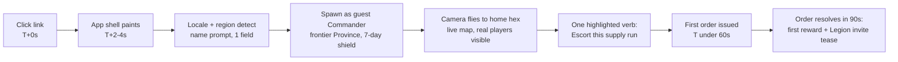

# 09 — Onboarding, Retention & Accessibility: Legions of Earth

**Executive summary.** This document specifies how a stranger anywhere on Earth — on a 2 GB-RAM Android phone, over 3G, in any of 20+ languages — goes from tapping a shared link to issuing a meaningful order in under 60 seconds, joins a Legion by their third session, and settles into a respectful daily rhythm that hits the anchor targets of **D1 ≥ 40% / D7 ≥ 18% / D30 ≥ 8%** without a single dark pattern. It covers the guest-first FTUE and progressive registration, the three-session learn-by-doing tutorial, retention and comeback loops built around Season structure rather than streak anxiety, opt-in PWA push and email digests with regional sensitivity, data-saver and lite-map modes with an explicit device test matrix, a WCAG 2.2 AA accessibility program (colorblind-safe patterned map palettes, full screen-reader navigation, zero reflex gameplay), and a standing regional playtesting program. Instrumentation event names are defined here; pipelines, dashboards, and experimentation live in `05-liveops-content-and-analytics.md`.

---

## 1. Design stance

Three commitments govern everything below, derived from the pillars in `00-vision-and-concept.md`:

1. **The link is the install.** Distribution is a URL. Every second and kilobyte between click and first order is churn. Budget: **< 5 MB / < 10 s interactive on 3G**, first meaningful order **< 60 s** from click.
2. **Retention through belonging, not obligation.** The anchor's core fantasy is *belonging to something enormous that notices you*. Our retention engine is the Legion and the Season arc — not streaks, not FOMO timers, not loss-framed nags. If a mechanic would make a player feel punished for sleeping, it is cut.
3. **Accessibility is a market, not a checkbox.** Colorblind players are ~5% of a 5M-account target (≈250k people). Low-end Android is the majority device class in half our target countries. WCAG 2.2 AA and the low-end path are launch gates, owned in this doc, verified by the regional playtesting program.

---

## 2. FTUE: click to first order in under 60 seconds

### 2.1 The critical path

The FTUE is engineered backwards from one moment: **the player's first supply run order visibly moving on the shared map**. Everything before it is on a stopwatch.



Concrete budget on the reference low-end device (see §6.5), 3G Fast profile (1.6 Mbps, 150 ms RTT):

| Step | Payload | Time budget (cumulative) |
|---|---|---|
| App shell (HTML + core JS + UI CSS) | 900 KB gz | 4 s |
| Home-region map chunk (own hex + 2 rings, vector) | 250 KB | 6 s |
| Locale pack (player's language only) | 120 KB | 6.5 s |
| Guest session create (1 HTTPS round trip) | 2 KB | 7 s |
| Spawn cinematic (procedural camera move, no video) | 0 KB | 12 s |
| Name entry + one-tap "Deploy" | — | 25–40 s |
| First order tap (pre-highlighted supply escort) | 1 KB | **45–60 s** |

Rules that keep this honest:

- **No launcher, no interstitial, no video.** The spawn moment is a camera move over live map data — cheaper than any MP4 and it proves the world is real (other Commanders' orders are visibly moving).
- **One input field before play**: Commander name, pre-filled with a culturally neutral generated name (e.g., "Commander Vael-73") the player can accept with one tap and change later. No email, no password, no age wall beyond the lightweight neutral age gate specified in `12-legal-compliance-privacy.md` (asked at registration, not at guest start, except in jurisdictions where doc 12 requires it earlier).
- **Language is auto-detected** from `Accept-Language` with a one-tap override on the name screen. All 20+ launch languages are selectable before any tutorial text appears (`07-localization-and-i18n.md`).
- **The first order is real.** The supply run the player escorts is an actual convoy on the actual Shard, seeded by the spawn system into a low-risk frontier corridor. New players contribute to the shared world from minute one — no sandboxed fake tutorial map. New-player protection (7-day shield, low-conflict frontier spawn) comes from `00-vision-and-concept.md` §4.4.

### 2.2 Guest accounts and progressive registration

**Guest-first is a hard requirement.** Every friction study of link-distributed web games points the same way: identity walls before play are the single largest funnel killer, and in our lowest-bandwidth markets many players have no email they check.

- A **guest Commander** is a full account keyed to a device credential (WebAuthn-backed random credential where available; signed localStorage token fallback). Guests can do everything except: hold Legion officer rank, trade on the regional market above a small cap, and make purchases.
- **Progressive registration** upgrades the guest in place — same Commander, same warband, same history — at *earned* moments, never as an interrupt:
  1. **After the first Skirmish result** (session 1–2): "Save your Commander" card offering one-tap sign-in via Google, Apple, or email magic link; **phone-number OTP** offered in regions where email penetration is low (aggregator selection in `06-economy-and-monetization.md`). Dismissible; re-offered at the next milestone, max once per session.
  2. **On accepting a Legion invite** (session ~3): registration required here, framed as "Your Legion needs to be able to find you" — the one wall in the flow, placed where motivation peaks.
  3. **On first purchase intent**, per `12-legal-compliance-privacy.md`.
- Guest accounts idle > 60 days with < 10 minutes total play are purged per doc 12's retention schedule; a returning credential re-spawns cleanly.
- Target conversion: **≥ 55% of D7-retained guests registered; ≥ 90% of Legion members registered** (structural, via rule 2).

**Alternative considered and rejected:** mandatory registration up front (cleaner analytics identity, easier anti-multiboxing). Rejected because the funnel cost (industry-typical 25–40% drop at pre-play signup walls) dwarfs the analytics benefit, and `10-security-anticheat-trust-safety.md` handles multi-account risk with device/behavioral signals that work on guests too.

### 2.3 First-session flow, step by step (target 6–9 minutes)

| Min | Beat | Player learns | Instrumentation event |
|---|---|---|---|
| 0–1 | Click → name → spawn → **escort supply run** | The map is alive; one tap = one order | `ftue_spawn`, `ftue_first_order` |
| 1–3 | Convoy travels; player pans map, sees Province tooltips, front lines, other Commanders | Reading the map; supply lines exist | `ftue_map_pan`, `ftue_province_inspect` |
| 3–4 | Convoy arrives; reward (timber + silver); prompt to **queue first unit** (Wayfinder, 4-min timer) | Timers are real-time; queueing works offline of the session | `ftue_first_train` |
| 4–6 | **Scout order** on adjacent hex; report returns with a visible nearby Legion's territory painted | Scouting; Legions hold land; you are near giants | `ftue_first_scout` |
| 6–8 | "Save your Commander" card (skippable); **session summary**: what your 7 minutes did for the region | 5 minutes matter; clean exit point | `reg_prompt_shown`, `session_summary_shown` |
| 8–9 | Optional: set one **standing order** ("keep escorting this route while I'm away") | Async play; a reason to return | `ftue_standing_order` |

The session ends with an explicit, satisfying stopping point — a summary screen, not a cliffhanger. Respecting the exit is pillar 3 and, per §4, our anti-dark-pattern stance.

---

## 3. Tutorial: three sessions, learn by doing

There is no tutorial "mode." There is a **Muster Path** — a visible 12-step checklist (progress bar in the top bar, collapsible) whose steps are real actions on the real Shard. Every step grants resources sized to matter in week 1 and be trivial by week 3. Text per step: ≤ 140 characters source English, written for translation (`07-localization-and-i18n.md` glossary terms only).

**Session 1 — "You exist"** (covered in §2.3): first order, first training, first scout, standing order. Ends ≤ 10 minutes.

**Session 2 — "You matter"** (typically day 1–2, often triggered by the first re-entry notification, §5):
- Collect the overnight result of the standing order — the **first supply run completed while absent** is the emotional payload: the world worked for you while you slept.
- **First Skirmish**: the Muster Path directs the player to intercept a low-strength raider band (spawn system guarantees one within range, tuned to ~80% win rate with the starter warband). The player sets a **Doctrine** from three presets (Hold / Harass / Withdraw at half strength), commits, and watches the deterministic auto-battle replay (~20 s visualization, skippable). Learning: combat is preparation, not reflexes.
- Repair a damaged watchtower on a friendly hex (introduces Engineers and build verbs).
- Sighted but not forced: the **Legion browser** appears in the sidebar with 3 recommended Legions (see below).

**Session 3 — "You belong"** (day 2–4):
- The Muster Path's spotlight step: **Join a Legion**. Recommendation engine ranks open Legions on the player's Shard by: (a) geographic proximity of Stronghold to the player's frontier zone, (b) **time-zone complementarity** — Legions publicly benefit from around-the-clock coverage (anchor §2), so the recommender favors Legions with a coverage gap in the player's active hours, surfaced as "The Tidewalkers need watchers in your hours"; (c) language overlap *or* explicit "multilingual, translation-friendly" flag (chat MT per anchor §5); (d) health signals — activity in last 72 h, officer responsiveness, not near the 100-Commander cap. Mechanics of invites, applications, and Legion onboarding roles live in `03-legions-social-and-diplomacy.md`.
- Players who ignore the prompt are never locked out of anything, but the recommender re-surfaces after each Skirmish with fresh candidates. Solo play remains viable (pillar 2) — the push is persistent, not coercive.
- First **Legion act**: contribute one resource shipment to the Legion treasury and receive the Legion banner on their home hex — visible identity change, screenshot-worthy, shareable (`11-marketing-community-gtm.md`).
- Muster Path completes with a **Hall of Ages preview**: the player's name shown on a mock monument line — "This is where Seasons are remembered. Earn your line."

Target: **≥ 60% of D3-retained players in a Legion by session 3** (KPI defined in `05-liveops-content-and-analytics.md` §8's KPI tree; supports the anchor's ≥ 55%-of-D7-retained social target with headroom).

---

## 4. Retention loops — rhythm without dark patterns

### 4.1 The honest loop

```mermaid
flowchart TD
    subgraph Daily ~5-15 min
      A[Collect async results:\nsupply runs, scouts, timers] --> B[Issue 2-4 new orders\n+ refresh standing orders]
      B --> C[Legion check-in:\nchat, plan board, 1 requested task]
    end
    subgraph Weekly ~1-2 h total
      C --> D[Weekly Muster: Legion objective\nset by officers, Mon-Sun]
      D --> E[Clash Window participation\nwhen your front is called]
    end
    subgraph Seasonal 8 weeks
      E --> F[World-event beats\nweeks 3, 5, 7, per doc 02]
      F --> G[Finale + Hall of Ages\ninduction + reset]
      G --> A
    end
```

- **Daily** value comes from *timers and standing orders maturing* — pull, not push. A 5-minute check-in always yields: collected results, 2–4 meaningful orders, one visible contribution to the Legion's weekly objective.
- **Weekly** structure is the **Weekly Muster**: each Legion's officers pick one objective (take ridge X, bank N stone, keep route Y clean); every member contribution is logged on a shared ledger that names names — the "notices you" fantasy operationalized. Clash Windows (pre-declared, 24-hour, rotation per anchor §4.4) are the peak events; a member who only contributes async supply during the window still appears on the battle honor roll.
- **Seasonal** rhythm and re-entry beats are shared with `05-liveops-content-and-analytics.md` (event calendar) and `02-world-map-and-seasons.md` (reset mechanics).

### 4.2 Streak-free daily design — rationale

We ship **no daily-streak mechanic**: no consecutive-day counters, no streak-loss warnings, no decaying daily chests.

Why committed, not hedged: (1) Streaks convert *intrinsic* return ("my convoy arrived, my Legion needs me") into *loss-avoidance* return, which inflates D7 slightly and poisons D30+ with resentment-quitting — the opposite of an 8-week Season game's need. (2) A worldwide audience spans shift workers, Ramadan fasting schedules, monsoon-season connectivity gaps; punishing a missed day is regressive against exactly the players pillar 4 exists for. (3) Our daily pull (matured timers, Legion ledger) is stronger than a chest.

What exists instead: **Daily Dispatches** — up to 3 rotating micro-objectives ("escort 1 convoy," "scout 2 hexes") granting small resources. They **bank for 3 days** (miss two days, come back to three days' worth, capped) and never reference missed days in UI copy. Warpath Pass progress (doc 06) is likewise earnable at full rate by ~4 sessions/week — no daily-login pass points.

**Prohibited-pattern list** (enforced in design review, mirrored in `12-legal-compliance-privacy.md` for regulatory alignment): streak loss, countdown-pressure purchase timers, "your village is burning" false-urgency notifications, shame copy on lapse ("your Legion gave up on you"), pay-to-skip-frustration loops, appointment mechanics that require a fixed local hour (violates anchor time-zone fairness).

### 4.3 Comeback design for lapsed players

A lapsed Commander (no session in 7+ days) must never return to rubble. Mechanics:

- **Shielded absence:** a warband inactive 7+ days auto-withdraws to the Stronghold; the player loses frontier position, never their units or resources (hoarding decay per anchor §4.6 still applies, capped at 20% for absences ≤ 21 days).
- **Regroup Brief:** on return, a single screen: what your Legion did, what the front looks like now, one recommended re-entry order pre-staged ("The Verdant Pact pushed north — reinforce the Cinder Pass garrison?"). One tap and they are back in the war. No guilt copy; the brief celebrates the Legion's progress and hands the player a role in it.
- **Legion-side tooling:** officers see a (privacy-reviewed, doc 12) "away" flag and can queue a personal welcome-back note that attaches to the Regroup Brief — peer pull beats any system message.
- **Regroup Boon:** returning players get a 24-hour +50% training-speed buff (convenience-class, capped, identical for payers and free players) to rebuild frontline relevance fast.

### 4.4 Season re-entry moments

The structural comeback beats of each 8-week Season, coordinated with `05-liveops-content-and-analytics.md`:

| Week | Beat | Lapsed-player hook |
|---|---|---|
| 3, 5, 7 | World-event beats (weeks set by `02-world-map-and-seasons.md`; anchor §4.5 narrative arc) | Map incentives redrawn — old defeats stop mattering; one comeback push + email digest per beat |
| 6 | **Muster Call**: finale scoring preview | "Your Legion is 4th in the region — the finale is winnable"; Legions actively recruit returners for coverage hours |
| 8→0 | Reset + Hall of Ages induction + new-Season frontier | The great equalizer: everyone starts even; strongest single re-acquisition moment of the cycle |

The Season reset is our structural answer to the genre's biggest churn driver (snowballing leaders). Every 8 weeks the game is *winnable again for everyone*, and the Hall of Ages converts last Season's play into permanent identity — the reason the reset feels like legacy, not loss.

---

## 5. Notifications: push, email, and regional norms

### 5.1 Principles

- **Everything is opt-in.** No permission prompt at first load — browser push prompts fired cold are declined 80%+ and burn the one-shot browser permission. We ask **in context**, after the player creates something worth hearing about: first standing order → "Want a ping when your convoy arrives?"; Legion join → "War alerts from your Legion?"
- **Per-category toggles** from day one: Order results · Legion & Coalition alerts · Clash Windows · Season events · Digest. Default frequency cap: **max 2 pushes/day, hard cap 4** (Clash defense alerts may exceed the soft cap, never the hard cap). All copy localized, no false urgency (§4.2 list).
- **Quiet hours by default:** 22:00–08:00 local (device timezone), user-adjustable; Clash-defense alerts may override only if the player explicitly enables "wake me for war."

### 5.2 Channels

| Channel | Stack | Use |
|---|---|---|
| **PWA Web Push** | Standard Web Push (VAPID) via service worker; works on Chrome/Firefox/Edge Android and desktop; iOS Safari 16.4+ requires Home-Screen install — the FTUE offers "Add to Home Screen" after session 2 on iOS with this framing | Order results, Legion alerts, Clash Windows |
| **Email** | Transactional + digest via **Braze** (customer-engagement platform; chosen over Iterable for stronger regional deliverability tooling and over in-house for time-to-launch — revisit in-house at scale per `13-roadmap-team-budget.md`) | Magic-link auth, weekly digest, Season beats, comeback |
| **In-game inbox** | Own stack, source of truth | Everything; push/email deep-link into it |

### 5.3 What is worth notifying about

Send: convoy/scout results the player explicitly subscribed to; training queue empty **and** player set "tell me"; Legion officer @-mentions and war declarations touching the player's front; Clash Window scheduled/starting on the player's front; Weekly Muster result; the three Season beats (§4.4). **Never** send: generic "we miss you," promotional pushes for purchases, or anything a player didn't cause or subscribe to. The weekly **email digest** (opt-in at registration, one checkbox, unchecked by default in GDPR-class regions per doc 12) is a Legion-centric recap: front-line map thumbnail, your contributions on the ledger, next Clash Window in *your local time*.

### 5.4 Regional sensitivity

- **Send-time optimization** per user's observed active hours, not region defaults; Braze handles the delivery-time modeling.
- **Channel mix by region:** email digests underperform in markets where email is not a daily habit (much of South/Southeast Asia, Sub-Saharan Africa) — there, PWA push + Home-Screen install is the primary channel and the FTUE weights the install prompt earlier. We deliberately do **not** integrate WhatsApp/Telegram/LINE messaging at launch (consent complexity, platform policy volatility); Legions self-organize on those platforms and deep links support them (`03-legions-social-and-diplomacy.md`, `11-marketing-community-gtm.md`).
- **Cultural calendar awareness:** notification pacing respects the global-holidays calendar in `05-liveops-content-and-analytics.md` — e.g., reduced pinging during major regional observances, festival-timed events framed by the neutral in-fiction calendar, never by real-world religious/national labels (anchor cultural-neutrality rule).
- Consent records, unsubscribe latency (< 24 h), and per-jurisdiction rules (e.g., email opt-in defaults) per `12-legal-compliance-privacy.md`.

---

## 6. Low-end and low-bandwidth support

### 6.1 Performance tiers

The client self-selects a tier at first load (device memory API, GPU probe, effective connection type) and the player can override in Settings. Full renderer architecture in `04-technical-architecture.md`; art implications in `08-art-and-ux-direction.md`.

| Tier | Trigger | What changes |
|---|---|---|
| **Full** | ≥ 4 GB RAM, WebGL2, 4G/WiFi | All effects, animated map layers, live troop movement interpolation |
| **Lite Map** | 2–3 GB RAM or weak GPU | Canvas-2D fallback renderer; static banners; movement shown as path arrows updated on a 5 s tick; particle effects off; target 30 fps stable on the 2019 baseline device |
| **Data Saver** | 2G/3G detected, Save-Data header, or manual | Everything in Lite, plus: map tiles as vector deltas only, no ambient audio download, battle replays as 2–6 KB deterministic order logs rendered locally (anchor §7 determinism), image assets at 0.5× resolution, poll-based updates replacing the WebSocket live layer |

Data budget in Data Saver: **< 5 MB first load (anchor requirement), < 150 KB per 5-minute session thereafter, < 3 MB per week for a daily player.** These are release-gate numbers measured in CI via throttled Lighthouse runs and on-device WebPageTest agents.

### 6.2 2G/3G behavior and offline order queueing

The async-first design (anchor §4.2) means the game is *structurally* tolerant of bad networks; the client makes that explicit:

- **Optimistic order queue:** every order is written to IndexedDB first, rendered as "queued" (distinct visual state, accessible label), then synced. On flaky connections the player keeps issuing orders; the service worker background-syncs when connectivity returns. Orders carry client timestamps; the authoritative server resolves on arrival order with a fairness window (details in `04-technical-architecture.md`); conflicts (e.g., target hex flipped while offline) return a plain-language rejection with a one-tap re-target.
- **Read-only offline mode:** the last-synced map state, Legion plans, and inbox are cached; opening the PWA in a tunnel shows the world as of last sync with a clear "as of 14 min ago" banner — never a dead screen.
- **2G floor:** on 2G (EDGE-class) the target is degraded-but-usable: text UI, own-region map only, order queueing functional. We commit to "playable" on 3G (anchor) and "operable" on 2G.
- **Reconnect etiquette:** no full reloads on reconnect; delta sync only. A session dropped mid-order never double-issues (idempotency keys on every order).

### 6.3 Device test matrix

Representative devices, refreshed every 6 months, physically present in the playtesting program (§8) and mirrored in a BrowserStack/AWS Device Farm cloud pool for CI:

| Class | Device (year) | RAM | Primary regions | Network profile tested |
|---|---|---|---|---|
| Floor | Samsung Galaxy A10s (2019) | 2 GB | Nigeria, Kenya, Bangladesh, Pakistan | 2G EDGE, 3G |
| Low | Xiaomi Redmi 9A (2020) | 2 GB | India, Indonesia, Brazil | 3G, throttled 4G |
| Low | Tecno Spark 8C (2022) | 2 GB | West/East Africa | 3G |
| Mid | Redmi Note 11 (2022) | 4 GB | India, SEA, LATAM, MENA | 4G |
| Mid | Samsung Galaxy A34 (2023) | 6 GB | EU, LATAM, Turkey | 4G/WiFi |
| Mid | iPhone SE (2022) | 4 GB | US, JP, EU | 4G/WiFi (Safari/WebKit gate) |
| High | Pixel 8 (2023) | 8 GB | US, EU, KR | WiFi |
| High | iPhone 15 (2023) | 6 GB | US, JP, KR | WiFi |
| Desktop | 2018 i3 laptop, integrated GPU | 8 GB | Global; internet cafés (SEA, LATAM) | WiFi, throttled |

Release gate: the FTUE §2.1 stopwatch must pass on the **Floor** device over the 3G profile; Lite Map must hold 30 fps on **Low**; no release ships that regresses the Floor path.

**Alternative considered:** native app wrappers at launch for low-end performance. Rejected: store distribution contradicts link-first virality and adds 30% platform fees to doc 06's model; the anchor allows wrappers later.

---

## 7. Accessibility: WCAG 2.2 AA as a launch gate

Target: **WCAG 2.2 AA conformance for the full player-facing product** (game UI, map interactions, account flows, help), audited pre-launch and each major release. Ownership: a named accessibility lead in the UX team (`13-roadmap-team-budget.md`); visual standards shared with `08-art-and-ux-direction.md`.

### 7.1 Colorblind-safe map with patterns

- Faction/territory identity is **never encoded by hue alone** (WCAG 1.4.1). Every Legion banner color is paired with a **pattern** from a 12-pattern library (stripes, crosshatch, dots, chevrons, waves, etc.) rendered as territory fill texture and border style. Pattern assignment is automatic and unique within any visible map neighborhood.
- The base palette is built for deuteranopia/protanopia/tritanopia separability (verified with simulation tooling in the design pipeline) with a **high-contrast map mode** (4.5:1 minimum on all map text, 3:1 on territory boundaries) and a **monochrome + pattern** mode as the extreme fallback.
- Supply-line status (healthy/threatened/cut — the game's most consequential signal) uses color + line style (solid/dashed/broken) + iconography, and is announced in text in Province tooltips.

### 7.2 Screen-reader navigation

- **All menus, chat, inbox, Legion management, market, and settings are native accessible DOM** (React UI shell per anchor §7): semantic landmarks, correct roles/names/states, focus management on route changes, `aria-live` for order results and chat (polite) and Clash alerts (assertive).
- **The map itself** gets a parallel **Grid Navigator**: arrow-key/swipe hex-by-hex traversal with each Province announced as structured text ("Cinder Pass. Highland. Held by the Tidewalkers. Supply: healthy. Your garrison: 40 Shieldline."), plus a filterable **list view of every map entity** (my units, my Provinces, frontline hexes, active orders) from which every order can be issued. Every game action available by pointer is available by keyboard and screen reader — this is the acceptance criterion, tested per §7.5.
- Tested against NVDA + Chrome (Windows), VoiceOver (macOS/iOS), and **TalkBack (Android)** — weighted heaviest, matching our device mix.

### 7.3 Motor accessibility

- **No reflex gameplay exists** — anchor §4.2 makes combat deterministic and asynchronous, so the genre's usual motor barriers are absent by design. We protect this: no QTEs, no drag-only interactions (every drag has a tap-tap alternative, WCAG 2.5.7), no hover-only information (2.1.1/1.4.13), target sizes ≥ 24×24 CSS px with ≥ 44 px for primary actions.
- All timers that expire (e.g., Clash Window contribution) are ≥ hours-long by design; the few short UI timeouts (undo toasts) are extendable (2.2.1).
- Full remappable-keyboard play on desktop; single-switch traversal works via the Grid Navigator's linear mode.

### 7.4 Cognitive load

- **Progressive disclosure:** the Muster Path gates UI complexity — market, diplomacy, and coalition layers unlock as they become relevant, and each unlock is one screen with one job.
- **Plain-language mode** (settings toggle): strips flavor prose from all functional text; sentence length capped; numbers over narrative. Localizes cleanly because it draws from the same string table with a `plain` variant (`07-localization-and-i18n.md`).
- **Reduced-motion mode** honors `prefers-reduced-motion` (camera flights become cuts, replays default to summary text).
- **Session summary + Regroup Brief** (§2.3, §4.3) double as memory aids: the game always tells you where you left off and what one thing to do next. No mechanic ever requires remembering hidden state.
- Reading level target for functional UI text: CEFR B1 in source English, which also lowers translation cost and error rates.

### 7.5 Testing plan

| Layer | Tool/method | Cadence |
|---|---|---|
| Automated | axe-core in component CI + Playwright a11y suite on the 20 core flows | Every PR |
| Manual expert | Internal a11y lead heuristic pass on new features | Per feature |
| Assistive-tech scripts | NVDA/VoiceOver/TalkBack scripted runs of FTUE, order issuing, Legion join, purchase | Per release |
| External audit | Third-party WCAG 2.2 AA audit (e.g., Deque or TPGi) | Pre-launch + every 2 Seasons |
| Players with disabilities | Paid panel (≥ 12 players: screen-reader, low-vision, colorblind, motor, cognitive) inside the §8 program | Every Season |

Accessibility bugs at "blocks a WCAG A/AA criterion on a core flow" severity are release blockers, same class as data loss.

---

## 8. Regional playtesting program

A standing program, not a pre-launch event — because the FTUE and low-end path degrade silently as features accrete.

- **Structure:** 6 regional cells — Lagos (West Africa), Nairobi (East Africa), São Paulo (Brazil/LATAM), Jakarta (SEA), Delhi (South Asia), Warsaw (CEE, doubling as EU/RTL-adjacent QA partner with an Arabic-language remote cohort in Cairo). Each cell: a contracted local research partner, 12–20 rotating players per wave, devices from the §6.3 matrix on **real local networks** (never only simulated throttling — real 3G congestion, captive portals, and carrier proxies find bugs simulators miss).
- **Cadence:** one wave per cell per Season (6 waves/8 weeks), each wave testing: FTUE stopwatch on local networks, one new feature, one localization pass with `07-localization-and-i18n.md`'s LQA rubric, and one payment-flow walkthrough with doc 06's regional methods.
- **Remote layer:** unmoderated remote tests (UserTesting/Lookback-class panel plus community volunteers recruited per `11-marketing-community-gtm.md`) fill countries between cells; RUM data (§9) tells us *where* to point the next wave.
- **Output contract:** every wave produces a ranked findings list triaged within one week; FTUE-stopwatch or Floor-device regressions found in-region are release blockers.
- Budget line and staffing in `13-roadmap-team-budget.md`; participant consent and data handling per `12-legal-compliance-privacy.md`.

---

## 9. Metrics, targets, and instrumentation

Targets align with the anchor (§9: D1 ≥ 40 / D7 ≥ 18 / D30 ≥ 8). This section defines *what we measure and the thresholds we manage to*; pipelines, dashboards, cohorting, and the experimentation platform are specified in `05-liveops-content-and-analytics.md`.

### 9.1 Funnel and retention targets

| Metric | Target | Alarm threshold |
|---|---|---|
| Click → shell interactive (p75, worldwide) | < 6 s (anchor) | > 8 s any region-week |
| Click → first order (p50 / p75) | < 60 s / < 120 s | p50 > 90 s |
| FTUE completion (first order issued) | ≥ 70% of arrivals | < 60% |
| Session-1 completion (summary screen reached) | ≥ 55% of arrivals | < 45% |
| Guest → registered by D7 (of D7-retained) | ≥ 55% | < 40% |
| In a Legion by session 3 (of D3-retained) | ≥ 60% | < 45% |
| **D1 / D7 / D30 retention** | **≥ 40% / ≥ 18% / ≥ 8%** | 3-week declining trend |
| Lapsed (7d+) reactivation within Season | ≥ 15% of lapsed | < 8% |
| Season-boundary return (played S(n), returns in S(n+1) week 1) | ≥ 35% | < 25% |
| Push opt-in (of players shown contextual prompt) | ≥ 45% | < 30% |
| Data Saver / Lite tier crash-free sessions | ≥ 99.5% | < 99% |
| Retention gap, Floor-device cohort vs. all | D7 within 4 pts of global | > 6 pts |

That last row is the worldwide-audience lens as a managed number: if low-end players churn faster, pillar 4 is failing regardless of global averages.

### 9.2 Instrumentation hooks

Event taxonomy (namespaced, versioned, schema-registered per doc 05): `ftue_*` (§2.3 table), `reg_*` (prompt shown/accepted/method), `tutorial_step_{1..12}`, `legion_reco_shown/joined`, `order_queued/synced/rejected`, `session_summary_shown`, `notif_prompt/opt_in/sent/opened` (by category), `comeback_brief_shown/order_taken`, `tier_selected/overridden`, `a11y_mode_enabled` (per mode — measured so accessibility features get maintenance priority proportional to real use, while respecting doc 12's rules on sensitive inference), plus RUM performance beacons (load, tier, effective connection, region) on every session. Every event carries: shard, region (coarse, per doc 12), device tier, language, guest/registered, Legion status — the six cuts every chart in this doc's review meeting uses.

### 9.3 Review rhythm

Weekly FTUE-funnel review (owner: onboarding designer) and a per-Season retention deep-dive feeding the experiment backlog in doc 05. Experiments touching this doc's surfaces follow one rule ruthlessly: **we A/B test copy, ordering, pacing, and thresholds — never the ethical constraints.** The prohibited-pattern list (§4.2), opt-in norms (§5.1), and accessibility gates (§7) are not variables.
