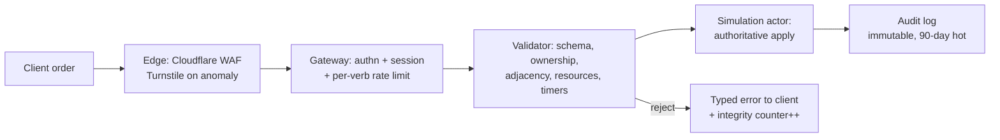
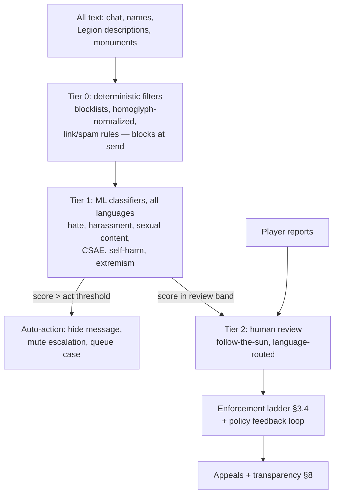

# 10 — Security, Anti-Cheat & Trust/Safety: Legions of Earth

**Executive summary.** Legions of Earth is a browser game with no installed client, a fully server-authoritative deterministic simulation, and a worldwide player base of ~100,000 registered Commanders per Shard. That combination makes classic FPS-style anti-cheat (kernel drivers, memory scanning) both impossible and unnecessary: the client is untrusted by design, and every meaningful action is validated server-side. Our real adversaries are **automation (bots), multi-accounting, win-trading, account takeover, DDoS, and social abuse at planetary scale in 20+ languages**. This document commits to a concrete defense: authoritative order validation with per-verb rate limits; a behavioral bot-detection pipeline with human-review thresholds and a four-rung enforcement ladder with appeals; passkey-first authentication with email magic links; Cloudflare-fronted infrastructure with an annual external pentest cadence; and a follow-the-sun multilingual moderation operation (automated classifiers + ~14 FTE-equivalent human reviewers at first-Shard scale) enforcing the fictional-banners rule, a homoglyph-aware naming policy, and a geopolitics playbook for the days when real-world conflict spills into a game about holding terrain on a map of Earth. Success is measured against the anchor's integrity target: **fewer than 2% of accounts actioned for botting/multi-boxing per Season, trending down**, with published transparency reports every Season.

Cross-references: server architecture in `04-technical-architecture.md`; economy exploit surfaces in `06-economy-and-monetization.md`; chat and diplomacy systems in `03-legions-social-and-diplomacy.md`; language coverage in `07-localization-and-i18n.md`; legal basis for enforcement and data handling in `12-legal-compliance-privacy.md`; reporting UI patterns in `08-art-and-ux-direction.md` and `09-onboarding-retention-accessibility.md`.

---

## 1. Threat model

We rank threats by (impact on fair play × likelihood × cost to defend). The table below is the canonical list; every later section maps back to it.

| # | Threat | Actor & motive | Impact if unchecked | Primary defense | Residual risk |
|---|---|---|---|---|---|
| T1 | **Client tampering** (modified JS, forged packets, map-fog removal) | Curious players, cheat-tool sellers | Low — server ignores illegal state | Server authority (§2); fog-of-war computed server-side per viewer | Cosmetic-only local hacks; UI automation feeds T2 |
| T2 | **Botting / automation** (scripted supply runs, 24/7 order queues, resource farms) | Efficiency-seeking players; RMT farm operators | High — devalues the "five minutes matter" pillar; inflates economy | Behavioral detection (§3), action budgets, friction challenges | Sophisticated human-like bots; arms race is permanent |
| T3 | **Multi-accounting** (alt armies, feeder accounts, shield abuse via disposable alts) | Competitive Legions | High — breaks the 100-Commander Legion cap and new-player protection | Device/network correlation + behavioral linkage (§3.2) | Households and internet cafés sharing infrastructure (must not be punished) |
| T4 | **Win-trading / collusion** (staged battles for Season score, kingmaking, tribute laundering) | Top Legions near Season finale | Medium-high — corrupts Hall of Ages legitimacy | Anomaly detection on battle outcomes + economy flows; human review; Season-score forfeiture | Genuine diplomacy looks similar; adjudication is judgment-heavy |
| T5 | **Spying & insider sabotage** | Rival Legions planting members | **Legitimate gameplay by default** (§1.1) — abuse only when paired with ToS violations | Policy line, Legion permission tools (`03-legions-social-and-diplomacy.md`), audit logs for Legates | Community perception; needs clear public policy |
| T6 | **Account takeover (ATO)** (credential stuffing, phishing, session theft) | Griefers, RMT, revenge within Legion politics | High per-victim — a stolen Legate account can disband a 100-player Legion | Passkeys, magic links, step-up auth, session controls (§4); Legate-action cool-downs | Phishing of magic links; social engineering |
| T7 | **DDoS** (volumetric, L7 floods timed to Clash Windows) | Losing Legions, extortionists | High — a 30-minute outage during a Clash Window decides a Season | Cloudflare edge, async-first design, contribution-window tolerance (§5.1) | Targeted L7 attacks on WebSocket endpoints |
| T8 | **Toxicity, hate, harassment, real-world-conflict spillover** | Small % of players, amplified in wartime | High — worldwide audience, 20+ languages, culturally diverse | Moderation stack (§6), policy (§7), crisis runbook (§7.4) | Coded language, new slurs, cross-language evasion |
| T9 | **RMT (real-money trading)** of accounts/resources | Farm operators | Medium — fuels T2/T3 | No tradeable premium currency (`06-economy-and-monetization.md`); market anomaly detection; marketplace-listing DMCA/ToS takedowns | Off-platform account sales are hard to prevent, only to punish |

### 1.1 Spying as gameplay vs. abuse — the explicit line

Espionage is part of the fantasy of grand strategy and we will not pretend otherwise. The policy, published verbatim in the Code of Conduct:

- **Allowed:** joining a rival Legion under an assumed identity, reading their plans, feeding intelligence to your real Legion, defecting with knowledge, sabotaging by *making bad in-game decisions* you were legitimately empowered to make.
- **Prohibited:** using a *compromised or purchased* account to spy (T6/T9); stripping a Legion treasury via a role you obtained through ToS violations; doxxing or off-platform harassment discovered through infiltration; multi-account spying (one human, one identity per Shard — T3).

Design mitigations belong to `03-legions-social-and-diplomacy.md` (rank-gated treasury withdrawal limits, 48-hour cool-down on Legate-level destructive actions, immutable audit log visible to all Officers). Trust & Safety only intervenes when the prohibited list is triggered. This line lets betrayal stories — the lifeblood of MMO strategy communities — happen safely.

---

## 2. Server authority and validation

### 2.1 Why determinism deletes whole cheat classes

Per `04-technical-architecture.md`, all combat resolves in **deterministic, server-side auto-battles**; the client renders replays from tiny payloads and submits only *orders*. Consequences:

- **No aim/speed/ESP hacks exist** — there is no twitch layer to cheat in. This is a pillar-level advantage of the design (Pillar 3, async-friendly).
- **A modified client can only lie to its own screen.** Fog of war, enemy positions, and market depth are computed per-viewer on the server; the client never receives data it isn't entitled to see. (This is the one place "server authority" requires discipline: we treat any field sent to the client as public to that player.)
- **Replays are court records.** Because battles are deterministic functions of (ruleset version, initial state hash, order set) — combat has zero RNG and no seed (`01-game-design-document.md`) — any disputed outcome can be re-simulated bit-for-bit during a win-trading investigation.

The entire anti-cheat problem therefore reduces to two questions: *is this order legal?* and *is a human issuing these orders?* Section 2.2 answers the first; §3 the second.

### 2.2 Order validation pipeline

Every mutation travels one path — HTTPS action endpoint or WebSocket message — into the same validator before touching the simulation:

Validation layers, in order, all server-side:

1. **Schema** — strict TypeScript/zod validation; unknown fields rejected, never ignored.
2. **Authorization** — does this Commander own this warband/Province? Does their Legion rank permit this treasury action?
3. **Game-legality** — adjacency and supply-line reachability, resource balances, timer states, Clash Window eligibility, new-player-shield rules. The validator shares the exact rule code with the simulation (one TypeScript package), so "client thought it was legal" bugs cannot become exploits.
4. **Rate limits** — per-verb token buckets (below).
5. **Idempotency** — every order carries a client-generated UUID; replayed packets are no-ops, killing double-spend races.

### 2.3 Rate limits as anti-automation groundwork

Limits are set at roughly **3× the 99th-percentile of legitimate human play** measured in beta, so honest players never see them, and are enforced per account *and* per IP/ASN bucket:

| Verb class | Limit (per account) | Burst | Rationale |
|---|---|---|---|
| Movement/queue orders | 30/min | 10 | Hyperactive human peak ≈ 10/min |
| Train / build / repair | 20/min | 8 | Menu-driven, slower |
| Scout / supply-run dispatch | 15/min | 5 | Bot-favorite verbs; tighter |
| Market orders | 10/min, 500/day | 5 | Caps RMT wash-trading throughput |
| Chat messages | 20/min, sliding | 5 | Plus flood similarity check |
| Legion admin (invite/kick/rank) | 30/hour | — | Limits stolen-Legate blast radius (T6) |
| Report submissions | 20/day | — | Anti report-brigading (§8.1) |
| Auth attempts (magic link) | 5/hour/address | — | ATO throttle |

Exceeding a limit returns a typed error and increments a per-account **integrity counter**; the counter (not the single event) feeds the detection pipeline in §3. Limits are config-driven and shard-local so live-ops (`05-liveops-content-and-analytics.md`) can tune them without deploys.

---

## 3. Bot and multi-account detection

### 3.1 Detection philosophy

We optimize for **precision over recall at the punishment stage** and recall over precision at the *observation* stage. False bans of legitimate players in a Legion-based game destroy 100 players' trust, not one. Therefore: broad, cheap signals feed a scoring model; only high scores plus human review produce account-level punishment; automated systems alone may only apply *soft* friction (challenges, cool-downs).

### 3.2 Signal inventory

**Behavioral signals (primary — privacy-cheapest, hardest to fake):**

- **Session rhythm:** entropy of inter-action intervals; humans are bursty and diurnal, bots are metronomic or uniformly random. A Commander issuing supply-run orders every 340±5 s for 22 hours/day is not a shift worker.
- **Circadian coherence:** activity vs. the account's own established sleep pattern — *never* vs. an assumed regional timezone (worldwide audience; a Commander in Lagos playing at 4 a.m. UTC is normal).
- **Verb diversity:** bots specialize (farm, scout, ferry); humans chat, vote, browse the Hall of Ages, misclick.
- **UI-path realism:** server-visible order sequencing that skips prerequisite reads (ordering a raid on a Province whose panel was never fetched).
- **Reaction-to-events latency distribution:** responding to a raid alert in <2 s at 4 a.m., every time.

**Device/network signals (secondary — corroboration only):**

- Coarse device profile: user-agent, screen class, touch vs. pointer, timezone offset, language. We deliberately do **not** deploy invasive canvas/audio fingerprinting; it is GDPR-hostile (see `12-legal-compliance-privacy.md`), fragile on low-end Android WebViews, and punishes exactly the shared-device demographics we serve.
- Network: ASN reputation, datacenter-IP flag, impossible-travel between sessions, many-accounts-per-IP *rate* (not existence — an internet café or campus NAT legitimately hosts dozens of Commanders).
- **Cloudflare Turnstile** (invisible, no image puzzles) as the step-up challenge — chosen over hCaptcha/reCAPTCHA for privacy posture, no-Google dependency, zero-friction pass rate on low-end devices, and $0 cost at our volume.

**Economy-graph signals (for T3/T4/T9):**

- Resource-flow graph analysis: alt "feeder" accounts show near-100% outbound flow to one beneficiary; win-trading shows repeated battles with statistically improbable doctrine choices (defender fielding empty garrisons at score-relevant Provinces in Season week 7–8).
- Worked example: Account B, registered day 3 of the Season, plays 40 minutes total, ships 96% of all resources ever gathered to Account A across 31 market trades priced 80% below regional median, from an IP block A also uses. Individually each signal is innocent; the joint score crosses the review threshold and a human reviewer confirms a feeder alt in under 5 minutes using the case UI.

### 3.3 Scoring, thresholds, and human review

A gradient-boosted model (retrained per Season on labeled cases) outputs an integrity score 0–100 per account daily:

| Score | Automated action | Human involvement |
|---|---|---|
| < 40 | None | None |
| 40–70 | Invisible Turnstile challenge on next session; extra logging | None |
| 70–85 | Soft friction: order-queue confirmation prompts; flagged for review queue (72 h SLA) | Reviewer confirms/clears |
| > 85 or confirmed | Enforcement ladder (§3.4) | **Mandatory human sign-off for any restriction ≥ 24 h** |

Target operating point: **≥ 97% precision** on enforced actions, measured by appeal overturn rate ≤ 3% (§3.5). Review capacity is budgeted at ~0.4% of MAU flagged per month → at 100k registered/Shard ≈ 250 cases/week ≈ 1.5 dedicated integrity analysts per three Shards, staffed within the T&S team (§6.3).

**Privacy-conscious design commitments** (binding; details in `12-legal-compliance-privacy.md`): signals are pseudonymized in the pipeline; raw network data retained 90 days then aggregated; no biometric or keystroke-dynamics collection; detection features are documented in the privacy policy at the category level; model features never include protected characteristics or country as a punitive input.

### 3.4 Enforcement ladder

One human = one account per Shard (a second Shard is fine). Punishments escalate; each rung is communicated in the player's language with the *category* of violation and evidence summary (never raw detection features, which would train evaders):

1. **Warn** — in-product notice + email; no gameplay effect; expires after one Season of clean play.
2. **Restrict** — 24 h–7 d: market access frozen, order queues capped at manual-refill, Legion-admin verbs disabled. The Commander can still play; their Legion is minimally collateral-damaged.
3. **Season ban** — account benched for the remainder of the current ~8-week Season; Season score contributions retroactively voided (this is the real deterrent for win-traders — Hall of Ages entries are corrected, and corrections are public).
4. **Account ban** — permanent; purchases non-refundable per ToS where law allows (`12-legal-compliance-privacy.md`); ban evasion via new accounts is itself rung-4 on detection.

Aggravators skip rungs: RMT operations, ban evasion, compromised-account abuse (T6), and any child-safety issue go straight to rung 4 plus, where applicable, preservation-and-referral procedures in `12-legal-compliance-privacy.md`. Win-trading (T4) enters at rung 3 for all colluding accounts, and the affected Legion's Season score is recomputed — punishing the conspiracy, not the 90 innocent Legion-mates, is why voiding *contributions* beats docking Legions.

### 3.5 Appeals

- Every enforcement notice contains a one-click appeal link; appeals form is localized in all 20+ launch languages (`07-localization-and-i18n.md`).
- Appeals of rungs 1–2: reviewed within 72 h by a different reviewer than the original decision. Rungs 3–4: within 7 days by a senior analyst; rung 4 requires two-person sign-off to uphold.
- Metrics published per Season (§8.2): appeal rate, overturn rate (target ≤ 3% overall; a spike is treated as a detection-quality incident, not a comms problem).
- DSA-compliant statement of reasons and out-of-court dispute options for EU players are handled per `12-legal-compliance-privacy.md`.

---

## 4. Account security

### 4.1 Authentication: passkeys first, magic links always

We ship **no passwords at all** — passkeys plus email magic links are the entire credential surface, and this document owns that posture (data-retention schedules in `12-legal-compliance-privacy.md` accordingly list passkey public-key credential material, never password hashes). Decision rationale: passwords cause ~80% of ATO via reuse/stuffing, create support burden, and add a signup step that hurts the "opened a link on the bus" funnel.

- **Primary: passkeys (WebAuthn/FIDO2)** — supported by every browser we target (including Android WebView 2019-era via Google Password Manager); phishing-resistant; syncs across the player's devices via platform credential managers. Prompted at first session end ("secure your Legion in one tap"), required for Legate-rank Commanders of Legions holding ≥ 10 Provinces.
- **Universal fallback: email magic links** — 15-minute expiry, single-use, bound to the requesting device's session via a short code shown on both screens (blocks remote-phish "forward me the link" attacks). Email is the one credential every target market has; SMS is explicitly rejected (cost at worldwide scale, SIM-swap risk, deliverability in several launch markets).
- **Optional link-outs:** Google and Apple sign-in for convenience; never required (not universally available worldwide).

**Step-up authentication** (fresh passkey assertion or magic link re-confirmation) is required for: purchases above the regional small-transaction threshold, email change, passkey removal, Legion disband/treasury-drain actions, and any login from a new country.

### 4.2 Sessions

- Access tokens: 15-minute JWTs; refresh tokens: 30-day, rotating, device-bound, revocable. WebSocket connections re-authenticate on token rotation.
- Player-facing **device manager**: list of active sessions (device class, coarse location, last active), one-tap "sign out everywhere."
- Anomaly-triggered session revocation: impossible travel or ASN jump forces silent re-auth; the player sees one magic-link tap, not a lockout.

### 4.3 Recovery without support burden

Support-ticket recovery does not scale to millions of accounts in 20+ languages, and human-mediated recovery is the softest ATO surface. Recovery is therefore **self-service and cryptographic**:

1. Lost device, has email → magic link. (Covers ~95% of cases.)
2. Lost email access → pre-generated one-time **recovery code** (offered at signup completion, re-offered every Season start) plus a 72-hour delay with notification to the old email, giving the true owner time to object.
3. Neither → identity cannot be re-established; the account is unrecoverable by policy. This is stated at signup. Support may *never* override authentication — removing the social-engineering path entirely.

**Legate protection (T6 blast radius):** destructive Legion actions (disband, mass-kick > 10, treasury withdrawal > 20%/day) have a 48-hour timer visible to all Officers, who can veto by majority — a stolen Legate credential cannot destroy a 100-Commander community before humans wake up in *some* timezone (the worldwide-membership advantage from `00-vision-and-concept.md` §2, now a security feature).

---

## 5. Infrastructure security

### 5.1 DDoS

- **Cloudflare** fronts everything: CDN for the PWA, WAF, L3/4 volumetric absorption, and WebSocket proxying with per-IP connection caps. Chosen over AWS Shield Advanced + CloudFront (higher cost at our egress profile, weaker L7 game-specific tooling) and Fastly (excellent CDN, thinner DDoS/WAF bundle).
- **Design absorbs what the edge can't.** The async-first loop means a 10-minute origin brownout loses almost nothing: orders queue client-side with idempotency keys and replay on reconnect. **Clash Windows are 24-hour contribution windows, not moments** — the anchor's time-zone-fairness mechanic is also our DDoS resilience: there is no single minute an attacker can deny. The finale resolution job runs server-internal, unreachable from the internet.
- Origin IPs are never public (Cloudflare Tunnels); simulation actors sit in a private network with the gateway as sole ingress.
- Runbook: attack detected → Cloudflare "Under Attack" mode per-route → Turnstile on auth/action endpoints → if origin-saturating, shed the live WebSocket layer first (the game degrades to polling, stays playable on the HTTPS action path) → player-facing status page in all launch languages.

### 5.2 Application and platform hygiene

| Area | Commitment |
|---|---|
| WAF | Cloudflare managed rules + custom rules for our API shapes; block-by-default on undefined routes |
| Secrets | Cloud KMS-backed secrets manager (per `04-technical-architecture.md` cloud choice); no secrets in env files or CI logs; 90-day rotation; per-service least-privilege IAM |
| Dependencies | TypeScript monorepo with **Renovate** auto-PRs, **npm audit + Socket.dev** in CI (Socket catches supply-chain/typosquat risk that CVE scanners miss); lockfile-only installs; provenance-verified publishes |
| SSDLC | Mandatory review for auth/validator/economy code paths; secret scanning (GitHub Advanced Security) pre-merge; SAST (Semgrep OSS rules) in CI |
| Logging | Immutable audit log for all admin/moderation tooling actions — the insider-threat control for our own staff; access reviews quarterly |
| Backups | Point-in-time recovery on PostgreSQL, tested restores monthly (a ransomware control as much as an ops one) |

### 5.3 Pentest cadence and disclosure

- **External pentest:** annually plus before each major launch milestone (closed beta, global launch), scoped to auth, payment integration, and the order/validation API. Recommended vendor: **Cure53** (deep web/browser specialization fits a browser-only game); alternative NCC Group lost on cost and web-app focus.
- **Continuous:** a **public vulnerability disclosure program at launch, upgrading to a paid bug bounty (HackerOne) at global launch** with bounties $100–$5,000. Game-logic exploits (dupes, validation bypasses) are explicitly in scope — economy bugs are security bugs in an MMO.
- Internal red-team exercise each Season against the win-trading and multi-account detectors: analysts attempt evasion, findings feed model retraining.

---

## 6. Trust & Safety at worldwide scale

### 6.1 The scale problem, quantified

At first-Shard maturity (~100k registered, **~25,000 DAU**, ~15k peak concurrent — the per-Shard activity model in `04-technical-architecture.md` §7, which owns these numbers), the Shard generates roughly **~600,000 chat messages/day**, ~65% of them in Legion channels, across Legion, Coalition, diplomacy, and local channels, in 20+ languages, around the clock — plus **~2,000 player reports/day** at 0.08 reports/DAU. No human team reads that; no pure-ML system judges it acceptably. The stack is layered:

### 6.2 Tooling decisions

- **Tier 0:** in-house deterministic layer — Unicode-normalized (NFKC + ICU spoofchecker) blocklist matching, URL policy (only allowlisted domains render as links), flood/similarity throttles. Runs in-process at the chat gateway, sub-millisecond, works identically for all scripts.
- **Tier 1:** a commercial multilingual moderation API — recommendation: **Checkstep** (purpose-built T&S platform, strong non-English coverage, DSA reporting tooling built in), with **Hive Moderation** as the evaluated alternative (excellent classifiers, weaker case-management; we'd be building the workflow layer ourselves) and Google Perspective rejected (toxicity-only, weak coverage beyond ~18 languages, no case management). Contract target ≈ $0.50–0.80 per 1,000 messages classified at volume; only messages passing Tier 0 and sampled/live-channel content is classified (≈ 40% of volume) to control cost.
- **Case management & enforcement:** Checkstep's console integrated with our enforcement service, so classifier hits, player reports, and integrity cases (§3) land in one queue with one audit log.
- **Chat translation** (a game feature per the anchor) doubles as a moderation asset: reviewer UIs show source + English pivot translation, letting any reviewer triage any language while native speakers make final calls in the priority set.

### 6.3 Staffing: follow-the-sun

Human review is split between a **core in-house team** (policy owners, senior adjudicators, integrity analysts) and an **outsourced multilingual review pool** — recommended vendor **Keywords Studios player-support/T&S line** (games-native, 20+ language coverage, existing LQA relationship per `07-localization-and-i18n.md`; TaskUs and Telus evaluated, lost on games specialization and language overlap with our launch set).

| Function | Location model | Headcount @ 1 Shard | Coverage |
|---|---|---|---|
| Head of Trust & Safety (in-house) | Remote | 1 | Policy, escalations, transparency reports |
| Senior adjudicators (in-house) | EU + APAC + Americas remote | 3 | Rung 3–4 sign-offs, appeals, geopolitics calls |
| Integrity analysts (in-house, §3) | Remote | 1 | Bot/win-trading case review |
| Outsourced reviewers (Keywords) | 3 sites: EU, SE Asia, LATAM | ~9 FTE-equivalent | 24/7 follow-the-sun; every hour covered by ≥ 2 reviewers spanning ≥ 6 languages natively, all languages via pivot translation |

The outsourced pool is sized from the §6.1 load: of the ~2,000 reports/day, dedup on unique-reporter count plus Tier 0/1 auto-resolution clear roughly half, leaving ~1,000 cases/day needing a human decision; at ~150 decisions per reviewer-day with seven-day coverage, that is ≈ 9 FTE-equivalent. Total ≈ **14 FTE-equivalent at first-Shard scale**, scaling sub-linearly (~+6 outsourced FTE per additional Shard as automation share rises). SLAs: imminent-harm reports (threats, self-harm, child safety) triaged **< 1 hour, 24/7**; standard reports < 24 h; low-priority (name disputes) < 72 h. Reviewer well-being provisions (rotation off high-severity queues, counseling access, exposure caps) are contractual with the vendor and budgeted in `13-roadmap-team-budget.md`.

---

## 7. Policy

### 7.1 The fictional-banners rule (constitutional)

From the anchor, restated as enforceable policy: **no Legion, Coalition, Commander name, banner, description, or monument may represent, claim, or evoke a real country, ethnic group, religion-as-faction, or political movement — current or historical-modern (post-1500 as the bright line), including flags, insignia, leaders, parties, armies, and slogans.** The game is about holding terrain on a stylized Earth, never "my country versus yours."

Enforcement layers:

1. **Registration-time:** name checks against a curated multilingual denylist (country names, demonyms, party/militia names, extremist orgs per UN/EU/national designation lists, hate symbols glossary sourced from ADL Hate Symbols Database and equivalent regional references) — matched after homoglyph normalization (§7.2). Banner creator offers only fictional heraldic elements; there is no free-drawing and no image upload at launch, and any future image-upload surface is gated on a Trust & Safety review (creator scope in `03-legions-social-and-diplomacy.md` and `08-art-and-ux-direction.md`).
2. **Report-time:** "represents a real-world group" is a first-class report reason (§8.1).
3. **Sweep-time:** weekly automated re-scan of all Legion names/descriptions against the updated denylist — new conflicts add new terms (§7.4).

Gray-zone adjudication examples (published so players see the line, not just the rule): *"Aurelian Legion"* — allowed (fictional, mythic-historical flavor). *"Roman Empire"* — allowed (pre-1500 bright line; historical-mythic). *"Republic of [current country]"* — removed at registration. A Legion named innocuously whose description declares allegiance to a real-world side of a current conflict — description removed, warn; repeat → rename + restrict.

### 7.2 Names and UGC across scripts and homoglyphs

All 20+ launch languages mean all major scripts: Latin, Cyrillic, Arabic, Devanagari, CJK, Thai, and more (`07-localization-and-i18n.md`).

- **Normalization pipeline:** NFKC → ICU `USpoofChecker` confusables mapping (UTS #39) → casefold → diacritic-strip variant → match against denylists in both raw and normalized forms. Example: `Аurelian` with a Cyrillic **А** (U+0410) normalizes to `aurelian` and also trips the mixed-script check — mixed-script names are disallowed outright except for documented natural pairs (e.g., CJK + Latin), killing most impersonation and filter-evasion at zero false-positive cost.
- **Zero-width and bidi controls** (ZWJ/ZWNJ/RLO) are stripped or rejected in names; RLO-based spoofing is a classic scam vector.
- **Impersonation:** names confusable (post-normalization edit distance ≤ 1) with staff tags, system actors, or top-100 Hall of Ages Commanders on the same Shard are blocked.
- **No real-person names of public figures** as Legion identity; personal-name collisions for individual Commanders are allowed (people share names) unless paired with impersonating behavior.

### 7.3 Harassment and hate policy (summary; full text ships in the Code of Conduct, localized)

- **Hate:** attacks on protected characteristics — zero tolerance; enters the ladder at rung 2 minimum, rung 4 for slurs with clear intent. Classifier thresholds are tuned per language with native-speaker calibration sets, because slur severity does not translate mechanically.
- **Harassment:** targeted repeated abuse, dogpiling (coordinated cross-Legion reporting or chat-flooding of one player), sexual harassment, doxxing (rung 4 immediately). *In-fiction trash talk about the war is allowed and expected*; the test is target (the player vs. their Legion's position on the map) and persistence.
- **Player-side tools ship at launch** (see `03-legions-social-and-diplomacy.md` and `09-onboarding-retention-accessibility.md`): mute, block (blocks all channels + diplomacy mail), Legion-level channel slow-mode, keyword self-filters, and "disable cross-Legion whispers" default-on for new players during their 7-day shield.

### 7.4 Geopolitics playbook — when the real world spills in

A game about territorial conquest on a map of Earth **will** intersect real conflicts: players will rename Legions after belligerents, re-fight real wars over the corresponding stylized terrain, and flood chat with real-world hostilities. The playbook, pre-committed so decisions are not made in the heat of the moment:

- **Standing posture:** the game and its official channels are permanently neutral on all real-world conflicts. We never make statements of support or condemnation; our statement is the fictional-banners rule itself. This is the only posture that a 60-country player base can share (anchor success criterion: no country > 30% MAU).
- **Trigger:** an armed conflict, terror attack, or mass-casualty event that measurably surfaces in-game (classifier topic-spike detection + reviewer flags + report-reason spikes).
- **Within 6 hours of trigger:** T&S lead convenes; conflict-specific terms (belligerent names, slogans, targeted slurs in relevant languages) are added to Tier 0/Tier 1 watchlists in *monitor* mode; regional reviewer capacity for affected languages is surged via the Keywords contract's 48-hour surge clause.
- **Within 24 hours:** decision on escalation level: **L1** monitor only → **L2** conflict terms move from monitor to review-required in public channels; name-sweep for new registrations referencing the conflict → **L3** temporary slow-mode on world/local channels in affected regions; conflict-referencing names get 72-hour forced-rename notices → **L4** (mass-casualty/atrocity adjacency): temporary disable of *new* Legion registrations Shard-wide, pre-drafted neutral in-game notice in all languages ("Legions of Earth is a fictional world; our thoughts are with everyone affected — [link to policy]").
- **What we never do:** alter the map, disable Provinces corresponding to real regions, or eject players by nationality. The stylized map has no modern borders (anchor §4.1) precisely so terrain is *terrain*.
- **Stand-down:** each activation reviewed within 2 weeks; temporary terms either promoted to permanent policy or expired; the activation is counted (not detailed) in the Season transparency report.

### 7.5 Crisis moderation runbook (non-geopolitical)

For raids/brigades (external community targets a Legion), viral hate meme waves, CSAE discovery, or credible real-world-harm threats:

1. **Sev-1 declared** by any senior adjudicator; on-call rotation is follow-the-sun (§6.3), 15-minute acknowledgment SLA.
2. **Contain:** channel slow-mode/lockdown is scoped (single Legion channel → regional → Shard) — never Shard-wide chat-off as a first move; targeted-player protective mute-shield (they see only Legion-mates) offered proactively.
3. **Preserve:** evidence snapshot to legal hold before deletion (`12-legal-compliance-privacy.md` governs retention and law-enforcement referral; CSAE follows NCMEC/INHOPE reporting paths, mandatory and immediate).
4. **Communicate:** status template in all launch languages within 2 hours for player-visible incidents; silence is a decision we make deliberately for incidents where amplification is the harm.
5. **Post-incident review** within 7 days; policy/tooling gaps become tracked work items in `05-liveops-content-and-analytics.md` cadence.

---

## 8. Reporting UX, transparency, and quality metrics

### 8.1 Reporting UX

- **Two taps from anything:** every message, name, banner, and monument has a long-press/right-click → Report entry. Reason picker (localized, icon-supported for low-literacy accessibility per `09-onboarding-retention-accessibility.md`): *Hate or harassment / Real-world group or politics / Cheating or botting / Scam or phishing / Impersonation / Self-harm concern / Other*.
- Context auto-attached (message + 10 surrounding lines, or the object reported); free-text optional — reporters should never need to write English.
- **Feedback loop:** reporter receives a notification when their report is actioned ("we took action on content you reported" — category only, no punishment details). Closing the loop measurably increases future reporting quality and trust.
- **Anti-brigading:** report volume never directly triggers punishment (dogpiles would weaponize it); it only affects queue priority, with dedup on unique-reporter count and a per-account daily report cap (§2.3). Accounts with chronically false reports lose queue-priority weight silently.

### 8.2 Transparency reporting

Published **every Season (~8 weeks)** on the game site, localized into all launch languages, covering that Season:

- Accounts actioned by category and rung (with the anchor's < 2% botting/multi-boxing integrity KPI tracked publicly);
- Report volumes, action rates, median time-to-action by severity class;
- Appeal rate and overturn rate;
- Geopolitics-playbook activations (count and level, not detail);
- Government/law-enforcement request counts (jointly owned with `12-legal-compliance-privacy.md`, which also covers DSA Article 15/24 obligations that this report is designed to satisfy in one artifact).

### 8.3 Moderation quality metrics (internal, reviewed monthly)

| Metric | Target | Notes |
|---|---|---|
| Precision of enforced actions (via appeal overturns + QA sampling) | ≥ 97% | QA double-reviews 5% random sample of all decisions |
| Classifier act-threshold precision, per language | ≥ 95% | Per-language, not aggregate — aggregate hides small-language failure |
| Imminent-harm triage SLA | < 1 h, 99% | 24/7 |
| Standard report SLA | < 24 h, 95% | |
| Reviewer inter-rater agreement (calibration sets) | ≥ 90% | Monthly cross-site calibration across outsourced pool |
| Repeat-offense rate within 30 days of rung-1 warn | < 20% | Measures whether warnings work |
| Prevalence: % of sampled chat views containing violating content | < 0.3%, trending down | The metric that matters to players; sampled, human-labeled |
| Appeal overturn rate | ≤ 3% | Spike = detection-quality incident (§3.5) |

These metrics, the enforcement ladder, and the pre-committed playbooks exist for one reason: a game whose core fantasy is *belonging to something enormous that notices you* only works if what notices you is fair. Fairness is enforced by servers, measured in public, and staffed around the clock — in every timezone our Commanders live in.
