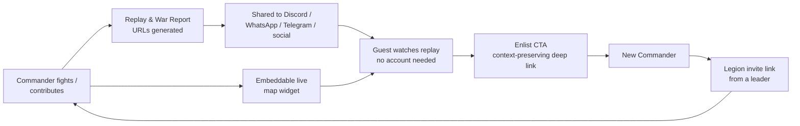
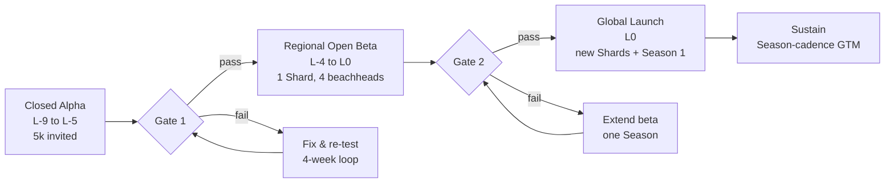

# 11 — Marketing, Community & Go-to-Market: Legions of Earth

**Executive summary.** Legions of Earth wins its audience the same way it wins battles: through coordination, not brute force. Our go-to-market plan spends less than a third of its budget on paid media and builds everything else around the product's structural advantage — *the entire install is a URL*, so every replay, war report, invite, and embedded map is simultaneously content and distribution. We open with a closed alpha seeded through strategy-genre communities, win four regional beachheads (Brazil, Central & Eastern Europe, Turkey, Southeast Asia) chosen for browser-strategy heritage and time-zone spread, and ride Legion pre-registration waves into a global launch. A creator program that funds non-English creators from day one, follow-the-sun community operations in three hubs, and a Season-finale news cadence turn the game's own history into a permanent earned-media engine. Total program budget through month 12 post-global-launch: **$1.2M**, targeting **5M registered Commanders in ≥60 countries with no country above 30% of MAU** — the reach criteria set in [00-vision-and-concept.md](00-vision-and-concept.md) §9.

---

## 1. Positioning and messaging

### 1.1 The one-line pitch

> **Legions of Earth is a free browser strategy MMO where thousands of players, organized into Legions of up to 100 Commanders, fight to hold a living map of Earth — one link, no install, five minutes at a time.**

Every piece of marketing copy must be reducible to this sentence. The three load-bearing claims, in priority order:

1. **Massive and shared** — one persistent Earth per Shard; your five minutes moves a planet-scale war.
2. **Zero friction** — a URL is the whole install; playable on the phone you already own, on the network you already have.
3. **Fair** — money never buys power; time zones never decide wars; strategy and coordination do.

### 1.2 Taglines

Primary tagline (used on the landing page, trailer end-card, and store surfaces):

> **One Earth. Ten thousand banners.**

It encodes Pillar 1 (one shared world) and the fictional-banner identity rule from [00-vision-and-concept.md](00-vision-and-concept.md) §4.3 in five words, and it survives translation. Secondary lines for campaign rotation: *"Hold the line — together."* (Legion recruitment beats), *"Your five minutes moves the front."* (casual/mobile-first beats), *"The war never sleeps. Neither does your Legion."* (time-zone fantasy beats). Per [07-localization-and-i18n.md](07-localization-and-i18n.md), taglines are **transcreated, not translated** — each T1 language team delivers a locale-native equivalent approved by the loc manager, because a literal "Ten thousand banners" is clumsy in several languages and idiomatic alternatives exist in all of them.

What we never say, in any market: real country names as factions, "conquer [real nation]," war-on-terror or contemporary-conflict imagery, or "beat the whales" framing. Ad creative passes the same cultural-neutrality screen as Legion names ([10-security-anticheat-trust-safety.md](10-security-anticheat-trust-safety.md)); a campaign concept that maps banners onto real nationalities is rejected at brief stage, not at review stage.

### 1.3 "A URL is the whole install" — the core growth weapon

App-store funnels for mid-core strategy games routinely lose 60–80% of intent between ad click and first session (store page → download → install → permissions → 80 MB patch → tutorial). Our funnel is **click → playing**: under 10 seconds to interactive on 3G, first order in under a minute, because the client's first interactive load is <5 MB ([00-vision-and-concept.md](00-vision-and-concept.md) §5, engineering budget in [04-technical-architecture.md](04-technical-architecture.md)). This changes what marketing *is*:

- **Every artifact ends in a playable link.** Trailers, tweets, creator videos, convention flyers (as QR codes), podcast reads — the call to action is never "wishlist" or "download," it is *play right now*. We measure every asset on click-to-first-order conversion, not impressions.
- **Every shareable object is a landing page.** A battle replay URL, a war report, a Legion profile, and a Hall of Ages monument each render as a server-side page with localized Open Graph cards (a generated image of the actual battle or front line) and an **Enlist** button. Guests can watch a full replay with no account; the account wall comes only when they act. This makes the game's own history an SEO and social surface that compounds every Season.
- **Deep links preserve context.** `loe.game/l/ashen-horde` drops a new player into that Legion's application flow after the tutorial; `loe.game/r/<replay-id>` plays the replay then offers enlistment *near that battlefield*. Context-preserving links convert 2–4× generic landing pages in comparable genres; we instrument this from alpha (event schema in [05-liveops-content-and-analytics.md](05-liveops-content-and-analytics.md)).
- **The demo is the game.** We never build a separate marketing demo; portal partners (§8.3) embed the real client in guest mode.

### 1.4 Naming and brand hygiene

"Legions of Earth" is the working title per the anchor; before the regional beta we complete a **22-language linguistic screen and trademark search** (same pipeline as item naming in [07-localization-and-i18n.md](07-localization-and-i18n.md) §safety) plus domain/handle acquisition (`loe.game` style short domain, unified handles). Budget for name screening and filings is in §9; legal mechanics in [12-legal-compliance-privacy.md](12-legal-compliance-privacy.md).

---

## 2. Audience segments and messages

Four worldwide segments, each with a distinct entry motivation. Percentages are our target mix of registered accounts at month 12; they deliberately sum with overlap because players migrate between segments.

| Segment | Who they are | Size target | Core message | Proof points to lead with | First-session goal |
|---|---|---|---|---|---|
| **Strategy veterans** | 4X/grand-strategy and wargame players (Civ, Paradox, hex wargames), 25–45, PC-first | ~15% | "Real operational depth: supply lines, doctrine, deception — no pay-to-win, no twitch." | Supply-line mechanic, deterministic Doctrine combat, Clash Window design | Read a front line correctly and run one interdiction raid |
| **Browser-MMO diaspora** | Ex-Travian / Tribal Wars / OGame / Grepolis players, 28–45, nostalgic, burned by pay-to-win and alarm-clock meta | ~30% | "The game you loved, minus the credit-card wars and 3 a.m. alarms." | Cosmetics-only hard line, rotating Clash Windows, 8-week Seasons (no 18-month grinds), ~5 MB load | Join a Legion and contribute to a held Province |
| **Mobile-first casual coordinators** | Phone-only players in BR/SEA/MENA/South Asia who organize groups in WhatsApp/Telegram/Zalo anyway; often on 2 GB devices and 3G | ~40% | "Five minutes on the bus actually matters to 4,000 people." | Instant load on their phone, data-saver mode, chat translation, meaningful 5-minute verbs | Complete a supply run that visibly helps their Legion |
| **Community leaders** | Guild masters, Discord admins, clan founders — the ~2% who bring the other 98% | ~15% of accounts, >50% of influence | "The best tools ever built for leading 100 people across 12 time zones." | Legion planning layer, audit log, charter matchmaking ([03-legions-social-and-diplomacy.md](03-legions-social-and-diplomacy.md)), Founding Muster perks (§7.2) | Found or import a Legion and send their first invite link |

Community leaders are the priority segment in every phase: one converted leader yields 20–100 registrations at effectively zero cost and anchors retention for all of them. Alpha invitations, beta pre-registration, and creator recruiting all target leaders first.

---

## 3. Viral loops built into the game

Marketing does not bolt virality on; the game design ships four loops, all cosmetic-safe under Pillar 5. Growth engineering (one full-stack engineer embedded with the game team, headcount in [13-roadmap-team-budget.md](13-roadmap-team-budget.md)) owns their conversion instrumentation.

1. **Shareable battle replays.** Deterministic combat means a replay is <2 KB of state + Doctrines ([01-game-design-document.md](01-game-design-document.md) §5.3) — cheap to host forever, instant to load on 3G, watchable without an account. Post-battle screens make sharing one tap, with the victor's Legion recruitment card attached. Target: **≥8% of resolved battles shared externally; ≥3% guest-viewer → registration conversion.**
2. **War reports.** Weekly per-Legion and per-front auto-generated summaries ("The Tidewalkers held the Horn Coast against 11 assaults") rendered as localized shareable pages and images — sized for WhatsApp/Telegram forwarding, which is how our largest segment communicates. Season finales generate a **Season Chronicle** per Legion and per Shard: the single biggest share event of the cycle, feeding the Hall of Ages.
3. **Legion invite links.** The out-of-game deep links defined in [03-legions-social-and-diplomacy.md](03-legions-social-and-diplomacy.md) §3.1, tracked as a first-class acquisition channel. Referral rewards are **cosmetic-only and mutual**: when an invited recruit reaches 7 activity-days, both parties earn banner flair, and Legions earn Stronghold cosmetics at 10/25/50 successful recruitments. No resources, no Laurels, no power — consistent with [06-economy-and-monetization.md](06-economy-and-monetization.md) exclusions, which also keeps referral fraud unprofitable ([10-security-anticheat-trust-safety.md](10-security-anticheat-trust-safety.md) screens the 7-activity-day gate).
4. **Embeddable live map widget.** An iframe/script widget showing a live (5-minute-delayed, to protect operations) view of any front, Province, or a Legion's holdings — built for Discord servers, fan sites, wikis, and stream overlays. Every widget carries an Enlist link. The delay, plus scouting fog rules, means the widget never leaks tactically decisive information; the spectator API behind it is shared with creator tooling (§6.3).

**K-factor targets:** ≥0.25 by end of regional beta, ≥0.35 at global launch steady state, with Season-finale weeks spiking above 0.5. At K=0.35, each paid or portal registration yields ~1.5 total registrations, which is what makes the §9 budget sufficient for the 5M goal.

---

## 4. Regional beachhead strategy

We do not launch "worldwide-evenly"; we launch worldwide-*deliberately*, winning four beachheads that (a) have deep browser-strategy heritage or mobile-coordinator density, (b) are cheap to reach, (c) validate our low-end/3G performance claims where they matter, and (d) **span the globe's clock**, so the first Shard's Legions can actually live the "time zones are a game mechanic" fantasy from week one. The <30% single-country MAU cap is a guardrail from day one, not a post-hoc fix.

| Beachhead | Why it wins first | Priority languages | Channel mix | Payment proof ([06](06-economy-and-monetization.md)) |
|---|---|---|---|---|
| **Brazil (+ LatAm halo)** | Largest browser-strategy nostalgia market in the Americas (Tribal Wars/Grepolis heritage); WhatsApp-native coordination culture; evening overlap with NA fills the Americas clock segment | `pt-BR`, `es-419` | WhatsApp channels & shareable cards, YouTube strategy creators, Discord, TikTok clips, Facebook groups | Pix, boleto-era prepaid habits |
| **Central & Eastern Europe (PL, CZ, UA, +DACH halo)** | The Travian/OGame heartland; highest strategy-genre affinity per capita; strong Discord/YouTube culture; solid mid ARPU | `pl`, `uk`, `de`, `cs` (T3 ramp) | Discord, YouTube, Twitch, Reddit, genre forums and fansites, Gamescom presence | Cards, PayPal, BLIK via aggregator |
| **Turkey** | Enormous ex-Travian population; young, Discord/YouTube-heavy; bridges Europe and MENA time zones; validates Tier-3 regional pricing | `tr`, `ar` halo | YouTube (dominant), Discord, Twitch, Telegram | Local cards, carrier billing |
| **Southeast Asia (ID, PH, VN, TH)** | Mobile-first coordinator density; ultimate test of the 2 GB/3G promise; fills the APAC clock segment; huge Facebook-group guild culture | `id`, `fil`, `vi`, `th` | Facebook groups & Messenger, Discord, TikTok, Zalo (VN), LINE (TH), YouTube | GCash/OVO/DANA-class wallets, prepaid via Coda-class channels, carrier billing |

**Why not the US/UK, Japan, or Korea first:** US/EU-West CPMs are 5–10× beachhead costs and browser-game skepticism is strongest there — but strategy veterans in those markets follow *stories*, so we win them with earned media, Reddit, and creators once the world is demonstrably alive (they enter naturally in the global launch wave; English is T0 so nothing blocks them). Japan and Korea have high polish expectations and expensive closed channel ecosystems (LINE ads, Kakao); `ja`/`ko` ship at launch (T1), but dedicated JP/KR pushes wait for post-launch quarters with local community hires — a fast-follow, not a beachhead. India is a strategic Tier-4 audience served from launch via `hi` and global channels; a dedicated India push is sequenced after we've proven Tier-4 monetization mechanics per [06-economy-and-monetization.md](06-economy-and-monetization.md).

**Time-zone completeness check:** Brazil (UTC-3) + CEE/Turkey (UTC+1..+3) + SEA (UTC+7..+8) gives the first Shard ~18 hours of natural peak coverage; NA/Oceania organic entry closes the rest. Marketing sequencing is thus itself a game-balance instrument.

---

## 5. Launch sequence

Three phases, each with entry mechanics and **hard success gates** — we do not proceed on calendar pressure. Calendar dates and their dependencies live in [13-roadmap-team-budget.md](13-roadmap-team-budget.md); this document uses L-offsets relative to global launch (L0).

### 5.1 Closed alpha (L-9 → L-5)

- **Who:** ~5,000 invited accounts — 40% community leaders recruited by hand from strategy Discords/forums in the four beachheads, 30% browser-MMO diaspora from genre communities, 20% mobile-first testers on real low-end devices (recruited with the LQA vendor's panels, [07-localization-and-i18n.md](07-localization-and-i18n.md)), 10% friends-and-family. NDA-free but unmarketed: we want honest word of mouth, not a hype spike on an unfinished game.
- **Entry mechanics:** personal invite codes, 3 per tester after week 2 — the first live test of the invite loop.
- **Languages:** English + `pt-BR`, `pl`, `tr`, `id` machine-assisted drafts to smoke-test i18n plumbing early (full T1 quality lands in beta).
- **Gate 1 (alpha → beta):** D7 ≥ 12% (pre-polish), ≥60% of session-3-reaching players affiliated with a Legion ([03](03-legions-social-and-diplomacy.md) funnel), crash-free sessions ≥ 99%, zero critical sim-integrity defects, p75 first-interaction < 8 s on throttled 3G.

### 5.2 Regional open beta (L-4 → L0)

- **Shape:** one real Shard, open registration in the four beachheads, soft-gated elsewhere (anyone can join via an invite link — we never region-lock a URL, we just don't advertise outside beachheads). **Progress carries into nothing** — the beta Shard ends with a true Season finale and reset, which is itself the marketing message: "Seasons are real; come see one end."
- **Entry mechanics — waves:** registration opens in waves of ~5,000 accounts every 48–72 hours, sized against live load and the Shard's ~100k registered / ~15k CCU envelope ([04-technical-architecture.md](04-technical-architecture.md)). Waves create urgency without dark patterns: the waitlist page shows your wave, and sharing your invite link moves your whole party up one wave together.
- **Entry mechanics — Founding Muster (Legion pre-registration):** a group of 10+ pre-registered players may charter a Legion *before* entry; the whole Muster enters in the same wave, with a reserved Legion name, the exclusive *Founding* banner trim (cosmetic-only, never reissued), and their charter card pre-filled. This is the community-leader conversion machine: it turns one Discord admin into 10–100 day-one Commanders who arrive already organized. Target: **≥35% of beta registrations arrive via a Muster or invite link.**
- **Marketing during beta:** creator program wave 1 (§6), first paid-media calibration ($100k across the four beachheads to establish CPR baselines), weekly war-report beats to regional press and communities.
- **Gate 2 (beta → global):** D1 ≥ 35% and D7 ≥ 15% with improving trend toward the anchor's 40/18; K ≥ 0.25; ≥ 55% of D7-retained players in a Legion (KPI defined in [05-liveops-content-and-analytics.md](05-liveops-content-and-analytics.md) §8); p75 first-interaction < 6 s in-beachhead including SEA 3G; payments live and reconciling in all four beachhead methods; no country > 45% of beta MAU (the cap tightens to 30% by L+3); moderation load per 1,000 MAU within the [10](10-security-anticheat-trust-safety.md) staffing model.

### 5.3 Global launch (L0) and sustain

- L0 is timed to a **Season 1 start** — launch day is enlistment day, not mid-war. New Shards open on the population thresholds defined in [02-world-map-and-seasons.md](02-world-map-and-seasons.md); marketing never oversells beyond Shard capacity because waves remain the pressure valve for the first two weeks.
- Launch-window beats (L0 → L+2 weeks): global trailer + simultaneous creator embargo lift in ≥10 languages; Founding Muster reopens globally; press angle "the strategy MMO whose install is a URL"; a public **live launch map** page (the §3 widget, full-planet view) that press and creators embed.
- Sustain cadence locks to the Season cycle in [05-liveops-content-and-analytics.md](05-liveops-content-and-analytics.md): every ~8 weeks delivers a finale Chronicle (earned media + share spike), a reset (lapsed-player re-entry beat: "fresh world, day-one fairness"), and a new Warpath Pass reveal. Marketing plans in Seasons, not months.

---

## 6. Creator program

### 6.1 Principles

Creators are the primary paid-adjacent channel because strategy games are *explained* games — a 20-minute "how supply lines actually work" video outsells any ad. Two hard commitments: **non-English creators are first-class from day one** (≥60% of curated slots reserved for creators producing in T1/T2 languages other than English), and **support precedes monetization** — tooling, access, and visibility come first; creator codes with revenue share arrive only at L+1 Season, once attribution and fraud screening are proven.

### 6.2 Tiers

| Tier | Size | Entry bar | What they get |
|---|---|---|---|
| **Pathfinder** | Uncapped, self-serve | Any creator, any size, any language; signed UGC policy | Asset kit, replay/spectator tools, creator Discord, beta access codes for their audience |
| **Vanguard** | ~150 curated (≥90 non-English) | Consistent output; ≥1k average views or equivalent; community standing | Everything above + early build access, monthly dev briefings (interpreted into top languages), embargo previews, direct line to creator relations, event invitations, $200–$800/video commissioning fund for tutorial-quality content in underserved languages |
| **Partner** | ~25 | Sustained reach + exemplary conduct; roughly one per major language/region | Everything above + creator code (5% of net attributed revenue for 30 days per code entry, per [06-economy-and-monetization.md](06-economy-and-monetization.md) §9.2), in-game creator banner cosmetic for their community, co-designed cosmetic items (revenue via code, never a power item) |

Creator relations staffing (a lead plus two regional coordinators aligned to the §7 hubs) is budgeted in [13-roadmap-team-budget.md](13-roadmap-team-budget.md); the commissioning fund and event costs sit in §9 here.

### 6.3 Tooling (the actual moat)

- **Spectator mode:** delayed free-camera observation of any front (same 5-minute delay and fog rules as the public widget), with name-plate anonymization toggle for privacy-safe content.
- **Replay studio:** any battle replay rendered at cinematic zoom with camera paths, slow-motion at the break-and-pursuit moment, and one-click WebM/MP4 export with localized captions — a low-end-friendly pipeline because the deterministic sim re-renders locally ([01](01-game-design-document.md) §5.3).
- **Data/API:** read-only public API for map history, Season standings, and Legion records — this is how community mapmakers, stat sites, and wiki builders (our diaspora segment's favorite hobby) become permanent infrastructure.
- **Creator dashboard:** link/code performance, audience-language breakdown, asset kit, and a piracy-safe press-kit CDN.

Why not a paid-sponsorship-led program instead: sponsorships buy launch-week spikes and zero durable advocacy, they price small non-English creators out, and they read as inauthentic in exactly the veteran communities we need. Commissioned *educational* content plus revenue-share codes aligns creator income with player understanding and retention instead.

---

## 7. Community operations

### 7.1 Official channels

| Surface | Role | Notes |
|---|---|---|
| **Discord (official)** | Global hub: announcements mirrored in 22 languages, per-language channels, Legion-recruitment board, dev Q&A | Primary for veterans/leaders; auto-translation bots bridge languages, mirroring in-game chat translation |
| **Forums (self-hosted, Discourse)** | Long-form strategy discussion, patch notes of record, searchable history | Owned platform — announcements of record never live only on a third party |
| **WhatsApp Channels (BR/LatAm), Telegram (TR/MENA/CIS), Zalo (VN), LINE (TH)** | Broadcast + community presence where players actually are | Broadcast-first (light moderation load); community-run groups linked, not owned |
| **Facebook groups (SEA)** | Guild-culture home for mobile-first coordinators | CM-moderated official group per language |
| **YouTube/TikTok/X/Instagram** | Clips, Chronicles, dev diaries | Localized captions minimum; full dubs for T1 where a Vanguard partner exists |
| **In-game noticeboard** | The one channel 100% of players see | Every critical announcement lands here first, in all 22 languages |

### 7.2 Community managers across time zones

Follow-the-sun staffing from three hubs matching the beachheads: **Americas (São Paulo), EMEA (Warsaw), APAC (Manila)** — six CMs at global launch (two per hub) natively covering `pt-BR`, `es-419`, `en`, `pl`, `tr`, `id`/`fil`, with paid part-time moderators extending to the remaining T1 languages. Escalation to Trust & Safety follows [10-security-anticheat-trust-safety.md](10-security-anticheat-trust-safety.md); CMs never adjudicate cheating or harassment cases themselves. A volunteer **Warden** program (guides, not police: no punitive powers, flag-and-help only) scales presence into T2/T3 languages, with cosmetic recognition mirroring the localization community rewards in [07-localization-and-i18n.md](07-localization-and-i18n.md).

### 7.3 Player councils

- **Council of Legates:** 15 seats per Shard-cluster, one Season per term, selected for language and region diversity (never more than 3 seats from one language community), drawn from active Legates and Officers. They receive preview briefings under NDA, a monthly structured session with community and player-relations staff, and a published "what the Council raised / what we did" digest — visibility is what makes councils credible. Its scope is **player relations and community representation**; product feedback and cultural review belong to the separate **Council of Envoys** (48 members, [05-liveops-content-and-analytics.md](05-liveops-content-and-analytics.md) §5.2), and the two bodies reference each other's digests rather than duplicating remits. In-game governance structures (coalition congresses) are game systems and live in [03-legions-social-and-diplomacy.md](03-legions-social-and-diplomacy.md); the Council is a *player-relations* body and the two are deliberately separate.
- **Language councils:** per-language terminology and culturalization feedback groups, shared with the community translation program in [07-localization-and-i18n.md](07-localization-and-i18n.md) §7.

### 7.4 UGC policy surface

Published in plain language in all 22 languages at beta start:

- **Allowed and encouraged:** monetized videos/streams, fan art and fiction, community tools and stat sites on the public API, fan translations of community content, tournament/event organization.
- **Asset kit license:** logos, key art, music stems, and UI assets under a custom license permitting monetized *content about the game*, prohibiting resale of assets, implied official endorsement, and use in other games or crypto/NFT projects.
- **Hard lines (mirror in-game T&S):** no real-country/ethnic/political framing of banners or campaigns ("Banner X = real nation Y" content is denied program standing), no cheat/bot/multibox content, no harassment campaigns. Enforcement ladder: warning → program removal → asset-license revocation, with appeals through support ([12-legal-compliance-privacy.md](12-legal-compliance-privacy.md) governs takedown mechanics).

---

## 8. Earned media, awards, and partnerships

### 8.1 Earned media

Three durable story hooks, pitched by a boutique games-PR agency (retained L-3 → L+2, then in-house): (1) *"the whole install is a URL"* — a tech-and-design story for PC Gamer, Rock Paper Shotgun, Ars Technica-class outlets and their regional equivalents; (2) *"time zones are a game mechanic"* — a culture story about Legions spanning São Paulo–Lagos–Warsaw–Manila, pitched with real player interviews from beta; (3) **the Season-finale data story** — every ~8 weeks we publish a Chronicle microsite with Shard-level statistics (Provinces exchanged, largest coalition betrayal, the 3 a.m. defense that held), giving strategy press and data-journalism accounts a recurring free story. Regional press in the four beachheads is pitched by the hub CMs in-language, never by English-only blast.

### 8.2 Awards

Cheap, credible, and juried: **IGF** (Excellence in Design; Nuovo if the one-world scale reads as novel), **Webby Awards** (Games; Best User Experience — the URL-install story is Webby-shaped), **Pocket Gamer Awards**, **Gamescom Indie Arena Booth** (doubles as the CEE beachhead's flagship event), and **Day of the Devs** submission. Submission calendar and fees in §9; one polished 3-minute juror build (a guided replay + live map tour) serves all of them.

### 8.3 Partnerships

- **Browser game portals — yes, as calibrated funnels.** CrazyGames and Poki embed the real client in guest mode (tutorial + shielded frontier play), with account carry-over via link-out to the canonical domain. Portals deliver high-volume, low-intent traffic — we expect weak D7 relative to invite-link cohorts, so portal cohorts are tracked separately and the partnership is judged on *net new D30-retained players per dollar of rev-share*, reviewed each Season. Itch.io hosts a devlog presence for goodwill; Opera GX's portal is worth one experiment for its concentrated gamer audience.
- **PWA install surfaces.** The game is installable as a PWA from day one ([00](00-vision-and-concept.md) §5). At L+4 → L+6 we wrap it: **Google Play via Trusted Web Activity** and **Microsoft Store PWA listing** — store presence without forking the client, consistent with "store wrappers may come later." iOS remains Safari/PWA until the economics of an App Store wrapper (fee exposure on the Warpath Pass, [06](06-economy-and-monetization.md)/[12](12-legal-compliance-privacy.md)) justify it.
- **What we skip:** exclusive platform deals (they fight the one-shared-world pillar), telco pre-install bundles at launch (real reach in SEA/Africa, but only worth negotiating once D30 is proven — revisit L+2 Seasons), and paid celebrity endorsements (wrong genre economics).

---

## 9. Budget and KPIs per phase

Program budget (media, creators, PR, events, tooling, brand filings) — salaries and headcount live in [13-roadmap-team-budget.md](13-roadmap-team-budget.md). Total **$1.2M** from alpha prep through L+12 months, deliberately small because the §3 loops and §6 creators are the scale engine; paid media never exceeds 30% of any phase.

| Phase | Window | Budget | Split | Primary KPIs (gate values in §5) |
|---|---|---|---|---|
| **Alpha prep + closed alpha** | L-12 → L-5 | $80k | Brand/name screening & filings $25k; trailer & asset kit $30k; community setup + device panels $25k | Qualitative fun signal; D7 ≥ 12%; Legion affiliation ≥ 60%; invite-code redemption ≥ 50% |
| **Regional open beta** | L-4 → L0 | $300k | Paid calibration $100k; creator commissioning wave 1 $80k; PR agency $60k; Gamescom/events $40k; portal integration $20k | CPR ≤ $0.35 blended in beachheads; K ≥ 0.25; ≥35% of registrations via Muster/invite; Gate 2 metrics |
| **Global launch window** | L0 → L+3 mo | $450k | Launch creator push (≥10 languages) $150k; paid amplification $130k; PR + launch events $80k; Chronicle/live-map production $50k; awards submissions $10k; contingency $30k | 1M registered in 90 days across ≥40 countries; effective CPR ≤ $0.15 after viral multiplier; no country >30% MAU by L+3; D1 ≥ 40% |
| **Sustain** | L+4 → L+12 mo | $370k (~$41k/mo) | Season-cadence creator commissions $160k; regional community events $90k; always-on paid in under-penetrated regions $80k; JP/KR fast-follow pilot $40k | 5M registered at L+12 in ≥60 countries; replay share rate ≥8%; K ≥ 0.35 steady / ≥0.5 finale weeks; ≥25% of new registrations from invite links; median Legion spans ≥3 countries |

Cross-checks: at K=0.35 and ~$310k total paid media yielding ~1.4M seeded registrations via portals, paid, and creator traffic, the viral multiplier and Season-finale spikes carry the balance to 5M — consistent with the base case in [06-economy-and-monetization.md](06-economy-and-monetization.md) §8, whose MAU mix assumes exactly this beachhead sequencing. All growth KPIs are guardrailed by [05-liveops-content-and-analytics.md](05-liveops-content-and-analytics.md): a tactic that spikes one country past the concentration cap, degrades p75 load, or leans on dark patterns is a failed tactic regardless of volume. Every KPI here is instrumented in the shared analytics stack (doc 05) with per-language funnel splits, because a worldwide GTM that only reads its English funnel is flying blind.
