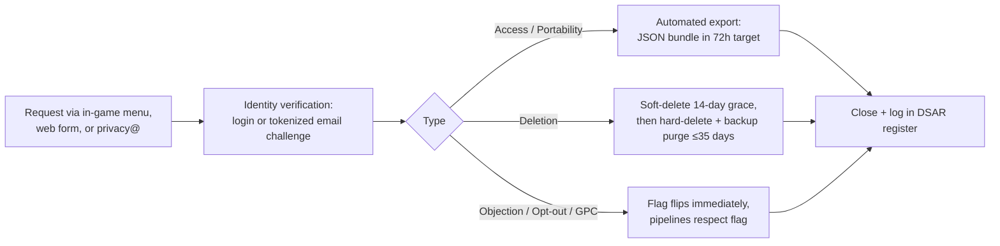

# 12 — Legal, Compliance & Privacy: Legions of Earth

**Executive summary.** Legions of Earth ships worldwide from day one, so legal readiness is a launch feature, not a back-office chore. This document commits to a concrete structure: a single contracting entity at launch with EU/UK representatives and a merchant-of-record payment model that outsources global VAT/GST; a privacy program built on data minimization (a Commander can play with nothing but a pseudonymous account), GDPR as the worldwide baseline with regime-specific deltas for CCPA/CPRA, LGPD, and a dozen other laws; a neutral age gate backed by Epic's Kids Web Services for parental consent where required; a monetization posture whose hard "no loot boxes, no paid randomness" line (per `00-vision-and-concept.md` and `06-economy-and-monetization.md`) removes the single largest regulatory risk class in games; DSA and UK Online Safety Act compliance mapped onto the moderation stack in `10-security-anticheat-trust-safety.md`; sanctions geo-handling that is respectful to blocked players; and a trademark and UGC-licensing plan for the brand and player-created content. It closes with a compliance risk register and the launch-blocking checklist that gates global release in `13-roadmap-team-budget.md`.

---

## 1. Corporate and policy structure

### 1.1 Contracting entity and governing law

**Decision: one operating entity at launch — a Delaware C-corporation ("the Studio") — supplemented by an appointed EU representative (GDPR Art. 27), a UK representative (UK GDPR Art. 27), and a merchant of record (MoR) for payments.** A two-entity model (US parent + Irish or Dutch EU subsidiary) is the standard end-state for games companies at scale, and we will re-evaluate it at the revenue milestone defined in `13-roadmap-team-budget.md`; at launch it loses because it roughly doubles legal/accounting overhead (~$60–90k/yr) while the MoR model already solves the two problems an EU entity would solve first (EU VAT and local consumer payment rails — see `06-economy-and-monetization.md`).

Governing law in the Terms of Service: **Delaware law and Delaware courts by default, with a mandatory carve-out** stating that consumers in the EEA, UK, Switzerland, Brazil, Australia, and other jurisdictions with non-waivable consumer protections retain the benefit of their local mandatory law and the right to sue in their home courts. This "local law prevails where it must" clause is what EU consumer-protection authorities (CPC network) expect after their 2018–2023 sweep actions against game publishers; fighting it is a losing position.

### 1.2 ToS/EULA essentials

One combined **Terms of Service** (account + license + conduct) plus a separate **Privacy Policy**, **Community Rules** (player-facing, plain language, localized), and **Virtual Items & Warpath Pass Terms**. Required clauses, each with the reason it exists:

| Clause | Commitment | Why |
|---|---|---|
| License, not property | Virtual items, currency, cosmetics are a limited revocable license | Standard; prevents property/estate claims; disclosed prominently per FTC and EU transparency expectations |
| Account & age | Minimum age 13 (higher where local law sets a higher floor — §3) | COPPA/GDPR-K posture |
| UGC license | Player grants worldwide, sublicensable license to Legion names, banners, chat, map markers; player warrants originality | Needed to render one player's banner on 15,000 other screens; see §7.3 |
| Conduct & fictional-banner rule | The "no real countries, ethnic groups, or political movements" naming rule from `00-vision-and-concept.md` §4.3 is a ToS term, enforced per `10-security-anticheat-trust-safety.md` | Cultural-neutrality pillar; also reduces DSA/OSA illegal-content exposure |
| Service changes & Season resets | Explicit notice that the map resets every ~8-week Season and features may change; Hall of Ages legacy persists | Prevents "you deleted my progress" claims; German courts scrutinize unilateral-change clauses, so changes to *paid* entitlements require notice + refund option |
| Termination | Graduated enforcement ladder cross-referenced to `10-security-anticheat-trust-safety.md`; appeal channel; on permanent ban, unused premium currency refundable in EEA/UK | EU fairness case law (e.g., German rulings against uncompensated forfeiture) |
| Dispute resolution | (a) 60-day informal negotiation first; (b) US players: AAA consumer arbitration, small-claims carve-out, **30-day opt-out**, no mass-arbitration fee shifting; (c) EEA/UK/BR/AU: local courts | Arbitration opt-out and small-claims carve-out are what keep US clauses enforceable post-*McGill*/mass-arbitration era; forced arbitration is unenforceable against EU consumers anyway |
| Language | ToS executed in English; **full legal translations in the top 8 revenue languages, plain-language localized summaries in all 20+ launch languages** (`07-localization-and-i18n.md`); French version controls for Quebec residents (Charter of the French Language, Bill 96) | Quebec and several civil-law states will not enforce English-only terms against consumers |

**Acceptance mechanics:** clickwrap (checkbox, not browsewrap) at registration; re-acceptance on material changes with 30 days' notice; version history publicly archived. The EU ODR platform was retired in July 2025, so the ToS no longer links it; instead we name our support portal and the informal-resolution ladder.

---

## 2. Privacy program

### 2.1 Data minimization by design

The strongest privacy position is not collecting the data. Decisions, coordinated with `04-technical-architecture.md`:

- **Guest-first play.** A visitor gets a pseudonymous Commander ID and can play immediately; email is requested only to *secure* the account (recovery) and is optional until the player joins a Legion or purchases. This shrinks the personal-data footprint for the huge top of the worldwide funnel.
- **No real names, no phone numbers, no contacts access, no precise geolocation.** Country-level geo (from IP, then discarded — IPs truncated to /24 after 30 days in logs) is used only for language defaults, regional pricing, sanctions screening, and Clash Window fairness analytics.
- **No third-party advertising SDKs in the client.** Analytics per `05-liveops-content-and-analytics.md` are first-party, keyed to the pseudonymous ID.
- **Chat** is retained 90 days for safety review, then deleted; machine-translation of chat (`07-localization-and-i18n.md`) runs through a processor under DPA with no training on our data (contract term with the MT vendor).
- **Payments never touch our servers.** The MoR holds cardholder data; we store only a transaction reference and entitlement. PCI DSS scope: SAQ-A.

### 2.2 Regimes and lawful bases

**Decision: build to GDPR as the global baseline** and layer regime deltas, rather than maintaining per-country data pipelines. GDPR is the strictest widely-applicable regime; a GDPR-clean architecture satisfies ~90% of every other law's substance.

| Regime | Applies because | Key deltas beyond the GDPR baseline |
|---|---|---|
| **GDPR / UK GDPR** | EEA/UK players | Art. 27 reps; DPO (§2.6); DPIAs; 72-hour breach notice |
| **CCPA/CPRA** (California) | CA players; thresholds likely met at scale | "Do Not Sell/Share" link (we don't sell, but we still honor **Global Privacy Control** signals); notice at collection; no financial retaliation for opt-outs |
| **LGPD** (Brazil) | Brazil is a target growth market (Pix support in doc 06) | Named DPO ("encarregado") published in the Portuguese policy; ANPD simplified-DSAR 15-day handling |
| **PIPEDA / Quebec Law 25** | Canada | Quebec: privacy officer named, privacy-by-default settings, French-first notices |
| **APPI** (Japan) | Japan launch language | Cross-border transfer disclosure of destination countries |
| **PIPA** (South Korea) | Korea launch language | Under-14 parental consent (§3); domestic agent if thresholds met |
| **DPDP Act** (India) | India is a priority market (UPI in doc 06) | Under-18 parental consent + ban on behavioral tracking of children once Rules are in force — see §3.4 |
| **POPIA** (South Africa), **PDPA** (Singapore/Thailand), **KVKK** (Turkey), **PDPL** (Saudi Arabia/UAE) | Launch languages/markets | Registration/notification duties tracked in the RoPA; Turkey VERBİS registration |

**Lawful bases (GDPR Art. 6):**

| Processing | Basis |
|---|---|
| Account, gameplay state, matchmaking into Shards, Season scoring | Contract (Art. 6(1)(b)) |
| Anti-cheat/anti-bot telemetry, security logs (`10-security-anticheat-trust-safety.md`) | Legitimate interest (6(1)(f)) — LIA documented; no solely-automated permanent bans without human review (Art. 22 posture) |
| First-party product analytics | Legitimate interest with opt-out worldwide; **consent where local law requires it via cookie rules (EU ePrivacy)** |
| Marketing email | Consent (opt-in), double opt-in in Germany |
| Chat translation | Contract (it is a core advertised feature) |
| Legal compliance (tax records via MoR, sanctions screening) | Legal obligation (6(1)(c)) |

### 2.3 Consent and cookies

**Decision: minimal-cookie architecture + Usercentrics as CMP.** The web client sets: (1) a strictly-necessary session/auth cookie, (2) a preferences cookie (language, data-saver mode), (3) an analytics identifier. Only (3) is consent-gated in the EEA/UK/Switzerland and other opt-in jurisdictions; the banner is therefore a single toggle, not a 40-vendor wall — a genuine UX win on the 3G/low-end path in `09-onboarding-retention-accessibility.md` (the CMP script is lazy-loaded, ~35 KB, after first paint). Usercentrics beats OneTrust here on script weight and per-MAU pricing at our scale; building a bespoke CMP lost because keeping pace with TCF-adjacent regulatory drift is not core work. GPC signals are honored globally, not just in California.

### 2.4 DSAR flow and deadlines

**Decision: in-house DSAR console** (an admin surface over the entitlement/profile/chat stores defined in `04-technical-architecture.md`) fronted by a Zendesk form and a `privacy@` alias. A vendor DSAR suite (Transcend, OneTrust) lost at launch scale — our data map is small and first-party; revisit if subprocessor count exceeds ~20.

Statutory clocks tracked per request: GDPR/UK 1 month (+2 extendable), CCPA 45 days (+45), LGPD simplified 15 days, Quebec 30 days. Internal SLA: **7 days** for all, so statutory deadlines are never in play. Deletion carve-outs (kept and disclosed): transaction records for tax (via MoR), ban-evasion hashes (legitimate interest, hashed identifiers only), Hall of Ages entries — these are **pseudonymized on deletion** (Commander name replaced with "a departed Commander"), preserving the monument without the identity.

### 2.5 Retention schedule (system of record)

| Data class | Retention | Rationale |
|---|---|---|
| Account core (email, passkey public-key credential material, language, country) | Life of account + 30 days post-deletion | Recovery grace; passkeys + email magic links per `10-security-anticheat-trust-safety.md` — no passwords exist to store |
| Guest accounts idle > 60 days with < 10 minutes played | Purged on rolling sweep (full delete) | Guest-first funnel hygiene, per `09-onboarding-retention-accessibility.md` §2.2 |
| Gameplay state (warband, Doctrine, Province holdings) | Season + 90 days (aggregates persist in Hall of Ages, pseudonymizable) | Season reset per `02-world-map-and-seasons.md` |
| Chat & report evidence | 90 days rolling; frozen copies for active T&S cases until case close + 6 months | Safety vs. minimization balance |
| Security/anti-cheat telemetry | 180 days | Bot-ring detection windows (doc 10) |
| Server logs w/ IP | 30 days full, then truncated 12 months | Incident response |
| Analytics events | 25 months, then aggregate-only | Two Season-over-Season yearly comparisons |
| Payment references | 7–10 years per tax law (held by MoR; we hold entitlement records 7 years) | Legal obligation |
| DSAR register, consent receipts | 5 years | Accountability |

### 2.6 Governance: DPO, RoPA, transfers, breach

- **DPO: retain a DPO-as-a-service firm in the EU (e.g., DataGuard or ePrivacy GmbH) from open beta.** Required-in-substance given systematic monitoring at scale; an internal hire lost on cost (~€120k) vs. service (~€15–25k/yr). The same engagement supplies the **Art. 27 EU representative**; a UK firm supplies the UK rep. Brazil's encarregado and Quebec's privacy officer are the Studio's Head of Operations, named in localized policies.
- **Records of Processing (RoPA)** maintained from day one in the same repository as this document set; reviewed each Season boundary (a natural 8-week compliance heartbeat).
- **DPIAs** required before launch for: chat + machine translation, anti-cheat behavioral profiling, age-assurance flow, and Clash Window notification push system.
- **Cross-border transfers:** the Studio certifies under the **EU–US Data Privacy Framework** (plus UK Extension and Swiss–US DPF) and *also* executes 2021 SCCs (Module 2) with UK IDTA Addendum as belt-and-braces given DPF litigation risk. Subprocessors (CDN, DB hosting, MT vendor, email, Zendesk, Usercentrics, KWS) are listed on a public subprocessor page with 30-day change notice. EEA player data is homed in an EU region of the primary cloud per `04-technical-architecture.md`; transfers are then mostly support-access, not bulk storage.
- **Breach response:** 72-hour supervisory notification clock (GDPR), player notification where high risk; runbook and tabletop exercise pre-launch, owned jointly with security (doc 10). Cyber/tech E&O insurance with breach-response coverage bound before open beta.

---

## 3. Minors

### 3.1 Age gate and posture

**Decision: neutral age gate at first registration (free-entry date-of-birth, no defaulted year, no "you must be 13" hint), minimum age 13 worldwide, raised where law demands.** The game is **not directed to children**: mid-core strategy theme, text-heavy diplomacy, marketing aimed 16+ (`11-marketing-community-gtm.md`). But a free browser game *will* attract under-13s, so we take the "mixed audience" precautions seriously rather than pretending otherwise — this is exactly the posture the FTC's 2025 COPPA rule amendments reward.

| Age at gate | Result |
|---|---|
| Under 13 (or under local floor) | No account. Session flag prevents same-browser retry roulette; polite localized message |
| 13 to local digital-consent age (13–16 in EU per member state; 14 in KR; see §3.4 for India) | **Teen-safe mode** + parental consent where the local basis requires it |
| At/above consent age | Full experience |

**Teen-safe mode defaults:** chat restricted to Legion-only with proactive filtering (doc 10), no public diplomacy chat, marketing consent unavailable, analytics limited to service-essential, spending disabled until parental controls are configured, profile fields locked to preset banner imagery.

### 3.2 Age assurance and parental consent

**Decision: Epic Games' Kids Web Services (KWS)** for verifiable parental consent and parent-managed permissions. It won over k-ID and Yoti on price at our volume, breadth of consent methods worldwide (card micro-charge, ID, facial-age-estimation via partners), and browser-first integration. Yoti remains the named fallback for jurisdictions where facial age estimation becomes mandatory for age assurance (a live possibility under UK OSA children's codes and EU age-verification pilots — see §5). We deliberately do **not** collect ID documents ourselves, ever.

GDPR-K (Art. 8): where consent is the basis for a processing activity and the player is below the member-state consent age, KWS gathers parental consent; where we can rest on contract/legitimate interest (core gameplay), we do, minimizing the consent surface. COPPA: because under-13s are excluded and the service is not child-directed, COPPA's verifiable-parental-consent machinery is not triggered; the age gate, its neutrality, and non-child-directed marketing are the compliance record.

### 3.3 Parental spending controls

- Spending for minors is **off by default**; a parent enables it through the KWS parent portal and sets a monthly cap (preset options 5 / 10 / 20 in local price tier — regional price points per `06-economy-and-monetization.md`).
- Every purchase confirmation restates the real-currency price (§4.1). Receipts go to the parent's email.
- Refund policy honors the practical reality of unauthorized child purchases: first-incident goodwill refund policy, no questions, within 90 days — cheaper than chargebacks and CPC-network attention.

### 3.4 Regional rules for minors in games

| Jurisdiction | Rule | Our handling |
|---|---|---|
| South Korea | Under-14 parental consent (PIPA); youth spending-limit norms | KWS consent flow; parental cap mandatory under 14. (The nighttime "shutdown law" was abolished in 2021 — no curfew logic needed) |
| China | Minor playtime/spend curfews, licensing (banhao) | **Not launching in mainland China**; no simplified-Chinese mainland distribution; Traditional Chinese serves TW/HK per doc 07 |
| India (DPDP Act) | Parental consent for under-18; no behavioral tracking/targeted ads at children | When DPDP Rules take effect: Indian minors get teen-safe mode with analytics limited to service-essential, and KWS parental consent at account creation for under-18s. Interim: 13+ gate + teen-safe mode |
| UK | Age Appropriate Design Code | High-privacy defaults for minors (already our teen-safe mode); DPIA documents AADC conformance |
| Germany (USK) / EU (PEGI) | Ratings for chat + in-game purchases descriptors | Self-rate via **IARC** questionnaire when store wrappers ship; browser launch uses PEGI 12-equivalent voluntary labeling with "in-game purchases" and "users interact" descriptors |
| Australia | Under-16 social-media minimum-age law (2025) | Tracked in the risk register; current guidance excludes games, but our chat features keep this on watch |

---

## 4. Monetization law by country

### 4.1 Virtual currency: disclosure and design rules

The premium currency ("the Warpath Pass currency and cosmetic wallet" per `06-economy-and-monetization.md`) follows the **FTC dark-pattern guidance and the CPC network's 2025 virtual-currency key principles**:

- **Real-price anchoring:** every storefront item shows local real-currency equivalence alongside the virtual price; bundle sizes map cleanly to item prices (no forced-remainder bundles like "item costs 550, packs are 500/1200").
- **No expiry** of purchased currency (several US states apply gift-card no-expiry rules to stored value; simplest worldwide policy: it never expires).
- **No countdown-pressure dark patterns** on paid items; rotating cosmetic shop items return on a published schedule.
- Purchase flow shows an unambiguous order button; in Germany the button must say the equivalent of **"zahlungspflichtig bestellen"** ("order with obligation to pay") — a localized string requirement handed to `07-localization-and-i18n.md`.
- Warpath Pass is a fixed, fully-disclosed track — its contents are listed before purchase, satisfying Japan's JOGA-style transparency norms without extra work.

### 4.2 Why the no-loot-box line eliminates the largest risk class

Because `00-vision-and-concept.md` §6 bans gacha/loot boxes and any paid randomness outright, the following simply do not apply to us — this is a *compounding* saving in legal spend, engineering, and market access:

- **Belgium** (Gaming Commission 2018 position: paid loot boxes are gambling) and the **Netherlands** (regulator posture despite the 2022 court reversal): no feature carve-outs, no country-specific store variants.
- **Korea's 2024 probability-disclosure law** and China's disclosure rules: no odds tables to publish or audit.
- **Germany/Austria consumer suits** (FIFA-points line of cases), **UK DCMS** loot-box commitments, **Spanish and Finnish draft bills**, and the **EU Digital Fairness Act** trajectory: we are outside the blast radius, and can say so in marketing (`11-marketing-community-gtm.md` should use it).
- PEGI/IARC "paid random items" descriptor: never triggered, keeping the rating floor lower in several markets.

Guardrail to keep this true: the launch-blocking checklist (§9) includes a standing rule that **any feature mixing payment and randomness — including "random cosmetic" bundles, prize wheels with paid spins, or paid keys to earned chests — requires sign-off from counsel and is presumptively rejected.**

### 4.3 Price display, VAT/GST, and tax

**Decision: merchant-of-record model (aggregator per `06-economy-and-monetization.md`, e.g., Xsolla-class) is also our tax decision.** The MoR is the seller of record, so it registers, collects, and remits VAT/GST/sales tax in 100+ jurisdictions (EU via its own OSS, UK, Australia/NZ GST, Brazil, India, GCC VAT, US marketplace-facilitator states). We display **tax-inclusive prices in the EU/UK/AU and everywhere local law or custom expects it**, tax-exclusive only where standard (US/CA). Alternative — self-registration through EU OSS plus country-by-country registrations — lost decisively: ~30 registrations, local fiscal representatives, and monthly filings is a full-time job that the MoR fee already covers. The Studio's own tax exposure reduces to US federal/state corporate tax and transfer-pricing hygiene if/when an EU entity is added.

### 4.4 EU consumer withdrawal rights for digital goods

Under the Consumer Rights Directive, EU/UK consumers get a **14-day withdrawal right** for digital content **unless** they (a) expressly consent to immediate delivery and (b) acknowledge losing the withdrawal right. Our purchase flow implements exactly that two-checkbox pattern for instant delivery of currency/cosmetics; the confirmation email restates it. For the **Warpath Pass**, treated as digital content delivered immediately (track unlocks at once), the same waiver applies; if a player has consumed nothing, we refund within 14 days anyway as policy — goodwill that also satisfies Germany's stricter consumer climate. The Digital Content Directive's conformity duty means paid cosmetics must keep working for the period the consumer reasonably expects: our commitment is **cosmetics persist across Seasons via the Hall of Ages legacy system**, which is precisely what doc 00 promises, so law and design already agree.

---

## 5. Platform-law obligations: EU DSA and UK Online Safety Act

With Legion/Coalition chat, player-authored names and banners, and map markers, LoE is a **hosting service and likely an "online platform"** under the DSA and a **user-to-user service** under the UK OSA. Compliance is largely *operational*, and the moderation stack in `10-security-anticheat-trust-safety.md` was designed to satisfy it:

| Obligation | Source | How the doc-10 stack satisfies it |
|---|---|---|
| Notice-and-action for illegal content | DSA Art. 16 | In-client report flow on every piece of UGC (chat line, name, banner); triaged queue with SLA tiers |
| Statement of reasons to sanctioned users + submission to the EU Transparency Database | DSA Art. 17/24(5) | Enforcement ladder generates templated, localized statements; automated Transparency DB submission job |
| Internal complaint-handling (appeals) | DSA Art. 20 | Appeal channel with human review, distinct from first decision-maker |
| Single point of contact + legal rep in EU | DSA Arts. 11–13 | Published contact; Art. 27 rep engagement extended to DSA legal-rep service |
| Annual transparency report | DSA Art. 15/24 | Counts already emitted by moderation tooling; note: DSA exempts **micro/small enterprises** from some Art. 24 duties — we likely qualify pre-scale, but we build the reporting anyway since OSA wants similar numbers |
| No dark patterns; no ads profiling minors | DSA Arts. 25/28 | No third-party ads at all; §4.1 covers dark patterns |
| Illegal-content risk assessment; children's access assessment + children's risk assessment | UK OSA (Ofcom codes) | Written assessments before UK availability; teen-safe mode and proactive filtering are the resulting mitigations; assessments re-run each time chat features materially change |
| Age assurance if children likely to access harmful content | UK OSA | Our content ratings and filtered chat keep us outside the pornography/self-harm-driven "highly effective age assurance" mandate; Yoti is the contingency vendor if Ofcom guidance shifts for social/chat features |
| CSAM detection/reporting | Global (NCMEC reporting for US provider) | No image-UGC surface exists at launch (no free-drawing, no image upload; banners are composed from pre-cleared library elements — see doc 10); NCMEC reporting pipeline stands ready for reports; PhotoDNA-class hash-matching is a precondition of any future image-upload surface, which is itself gated on a Trust & Safety review |

We are far below **VLOP** thresholds (45M EU users) and plan no systemic-risk-audit machinery; the risk register tracks the threshold as growth insurance.

---

## 6. Sanctions and export controls

- **Restricted territories at launch:** Cuba, Iran, North Korea, Syria, and the Crimea/Donetsk/Luhansk regions (OFAC comprehensive programs), plus any territory the MoR cannot lawfully serve. Russia and Belarus: gameplay access is not sanctioned, but payments largely are — **decision: play allowed, purchases unavailable** there via MoR payment-rail gating, revisited quarterly with counsel.
- **How we geo-handle respectfully:** the block is at account-creation and payment level by IP + payment-country signals — not a mid-session rug-pull. The message is honest and localized: "Legions of Earth can't operate in your region because of trade restrictions that apply to us, not because of you." No taunting error codes, no silent failures. VPN circumvention is not hunted aggressively for *play* (we are not obligated to be perfect, only diligent); payment screening is the hard wall and sits with the MoR's OFAC/EU/UK screening.
- **Export controls:** the client uses standard TLS; mass-market encryption in a publicly available web app falls under EAR §740.17/5D992-class treatment with self-classification — one memo from counsel, filed, done. No controlled technology ships.
- The fictional-banner rule (§1.2) has a sanctions-adjacent benefit: no in-game representation of real states means no accidental "hosting content of a sanctioned government" edge cases.

---

## 7. Intellectual property

### 7.1 Clearing and protecting the name

"Legions of Earth" is a **working title until clearance completes** (doc 00 says "working title" deliberately). The word "Legion" is crowded in games (multiple marks in class 9/41). Plan, budgeted in `13-roadmap-team-budget.md`:

1. **Knockout search** (counsel + Corsearch-class database) across Nice classes **9 (software), 41 (entertainment services), 42 (online services)** in the top-12 launch markets — 2 weeks, ~$8–12k.
2. If cleared: file **US + EUIPO + UK direct, then Madrid Protocol** designations for JP, KR, BR, IN, MX, AU, TR, ID off the US base — ~$25–35k all-in.
3. If blocked: two pre-cleared fallback titles are kept under NDA; the brand system in `08-art-and-ux-direction.md` is built logo-first so a rename before marketing spend is cheap. **Hard rule: no paid marketing (doc 11) starts before at least US/EU/UK applications are on file.**
4. Domain + handle sweep at knockout time; UDRP is the recourse for squatters, not negotiation from weakness.

Defensive hygiene: register the game name and Studio name as marks; do **not** attempt to trademark generic in-game vocabulary (Commander, Province) — unprotectable and community-hostile. Copyright in code, art, and music is owned via employee IP assignment and contractor work-for-hire clauses (contract templates are a launch-blocking item).

### 7.2 Third-party content

License audit ledger for every font (check the 20+-language font stack in doc 07 — CJK fonts have notoriously restrictive licenses; commit to open-licensed Noto family as default), audio, middleware, and open-source package (SPDX scan in CI per `04-technical-architecture.md`; no AGPL in the client or server without counsel sign-off). Map data: base geography generated from open sources (Natural Earth-class public domain data), documented so no ODbL share-alike obligations attach to our derived hex world.

### 7.3 Player-created content and community programs

- **UGC license** (§1.2) is broad but honest: players keep ownership; we get the operational license; we commit not to sell player-created designs as standalone paid cosmetics without a separate opt-in agreement.
- **DMCA:** registered agent with the US Copyright Office; notice/counter-notice flow folded into the doc-10 report tooling; repeat-infringer policy (required for safe harbor).
- **Community translation program** (doc 07): contributors sign a lightweight CLA granting a perpetual license to their strings with attribution in credits — prevents a translator revoking a live language pack.
- **Fan content policy** published at launch: streaming, videos, fan art expressly welcomed (monetized streams included); no fan projects using our trademarks in their *titles*; no implication of endorsement. This is the Riot/Blizzard-style policy shape and it is a marketing asset (doc 11).
- **Hall of Ages** records player deeds permanently by design; the ToS discloses this, and §2.4's pseudonymization-on-deletion squares permanence with erasure rights.

---

## 8. Compliance risk register

Likelihood/impact on 1–5 scale (5 highest). Owners are roles defined in `13-roadmap-team-budget.md`.

| # | Risk | L | I | Mitigation | Owner |
|---|---|---:|---:|---|---|
| R1 | Child-privacy enforcement (age-gate failure, under-13 slip-through) | 3 | 5 | Neutral gate, teen-safe defaults, KWS consent, non-child-directed marketing record, annual audit of age-signal contradictions | DPO + T&S Lead |
| R2 | A future feature drifts into paid randomness | 2 | 5 | Standing counsel-veto rule (§4.2) in the feature-review template; LiveOps training | GC (fractional) |
| R3 | DSA/OSA duties missed as chat scales (statements of reasons, risk assessments stale) | 3 | 4 | Compliance items in Season-boundary checklist; automated Transparency DB job; Ofcom code tracker | T&S Lead |
| R4 | Trademark opposition forces rename after marketing spend | 2 | 4 | Clearance-before-spend rule; fallback names; logo-first brand | GC + Marketing Lead |
| R5 | Cross-border transfer invalidation (DPF struck down) | 2 | 3 | SCCs already executed in parallel; EU data-homing limits bulk exposure | DPO |
| R6 | Sanctions payment slip (blocked-region purchase) | 2 | 4 | MoR screening is contractual; quarterly geo-rule review; no self-processed payments | Payments Lead |
| R7 | Data breach of account store | 2 | 4 | Doc-10 controls, breach runbook, cyber insurance, minimal PII collected in the first place | Security Lead |
| R8 | Consumer-authority action on virtual-currency presentation | 2 | 3 | §4.1 disclosure rules baked into storefront components, not per-screen | Economy Lead |
| R9 | India DPDP Rules stricter than planned (under-18 flows) | 3 | 3 | KWS flow already built for KR under-14; India toggle reuses it; interim teen-safe mode | DPO |
| R10 | UGC liability (extremist/real-world-political banners evade filters) | 3 | 3 | Fictional-banner rule + no image-UGC surface at launch + doc-10 reporting; DSA notice-and-action | T&S Lead |
| R11 | Community-translation IP dispute | 2 | 2 | CLA before contribution; string provenance tracked | Localization Lead |
| R12 | Australia/EU minimum-age laws extend to games with chat | 2 | 4 | Quarterly legislative watch; teen-safe mode is the ready-made mitigation | GC |

---

## 9. Launch-blocking checklist

Global launch (per `13-roadmap-team-budget.md` milestones) does not proceed until every box is checked:

- [ ] ToS, Privacy Policy, Community Rules, Virtual Items Terms finalized; full translations in top-8 languages, summaries in all launch languages; clickwrap live
- [ ] Age gate + teen-safe mode shipped; KWS integration tested in EU (per-state consent ages), KR (14), and UK (AADC defaults)
- [ ] DSAR console + `privacy@` intake operational; deletion pipeline verified end-to-end including backup purge and Hall of Ages pseudonymization
- [ ] RoPA current; DPIAs signed for chat/MT, anti-cheat profiling, age assurance, push notifications
- [ ] DPO service, EU + UK Art. 27 reps, DSA point of contact engaged and published
- [ ] DPF certification filed **and** SCCs/IDTA executed with all subprocessors; public subprocessor page live
- [ ] CMP live; GPC honored; cookie inventory matches reality (automated scan in CI)
- [ ] MoR contract covers tax remittance in all launch markets; tax-inclusive price display verified in EU/UK/AU; withdrawal-right waiver flow and German button-rule string verified
- [ ] No-paid-randomness veto rule embedded in feature-review template with counsel sign-off recorded
- [ ] DSA notice-and-action, statements of reasons, appeals, and Transparency DB job live; OSA illegal-content and children's assessments written and mitigations mapped
- [ ] Sanctions geo-rules deployed (CU/IR/KP/SY/Crimea-DNR-LNR block; RU/BY purchase-off); respectful localized messaging reviewed
- [ ] Encryption self-classification memo filed; OSS license scan clean; font/audio license ledger complete
- [ ] Trademark applications on file in US/EU/UK minimum; DMCA agent registered; fan content policy and UGC license live
- [ ] Breach runbook tabletop completed; cyber E&O insurance bound
- [ ] Employee/contractor IP assignment templates executed for all contributors to shipped code and art

**Standing cadence after launch:** a compliance review at every Season boundary (~8 weeks) covering the legislative watchlist (R12), RoPA drift, DSA/OSA metrics, and any new market entries — legal compliance on the same heartbeat as the game itself.
