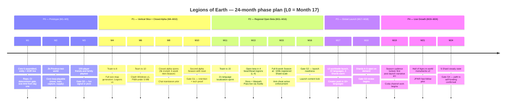

# 13 — Roadmap, Team & Budget: Legions of Earth

**Executive summary.** This document commits Legions of Earth to a 24-month plan: a 3-month prototype (P0) built by a core team of six, a 7-month vertical slice and closed alpha (P1), a regional open beta (P2), global launch at month 17 (P3), and live growth through month 24 (P4). Each phase ends at a go/no-go gate with measurable criteria — fun signal, retention, cost per Shard, and integrity metrics — and we do not proceed on calendar pressure. The team grows from 6 to ~22 at launch, remote-first across the Americas, EMEA, and APAC, because a worldwide team is both cheaper and the only honest way to build a game whose core mechanic is time zones. The total 24-month envelope is **$4.2M lean / $6.0M base**, of which personnel is ~57%, marketing ~17% (per [11-marketing-community-gtm.md](11-marketing-community-gtm.md)), and infrastructure ~6% (per [04-technical-architecture.md](04-technical-architecture.md)'s cost model). Monetization goes live in regional beta; per [06-economy-and-monetization.md](06-economy-and-monetization.md), net revenue reaches a ~$113k/month base-case run rate by launch + 12 months — about three-quarters of the steady-state live burn, with the strong case or Shard-count growth closing the rest — against the anchor's self-sustaining criterion. The plan closes with the top 10 risks (with named owners), an open-questions register, and the first 30-day action list.

---

## 1. Phase plan: 24 months, five phases

Global launch (L0 in [11-marketing-community-gtm.md](11-marketing-community-gtm.md)'s offset notation) lands at **month 17**. All of doc 11's L-offsets resolve against that anchor: alpha prep begins L-12 = M5, regional open beta opens L-4 = M13. Phases overlap deliberately at their seams — beta hardening starts while alpha is still running — but each phase has one owner and one exit gate.

**Phase owners:** P0–P1 Game Director; P2 Producer (launch readiness is an operations problem); P3 Producer + Marketing Lead jointly; P4 LiveOps Designer. The Tech Lead co-owns every gate's technical criteria.

Two scheduling rules bind everything:

1. **Seasons are the metronome.** From the first closed-alpha mini-Season (M8) onward, every internal milestone is expressed in Seasons, not sprints. The alpha runs two compressed 4-week Seasons to test the reset machinery ([02-world-map-and-seasons.md](02-world-map-and-seasons.md)) twice before any public player sees it; beta and live run the full ~8-week cadence.
2. **Gates gate money, not just features.** Each gate releases the next phase's budget tranche. A missed gate triggers a mandatory 4-week fix-or-descope cycle, then a re-test — never a waiver.

---

## 2. Scope cutlines: what ships when

The matrix below is the binding cutline against the feature sets specified in docs 01–10. "v1" means the minimum coherent version of the sibling doc's spec; "full" means the launch spec of that doc.

| Capability (owning doc) | P0 Prototype | P1 Alpha | P2 Beta | P3 Global launch |
|---|---|---|---|---|
| Map: hex world, biomes, supply lines ([02](02-world-map-and-seasons.md)) | 2k-Province region | Full ~48k-land-Province generation | Full + season variations | Full |
| Core loop: move, train, build, scout ([01](01-game-design-document.md)) | Yes (3 unit archetypes) | All 5 archetypes | Full + balance passes | Full |
| Doctrines + deterministic auto-battle ([01](01-game-design-document.md)) | Simplified (fixed doctrine) | Full doctrine editor, replays | Full | Full |
| Legions: ranks, treasury, Stronghold ([03](03-legions-social-and-diplomacy.md)) | Named groups + chat only | Full v1 | Full + Coalition diplomacy | Full |
| Coalitions, diplomacy, congress ([03](03-legions-social-and-diplomacy.md)) | — | Coalition basics (pacts) | Full v1 | Full |
| Skirmish layer ([01](01-game-design-document.md)) | Yes (the P0 combat) | Full | Full | Full |
| Clash Windows, time-zone rotation ([00](00-vision-and-concept.md) §4.4) | — | v1, rotation rules live | Full, rotation audited per region | Full |
| Seasons + reset + Hall of Ages ([02](02-world-map-and-seasons.md)) | — | 4-week mini-Seasons, Hall of Ages ledger only | Full 8-week Season, Hall of Ages v1 UI | Full; in-world monuments v2 in P4 |
| Player market + caravans ([06](06-economy-and-monetization.md) §economy) | — | Barter-only stub | Full regional market | Full |
| Monetization: store, Laurels, Warpath Pass ([06](06-economy-and-monetization.md)) | — | Dark (store stub, no real money) | **Live** via Xsolla MoR, 4-tier regional pricing | Full; gifting + creator codes |
| Payments long tail: Coda, carrier, prepaid ([06](06-economy-and-monetization.md) §7) | — | — | — | Deferred to L+4–6 as planned |
| Languages ([07](07-localization-and-i18n.md)) | en + pseudo-locales in CI | en + 4 pilot (es-419, pt-BR, id, ar for RTL proof) | 21 professional languages, LQA passed | 22 incl. en; community T3 program opens P4 |
| Chat translation ([04](04-technical-architecture.md) §5, [07](07-localization-and-i18n.md) §4 owns the provider decision) | — | Translate-on-tap pilot (Google Cloud Translation v3) | Full launch policy: Google Cloud Translation v3 + locked game-term glossary | Full; self-hosted NLLB-200 migration post-launch at [07](07-localization-and-i18n.md)'s spend threshold |
| Client: PWA, <5 MB, Tier C Lite Map ([04](04-technical-architecture.md)) | Desktop browser only | PWA, 5 MB enforced, Tier B floor | Tier C Lite Map + data-saver mode | Full, p75 <6 s worldwide |
| Onboarding FTUE + new-player shield ([09](09-onboarding-retention-accessibility.md)) | — | FTUE v1, 7-day shield | Full FTUE, localized | Full |
| Accessibility WCAG 2.2 AA ([09](09-onboarding-retention-accessibility.md)) | Colorblind-safe palettes from day one | Keyboard nav, contrast pass | Screen-reader menus, internal audit | External AA audit passed |
| Anti-cheat, bot/multi-account detection ([10](10-security-anticheat-trust-safety.md)) | Server authority only | Telemetry + detection v1 (observe mode) | Active enforcement, appeals flow | Full |
| Trust & Safety: naming rules, moderation ([10](10-security-anticheat-trust-safety.md)) | — | Name filter (fictional-banners rule) | Full reporting + human review queue | Full, 24/7 via follow-the-sun team + contractors |
| Analytics + experimentation ([05](05-liveops-content-and-analytics.md)) | Event log only | Core funnels, cohort dashboards | Full telemetry, A/B harness | Full |
| LiveOps events + narrative arcs ([05](05-liveops-content-and-analytics.md)) | — | — | One world event tested | Full Season arc cadence |
| Art: final style, cosmetics pipeline ([08](08-art-and-ux-direction.md)) | Placeholder/graybox | Final map + UI style | Cosmetics pipeline producing weekly | Full |

**Explicitly deferred beyond the 24-month window** (each has a decision date in §8):

- **App-store wrappers** (iOS/Android/Steam). The PWA is the flagship channel and the margin strategy ([06](06-economy-and-monetization.md) §7). Decision at L+6.
- **Deep JP/KR launches.** Fast-follow pilot only at M21 per [11-marketing-community-gtm.md](11-marketing-community-gtm.md); full investment is a P5 decision.
- **Spectator/esports features** beyond replay sharing. Clash spectating is cheap by design ([04](04-technical-architecture.md) risk 2) but productizing it is not launch-critical.
- **User-run tournament/custom-map modes.** Conflicts with Pillar 1 (one shared world) until the core proves out.
- **Voice chat.** Text with translation is the worldwide-equalizer choice; voice fragments Legions by language.
- **T3 community-language long tail** beyond the program's opening cohort ([07](07-localization-and-i18n.md) §6).

---

## 3. Go/no-go gates

Every gate measures four families: **fun**, **retention**, **cost**, **integrity** — plus phase-specific technical proof. Gate reviews are written, half-day, and end in one of: GO / FIX (4-week cycle, re-test) / PIVOT / STOP.

| Gate | When | Fun signal | Retention | Cost | Integrity / tech proof |
|---|---|---|---|---|---|
| **G0** end P0 (M3) | 100-player friends-and-family, 2 weeks | ≥60% of playtesters return unprompted ≥3 of final 7 days; median session completes a visible contribution in ≤5 min; playtest NPS ≥ +20 | D3 ≥ 45% within the cohort | Burn ≤ $225k cumulative | Battle replays bit-identical across arm64/x64 (determinism gate green); 45+ fps map on 2019 2 GB Android |
| **G1** end P1 (M10, after 2 alpha Seasons) | ≥60% of session-3-reaching alpha players in a Legion ([11](11-marketing-community-gtm.md) Gate 1); invite-code redemption ≥ 50% | D1 ≥ 30%, **D7 ≥ 12%**; Season-2 return rate ≥ 35% of Season-1 actives | Alpha infra ≤ $10k/mo total; projected mature-Shard cost tracking to [04](04-technical-architecture.md)'s $13.1k model ±25% | First-load < 5 MB enforced in CI; crash-free sessions ≥ 99%; bot-detection pipeline observing with <5% false-positive rate on known-human sample |
| **G2** end P2 (M16) | K-factor ≥ 0.25; ≥35% of registrations via Muster/invite links ([11](11-marketing-community-gtm.md)) | D1 ≥ 35% trending 40%; D7 ≥ 15%; D30 ≥ 6% trending 8%; ≥55% of D7-retained in a Legion (identical to [11](11-marketing-community-gtm.md) Gate 2; KPI defined in [05](05-liveops-content-and-analytics.md) §8) | Blended CPR ≤ $0.35 in beachheads; **infra ≤ $15k/Shard/mo** trending to [04](04-technical-architecture.md)'s $13.1k model; payer conversion ≥ 1.2% in monetized cohorts with refunds < 0.8% | ≤3% of accounts actioned per Season with downward trend; p75 first-interaction < 6 s in beachhead countries incl. 3G ([04](04-technical-architecture.md) RUM by country); 21 languages LQA-passed; zero critical findings in pre-launch security review ([10](10-security-anticheat-trust-safety.md)) |
| **G3** L+3 (M20) | Median Legion spans ≥ 2 countries trending 3; replay share rate ≥ 8% | D1 ≥ 40%; D30 ≥ 8%; ≥55% of D7-retained in a Legion | Effective CPR ≤ $0.15 post-viral; net revenue ≥ $40k/mo and rising; infra per registered ≤ $0.11/mo | 1M registered in 90 days across ≥40 countries; no country > 30% of MAU; actioned accounts < 2%/Season |
| **G4** M24 | Season-over-Season active-Legion survival ≥ 60% | D30 stable ≥ 8% across 2 consecutive Seasons | Net revenue run rate ≥ 70% of live-crew cost, on trajectory to 100% by L+12 ([06](06-economy-and-monetization.md) §8.2) | All [00](00-vision-and-concept.md) §9 integrity and performance targets green or trending green |

Failure playbooks are pre-written: G0 fail = pivot the loop, not the vision (one pivot budgeted); G1 retention fail = FTUE/Legion-onboarding rework per [09](09-onboarding-retention-accessibility.md), not more features; G2 cost fail = delay launch one Season — a delayed launch costs ~$250k/month of burn, a failed one costs the company.

---

## 4. Team plan: 6 → 22 → live crew

### 4.1 Principles

- **Remote-first, worldwide, deliberately spread across time zones.** We hire across the Americas, EMEA, and APAC with an employer-of-record (**Deel**) so we can employ in ~100 countries without entities. This is not just cost arbitrage: a team spread from São Paulo to Manila *plays the game the way our players will*, gives follow-the-sun incident and Trust & Safety coverage without night shifts, and staffs community roles with native speakers. Every discipline keeps a ≥3-hour overlap with a UTC±0–2 "spine"; decisions are written (Notion), work is tracked in Linear, and synchronous meetings fit inside the spine window.
- **Seniors first, then leverage.** The first 12 hires are senior generalists; juniors and contractors arrive once systems exist to absorb them.
- **Contract the spiky work.** Audio/music ([08](08-art-and-ux-direction.md)), narrative writing, the WCAG audit, security pentest ([10](10-security-anticheat-trust-safety.md)), tier-1 player support (PartnerHero-class vendor from P3), and all translation ([07](07-localization-and-i18n.md)) are contracted, not hired.

### 4.2 Hiring sequence

| # | Role | Lands | Phase | Why then |
|---|---|---|---|---|
| 1 | Game Director / Lead Designer (founder) | M0 | P0 | Owns the fantasy and the cutlines |
| 2 | Tech Lead / Simulation Engineer (founder) | M0 | P0 | Deterministic sim core is the riskiest code; built first ([04](04-technical-architecture.md) §4) |
| 3 | Senior Client Engineer (PixiJS/WebGL) | M0 | P0 | The 5 MB / low-end promise is won or lost in month one |
| 4 | Senior Platform Engineer (API, DB, infra) | M0 | P0 | Event-sourced backbone from day one; retrofits are fatal |
| 5 | Product Artist (map + UI, [08](08-art-and-ux-direction.md)) | M0 | P0 | Map readability *is* the game; graybox with intent |
| 6 | Producer / Ops generalist | M0 | P0 | Runs EOR, contracts, playtests, and this document |
| 7 | Systems / Economy Designer | M4 | P1 | [01](01-game-design-document.md) + [06](06-economy-and-monetization.md) economy math needs a dedicated owner before alpha |
| 8 | Backend Engineer #2 (realtime, gateways) | M4 | P1 | WS fan-out and region actors for full-size world |
| 9 | UX Designer | M5 | P1 | FTUE and 5-minute-session ergonomics ([09](09-onboarding-retention-accessibility.md)) |
| 10 | Community Manager (global) | M5 | P1 | Alpha prep starts L-12 = M5 exactly per [11](11-marketing-community-gtm.md) |
| 11 | Growth / Full-stack Engineer | M7 | P1 | Owns viral-loop instrumentation — a named headcount commitment in [11](11-marketing-community-gtm.md) §3 |
| 12 | QA / Playtest Lead | M7 | P1 | Alpha at 5k players needs structured test ops + the device lab |
| 13 | Localization Manager | M10 | P2 | Drives the 21-language sprint and the Crowdin pipeline ([07](07-localization-and-i18n.md)) before beta |
| 14 | Data Analyst | M11 | P2 | Gate G2 is decided on cohort data ([05](05-liveops-content-and-analytics.md)) |
| 15 | DevOps / SRE | M11 | P2 | Multi-Shard operations, on-call maturity before real money flows |
| 16 | Trust & Safety / Support Lead | M12 | P2 | Moderation queue, naming enforcement, support vendor onboarding ([10](10-security-anticheat-trust-safety.md)) |
| 17 | Artist #2 (cosmetics pipeline) | M13 | P2 | Store opens at beta; cosmetics are the revenue line |
| 18 | LiveOps Designer | M14 | P2 | Owns Season events and the [05](05-liveops-content-and-analytics.md) cadence; becomes P4 phase owner |
| 19 | Creator Relations Lead | M15 | P3 | Wave-1 creator program and Vanguard tier ([11](11-marketing-community-gtm.md) §6) |
| 20–21 | Regional Community Coordinators ×2 | M16 | P3 | Aligned to doc 11's regional hubs; hired in-region, native-language |
| 22 | Security Engineer | M16 | P3 | Full-time anti-cheat/anti-fraud at launch scale ([10](10-security-anticheat-trust-safety.md)) |

Lean scenario trims to a peak of 18 by making roles 9, 17, 19 contract and merging 14 into 11.

### 4.3 The live crew (steady state, from ~L+9)

After launch the organization splits into a **live crew** and a **growth bet**. The live crew is the minimum organization that keeps the world running, Seasons shipping, and players safe — and it is the unit the anchor's "self-sustaining by month 12" criterion applies to:

- 10 FTE: LiveOps Designer (lead), 2 gameplay engineers, 1 client engineer, 1 SRE, 1 artist, 1 data analyst, Community Manager + 2 regional coordinators
- Plus: support vendor pod, T&S contractor coverage, localization vendor per [07](07-localization-and-i18n.md), infra at 5 Shards

Fully loaded, this crew runs **≈ $75–80k/month personnel + $51.1k infra (5 Shards, [04](04-technical-architecture.md) §7) + $16.4k localization ≈ $143–148k/month**, against [06-economy-and-monetization.md](06-economy-and-monetization.md)'s base-case month-12 net run rate of ~$113k/month — the base case covers roughly three-quarters of the live burn, with the gap carried by remaining runway until the strong case, Shard-count growth, or the chat-MT cost curve ([07](07-localization-and-i18n.md) §4.2) closes it. Everyone above the live crew (roughly 10–12 people at M24) is the growth bet, funded by remaining runway and the revenue curve, and is the first thing resized if G4 misses.

---

## 5. Budget: 24-month envelope

### 5.1 Assumptions

- **Personnel:** fully loaded cost (salary + EOR fees + benefits + equipment) blended across seniority and geography. Base: **$9.6k/FTE-month** ($115k/yr); lean: **$7.9k** ($95k/yr, deeper skew to lower-cost regions and mid-level hires). Worldwide hiring is what makes these bands possible at senior quality.
- **Person-months:** base ramp per §4.2 totals ~353 FTE-months over 24 months; lean ~300.
- **Infrastructure:** from [04-technical-architecture.md](04-technical-architecture.md) §7 — $13.1k/Shard/month at mature scale (chat MT included; it ramps with DAU, so young Shards run far cheaper); pre-launch environments per its §8.
- **Localization:** from [07-localization-and-i18n.md](07-localization-and-i18n.md) §6.2 — $113k one-time launch localization + ~$30.3k/Season ongoing.
- **Marketing:** [11-marketing-community-gtm.md](11-marketing-community-gtm.md) §9's $1.2M program; $994k of it falls inside this 24-month window (the balance is L+8–L+12 sustain spend).

### 5.2 Envelope by category

| Category | Lean | Base | Notes |
|---|---:|---:|---|
| Personnel (incl. contractors for audio, narrative, audits) | $2.37M | $3.39M | 58% of base total |
| Infrastructure & platform | $0.28M | $0.36M | Peaks at ~$45k/mo late in P4 as Shards mature (chat MT ramps with DAU; [04](04-technical-architecture.md) §7) |
| Localization | $0.21M | $0.29M | Lean trims T2 roster at launch, promotes on evidence |
| Marketing program | $0.70M | $0.99M | Lean cuts paid media ~30%, keeps creators |
| Tools, legal, G&A | $0.27M | $0.39M | See breakdown below |
| Contingency (10%) | $0.39M | $0.54M | Released only by gate reviews |
| **Total 24-month envelope** | **$4.22M** | **$5.97M** | |

Tools/legal/G&A base breakdown: software stack $80k (GitHub, Linear, Notion, Figma, Slack, Crowdin, Sentry; Grafana Cloud sits in the infra line per [04](04-technical-architecture.md)); legal & compliance execution $160k (entity, ToS/privacy counsel, DPO-as-a-service, age-rating and per-country monetization review per [12-legal-compliance-privacy.md](12-legal-compliance-privacy.md)); accounting/insurance/banking $70k (Ramp + fractional CFO); recruiting $50k; low-end device lab $30k (forty 2018–2021 Android handsets and throttled-3G rigs distributed to QA and regional staff — the worldwide performance promise is tested on real hardware in real markets, not simulators).

### 5.3 Spend by phase (base)

| Phase | Window | Personnel | Infra | Loc | Marketing | G&A | +10% cont. | Phase total |
|---|---|---:|---:|---:|---:|---:|---:|---:|
| P0 | M1–3 | $173k | $5k | — | — | $25k | $20k | **$223k** |
| P1 | M4–10 | $662k | $35k | $15k | $80k | $80k | $87k | **$959k** |
| P2 | M11–16 | $893k | $60k | $143k | $300k | $110k | $151k | **$1.66M** |
| P3 | M17–18 | $394k | $50k | $33k | $300k | $60k | $84k | **$921k** |
| P4 | M19–24 | $1,267k | $210k | $98k | $314k | $115k | $200k | **$2.20M** |
| **Total** | | **$3.39M** | **$360k** | **$289k** | **$994k** | **$390k** | **$542k** | **$5.97M** |

The tranche structure follows the gates: only **$223k is at risk before the fun signal exists** (G0), and $1.18M before the first real retention read (G1). Anyone funding this plan is buying a cheap kill-test first and a launch second.

### 5.4 What lost

- **A single-region "soft launch country" instead of a 4-region beta.** Cheaper, but it cannot validate time-zone rotation, cross-language Legions, or Tier 3–4 payment behavior — the three things this game uniquely depends on.
- **Hiring a co-located core in one hub city.** ~35% higher personnel cost and it would ship a game about time zones built by people who share one.
- **Doubling marketing to buy the 5M-registered goal.** [11](11-marketing-community-gtm.md)'s math is explicit: the viral loops are the scale engine; paid media beyond ~30% of any phase budget buys registrations that don't retain.

---

## 6. Revenue interplay: when the game funds itself

Monetization switches on at **regional open beta (M13)** — the store, Laurels, and the Warpath Pass via Xsolla as merchant of record, with 4-tier regional pricing from day one ([06-economy-and-monetization.md](06-economy-and-monetization.md) §7). Beta purchases are wipe-safe (cosmetics and pass progress persist through Season resets and into launch), so early spending is honest. This gives us four months of real payment-rail, refund, and price-tier data before L0 — Gate G2 includes payer-conversion and refund-rate criteria for exactly this reason.

The revenue trajectory against cost, from [06](06-economy-and-monetization.md) §8.2:

| Milestone | Lean | Base | Strong |
|---|---|---|---|
| Net revenue inside the 24-month window (M13–M24) | ~$0.15M | ~$0.30M | ~$0.65M |
| Month-12-post-launch (M29) net run rate | $46k/mo | $113k/mo | $263k/mo |
| Live crew fully covered (≈$113k/mo, §4.3) | ~L+20 | **~L+12 (M29)** ✅ anchor target | ~L+8 |
| Full ~20-person org covered (~$250k/mo) | not in model | ~L+24 at base growth | ~L+12 |

Three commitments follow:

1. **The envelope in §5 does not count revenue.** In-window revenue (~$0.3M base) is treated as runway extension, not plan funding. The plan must close on the $4.2–6.0M envelope alone.
2. **The anchor's "self-sustaining live team by month 12" is met in the base case with near-zero margin.** That is deliberate — it is why the live crew is sized at 10 FTE and why lean cost discipline is a launch feature, not austerity. If G3 revenue KPIs track below base, the P4 growth bet shrinks at M22, not the live crew.
3. **Revenue upside has a pre-committed destination:** strong-case surplus funds, in order, the Coda/carrier-billing channel (unlocking Tier 4 spend), the JP/KR follow-through, and T2→T1 language promotions ([07](07-localization-and-i18n.md) §6.4) — all reach investments, consistent with Pillar 4.

---

## 7. Top 10 risks

| # | Risk (category) | Owner | Mitigation |
|---|---|---|---|
| 1 | **The mass-scale fun never materializes** — the loop works at 100 players but not 15k (design) | Game Director | G0/G1 gate structure with kill criteria; alpha runs two full mini-Seasons at 5k; one funded pivot; staged Shard population targets per [02](02-world-map-and-seasons.md) |
| 2 | **Shard cold-start** — a world at 10% population feels dead and kills retention before mass arrives (design/market) | Producer | Gated Shard opening tied to registration waves; invite/Muster mechanics front-load Legions ([11](11-marketing-community-gtm.md) §3); frontier compression per [02](02-world-map-and-seasons.md); never open a Shard we can't fill to 30% in week one |
| 3 | **Retention below gates** — D7/D30 miss and the funnel economics collapse (design) | Game Director + Data Analyst | FTUE instrumented from alpha ([09](09-onboarding-retention-accessibility.md)); fix-or-descope cycles at G1/G2; Legion-joining is the retention lever we pull first (anchor §9 social targets) |
| 4 | **Infra or DB costs blow past the [04](04-technical-architecture.md) model** at real launch load (technical) | Tech Lead | Cost per Shard is a *gate metric* (G2 ≤ $15k/mo); loadtest env at 20k simulated CCU before each Season; event-sourced design keeps the expensive layers (egress, fan-out) degradable |
| 5 | **Botting/multi-accounting corrupts territory outcomes** and honest Legions quit (technical/integrity) | Security Engineer (Tech Lead until M16) | Detection observing from alpha, enforcing from beta ([10](10-security-anticheat-trust-safety.md)); integrity is a gate family at every gate; <2%-actioned launch target from the anchor |
| 6 | **Viral loops underperform (K < 0.25)** and CAC makes the reach target unaffordable (market) | Marketing Lead | Doc 11's beta calibration exists to learn this at $100k, not $1M; portal channel and creator commissioning as non-paid fallbacks; G2 blocks launch until K ≥ 0.25 |
| 7 | **Per-country regulatory friction** — minors' spending law, consumer-rights variance, data-localization surprises (regulatory) | Producer + outside counsel | Xsolla MoR absorbs tax/consumer mechanics ([06](06-economy-and-monetization.md) §7); [12](12-legal-compliance-privacy.md) compliance matrix reviewed each gate; conservative defaults (minors' caps, refunds worldwide) reduce per-country variance |
| 8 | **Culturalization failure** — a banner, name, or event reads as a real-world political statement in some market (market/integrity) | Localization Manager + T&S Lead | Fictional-banners rule enforced at naming ([00](00-vision-and-concept.md) §4.3, [10](10-security-anticheat-trust-safety.md)); [07](07-localization-and-i18n.md) culturalization checklist on all content; native reviewers in 21 languages; regional coordinators as early-warning |
| 9 | **Small-team burnout/attrition** — losing 1 of 6 in P0 or the Tech Lead ever (team) | Producer | No-crunch policy made credible by gates-not-dates; follow-the-sun on-call (nobody pages at 3 a.m. local); documented systems from day one; key-person insurance on founders; hiring pipeline warm one hire ahead |
| 10 | **Funding gap** — base envelope slips or the raise closes light (finance) | Game Director | Lean plan ($4.2M) is a real, pre-scoped fallback, not a haircut; tranche-by-gate spending caps exposure; revenue-at-beta shortens the unfunded tail; monthly burn review against §5.3 with a hard ±10% variance trigger |

---

## 8. Open questions register

Owned by the Producer, reviewed at every gate; each question has a decision date, and no question may pass its date unresolved.

| # | Question | Decide by | Decision input |
|---|---|---|---|
| 1 | Funding structure: single raise vs. two tranches (pre-seed → seed at G1)? | M1 | Investor appetite for the G0 kill-test framing |
| 2 | Corporate domicile + IP holding structure for a fully remote worldwide company | M2 | Counsel per [12](12-legal-compliance-privacy.md); EOR coverage map |
| 3 | Final title clearance — does "Legions of Earth" survive the 22-language linguistic screen and trademark search ([11](11-marketing-community-gtm.md) §1.4)? | M9, before beta branding | Screening results; fallback names shortlisted at M6 |
| 4 | Confirmation checkpoint, not an open decision: the four P2 beachheads are committed in [11](11-marketing-community-gtm.md) §4 (Brazil, Central-Eastern Europe, Turkey, Southeast Asia); M9 confirms per-region readiness against alpha evidence | M9 | Alpha player-origin data; payment-method readiness; loc roster |
| 5 | Season length: does beta evidence support ~8 weeks, or does D30 data argue for 6? | G2 (M16) | Season-2 return rates, mid-Season drop-off curves ([05](05-liveops-content-and-analytics.md)) |
| 6 | Shard-merge / low-population policy for post-launch shrinkage | M20 | [02](02-world-map-and-seasons.md) mechanics; first Shard census |
| 7 | Coda + carrier billing contract scope (which markets first)? | M18 | Beta Tier-4 payment data per [06](06-economy-and-monetization.md) |
| 8 | App-store wrapper investment (and its 30%-fee pricing implications) | L+6 (M23) | PWA install rates by market; iOS Safari PWA behavior |
| 9 | JP/KR: promote fast-follow pilot to full launch? | M24 | Pilot retention + ARPU vs. [06](06-economy-and-monetization.md) Tier-1 model |
| 10 | Post-G4 growth bet: deepen this game vs. begin platform/second-mode work? | M24 | G4 outcome; strong-case revenue trajectory |

---

## 9. First 30-day action list

Week 1
1. Close funding tranche 1; open banking (Mercury) + spend management (Ramp).
2. Incorporate; engage counsel on domicile/IP question (§8.2); sign Deel EOR master agreement.
3. Confirm all six core-team starts; issue equity per plan; key-person insurance quotes.
4. Stand up the stack: GitHub org, Linear, Notion, Slack, Figma; CI skeleton with the **determinism gate and `size-limit` check from the first commit** ([04](04-technical-architecture.md) §8) — the 5 MB promise starts now, not at beta.

Week 2
5. Technical spike plan signed: integer-only sim core, 2k-Province dev world seed, PixiJS render harness on the reference 2019 Android device.
6. Order the device lab (first 15 handsets to the founding team's four countries); set up throttled-3G test rigs.
7. Draft G0 gate document with exact playtest protocol and kill criteria; circulate for sign-off before code biases it.

Week 3
8. Begin trademark/linguistic pre-screen of the working title and two fallbacks ($25k line in [11](11-marketing-community-gtm.md) §9).
9. Recruit the 100-player G0 playtest cohort — deliberately spanning ≥10 countries and ≥6 time zones, including 3G-only participants.
10. Producer publishes the budget dashboard: monthly burn vs. §5.3, reviewed every second Friday.

Week 4
11. First internal playable of the core loop (move → capture → supply-check), however ugly.
12. Open hiring for M4 seats (#7 Systems Designer, #8 Backend #2) — pipeline warm one hire ahead per risk 9.
13. Book the M3 gate review; invite one external advisor as designated skeptic.
14. Write the first weekly build note in public-ready form — the transparency habit [11](11-marketing-community-gtm.md) needs at alpha starts in month one.

---

*Cross-references: infrastructure cost model — [04-technical-architecture.md](04-technical-architecture.md) §7; revenue scenarios this plan must intersect — [06-economy-and-monetization.md](06-economy-and-monetization.md) §8; localization spend detail — [07-localization-and-i18n.md](07-localization-and-i18n.md) §6; marketing program and gate values — [11-marketing-community-gtm.md](11-marketing-community-gtm.md) §5, §9; compliance workstream — [12-legal-compliance-privacy.md](12-legal-compliance-privacy.md). This document owns the calendar, the headcount, and the money; the anchor [00-vision-and-concept.md](00-vision-and-concept.md) owns what they are for.*
